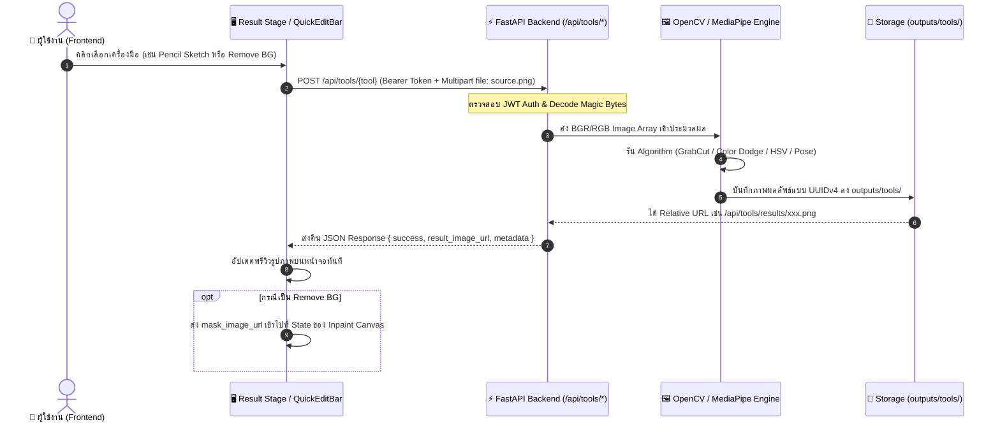

# LUMA Creative Studio (Image Processing Tools): Technical Specification & Frontend Contract

> **วันที่จัดทำ:** 27 กันยายน 2026 (ปรับปรุงล่าสุด: 28 กันยายน 2026)  
> **ผู้ออกแบบ / สถาปนิก:** Backend & Image Processing Team  
> **เวอร์ชัน:** 1.0.1  
> **ระบบเป้าหมาย:** Frontend Client (PC1) เชื่อมต่อมายัง Backend (`http://192.168.1.20:8000`, `http://172.20.10.6:8000` หรือ `http://localhost:8000`)

---

## 1. วัตถุประสงค์และขอบเขต (Objectives & Scope)

### วัตถุประสงค์หลัก:
จัดทำชุดเครื่องมือประมวลผลและตกแต่งภาพแบบคลาสสิก (Classical Image Processing Suite) จำนวน 4 ฟังก์ชันสำหรับแท็บ **"Post-Processing & Creative Studio"** บนหน้าเว็บ LUMA เพื่อต่อยอดจากภาพที่ AI เพิ่งสร้างเสร็จ (Generated Image) หรือภาพที่ผู้ใช้อัปโหลดเข้ามาใหม่ โดยใช้สูตรคณิตศาสตร์และอัลกอริทึมจากรายวิชา Image Processing (Lecture 3, 8, 9, 10, 11)

### ขอบเขตการทำงาน (In-Scope):
1. **👤 คนที่ 1: MediaPipe Pose Landmark Detection (`POST /api/tools/pose`)**  
   สกัดโครงร่างกระดูกและข้อต่อ 33 จุด วาด Overlay ลงบนภาพ พร้อมคืนพิกัด JSON (x, y, z, visibility) หากไม่พบคนในภาพจะตอบ `200 OK` พร้อม `landmarks: []`
2. **✏️ คนที่ 2: Artistic Pencil Sketch & Line-Art (`POST /api/tools/sketch`)**  
   แปลงภาพสีเป็นภาพวาดลายเส้นดินสอขาวดำด้วยเทคนิค Color Dodge Blend รองรับพารามิเตอร์ `blur_ksize` (15–31 เลขคี่)
3. **🎨 คนที่ 3: Color Splash & Mood Tint Filter (`POST /api/tools/color-splash`)**  
   ดูดเฉพาะสีเด่นตาม Color Space HSV (รองรับ 'green' และ 'red') และปรับส่วนที่เหลือเป็นขาวดำ
4. **✂️ คนที่ 4: Smart Background Removal & Auto-Mask (`POST /api/tools/remove-bg`)**  
   ตัดฉากหลังอัตโนมัติด้วย GrabCut + Morphology Close คืนทั้งภาพโปร่งใส (RGBA PNG) และภาพ Binary Mask (ขาว-ดำ: ขาว=ตัวแบบ, ดำ=ฉากหลัง) สำหรับ Inpainting Canvas
5. **🖼️ Image Result Server (`GET /api/tools/results/{filename}`)**  
   เสิร์ฟภาพผลลัพธ์จากเซิร์ฟเวอร์แบบ Static Streaming รองรับ Header `Authorization` และตั้งค่า Cache Header 24 ชั่วโมง

---

## 2. สถาปัตยกรรมระบบ (System Architecture)



---

## 3. รายละเอียดข้อมูลและการออกแบบ API (Data Models & API Contracts)

### 3.1 ข้อมูลการเชื่อมต่อพื้นฐาน (Network & Security)
- **Base URL:** `http://localhost:8000` (หรือ IP Backend วง LAN เช่น `http://172.20.10.6:8000`)
- **Prefix:** `/api/tools`
- **Required Header (ทุก POST Endpoint):**
  ```http
  Authorization: Bearer <JWT_ACCESS_TOKEN>
  ```
- **รูปแบบ Request ที่ Frontend ส่งจริง:**
  - `Content-Type: multipart/form-data`
  - แนบภาพในช่อง **`file`** เสมอ (ชื่อไฟล์เป็น `source.png` แม้เนื้อไฟล์เป็น JPEG/WEBP/RGBA Backend ถอดรหัสจากเนื้อไฟล์โดยตรง)

---

### 3.2 TypeScript Data Interfaces (สำหรับ `src/contracts/tools.ts`)

```typescript
/** ข้อมูลพิกัดสรีระร่างกายของ MediaPipe Pose */
export interface PoseLandmark {
  id: number;          // 0 - 32
  name: string;        // เช่น NOSE, LEFT_SHOULDER, RIGHT_WRIST
  x: number;           // พิกัด X สัมพัทธ์ (0.0 - 1.0)
  y: number;           // พิกัด Y สัมพัทธ์ (0.0 - 1.0)
  z: number;           // ความลึกสัมพัทธ์
  visibility: number;  // ความมั่นใจ (0.0 - 1.0)
}

/** Base Response สำหรับทุกเครื่องมือ */
export interface ToolBaseResponse {
  success: boolean;
  tool: 'pose' | 'sketch' | 'color-splash' | 'remove-bg';
  result_image_url: string; // เช่น /api/tools/results/sketch_550e8400.png
  metadata: Record<string, any>;
}

/** Response เฉพาะของ Pose Detection */
export interface PoseResponse extends ToolBaseResponse {
  tool: 'pose';
  landmarks: PoseLandmark[];
  metadata: {
    total_landmarks: number;
  };
}

/** Response เฉพาะของ Remove Background & Mask */
export interface RemoveBgResponse extends ToolBaseResponse {
  tool: 'remove-bg';
  mask_image_url: string;   // Binary Mask (ขาว-ดำ) สำหรับ Inpainting Canvas
  metadata: {
    method: string;
    iterations: number;
  };
}
```

---

### 3.3 รายละเอียดของแต่ละ Endpoint

#### 👤 1. MediaPipe Pose Landmark Detection
- **Method / URL:** `POST /api/tools/pose`
- **Request Form / Multipart:**
  - `file`: ไฟล์ภาพต้นฉบับ
- **Response (200 OK):**
```json
{
  "success": true,
  "tool": "pose",
  "result_image_url": "/api/tools/results/pose_9a8b7c6d5e4f3a2b1c.png",
  "landmarks": [
    { "id": 0, "name": "NOSE", "x": 0.5012, "y": 0.2814, "z": -0.0412, "visibility": 0.9991 },
    { "id": 11, "name": "LEFT_SHOULDER", "x": 0.6124, "y": 0.4215, "z": -0.1142, "visibility": 0.9875 }
  ],
  "metadata": {
    "total_landmarks": 33
  }
}
```
*(กรณีไม่พบคนในภาพ ตอบ `200 OK` พร้อม `landmarks: []`)*

---

#### ✏️ 2. Artistic Pencil Sketch & Line-Art
- **Method / URL:** `POST /api/tools/sketch`
- **Request Form / Multipart:**
  - `file`: ภาพต้นฉบับ
  - `blur_ksize` (int, default: `21`): ขนาด Kernel (เลขคี่ช่วง 15–31 เช่น 15, 21, 31)
- **Response (200 OK):**
```json
{
  "success": true,
  "tool": "sketch",
  "result_image_url": "/api/tools/results/sketch_1234abcd5678efgh.png",
  "metadata": {
    "blur_ksize": 21
  }
}
```

---

#### 🎨 3. Color Splash & Mood Tint Filter
- **Method / URL:** `POST /api/tools/color-splash`
- **Request Form / Multipart:**
  - `file`: ภาพต้นฉบับ
  - `target_color` (string, default: `"green"`): เลือกได้ระหว่าง `"green"` หรือ `"red"`
- **Response (200 OK):**
```json
{
  "success": true,
  "tool": "color-splash",
  "result_image_url": "/api/tools/results/splash_9988aabbccddeeff.png",
  "metadata": {
    "target_color": "green"
  }
}
```

---

#### ✂️ 4. Smart Background Removal & Auto-Mask
- **Method / URL:** `POST /api/tools/remove-bg`
- **Request Form / Multipart:**
  - `file`: ภาพต้นฉบับ
- **Response (200 OK):**
```json
{
  "success": true,
  "tool": "remove-bg",
  "result_image_url": "/api/tools/results/nobg_aabbccddeeff1122.png",
  "mask_image_url": "/api/tools/results/mask_1122334455667788.png",
  "metadata": {
    "method": "grabcut_morphology_close",
    "iterations": 5
  }
}
```
> **ข้อกำหนด Mask:** ขาว (255) = ตัวแบบ, ดำ (0) = ฉากหลัง ขนาดเท่ากับภาพต้นฉบับพอดี

---

#### 🖼️ 5. ดาวน์โหลด/แสดงผลรูปภาพผลลัพธ์
- **Method / URL:** `GET /api/tools/results/{filename}`
- **Headers:** รองรับทั้งแบบมีและไม่มี Header `Authorization: Bearer <token>`
- **Response:** Content-Type `image/png` พร้อม Cache-Control 24 ชั่วโมง

---

## 4. ตารางข้อผิดพลาด (Error Matrix)

| HTTP Status | ข้อความใน `detail` | คำอธิบาย |
|---|---|---|
| `400 Bad Request` | *Please provide an image either via 'file' upload or 'image_url'...* | ไม่ได้แนบไฟล์มา |
| `401 Unauthorized` | *Could not validate credentials* | ไม่ได้แนบ Token หรือ Token หมดอายุ |
| `404 Not Found` | *Tool result image not found.* | ไม่พบไฟล์รูปผลลัพธ์ (เฉพาะ GET /results) |
| `422 Unprocessable` | *Cannot decode image data...* | ไฟล์เสียหรือไม่ใช่รูปภาพ |
| `500 Server Error` | *Processing error...* | ข้อผิดพลาดภายใน Engine |

---

## 5. การทดสอบและการตรวจสอบความถูกต้อง (Testing & Verification)

* ผ่านชุดทดสอบอัตโนมัติ `tests/test_image_tools.py` ครบ 13/13 ข้อ (ครอบคลุมทั้ง RGBA Input, JPEG `source.png`, Token on GET, และ Error Handling)
* Swagger UI พร้อมทดสอบที่: `http://localhost:8000/docs#/Image%20Processing%20Studio%20Tools`
