# LUMA Backend Architecture — Complete Technical Specification
> **เอกสารแม่บทสถาปัตยกรรมระบบและคู่มือเทคนิคฉบับสมบูรณ์ (Master Document สำหรับ Google NotebookLM)**  
> **ระบบเป้าหมาย:** LUMA Distributed AI Image Generation Platform (Backend API Service)  
> **เทคโนโลยีหลัก:** Python 3.10+, FastAPI, SQLAlchemy 2.0 (SQLite / PostgreSQL), Pydantic v2, Pytest, ComfyUI / AI Node  
> **วัตถุประสงค์ของเอกสาร:** เป็น Source Document รวบรวมข้อกำหนดทางเทคนิค, Flow การทำงาน, โครงสร้างฐานข้อมูล, ระบบความปลอดภัย และการเชื่อมต่อ AI Node แบบครบถ้วนสมบูรณ์ 100% สำหรับการ Grounding ตอบคำถาม และสร้าง Audio Overview (Tech Deep Dive Podcast) บน Google NotebookLM

---

## สารบัญภาพรวมระบบ (Table of Contents)
- [บทนำและสถาปัตยกรรมระบบภาพรวม (Executive Architecture Overview)](#executive-architecture-overview)
- [ส่วนที่ 1: Entry Point & Application Lifecycle (main.py)](#part-1-entry-point--application-lifecycle-mainpy)
- [ส่วนที่ 2: Core, Configuration & Security (app/core/)](#part-2-core-configuration--security-appcore)
- [ส่วนที่ 3: Database & ORM Models (app/db/ และ app/models/)](#part-3-database--orm-models-appdb-และ-appmodels)
- [ส่วนที่ 4: Schemas & Data Contracts (app/schemas/)](#part-4-schemas--data-contracts-appschemas)
- [ส่วนที่ 5: API Routers (app/api/)](#part-5-api-routers-appapi)
- [ส่วนที่ 6: Services & Business Logic (app/services/)](#part-6-services--business-logic-appservices)
- [ส่วนที่ 7: AI Integration & Testing Suite (mock_ai_server.py และ tests/)](#part-7-ai-integration--testing-suite)
- [ภาคผนวก: สรุปศัพท์เทคนิคและการตัดสินใจทางสถาปัตยกรรม (Glossary & Architectural Decisions)](#glossary--architectural-decisions)

---

## <a id="executive-architecture-overview"></a>บทนำและสถาปัตยกรรมระบบภาพรวม (Executive Architecture Overview)

ระบบ **LUMA Backend** ได้รับการออกแบบภายใต้สถาปัตยกรรม **Decoupled Asynchronous Microservices** ที่แยกชั้นระหว่าง Core API Orchestrator และ AI Generation Node อย่างเด็ดขาด เพื่อรองรับการประมวลผลโมเดลขนาดใหญ่ที่ไม่ทำให้ Web Request ค้างหรือบล็อกการทำงาน (Non-blocking I/O)

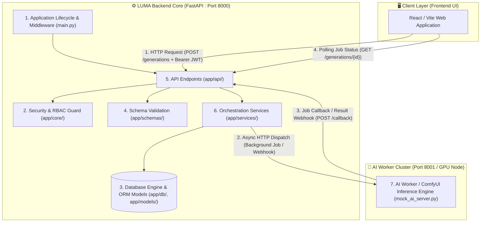

### สรุปหัวใจสำคัญของทั้ง 7 ส่วนหลัก:
1. **Entry Point (`main.py`)**: จัดการ Lifespan Context Manager, ควบคุมการเชื่อมต่อฐานข้อมูลตอนบูต, ป้องกันปัญหา CORS Header หายเมื่อเกิด HTTP 500
2. **Core & Security (`app/core/`)**: จัดการคอนฟิกแบบ Zero-Secret Leak, ตรวจสอบ JWT Bearer Token, และระบบ RBAC 3 ระดับ (REVIEWER, ADMIN, OWNER) ที่ตรวจสอบสิทธิ์สดกับฐานข้อมูลทุก Request
3. **Database & ORM (`app/db/`, `app/models/`)**: โครงสร้าง 4 ตารางหลัก (`users`, `generations`, `admin_roles`, `audit_events`) รองรับทั้ง SQLite สำหรับ Local Development และ PostgreSQL สำหรับ Production
4. **Schemas & Data Contracts (`app/schemas/`)**: Pydantic v2 ตรวจสอบ Input/Output Data คุม Seed, Aspect Ratio, Prompts ป้องกัน SQL Injection และ Malformed Payloads
5. **API Routers (`app/api/`)**: รวม Route การขอสร้างรูป (`/generations`), รับผลลัพธ์จาก AI (`/callback`), จัดการไฟล์ภาพ (`/uploads`), และงาน Admin
6. **Services & Business Logic (`app/services/`)**: Orchestration Layer ตัดสินใจว่าจะส่งงานเข้า AI โหมด Synchronous หรือ Asynchronous Callback, ตรวจสอบ Magic Bytes ของไฟล์อัปโหลด
7. **AI Integration & Testing (`mock_ai_server.py`, `tests/`)**: AI Worker ที่จำลอง Latency และ Failure Scenarios ได้สมจริง พร้อม Pytest ครอบคลุม Unit, Integration, และ E2E Flow

---


---

## <a id="part-1-entry-point--application-lifecycle-mainpy"></a>Part 1: Entry Point & main.py


# LUMA Backend: Technical Specification & Code Architecture (Part 1: Entry Point & `main.py`)

> **วันที่จัดทำ:** 2026-09-21  
> **หมวดหมู่:** Backend Architecture & Technical Specification  
> **เวอร์ชัน:** 1.0.0  
> **ระบบเป้าหมาย:** LUMA Image Generation Backend API (`main.py`)  
> **อ้างอิงเอกสารหลัก:** `BACKEND_ONBOARDING_GUIDE.md`

---

## 1. วัตถุประสงค์และขอบเขต (Objectives & Scope)

### 1.1 วัตถุประสงค์ (Objectives)
- อธิบายและสรุปสถาปัตยกรรมระบบโดยรวมของ **LUMA Backend** ทั้ง 7 ส่วนหลักตามที่ระบุไว้ใน `BACKEND_ONBOARDING_GUIDE.md`
- เจาะลึกการทำงานของไฟล์ **`main.py`** ซึ่งเป็น Application Entry Point ครอบคลุมการตั้งค่า **CORS**, **Lifespan Lifecycle**, **Router Inclusion**, และ **Global Exception Handler**
- วิเคราะห์ Control Flow และ Data Flow แบบทีละบรรทัด (Line-by-Line Execution Trace) ชี้ชัดว่าแต่ละฟังก์ชันส่งต่องานไปยังไฟล์ใดและคืนค่าอย่างไร

### 1.2 ขอบเขต (Scope)
- **In-Scope:**
  - โครงสร้างและปฏิสัมพันธ์ระหว่าง 7 องค์ประกอบหลักของ Backend
  - การบูตระบบด้วย Modern Lifespan Protocol และการทำ Database Auto-creation (`Base.metadata.create_all`)
  - กลไก One-Time Bootstrap เจ้าของระบบ (`_bootstrap_owner`)
  - การจัดการ Cross-Origin Resource Sharing (CORS) และการป้องกันปัญหา CORS Header หลุดหายเมื่อเกิด Unhandled 500
  - สเปกของ Health Check (`/healthz`) และ System Status (`/api/status`)
- **Out-of-Scope:**
  - รายละเอียดระดับลึกของโมเดล AI ใน `mock_ai_server.py` หรือ ComfyUI Workflow (จะสรุปแยกในส่วนของ AI Integration)

---

## 2. ภาพรวมสถาปัตยกรรมระบบ (System Architecture Overview)

LUMA Backend ทำหน้าที่เป็น Core Orchestrator ระหว่าง Frontend (UI) และ AI Inference Node โดยแบ่งโครงสร้างภายในเป็น 7 ส่วนหลัก:

```mermaid
flowchart TD
    subgraph ClientLayer ["🖥️ หน้าบ้าน (Client / Frontend)"]
        UI["Web Frontend (React / Vite / Next.js - Port 3000 / 5173)"]
    end

    subgraph BackendApp ["⚙️ LUMA Backend (FastAPI - Port 8000)"]
        direction TB
        Main["1. Entry Point & Lifecycle (main.py)"]
        Core["2. Core, Config & Security (app/core/)"]
        Routers["5. API Routers (app/api/)"]
        Schemas["4. Schemas Contracts (app/schemas/)"]
        Services["6. Business Services (app/services/)"]
        DB[(3. Database & Models / SQLite & PostgreSQL)]
        
        Main --> Routers
        Routers --> Schemas
        Routers --> Core
        Routers --> Services
        Services --> DB
    end

    subgraph AINodeCluster ["🤖 ส่วนประมวลผล AI (Port 8001 / Worker)"]
        AINode["7. AI Inference Node (mock_ai_server.py / ComfyUI)"]
    end

    UI -->|1. HTTP Request (แนบ Bearer JWT)| Routers
    Services -->|2. ส่ง Prompt & สเปกไปประมวลผล| AINode
    AINode -.->|3. Callback ผลลัพธ์ Base64 กลับมา| Routers
    Services -->|4. Decode Base64 บันทึกไฟล์ PNG & อัปเดต DB| DB
```

### สรุปสาระสำคัญ 7 ส่วนหลักของระบบ:
1. **Entry Point & Lifecycle (`main.py`):** ประตูหน้าบ้านของ API, จัดการ CORS Middleware, Lifespan Startup/Shutdown, Route Registration, และ Global Exception Handling
2. **Core, Configuration & Security (`app/core/`):** โหลด `.env` ผ่าน Pydantic Settings (`config.py`), แฮชรหัสผ่าน `bcrypt` และออก Token JWT (`security.py`), ตรวจสอบระดับสิทธิ์ Role-Based Access Control (`permissions.py`: Owner=3, Admin=2, Reviewer=1)
3. **Database & ORM Models (`app/db/`, `app/models/`):** จัดการ SQLAlchemy Engine, Session Pool, `get_db()` Dependency และตารางหลัก 4 ตาราง (`User`, `Generation`, `AdminRole`, `AuditEvent`)
4. **Schemas & Data Contracts (`app/schemas/`):** Pydantic Models ตรวจสอบ Input Validation และแปลงโครงสร้าง Response ให้เป็นมาตรฐาน
5. **API Routers (`app/api/`):** แหล่งรวม Endpoints 6 โมดูลหลัก (`/auth`, `/generations`, `/callback`, `/uploads`, `/models`, `/admin`)
6. **Business Logic & Services (`app/services/`):** ตรรกะงานสร้างภาพ AI (`generation.py`), การคัดกรองความปลอดภัยไฟล์อัปโหลด 5 ชั้น (`upload.py`), และการจัดการบัญชี/Audit Log (`admin.py`)
7. **AI Integration & Testing (`mock_ai_server.py`, `tests/`):** เซิร์ฟเวอร์จำลอง AI Node (Port 8001) และชุดทดสอบ Pytest 67+ เทสต์

---

## 3. เจาะลึก `main.py` — ไล่โค้ดทีละบรรทัด (Line-by-Line Walkthrough)

โครงสร้างโค้ดทั้งหมด 136 บรรทัด แบ่งการทำงานออกเป็น 7 ส่วน ดังนี้:

### ท่อนที่ 1: การโหลด Library และการตั้งค่า Logging (บรรทัด 1 - 19)

```python
1: import logging
2: from contextlib import asynccontextmanager
3: from fastapi import FastAPI, Request
4: from fastapi.responses import JSONResponse
5: from fastapi.middleware.cors import CORSMiddleware
6: from sqlalchemy import text
7: 
8: from app.db.database import engine, Base, SessionLocal
9: from app.api import auth, generation, callback, upload, models, admin
10: from app.core.config import settings
```

#### 🔍 Control Flow & Memory Analysis:
- **บรรทัด 1-6:** โหลด Standard Library และ Core Modules ของ FastAPI และ SQLAlchemy
- **บรรทัด 8 (`from app.db.database import engine, Base, SessionLocal`):**
  - **การทำงาน:** Python กระโดดไปยัง `app/db/database.py`
  - ทำการรัน `create_engine(settings.DATABASE_URL)` เพื่อสร้าง Connection Pool ไปยัง Database
  - ประกาศ `Base = declarative_base()` สำหรับ ORM Registry
  - สร้าง Session Factory `SessionLocal = sessionmaker(...)`
- **บรรทัด 9 (`from app.api import auth, generation, ...`):**
  - **การทำงาน:** Python วิ่งไปโหลดโมดูลย่อยทั้งหมดใน `app/api/` คอมไพล์ Path Operations, Parameter Validators และ Dependency Injection (`get_current_user`, `get_db`) เข้าสู่ Memory
- **บรรทัด 10 (`from app.core.config import settings`):**
  - **การทำงาน:** โหลด `app/core/config.py` ซึ่งจะอ่าน Environment Variables จาก `.env` และเก็บไว้ในตัวแปร `settings`

```python
12: # 💡 ตั้งค่าระบบ Logging กลาง
13: logging.basicConfig(
14:     level=logging.INFO,
15:     format="%(asctime)s | %(levelname)-8s | %(name)s | %(message)s",
16:     datefmt="%Y-%m-%d %H:%M:%S",
17: )
18: logger = logging.getLogger(__name__)
```
- **บรรทัด 13-18:** กำหนดฟอร์แมต Log ระดับระบบให้แสดงวันเวลา, ระดับ Log (`INFO`, `WARNING`, `ERROR`), ชื่อโมดูล และเนื้อหาข้อความ

---

### ท่อนที่ 2: ฟังก์ชัน Bootstrap เจ้าของระบบ `_bootstrap_owner()` (บรรทัด 21 - 50)

```python
21: def _bootstrap_owner() -> None:
...
29:     from sqlalchemy.orm import Session
30: 
31:     from app.core.config import settings
32:     from app.models import AdminRole, User
33: 
34:     email = (settings.ADMIN_BOOTSTRAP_EMAIL or "").strip()
35:     if not email:
36:         return
```
- **บรรทัด 29-32 (Lazy Import):** นำเข้าโมเดลภายในฟังก์ชัน เพื่อป้องกันปัญหา **Circular Import** ระหว่าง `main.py`, `database.py` และ `models`
- **บรรทัด 34-36:** อ่านค่า `ADMIN_BOOTSTRAP_EMAIL` จาก Settings หากไม่ได้ระบุไว้ จะ `return` จบทันที ไม่เปลือง Connection

```python
38:     with Session(engine) as db:
39:         if db.query(AdminRole).filter(AdminRole.role == "owner").first():
40:             return
41:         user = db.query(User).filter(User.email == email).first()
42:         if user is None:
43:             logger.warning(
44:                 "ADMIN_BOOTSTRAP_EMAIL=%s ยังไม่ได้สมัครสมาชิก — ข้ามการมอบสิทธิ์", email
45:             )
46:             return
47:         db.add(AdminRole(user_id=user.id, role="owner", granted_by=None))
48:         db.commit()
49:         logger.info("มอบสิทธิ์ owner ให้ %s เรียบร้อย", email)
```

#### 🔍 Execution Flow & Data Flow:
1. **บรรทัด 38:** เปิด Database Session เฉพาะกิจด้วย Context Manager `with Session(engine) as db:` เพื่อรับประกันการปิด Connection เมื่อเสร็จสิ้น
2. **บรรทัด 39-40 (Idempotency Check):** ยิงคำสั่ง SQL:
   ```sql
   SELECT * FROM admin_roles WHERE role = 'owner' LIMIT 1;
   ```
   **Security Concept:** หากมี Owner อยู่ในระบบแล้ว ฟังก์ชันจะออกจากระบบทันที ป้องกันไม่ให้ค่าคงเหลือใน `.env` แอบคืนสิทธิ์ให้ผู้ใช้ที่เคยถูกปลดออกไปแล้ว
3. **บรรทัด 41-46:** หากยังไม่มี Owner ในระบบ จะค้นหาผู้ใช้จากอีเมล:
   ```sql
   SELECT * FROM users WHERE email = :email LIMIT 1;
   ```
   หากไม่พบ ผู้ใช้จะบันทึก Warning Log และไม่ทำอะไรต่อ (ต้องรอให้ User บัญชีนั้นสมัครสมาชิกเข้ามาก่อน)
4. **บรรทัด 47-49:** หากพบบัญชีผู้ใช้ จะสร้าง Record ลงในตาราง `AdminRole`:
   ```sql
   INSERT INTO admin_roles (user_id, role, granted_by) VALUES (:user_id, 'owner', NULL);
   ```
   สั่ง `db.commit()` บันทึกข้อมูลลงฐานข้อมูลถาวร และแจ้ง Info Log

---

### ท่อนที่ 3: วงจรชีวิตของแอปพลิเคชัน `lifespan` (บรรทัด 52 - 62)

```python
52: @asynccontextmanager
53: async def lifespan(app: FastAPI):
54:     # สร้างตารางใน Database เมื่อเซิร์ฟเวอร์เริ่มทำงาน
55:     try:
56:         Base.metadata.create_all(bind=engine)
57:         logger.info("Database tables initialized successfully.")
58:         _bootstrap_owner()
59:     except Exception as e:
60:         logger.warning(f"Could not initialize tables on startup: {e}")
61:     yield
```

#### 🔍 ลำดับขั้นตอนตาม Lifespan Protocol:
- **Phase 1: Startup (ก่อน `yield` - บรรทัด 56-58):**
  - รันคำสั่ง `Base.metadata.create_all(bind=engine)` เพื่อสร้างตารางทั้งหมดตามที่โมเดลประกาศไว้ หากตารางยังไม่เคยมีในระบบ
  - เรียก `_bootstrap_owner()` ทันทีหลังสร้างตารางเสร็จ
  - มีบล็อก `try...except` ป้องกันเซิร์ฟเวอร์ Crash ทันทีหากการเชื่อมต่อ Database ช่วงบูตสะดุด
- **Phase 2: Hand-off (`yield` - บรรทัด 61):**
  - คืนการควบคุมให้ ASGI Server (Uvicorn) เพื่อเปิดรับ HTTP Request จากภายนอก
- **Phase 3: Shutdown (หลัง `yield`):**
  - เมื่อได้รับสัญญาณปิดระบบ (`SIGTERM` หรือ `Ctrl+C`) โค้ดหลังบรรทัด `yield` จะถูกเรียกเพื่อคืนทรัพยากร

---

### ท่อนที่ 4: การประกาศแอปพลิเคชัน และ CORS Middleware (บรรทัด 64 - 79)

```python
64: app = FastAPI(
65:     title="LUMA Backend API",
66:     description="Backend API for LUMA Image Generation Platform",
67:     version="1.0.0",
68:     lifespan=lifespan
69: )
70: 
71: # 💡 เพิ่ม CORS Middleware เพื่อให้ Frontend สามารถยิง API ข้าม Origin ได้
72: app.add_middleware(
73:     CORSMiddleware,
74:     allow_origins=["http://localhost:3000", "http://localhost:5173", "http://localhost:8080", "*"],
75:     allow_credentials=True,
76:     allow_methods=["*"],
77:     allow_headers=["*"],
78: )
```

#### 🔍 การทำงานของ CORS Middleware:
- **เบราว์เซอร์กับนโยบาย Same-Origin Policy (SOP):** เมื่อเว็บแอปพลิเคชันฝั่ง Frontend (เช่น `http://localhost:5173`) พยายามเรียก API ไปที่ `http://localhost:8000` เบราว์เซอร์จะส่ง Preflight Request (`OPTIONS`) มาถามสิทธิ์ก่อน
- `CORSMiddleware` ทำหน้าที่เป็น Gatekeeper ชั้นนอกสุด:
  - `allow_origins`: กำหนด Origin ที่อนุญาต
  - `allow_credentials=True`: อนุญาตให้แนบข้อมูลสิทธิ์ยืนยันตัวตน (Cookies, Authorization Bearer Header)
  - `allow_methods=["*"]`: รองรับ Method `GET`, `POST`, `PUT`, `DELETE`, `OPTIONS`
  - `allow_headers=["*"]`: รองรับ Header ทั้งหมด เช่น `Content-Type`, `Authorization`, `X-LUMA-INTERNAL-SECRET`

---

### ท่อนที่ 5: การรวบรวม Routers (บรรทัด 80 - 86)

```python
80: # 🆕 เชื่อมต่อ Routers
81: app.include_router(auth.router)
82: app.include_router(generation.router)
83: app.include_router(callback.router)
84: app.include_router(upload.router)
85: app.include_router(models.router)
86: app.include_router(admin.router)
```

#### 🔍 การกระจายงานตาม URL Path:
| Router | Prefix / จุดประสงค์หลัก | ปลายทางไฟล์โค้ด |
| :--- | :--- | :--- |
| `auth.router` | `/auth/register`, `/auth/login`, `/auth/me` | `app/api/auth.py` |
| `generation.router` | `/generations`, `/generations/{id}/progress`, cancel | `app/api/generation.py` |
| `callback.router` | `/callback/ai-result` (รับภาพ Base64 จาก AI Node) | `app/api/callback.py` |
| `upload.router` | `/uploads` (รับภาพต้นฉบับสำหรับ Image-to-Image) | `app/api/upload.py` |
| `models.router` | `/models` (รายชื่อโมเดล, Sampler, LoRA) | `app/api/models.py` |
| `admin.router` | `/admin/stats`, `/admin/users`, `/admin/audit` | `app/api/admin.py` |

---

### ท่อนที่ 6: Root Route และ Global Exception Handler (บรรทัด 89 - 104)

```python
89: @app.get("/", tags=["Health Check"])
90: def read_root():
91:     return {"message": "LUMA Backend is running! 🚀"}
```
- Endpoint พื้นฐานสำหรับ Smoke Test ตรวจสอบสถานะการรัน

```python
94: @app.exception_handler(Exception)
95: async def unhandled_exception_handler(request: Request, exc: Exception):
96:     logger.exception(f"Unhandled error on {request.method} {request.url.path}: {exc}")
97:     headers = {}
98:     origin = request.headers.get("origin")
99:     if origin:
100:         headers["Access-Control-Allow-Origin"] = origin
101:         headers["Access-Control-Allow-Credentials"] = "true"
102:         headers["Access-Control-Allow-Methods"] = "*"
103:         headers["Access-Control-Allow-Headers"] = "*"
104:     return JSONResponse(status_code=500, content={"detail": "Internal Server Error"}, headers=headers)
```

#### 🔍 ความสำคัญเชิงเทคนิคของ Exception Handler:
- **ปัญหาทางเทคนิค (The 500 CORS Issue):** เมื่อเกิด Unhandled Exception ร้ายแรงใน FastAPI/Starlette response ข้อผิดพลาดอาจข้ามผ่าน Middleware Pipeline ทำให้ Response 500 ไม่มี Header CORS แนบไปด้วย เบราว์เซอร์จึงตัดการเชื่อมต่อและแจ้งเตือนว่าติด CORS แทนที่จะแสดงเนื้อหา Error ที่แท้จริง
- **การแก้ไข:** ฟังก์ชันนี้จะดึง `origin` จาก Header ของ Request ต้นทาง แล้วประกอบ Header CORS ด้วยตนเอง ก่อนส่งกลับ `JSONResponse(status_code=500)` ทำให้ Frontend ได้รับสถานะ 500 และแสดง Error Dialog บนหน้าบ้านได้อย่างถูกต้อง

---

### ท่อนที่ 7: Endpoint ตรวจสอบความพร้อมของระบบ (Health Checks) (บรรทัด 107 - 136)

```python
107: @app.get("/healthz", tags=["Health Check"])
108: def health_check():
109:     """Health check endpoint สำหรับ Nginx, Frontend, และ DevOps"""
110:     db_state = "connected"
111:     try:
112:         with SessionLocal() as db:
113:             db.execute(text("SELECT 1"))
114:     except Exception as exc:
115:         logger.error(f"Health check: database unreachable | {exc}")
116:         db_state = "unreachable"
117: 
118:     body = {
119:         "status": "healthy" if db_state == "connected" else "degraded",
120:         "service": "LUMA Backend API",
121:         "version": "1.2.0",
122:         "ai_mode": settings.AI_MODE,
123:         "database": db_state,
124:     }
125:     return JSONResponse(status_code=200 if db_state == "connected" else 503, content=body)
```

#### 🔍 Logic การประเมินสถานะระบบ:
- บรรทัด 112-113: ทดสอบยิง SQL เบาที่สุด `SELECT 1` เพื่อตรวจสอบการตอบสนองของฐานข้อมูลจริง
- บรรทัด 125 (Smart Status Response):
  - หาก Database พร้อมใช้งาน $\rightarrow$ ตอบกลับ `200 OK`
  - หาก Database ล่ม $\rightarrow$ ตอบกลับ `503 Service Unavailable` ทำให้ Load Balancer (Nginx / Kubernetes Probe) ทราบทันทีและตัดเซิร์ฟเวอร์ออกจาก Traffic Pool

```python
128: @app.get("/api/status", tags=["System"])
129: def system_status():
130:     """System info endpoint สำหรับ Frontend Dashboard"""
131:     return {
132:         "status": "online",
133:         "supported_tasks": ["txt2img", "img2img", "inpaint"],
134:         "max_upload_mb": settings.MAX_UPLOAD_SIZE_BYTES // (1024 * 1024),
135:         "ai_mode": settings.AI_MODE
136:     }
```
- ส่งข้อมูลสเปกของระบบที่แปลงหน่วยแล้ว (เช่น ขนาด Upload สูงสุดในหน่วย MB) เพื่อให้ Dashboard ของ Frontend ดึงไปปรับแต่ง UI

---

## 4. แผนผังการทำงาน (Sequence Diagrams)

### 4.1 ลำดับการบูตระบบ (Startup Lifecycle Flow)

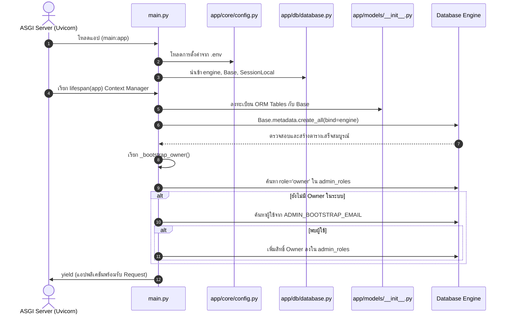

### 4.2 วงจรชีวิตของ HTTP Request (Inbound Request Lifecycle)

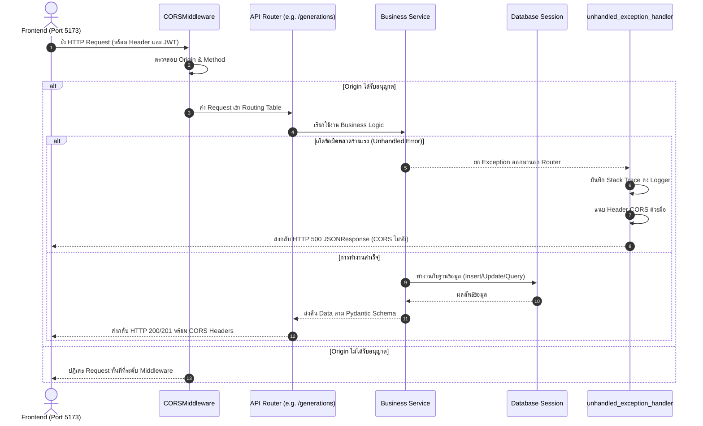

---

## 5. ข้อพิจารณาด้านความปลอดภัยและเสถียรภาพ (Security & Reliability Highlights)

1. **One-Time Bootstrap:**  
   การเช็ก `role == "owner"` ก่อนทำการมอบสิทธิ์เสมอ ป้องกันไม่ให้ไฟล์ `.env` ที่ยังหลงเหลืออยู่ในเซิร์ฟเวอร์ย้อนคืนสิทธิ์ให้ผู้ใช้ที่ถูกถอดถอนไปแล้ว
2. **CORS Preservation on Unhandled Exceptions:**  
   การแทรก Header CORS ใน `unhandled_exception_handler` ช่วยแก้ปัญหาเบราว์เซอร์แจ้งเตือนผิดพลาด ทำให้นักพัฒนาหาสาเหตุของ Internal Server Error ได้อย่างตรงจุด
3. **Database Health Isolation:**  
   คำสั่ง `SELECT 1` ใน `/healthz` รันแบบแยก Session โดดเดี่ยวและส่งรหัส HTTP 503 เมื่อฐานข้อมูลดับ ช่วยให้ระบบ Orchestrator (เช่น Docker, Kubernetes, Nginx) ป้องกันการส่ง Traffic ไปยังโหนดที่ไม่พร้อมทำงาน


---

## <a id="part-2-core-configuration--security-appcore"></a>Part 2: Core, Configuration & Security


# LUMA Backend — Technical Specification & Deep Dive
## ส่วนที่ 2: Core, Configuration & Security (`app/core/`)

> **วันที่จัดทำ:** 21 กันยายน 2026  
> **โมดูล:** `app/core/` (Configuration, Security, Permissions)  
> **ระบบเป้าหมาย:** LUMA Backend (FastAPI + SQLAlchemy)  
> **ไฟล์ที่เกี่ยวข้อง:** `app/core/config.py`, `app/core/security.py`, `app/core/permissions.py`

---

## 1. วัตถุประสงค์และขอบเขต (Objectives & Scope)

- **วัตถุประสงค์หลัก:**  
  เป็นแกนกลางด้านความปลอดภัยและการตั้งค่าของระบบ LUMA Backend ทำหน้าที่จัดการคอนฟิกระบบ, ป้องกันกุญแจความลับรั่วไหล, เข้ารหัสและตรวจสอบรหัสผ่าน, สร้างและถอดรหัส JWT Token สำหรับยืนยันตัวตน (Authentication) รวมถึงควบคุมสิทธิ์การเข้าถึงของผู้ดูแลระบบแบบ Role-Based Access Control (Authorization)
- **ขอบเขตการทำงาน (In-Scope):**
  - จัดการ Environment Variables แบบ Type-safe พร้อมระบบตัดการทำงานทันทีหากพบ Weak/Leaked Secrets
  - แฮชรหัสผ่านด้วย `bcrypt` พร้อมการจัดการข้อจำกัดความยาว 72 ไบต์อย่างปลอดภัย
  - ตรวจสอบและสร้าง Access Token ตามมาตรฐาน `OAuth2 Bearer` (JWT HS256)
  - ให้บริการ Dependency Injection (`get_current_user`) สำหรับ Route ที่ต้องการความปลอดภัย
  - จัดการลำดับสิทธิ์แอดมิน 3 ระดับ (`REVIEWER`, `ADMIN`, `OWNER`) ด้วยการดึงข้อมูลสดจากฐานข้อมูล (Real-time DB query) เพื่อรองรับการเพิกถอนสิทธิ์ทันที (Instant Revocation)
- **นอกขอบเขต (Out-of-Scope):**
  - การลงทะเบียนผู้ใช้ใหม่หรือจัดการข้อมูลโปรไฟล์ (เป็นหน้าที่ของ `app/api/auth.py` และ `app/services/`)
  - การเชื่อมต่อ AI Inference โดยตรง (เป็นหน้าที่ของ `app/services/generation.py`)

---

## 2. สถาปัตยกรรมและแผนผังความปลอดภัย (Security Architecture)

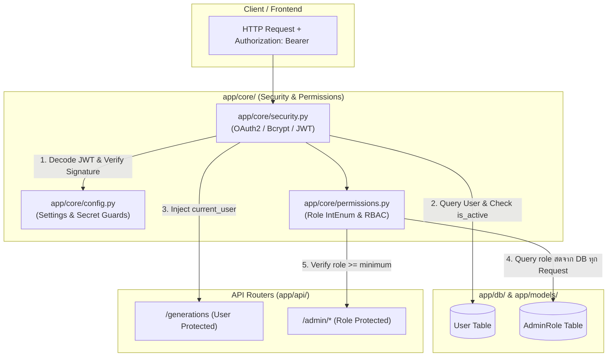

---

## 3. รายละเอียดโค้ดและการทำงานทีละบรรทัด (Line-by-Line Breakdown)

### 3.1 [`app/core/config.py`](file:///Users/pongkarm/CDTI_work/CDTI_work_69/Term_1/Image_Processing/Project/app/core/config.py)
ไฟล์กำหนดค่าคอนฟิกส่วนกลางของระบบ อ่านค่าจากสภาพแวดล้อมและ `.env`

```python
from pathlib import Path
from pydantic_settings import BaseSettings, SettingsConfigDict

class Settings(BaseSettings):
    DATABASE_URL: str
    SECRET_KEY: str
    ALGORITHM: str = "HS256"
    ACCESS_TOKEN_EXPIRE_MINUTES: int = 30
```
- **คำอธิบาย:**
  - `DATABASE_URL` และ `SECRET_KEY` ถูกประกาศโดยไม่มีค่าเริ่มต้น แปลว่าตัวแปรทั้งสองตัวนี้**บังคับต้องมี**ในสภาพแวดล้อมหรือไฟล์ `.env` หากไม่มี เซิร์ฟเวอร์จะปฏิเสธการเริ่มทำงานทันที
  - `ALGORITHM`: ใช้มาตรฐาน `HS256` (HMAC with SHA-256) สำหรับการเซ็น JWT
  - `ACCESS_TOKEN_EXPIRE_MINUTES`: กำหนดอายุ Access Token ไว้ที่ 30 นาที

```python
    # อีเมลของเจ้าของระบบคนแรก แก้ปัญหาไก่กับไข่: ไม่มีใครมอบสิทธิ์ให้คนแรกได้
    # อ่านตอนเริ่มเซิร์ฟเวอร์เท่านั้น และไม่ทำอะไรเลยถ้ามี owner อยู่แล้ว
    ADMIN_BOOTSTRAP_EMAIL: str = ""
```
- **คำอธิบาย:**
  - กำหนดอีเมลผู้ดูแลคนแรก (`ADMIN_BOOTSTRAP_EMAIL`) เพื่อแก้ปัญหา Chicken-and-Egg ในระบบ RBAC โดยฟังก์ชัน `_bootstrap_owner()` ใน `main.py` จะแต่งตั้งอีเมลนี้เป็น `OWNER` ทันทีที่ระบบเปิดใช้งานครั้งแรก

```python
    # AI Service Configuration
    AI_MODE: str = "direct"  # "direct" | "callback"
    AI_SERVER_URL: str = "http://localhost:8001/generate"
    AI_SERVER_DIRECT_URL: str = "http://localhost:8001/generate"
    AI_SERVER_CALLBACK_URL: str = "http://localhost:8001/ai/generate"
    AI_CALLBACK_SECRET: str
    BACKEND_CALLBACK_URL: str = "http://localhost:8000/api/callback"
    OUTPUTS_DIR: Path = Path("./outputs")
    UPLOADS_DIR: Path = Path("./uploads")
    MAX_UPLOAD_SIZE_BYTES: int = 10 * 1024 * 1024  # 10 MB limit
    MAX_IMAGE_DIMENSION: int = 4096  # Max 4096x4096 px

    model_config = SettingsConfigDict(env_file=".env", extra="ignore")

settings = Settings()
```
- **คำอธิบาย:**
  - ตั้งค่าการเชื่อมต่อ AI Node, พาธโฟลเดอร์สำหรับเก็บภาพ (`outputs/`, `uploads/`)
  - กำหนดขนาดไฟล์สูงสุดที่อนุญาตให้อัปโหลดคือ 10 MB และขนาดภาพไม่เกิน 4096×4096 พิกเซล
  - `extra="ignore"` อนุญาตให้มีตัวแปรอื่นๆ ใน `.env` โดยไม่ทำให้ Pydantic เกิด Validation Error

```python
LEAKED_SECRETS = {
    "luma-super-secret-jwt-key-2024-cdti-image-processing",
    "luma-distributed-token-secret-6710301009",
    "CHANGE_ME_GENERATE_A_NEW_ONE",
}

for name, value in (
    ("SECRET_KEY", settings.SECRET_KEY),
    ("AI_CALLBACK_SECRET", settings.AI_CALLBACK_SECRET),
):
    if value in LEAKED_SECRETS or len(value) < 32:
        raise RuntimeError(
            f"{name} ยังเป็นค่าที่หลุดสาธารณะหรือสั้นเกินไป — "
            'สร้างใหม่: python -c "import secrets; print(secrets.token_urlsafe(64))"'
        )
```
- **จุดเด่นด้านความปลอดภัย (Security Guard):**
  - ดักจับคีย์ตัวอย่างที่เคยหลุดในเอกสารหรือ Git Repository หากเซิร์ฟเวอร์พบว่า `SECRET_KEY` หรือ `AI_CALLBACK_SECRET` ตรงกับ Blacklist หรือมีความยาวไม่ถึง 32 อักขระ ระบบจะสั่งหยุดทำงานทันที (`raise RuntimeError`)

---

### 3.2 [`app/core/security.py`](file:///Users/pongkarm/CDTI_work/CDTI_work_69/Term_1/Image_Processing/Project/app/core/security.py)
ไฟล์จัดการการเข้ารหัสรหัสผ่าน, สร้างและตรวจทาน JWT Token, และ Dependency ดึงข้อมูลผู้ใช้ปัจจุบัน

```python
from datetime import datetime, timedelta, timezone
from uuid import UUID
from fastapi import Depends, HTTPException, status
from fastapi.security import OAuth2PasswordBearer
from jose import jwt, JWTError
from passlib.context import CryptContext
from sqlalchemy.orm import Session

from app.core.config import settings
from app.db.database import get_db
from app.models import User

import bcrypt

oauth2_scheme = OAuth2PasswordBearer(tokenUrl="/auth/login")
```
- **คำอธิบาย:**
  - `oauth2_scheme`: อินสแตนซ์ของ `OAuth2PasswordBearer` ทำหน้าที่แกะ Token ออกมาจาก Header `Authorization: Bearer <token>` อัตโนมัติ พร้อมทั้งเชื่อมโยง Endpoint `/auth/login` กับเอกสาร Swagger OpenAPI

```python
def hash_password(password: str) -> str:
    """แปลง password ธรรมดา → hash ด้วย bcrypt"""
    pwd_bytes = password.encode('utf-8')[:72]
    salt = bcrypt.gensalt()
    return bcrypt.hashpw(pwd_bytes, salt).decode('utf-8')
```
- **คำอธิบาย:**
  - `[:72]`: การตัด Slice ข้อความให้ไม่เกิน 72 ไบต์ เป็นข้อบังคับสำคัญของอัลกอริทึม Bcrypt (Bcrypt Specification รองรับ Input สูงสุด 72 ไบต์) เพื่อป้องกันปัญหา Crash เมื่อมีข้อความยาวเกิน
  - สุ่ม Salt ใหม่ทุกครั้งด้วย `bcrypt.gensalt()` เพื่อป้องกันการโจมตีแบบ Rainbow Table

```python
def verify_password(plain_password: str, hashed_password: str) -> bool:
    """เช็กว่า password ที่กรอก ตรงกับ hash มั้ย"""
    try:
        pwd_bytes = plain_password.encode('utf-8')[:72]
        hashed_bytes = hashed_password.encode('utf-8')
        return bcrypt.checkpw(pwd_bytes, hashed_bytes)
    except Exception:
        return False
```
- **คำอธิบาย:**
  - ใช้ `bcrypt.checkpw` ซึ่งมีการทำงานแบบ Constant-Time Comparison ช่วยป้องกันการโจมตีผ่านการจับเวลา (Timing Attack) หากพบ Error ใดๆ จะคืนค่า `False` เสมอ

```python
def create_access_token(data: dict) -> str:
    """สร้าง JWT Token"""
    to_encode = data.copy()
    expire = datetime.now(timezone.utc) + timedelta(minutes=settings.ACCESS_TOKEN_EXPIRE_MINUTES)
    to_encode.update({"exp": expire})
    encoded_jwt = jwt.encode(to_encode, settings.SECRET_KEY, algorithm=settings.ALGORITHM)
    return encoded_jwt

def decode_token(token: str) -> dict | None:
    """ถอดรหัส JWT Token"""
    try:
        payload = jwt.decode(token, settings.SECRET_KEY, algorithms=[settings.ALGORITHM])
        return payload
    except JWTError:
        return None
```
- **คำอธิบาย:**
  - `create_access_token`: ฝังค่าเวลาหมดอายุ (`exp`) ตาม UTC และเข้ารหัสด้วย `SECRET_KEY`
  - `decode_token`: ถอดรหัสและตรวจสอบลายเซ็นดิจิทัล หาก Token หมดอายุหรือถูกปลอมแปลง จะดักจับ `JWTError` แล้วคืนค่า `None`

```python
def get_current_user(
    token: str = Depends(oauth2_scheme),
    db: Session = Depends(get_db)
) -> User:
    credentials_exception = HTTPException(
        status_code=status.HTTP_401_UNAUTHORIZED,
        detail="Could not validate credentials",
        headers={"WWW-Authenticate": "Bearer"},
    )
    payload = decode_token(token)
    if payload is None:
        raise credentials_exception

    user_id_str = payload.get("sub")
    if not user_id_str:
        raise credentials_exception

    try:
        user_uuid = UUID(user_id_str)
    except ValueError:
        raise credentials_exception

    user = db.query(User).filter(User.id == user_uuid).first()
    if user is None:
        raise credentials_exception
    if not user.is_active:
        raise HTTPException(
            status_code=status.HTTP_400_BAD_REQUEST,
            detail="Inactive user"
        )

    return user
```
- **ขั้นตอนการทำงานของ `get_current_user`:**
  1. ดึง Token ผ่าน `oauth2_scheme` และ Session ฐานข้อมูลผ่าน `get_db`
  2. ถอดรหัส Token หากล้มเหลว โยน HTTP 401
  3. ดึงฟิลด์ `sub` (Subject ซึ่งเก็บ User ID) และตรวจสอบรูปแบบความถูกต้องของ `UUID`
  4. ค้นหาผู้ใช้ในฐานข้อมูล หากไม่พบ โยน HTTP 401
  5. ตรวจสอบสถานะบัญชี หากถูกระงับสิทธิ์ (`is_active == False`) โยน HTTP 400 Inactive user
  6. ส่งคืนอ็อบเจกต์ `User` ให้กับ Route ปลายทาง

---

### 3.3 [`app/core/permissions.py`](file:///Users/pongkarm/CDTI_work/CDTI_work_69/Term_1/Image_Processing/Project/app/core/permissions.py)
ระบบควบคุมสิทธิ์ผู้ดูแลระบบ (Role-Based Access Control)

```python
from enum import IntEnum
from fastapi import Depends, HTTPException, status
from sqlalchemy.orm import Session

from app.core.security import get_current_user
from app.db.database import get_db
from app.models import AdminRole, User

class Role(IntEnum):
    """เรียงจากน้อยไปมาก เพื่อให้เทียบด้วย >= ได้ตรงไปตรงมา"""
    REVIEWER = 1
    ADMIN = 2
    OWNER = 3

ROLE_NAMES = {Role.REVIEWER: "reviewer", Role.ADMIN: "admin", Role.OWNER: "owner"}
NAME_TO_ROLE = {v: k for k, v in ROLE_NAMES.items()}
```
- **คำอธิบาย:**
  - สืบทอดจาก `IntEnum` ทำให้สามารถใช้เครื่องหมายเปรียบเทียบลำดับขั้นสิทธิ์ได้ทันที เช่น `current_role >= Role.ADMIN` โดยไม่ต้องเขียนเงื่อนไขซับซ้อน

```python
def get_role(db: Session, user_id) -> Role | None:
    """
    ระดับสิทธิ์ของผู้ใช้คนนี้ หรือ None ถ้าไม่ใช่แอดมิน

    อ่านจากฐานข้อมูลทุกครั้ง ไม่ได้ฝังไว้ใน JWT โดยตั้งใจ — token ถูกเซ็นครั้งเดียว
    แล้วเชื่อจนหมดอายุ ถ้าเก็บ role ไว้ในนั้น คนที่เพิ่งถูกถอดสิทธิ์จะยังใช้อำนาจ
    ได้จนกว่า token จะหมดอายุ ซึ่งตาม .env ที่ deploy อยู่คือ 24 ชั่วโมง
    """
    row = db.query(AdminRole).filter(AdminRole.user_id == user_id).first()
    if row is None:
        return None
    return NAME_TO_ROLE.get(row.role)
```
- **หลักคิดสำคัญทางสถาปัตยกรรม (Architectural Decision):**
  - **เหตุผลที่ไม่เก็บ Role ใน JWT:** JWT มีสถานะ Stateless และแก้ไขไม่ได้หลังจากการเซ็น หากเก็บ Role ใน JWT เมื่อแอดมินถูกเพิกถอนสิทธิ์ ผู้ใช้จะยังคงยิง API แอดมินได้ต่อไปจนกว่า Token จะหมดอายุ
  - การอ่านจากตาราง `AdminRole` แบบ Real-time ในทุกคำขอ ทำให้การระงับสิทธิ์มีผลในระดับเสี้ยววินาทีทันที (Instant Revocation)

```python
def require_role(minimum: Role):
    """
    Dependency สำหรับติดที่ router ไม่ใช่ที่ endpoint ทีละตัว
    """
    def dependency(
        current_user: User = Depends(get_current_user),
        db: Session = Depends(get_db),
    ) -> User:
        role = get_role(db, current_user.id)
        if role is None or role < minimum:
            raise HTTPException(
                status_code=status.HTTP_403_FORBIDDEN,
                detail=f"ต้องมีสิทธิ์ระดับ {ROLE_NAMES[minimum]} ขึ้นไป",
            )
        current_user.admin_role = role  # ให้ endpoint อ่านต่อได้โดยไม่ต้อง query ซ้ำ
        return current_user

    return dependency
```
- **คำอธิบาย:**
  - เป็น Closure Dependency รับระดับสิทธิ์ขั้นต่ำที่ต้องการ (`minimum`)
  - ตรวจสอบว่ามีสิทธิ์ถึงเกณฑ์หรือไม่ หากไม่ถึง ส่งกลับ **HTTP 403 Forbidden** พร้อมข้อความภาษาไทย
  - เมื่อผ่าน จะผูกค่า `current_user.admin_role = role` เข้ากับอ็อบเจกต์ผู้ใช้ เพื่อให้ Controller ข้างในใช้งานได้ทันทีโดยไม่ต้องยิงคำสั่ง SQL ซ้ำ

---

## 4. ข้อพิจารณาด้านความปลอดภัยและสมรรถนะ (Security & Performance)

| หัวข้อความปลอดภัย | มาตรการที่ใช้ในระบบ | ผลลัพธ์ที่ได้ |
| :--- | :--- | :--- |
| **Bcrypt Buffer Overflow / Crash** | ทำ Slicing รหัสผ่านที่ 72 ไบต์แรก (`[:72]`) | ป้องกันข้อผิดพลาดจากข้อจำกัดฮาร์ดโค้ดของอัลกอริทึม Bcrypt |
| **Hardcoded Secret Leakage** | ระบบตรวจจับคีย์ต้องห้าม (`LEAKED_SECRETS`) และความยาว >= 32 บิต | ป้องกันการลืมเปลี่ยน Default Key เมื่อนำขึ้น Production |
| **Privilege Revocation Lag** | ตรวจสอบสิทธิ์แอดมินสดผ่านฐานข้อมูลแทนการฝังใน JWT Token | สิทธิ์ถูกเพิกถอนทันที (Zero Delay) เมื่อแอดมินถูกปลด |
| **Token Hijacking & Replay** | อายุ Access Token สั้น (30 นาที) และตรวจสอบ `is_active` เสมอ | ลดความเสี่ยงจากการขโมย Token และบล็อกบัญชีที่ถูกแบนได้ทันที |
| **Timing Attacks** | ใช้ฟังก์ชัน `bcrypt.checkpw` ในการตรวจสอบรหัสผ่าน | ป้องกันการเดารหัสผ่านจากการวิเคราะห์เวลาประมวลผล |

---

## 5. แผนการทดสอบที่เกี่ยวข้อง (Testing & Verification)

ชุดทดสอบที่ครอบคลุมการทำงานของโมดูลนี้อยู่ในไดเรกทอรี `tests/`:
- **`tests/test_auth.py`**: ทดสอบการสมัครสมาชิก, การแฮชรหัสผ่าน, การยืนยันตัวตน, และการสร้าง Token
- **`tests/test_security.py`**: ทดสอบการทำงานของ Secret Validator, การตรวจจับ Token ปลอมหรือหมดอายุ, และการบล็อก Inactive User
- **`tests/test_admin_permissions.py`**: ทดสอบ Hierarchy ของสิทธิ์แอดมินทั้ง 3 ระดับ และการปฏิเสธการเข้าถึงด้วย HTTP 403


---

## <a id="part-3-database--orm-models-appdb-และ-appmodels"></a>Part 3: Database & ORM Models


# LUMA Backend: Technical Specification & Database Architecture
## ส่วนที่ 3: Database & ORM Models (`app/db/` และ `app/models/`)

> **วันที่จัดทำ:** 21 กันยายน 2026  
> **หมวดหมู่:** Database Architecture & ORM Technical Specification  
> **เวอร์ชัน:** 1.0.0  
> **ระบบเป้าหมาย:** LUMA Backend (FastAPI + SQLAlchemy)  
> **ไฟล์หลักที่เกี่ยวข้อง:**  
> - [`app/db/database.py`](file:///Users/pongkarm/CDTI_work/CDTI_work_69/Term_1/Image_Processing/Project/app/db/database.py) — การตั้งค่า Database Engine, Session Factory, และ Dependency Injection  
> - [`app/models/__init__.py`](file:///Users/pongkarm/CDTI_work/CDTI_work_69/Term_1/Image_Processing/Project/app/models/__init__.py) — นิยาม ORM Models ทั้ง 4 ตาราง (`users`, `generations`, `admin_roles`, `audit_events`)  
> - [`app/services/generation.py`](file:///Users/pongkarm/CDTI_work/CDTI_work_69/Term_1/Image_Processing/Project/app/services/generation.py) — การจัดการ State และอัปเดตฟิลด์ของโมเดล `Generation`

---

## 1. วัตถุประสงค์และขอบเขต (Objectives & Scope)

### 1.1 วัตถุประสงค์ (Objectives)
- อธิบายโครงสร้างและความสัมพันธ์ของฐานข้อมูลทั้งหมดในระบบ **LUMA Backend** ที่ถูกนิยามผ่าน **SQLAlchemy Declarative Models**
- เจาะลึกฟิลด์และชนิดข้อมูลของโมเดลการสร้างภาพ AI (`Generation`) ทั้งในมิติของ AI Ingestion Parameters, Pipeline Metadata, และวงจรการอัปเดตสถานะเมื่องานสำเร็จหรือล้มเหลว
- วิเคราะห์กลไกการบริหารจัดการ Database Connection และ Session Lifecycle ใน `app/db/database.py` เพื่อให้เข้าใจการทำงานร่วมกับ Dependency Injection ของ FastAPI และการป้องกันปัญหา Connection Leak

### 1.2 ขอบเขต (Scope)
- **ครอบคลุม (In-Scope):**
  - รายละเอียดระดับฟิลด์และคีย์นอก (Foreign Keys/Relationships) ของทั้ง 4 ตาราง: `users`, `generations`, `admin_roles`, และ `audit_events`
  - การจัดการ Primary Key แบบ **UUIDv4** เพื่อความปลอดภัยและขยายตัวได้ง่าย (IDOR Prevention)
  - วงจรชีวิตของ Connection Pool (`engine`), Session Factory (`SessionLocal`), และ Dependency (`get_db()`)
  - โฟลว์การอัปเดตข้อมูลของ `Generation` ทั้งในโหมด Callback (Asynchronous) และ Direct (Synchronous) รวมถึงเงื่อนไข Timeout และ Cancel
  - การรับประกันความปลอดภัยของข้อมูล (Data Isolation & Integrity)
- **ไม่ครอบคลุม (Out-of-Scope):**
  - การตรวจสอบและคัดกรองข้อมูลขาเข้า/ขาออกด้วย Pydantic Schema (อธิบายใน *ส่วนที่ 4: Schemas & Data Contracts*)
  - ตรรกะระดับลึกในการเชื่อมต่อ HTTP ไปยัง AI Node หรือการแปลงภาพ Base64 (อธิบายใน *ส่วนที่ 6: Services*)

---

## 2. แผนผังความสัมพันธ์ข้อมูล (Entity Relationship Diagram)

โครงสร้างฐานข้อมูลออกแบบตามหลักการ **Normalized Relational Model** ผสมผสานกับการเก็บข้อมูลแบบ **Semi-Structured (JSON)** ในส่วนที่ต้องการความยืดหยุ่น:

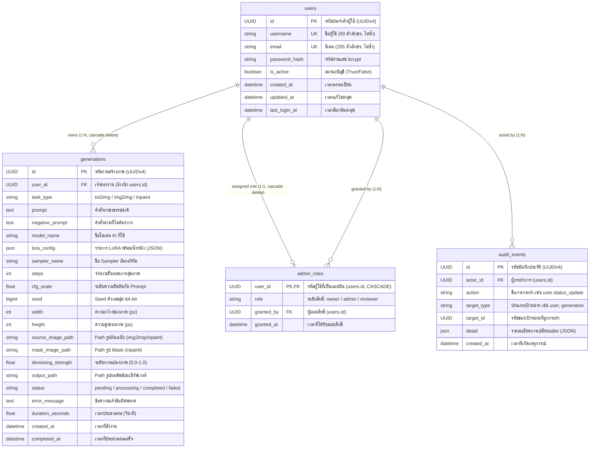

---

## 3. การจัดการ Connection และ Session (`app/db/database.py`)

ไฟล์ [`app/db/database.py`](file:///Users/pongkarm/CDTI_work/CDTI_work_69/Term_1/Image_Processing/Project/app/db/database.py) เป็นแกนกลางในการเชื่อมต่อกับฐานข้อมูล โดยมีรายละเอียดโค้ดและการทำงานดังนี้:

```python
from sqlalchemy import create_engine
from sqlalchemy.orm import sessionmaker, declarative_base
from app.core.config import settings

# 1. สร้าง "สายเชื่อม" ไปยัง Database (Connection Pool & Engine)
engine = create_engine(settings.DATABASE_URL)

# 2. สร้าง "โรงงานผลิต Session" สำหรับคุยกับ Database
SessionLocal = sessionmaker(autocommit=False, autoflush=False, bind=engine)

# 3. สร้าง "ฐาน" สำหรับให้ Models มาสืบทอด
Base = declarative_base()

# 4. ฟังก์ชัน Dependency สำหรับเปิด-ปิดการเชื่อมต่อ
def get_db():
    db = SessionLocal()
    try:
        yield db
    finally:
        db.close()
```

### 3.1 การวิเคราะห์องค์ประกอบหลัก

| ตัวแปร / ฟังก์ชัน | หน้าที่และความสำคัญ | เหตุผลในการกำหนดค่า (Configuration Rationale) |
| :--- | :--- | :--- |
| **`engine`** | ทำหน้าที่เป็น Connection Pool และตัวแปลง SQL Dialect | เชื่อมต่อไปยังฐานข้อมูลตาม URL ใน `settings.DATABASE_URL` (รองรับทั้ง SQLite สำหรับการทดสอบ และ PostgreSQL บน Production) โดยบริหารจัดการ Pool ของ TCP Connection อัตโนมัติ |
| **`SessionLocal`** | เป็น Session Factory ทำหน้าที่ instantiate Database Session instance ใหม่ | - `autocommit=False`: บังคับให้นักพัฒนาสั่ง `db.commit()` หรือ `db.rollback()` เองอย่างชัดเจน เพื่อรักษาขอบเขต Transaction Integrity<br/>- `autoflush=False`: ไม่ส่งคำสั่ง SQL ไปยัง DB ชั่วคราวโดยอัตโนมัติก่อน Query ช่วยป้องกัน Side-effects ที่ไม่คาดคิดและเพิ่มความเร็ว |
| **`Base`** | คลาสฐาน Declarative Base สำหรับ SQLAlchemy | ตารางทุกโมเดลใน `app/models/` จะสืบทอดจากคลาสนี้ เพื่อให้ SQLAlchemy สามารถลงทะเบียน Metadata ของตาราง และใช้ฟังก์ชัน `Base.metadata.create_all(bind=engine)` สร้างตารางอัตโนมัติได้ |
| **`get_db()`** | Generator function สำหรับ FastAPI Dependency Injection | ถูกเรียกใช้ผ่าน `Depends(get_db)` ใน API Routers เพื่อส่งมอบ `Session` instance ให้กับฟังก์ชัน Controller |

---

### 3.2 แผนผังวงจรชีวิตของ Database Session ต่อ HTTP Request

FastAPI ใช้โครงสร้างแบบ **Context-Managed Dependency Injection** ควบคุมการเปิด-ปิด Connection ผ่าน Pattern `try ... yield ... finally`:

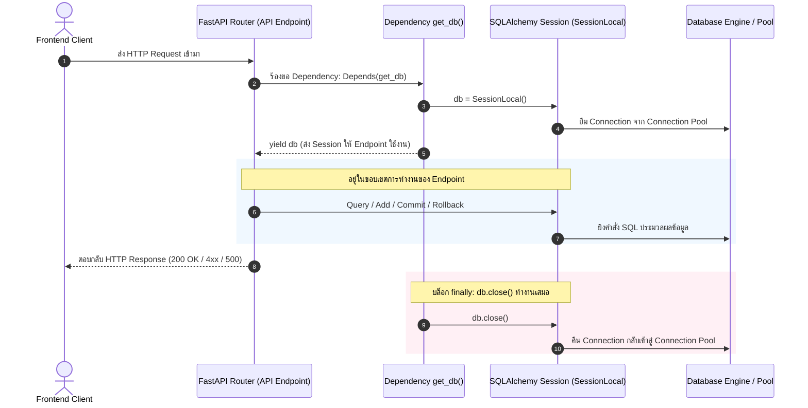

#### กลไกการปิด Connection อัตโนมัติ (Connection Cleanup Guarantee)
1. **เมื่อมีคำขอส่งเข้ามา:** ฟังก์ชัน `get_db()` จะสร้าง Session ตัวใหม่ขึ้นมา 1 ตัว แล้วหยุดรอที่คำสั่ง `yield db` พร้อมส่ง Object นั้นไปให้ฟังก์ชันปลายทางใน Router ใช้งาน
2. **เมื่อการประมวลผลสิ้นสุดลง:** ไม่ว่า Endpoint จะทำงานเสร็จสิ้นปกติ (HTTP 200/201) หรือเกิด Exception ร้ายแรงจนแอปโยน HTTP 4xx/500 Python Runtime จะกระโดดเข้าทำงานในบล็อก **`finally:`** เสมอ
3. **การป้องกันปัญหา Connection Leak:** คำสั่ง `db.close()` จะปิด Session และคืน Connection กลับเข้า Pool ทันที 100% ทำให้ระบบไม่เกิดอาการ Connection ค้างจนพูลเต็ม (Pool Exhaustion) แม้จะมี Request เข้ามาพร้อมกันเป็นจำนวนมาก

---

## 4. เจาะลึกโครงสร้าง 4 ตารางหลัก (`app/models/__init__.py`)

โมเดลทั้งหมดตั้งอยู่บนพื้นฐานการใช้ **UUID Version 4** เป็น Primary Key แทนการใช้ Auto-incrementing Integer เพื่อป้องกันการโจมตีประเภท ID Enumeration / Insecure Direct Object References (IDOR):

```python
id = Column(
    UUID(as_uuid=True),
    primary_key=True,
    default=uuid.uuid4,
    server_default=func.gen_random_uuid(),
)
```

---

### 4.1 ตาราง `users` ([`User`](file:///Users/pongkarm/CDTI_work/CDTI_work_69/Term_1/Image_Processing/Project/app/models/__init__.py#L20-L42))

ทำหน้าที่จัดเก็บบัญชีผู้ใช้งานระบบและสถานะความปลอดภัย:

| คอลัมน์ | ชนิดข้อมูล | คุณสมบัติ (Constraints) | วัตถุประสงค์ |
| :--- | :--- | :--- | :--- |
| `id` | `UUID` | Primary Key, Default=UUID4 | รหัสประจำตัวผู้ใช้สากล |
| `username` | `String(50)` | Unique, Not Null | ชื่อบัญชีผู้ใช้สำหรับการระบุตัวตน |
| `email` | `String(255)` | Unique, Not Null | อีเมลสำหรับเข้าสู่ระบบและการติดต่อ |
| `password_hash` | `String(255)` | Not Null | รหัสผ่านที่เข้ารหัสด้วยอัลกอริทึม `bcrypt` |
| `is_active` | `Boolean` | Default=True, Not Null | สถานะเปิดใช้งาน หากเป็น `False` จะถูกตัดสิทธิ์ทุก API ทันที |
| `created_at` | `DateTime(tz=True)` | Server Default=`now()` | วันเวลาที่สร้างบัญชี (บันทึก Timezone) |
| `updated_at` | `DateTime(tz=True)` | Default=`now()`, OnUpdate=`now()` | วันเวลาที่แก้ไขข้อมูลบัญชีล่าสุด |
| `last_login_at` | `DateTime(tz=True)` | Nullable=True | บันทึกเวลาเข้าสู่ระบบครั้งล่าสุด |

* **Relationships:**
  * `generations`: ผูกกับโมเดล `Generation` แบบ One-to-Many โดยกำหนด `cascade="all, delete-orphan"` เมื่อลบบัญชีผู้ใช้ ประวัติงานสร้างภาพทั้งหมดจะถูกลบตามทันที เพื่อรักษาความสะอาดของฐานข้อมูล (Referential Integrity)

---

### 4.2 ตาราง `generations` ([`Generation`](file:///Users/pongkarm/CDTI_work/CDTI_work_69/Term_1/Image_Processing/Project/app/models/__init__.py#L44-L80))

ตารางสำหรับจัดเก็บรายละเอียดงานสร้างภาพ พารามิเตอร์ AI ทุกชนิด สถานะงาน และไฟล์ผลลัพธ์:

#### หมวดหมู่ที่ 1: การระบุตัวตนและความเป็นเจ้าของ (Identity & Ownership)
* `id`: `UUID` (Primary Key) — รหัสงานสร้างภาพ
* `user_id`: `UUID` (Foreign Key อ้างอิง `users.id`, Not Null) — เจ้าของงาน สำหรับทำ Data Isolation

#### หมวดหมู่ที่ 2: พารามิเตอร์การสร้างภาพ AI (Inference Parameters)
* `task_type`: `String(20)` (Not Null) — ประเภทงานสร้างภาพ ได้แก่:
  * `"txt2img"`: สร้างภาพใหม่จากข้อความ Prompt
  * `"img2img"`: แปลงภาพต้นฉบับตามข้อความ Prompt
  * `"inpaint"`: แก้ไขภาพเฉพาะส่วนด้วย Mask ขาวดำ
* `prompt`: `Text` (Not Null) — คำสั่งภาษาธรรมชาติหลักที่บรรยายภาพที่ต้องการ
* `negative_prompt`: `Text` (Nullable) — คำสั่งระบุสิ่งที่ไม่ต้องการให้ปรากฏในภาพ
* `model_name`: `String(100)` (Not Null) — ชื่อโมเดล Checkpoint (เช่น `"sd-v1-5"`, `"realisticVisionV6"`)
* `lora_config`: `JSON` (Nullable) — การตั้งค่า LoRA ในรูปแบบ JSON เช่น:
  ```json
  [
    {"name": "more_details", "weight": 0.8},
    {"name": "anime_lineart", "weight": 0.5}
  ]
  ```
* `sampler_name`: `String(50)` (Not Null) — ชนิดอัลกอริทึม Sampling (เช่น `"Euler a"`, `"DPM++ 2M Karras"`)
* `steps`: `Integer` (Not Null) — จำนวนรอบการ Denoise (เช่น 20-50 steps)
* `cfg_scale`: `Float` (Not Null) — Classifier-Free Guidance Scale ควบคุมความเคร่งครัดตาม Prompt (เช่น 7.0)
* `seed`: `BigInteger` (Nullable) — ตัวเลขสุ่มแบบ 64-bit Signed Integer สำหรับควบคุมผลลัพธ์ภาพให้สร้างซ้ำได้
* `width`, `height`: `Integer` (Not Null) — ขนาดกว้าง x สูงของภาพ (เช่น 512, 768, 1024 px)

#### หมวดหมู่ที่ 3: ไฟล์นำเข้าและไปป์ไลน์รูปภาพ (Pipeline Image Inputs & Outputs)
* `source_image_path`: `String(500)` (Nullable) — Absolute Path ของภาพต้นฉบับบนเครื่องแม่ข่าย (ใช้ใน `img2img`, `inpaint`)
* `mask_image_path`: `String(500)` (Nullable) — Absolute Path ของไฟล์ภาพ Mask ขาวดำ (ใช้ใน `inpaint`)
* `denoising_strength`: `Float` (Nullable) — ค่าน้ำหนักการดัดแปลงภาพเดิม (0.0 = ไม่เปลี่ยนเลย, 1.0 = เปลี่ยนใหม่ทั้งหมด)
* `output_path`: `String(500)` (Nullable) — Absolute Path ของไฟล์ภาพผลลัพธ์ที่สร้างเสร็จแล้วบนเครื่องแม่ข่าย

#### หมวดหมู่ที่ 4: สถานะและการวัดประสิทธิภาพ (Lifecycle & Performance)
* `status`: `String(20)` (Default=`"pending"`, Not Null) — สถานะการประมวลผล: `"pending"`, `"processing"`, `"completed"`, `"failed"`
* `error_message`: `Text` (Nullable) — บันทึกข้อความแจ้งสาเหตุความล้มเหลว
* `duration_seconds`: `Float` (Nullable) — ระยะเวลาทั้งหมดที่ใช้ในการประมวลผล (หน่วยเป็นวินาที)
* `created_at`: `DateTime(tz=True)` (Default=`now()`) — เวลาที่ระบบเริ่มรับคำขอ
* `completed_at`: `DateTime(tz=True)` (Nullable) — เวลาที่การประมวลผลเสร็จสิ้นสมบูรณ์หรือล้มเหลว

---

### 4.3 ตาราง `admin_roles` ([`AdminRole`](file:///Users/pongkarm/CDTI_work/CDTI_work_69/Term_1/Image_Processing/Project/app/models/__init__.py#L82-L106))

ออกแบบขึ้นมาเพื่อจัดการสิทธิ์ Role-Based Access Control (RBAC) โดยเฉพาะ:

```python
class AdminRole(Base):
    __tablename__ = "admin_roles"

    user_id = Column(
        UUID(as_uuid=True),
        ForeignKey("users.id", ondelete="CASCADE"),
        primary_key=True,
    )
    role = Column(String(20), nullable=False)  # owner | admin | reviewer
    granted_by = Column(UUID(as_uuid=True), ForeignKey("users.id"), nullable=True)
    granted_at = Column(DateTime(timezone=True), server_default=func.now())

    user = relationship("User", foreign_keys=[user_id])
```

#### เหตุผลสำคัญทางสถาปัตยกรรม (Architectural Decision)
1. **การทำงานของ `create_all()` กับ Migration:**  
   คำสั่ง `Base.metadata.create_all()` ของ SQLAlchemy จะสร้างเฉพาะตารางใหม่ที่ยังไม่เคยมีในฐานข้อมูล แต่จะไม่สั่ง `ALTER TABLE` เพื่อเพิ่มคอลัมน์ใหม่ในตารางเดิมที่มีอยู่แล้ว หากเพิ่มคอลัมน์ `admin_role` ลงใน `users` จะทำให้ต้องรัน Migration สคริปต์บน Database จริงด้วยมือ การแยกเป็นตารางใหม่จึงทำให้ทีมพัฒนาเพียงแค่ `git pull` แล้วรีสตาร์ตเซิร์ฟเวอร์ ตารางใหม่จะถูกสร้างขึ้นอัตโนมัติทันที
2. **หลักการปลอดภัยโดยปริยาย (Default Secure):**  
   หากผู้ใช้คนใดไม่มีแถวข้อมูลในตาราง `admin_roles` ระบบจะอนุมานทันทีว่าผู้ใช้คนนั้นเป็นผู้ใช้งานทั่วไป (Non-admin)
3. **การออกแบบ Key:**  
   `user_id` ทำหน้าที่เป็นทั้ง **Primary Key** และ **Foreign Key** (1:1 Relationship) บังคับให้ผู้ใช้ 1 คนสามารถมีบทบาทแอดมินได้สูงสุดเพียง 1 บทบาท พร้อมตั้งค่า `ondelete="CASCADE"` หากลบผู้ใช้ บันทึกสิทธิ์แอดมินจะถูกลบตามทันที

---

### 4.4 ตาราง `audit_events` ([`AuditEvent`](file:///Users/pongkarm/CDTI_work/CDTI_work_69/Term_1/Image_Processing/Project/app/models/__init__.py#L107-L133))

ตารางบันทึกประวัติการกระทำของผู้ดูแลระบบ (Audit Trail / Compliance Log):

```python
class AuditEvent(Base):
    __tablename__ = "audit_events"

    id = Column(
        UUID(as_uuid=True),
        primary_key=True,
        default=uuid.uuid4,
        server_default=func.gen_random_uuid(),
    )
    actor_id = Column(UUID(as_uuid=True), ForeignKey("users.id"), nullable=False)
    action = Column(String(50), nullable=False)
    target_type = Column(String(30), nullable=True)
    target_id = Column(UUID(as_uuid=True), nullable=True)
    detail = Column(JSON, nullable=True)
    created_at = Column(DateTime(timezone=True), server_default=func.now())

    actor = relationship("User", foreign_keys=[actor_id])
```

#### หลักการสำคัญในการออกแบบ (Immutable Audit Trail)
* **Atomic Transaction Guarantee:** บันทึก Audit Log จะถูกบันทึกใน Database Transaction เดียวกันกับการกระทำเสมอ หากการเขียน Log ล้มเหลว การกระทำหลัก (เช่น การแบนผู้ใช้ หรือเปลี่ยนสิทธิ์) จะต้องถูก Rollback ไปด้วย ทำให้ไม่มีการกระทำใดเกิดขึ้นโดยไร้ร่องรอย
* **Append-Only & Tamper-Proof:** ใน API Layer ของระบบ **ไม่มี Route ใดที่อนุญาตให้แก้ไข (UPDATE) หรือลบ (DELETE)** ข้อมูลในตารางนี้ ข้อมูลที่ถูกบันทึกแล้วจะคงอยู่เพื่อใช้เป็นหลักฐานเสมอ

---

## 5. วงจรชีวิตและการเปลี่ยนสถานะของโมเดล `Generation`

การอัปเดตฟิลด์ในตาราง `generations` ถูกควบคุมอย่างเข้มงวดใน Service Layer ([`app/services/generation.py`](file:///Users/pongkarm/CDTI_work/CDTI_work_69/Term_1/Image_Processing/Project/app/services/generation.py)):

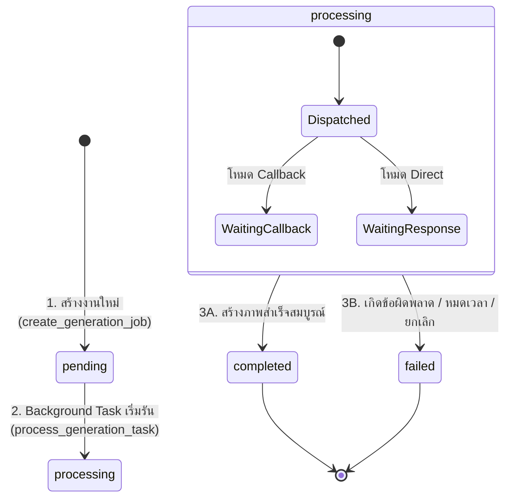

### 5.1 รายละเอียดการอัปเดตฟิลด์ในแต่ละสถานะ

| สถานะ (Status) | ฟิลด์ที่ถูกอัปเดต | ค่าที่ถูกบันทึกลงฟิลด์ | จุดที่เรียกใช้งานในโค้ด |
| :--- | :--- | :--- | :--- |
| **`pending`** *(เริ่มต้น)* | `id`, `user_id`, `status`, `task_type`, `prompt`, พารามิเตอร์ AI ทั้งหมด | ข้อมูลที่ได้รับจาก Client หลังผ่านการ Validate จาก Schema | `create_generation_job()` |
| **`processing`** | `status` | เปลี่ยนค่าเป็น `"processing"` | จุดเริ่มต้นของ `process_generation_task()` |
| **`completed`** *(สำเร็จ)* | 1. `status`<br/>2. `output_path`<br/>3. `completed_at`<br/>4. `duration_seconds`<br/>5. `seed` | 1. `"completed"`<br/>2. Absolute Path ของไฟล์ภาพ (เช่น `/outputs/<user_id>/<gen_id>.png`)<br/>3. เวลาปัจจุบัน `datetime.now(timezone.utc)`<br/>4. เวลาที่ใช้ประมวลผลจริง (วินาที)<br/>5. อัปเดตด้วย Seed จริงจาก AI Node (กรณีสุ่มอัตโนมัติ) | - `process_ai_callback()` (Callback Mode)<br/>- `process_generation_task()` (Direct Mode) |
| **`failed`** *(ล้มเหลว)* | 1. `status`<br/>2. `error_message`<br/>3. `completed_at`<br/>4. `duration_seconds` | 1. `"failed"`<br/>2. ข้อความระบุสาเหตุข้อผิดพลาด<br/>3. เวลาปัจจุบัน `datetime.now(timezone.utc)`<br/>4. ระยะเวลาที่ทำงานก่อนล้มเหลว | - `_mark_as_failed()`<br/>- `_check_and_apply_timeout()`<br/>- `cancel_generation()` |

---

### 5.2 กรณีศึกษา: 4 สาเหตุที่ทำให้งานปรับเป็นสถานะ `failed`

```mermaid
flowchart TD
    Job["งานที่กำลังประมวลผล (pending / processing)"]
    
    C1["1. Node AI ล้มเหลว"]
    C2["2. เซิร์ฟเวอร์หมดเวลา (Timeout)"]
    C3["3. ผู้ใช้สั่งยกเลิก (Cancel)"]
    C4["4. ข้อมูลหรือเน็ตเวิร์กผิดพลาด"]

    Job --> C1
    Job --> C2
    Job --> C3
    Job --> C4

    C1 -->|Callback ส่ง status='failed'| F1["บันทึก error_message จาก AI Node"]
    C2 -->|ค้างเกิน 300 วินาที (5 นาที)| F2["บันทึก 'Generation timed out after 5 minutes...'"]
    C3 -->|ยิง POST /cancel| F3["บันทึก 'Cancelled by user'"]
    C4 -->|Base64 เสียหาย / เน็ตเวิร์กหลุด| F4["บันทึก Exception Message"]

    F1 --> FailedState["status = 'failed'<br/>completed_at = now()<br/>db.commit()"]
    F2 --> FailedState
    F3 --> FailedState
    F4 --> FailedState
```

1. **AI Node Failure:**  
   AI Server ส่ง Callback กลับมาพร้อม `status: "failed"` และข้อความใน `error` หรือ `error_message` ระบบจะบันทึกข้อความนั้นลงใน `generation.error_message`
2. **Server Timeout Auto-fail (`_check_and_apply_timeout`):**  
   ฟังก์ชันตรวจสอบงานที่ค้างในสถานะ `pending` หรือ `processing` นานเกิน 300 วินาที (5 นาที) โดยไม่มีความเคลื่อนไหว ระบบจะปรับสถานะเป็น `failed` ทันที ป้องกันงานติดค้างในระบบตลอดกาล
3. **User Cancellation (`cancel_generation`):**  
   ผู้ใช้ส่งคำขอยกเลิกงานผ่าน `POST /generations/{id}/cancel` ระบบจะยิงคำขอลบ Task ไปยัง AI Node (`DELETE /ai/task/{id}`) และปรับสถานะใน DB เป็น `failed` พร้อมข้อความ `"Cancelled by user"`
4. **Data Corruption / Network Error:**  
   หากไฟล์ภาพ Base64 ที่ได้รับเสียหาย (Invalid Base64), ไม่สามารถแปลงไฟล์ภาพได้, หรือไม่พบภาพต้นฉบับบนดิสก์ ฟังก์ชัน `_mark_as_failed` จะบันทึกข้อผิดพลาดและปรับสถานะเป็น `failed`

---

## 6. ข้อพิจารณาด้านความปลอดภัยและสมรรถนะ (Security & Integrity)

| หัวข้อการออกแบบ | กลไกที่นำมาใช้ในโค้ด | ประโยชน์และผลลัพธ์ที่ได้ |
| :--- | :--- | :--- |
| **Data Isolation & IDOR Protection** | ใช้ `UUIDv4` ร่วมกับการเพิ่มเงื่อนไข `where(Generation.user_id == current_user.id)` เสมอ | ป้องกันผู้ใช้จากการเดา ID ของผู้อื่น และไม่สามารถดูหรือแก้ไขงานของคนอื่นได้ |
| **Atomic File & DB Operations** | ใช้การบันทึกภาพลงไฟล์ชั่วคราว (`.tmp`) แล้วใช้คำสั่ง `replace()` สลับไฟล์จริงก่อน Commit ลง DB | ป้องกันไฟล์รูปภาพขาดหายหรืออ่านได้ไม่สมบูรณ์ (Corrupted file) กรณีเกิดไฟดับหรือเซิร์ฟเวอร์แครชขณะเขียนดิสก์ |
| **Referential Integrity** | ใช้ Foreign Key Constraints ควบคู่กับ `ondelete="CASCADE"` บน SQLAlchemy และ DB Engine | รักษาความสอดคล้องของข้อมูล ป้องกันปัญหา Orphan Records เมื่อผู้ใช้ถูกลบออกจากระบบ |
| **Real-time Role Verification** | ตรวจสอบสิทธิ์แอดมินโดย Query ตรงจากตาราง `admin_roles` ทุกคำขอ ไม่เก็บ Role ลงใน JWT | สิทธิ์จะถูกเพิกถอนทันทีในระดับมิลลิวินาที (Zero Latency Revocation) ทันทีที่แอดมินถูกถอดถอน |
| **Transaction Rollback Guard** | มีบล็อก `try ... except ... db.rollback()` ครอบคลุมทุกการสั่ง Commit ข้อมูล | ป้องกัน Session อยู่ในสถานะค้าง (Dirty Transaction) ซึ่งจะกระทบต่อคำขอถัดไปใน Connection เดียวกัน |

---

## 7. แผนการทดสอบที่เกี่ยวข้อง (Testing & Verification)

ตารางฐานข้อมูลและโมเดลทั้งหมดได้รับการทดสอบอย่างครอบคลุมในชุดเทสต์อัตโนมัติผ่าน `pytest`:

1. **`tests/test_generations.py`**:
   - ทดสอบการสร้างงานใหม่และบันทึกลงในตาราง `generations`
   - ทดสอบการดึงข้อมูลเฉพาะของตนเอง (Data Isolation)
   - ทดสอบฟังก์ชัน Auto-timeout เมื่องานค้างเกิน 5 นาที
   - ทดสอบการยกเลิกงานและการปรับสถานะเป็น `failed`
2. **`tests/test_callback.py`**:
   - ทดสอบการรับ Callback จาก AI Server และการอัปเดตฟิลด์สถานะเป็น `completed`
   - ทดสอบการตรวจสอบความซ้ำซ้อน (Idempotency) เพื่อไม่ให้อัปเดตงานเดิมซ้ำสอง
3. **`tests/test_auth.py`**:
   - ทดสอบการบันทึกข้อมูลผู้ใช้และการเข้ารหัสผ่านในตาราง `users`
   - ทดสอบ Unique Constraints ของ `username` และ `email`


---

## <a id="part-4-schemas--data-contracts-appschemas"></a>Part 4: Schemas & Data Contracts


# LUMA Backend — Technical Specification & Deep Dive
## ส่วนที่ 4: Schemas & Data Contracts (`app/schemas/`)

> **วันที่จัดทำ:** 21 กันยายน 2026  
> **หมวดหมู่:** Data Contracts & Schema Validation (Pydantic v2)  
> **เวอร์ชัน:** 1.0.0  
> **ระบบเป้าหมาย:** LUMA Image Generation Backend API (`FastAPI` + `Pydantic v2`)  
> **อ้างอิงเอกสารหลัก:** `BACKEND_ONBOARDING_GUIDE.md` (ส่วนที่ 4)  
> **ไฟล์ที่เกี่ยวข้อง:**  
> - [`app/schemas/generation.py`](file:///Users/pongkarm/CDTI_work/CDTI_work_69/Term_1/Image_Processing/Project/app/schemas/generation.py)  
> - [`app/schemas/user.py`](file:///Users/pongkarm/CDTI_work/CDTI_work_69/Term_1/Image_Processing/Project/app/schemas/user.py)  
> - [`app/schemas/admin.py`](file:///Users/pongkarm/CDTI_work/CDTI_work_69/Term_1/Image_Processing/Project/app/schemas/admin.py)  
> - [`app/schemas/token.py`](file:///Users/pongkarm/CDTI_work/CDTI_work_69/Term_1/Image_Processing/Project/app/schemas/token.py)  

---

## 1. วัตถุประสงค์และขอบเขต (Objectives & Scope)

### 1.1 วัตถุประสงค์ (Objectives)
- อธิบายบทบาทหน้าที่ของ **Pydantic Schemas** ในฐานะ **Data Contract** สัญญาข้อตกลงข้อมูลกลางระหว่าง Frontend, Backend Router, Business Service, Database Layer และ AI Node
- เจาะลึกเหตุผลทางวิศวกรรมซอฟต์แวร์ (Software Engineering Rationale) ว่าทำไมต้องแยก Data Schemas ออกจาก Database ORM Models ใน `app/models/`
- วิเคราะห์สเปกของงานสร้างภาพ (`GenerationCreate`), ผลลัพธ์ (`GenerationResponse`), และข้อมูลสื่อสารย้อนกลับจาก AI Cluster (`AICallbackPayload`)
- อธิบายกลยุทธ์ความปลอดภัยและการปกป้องข้อมูลส่วนบุคคล (Data Privacy & Information Hiding) เช่น การกำจัด `password_hash` ในระดับ Schema, การทำ Data Masking สำหรับ Reviewer และ Role-Based Selective Redaction

### 1.2 ขอบเขต (Scope)
- **In-Scope:**
  - สถาปัตยกรรมการตรวจสอบข้อมูล (Validation Lifecycle) และ Type Coercion ของ Pydantic v2
  - การกำหนดขอบเขตตัวเลขและความยาว (Boundary Guards) เพื่อป้องกันปัญหา GPU Exhaustion / Denial of Service
  - การทำงานของ `from_attributes=True` และ `@computed_field`
  - สเปก Callback ข้อมูลรูปภาพ Base64, Seed, สถานะ และเวลาประมวลผล
  - การแบ่งระดับการเปิดเผยข้อมูลตามสิทธิ์ผู้ใช้ (`AdminMeResponse`, `AdminUserRow`, `AdminRunRow`)
- **Out-of-Scope:**
  - ตรรกะการประมวลผลคิวใน AI Worker (อยู่ใน `mock_ai_server.py` และ ComfyUI)
  - รายละเอียดการสร้างตารางและคอลัมน์ใน SQLAlchemy (อยู่ใน `app/models/`)

---

## 2. สถาปัตยกรรมและการไหลของข้อมูล (Architecture & Data Flow)

Pydantic ทำหน้าที่เป็น **Security & Contract Boundary** ที่หน้าด่านของระบบ ก่อนที่ข้อมูลจะเดินทางเข้าสู่ Business Logic หรือส่งกลับไปยัง Client:

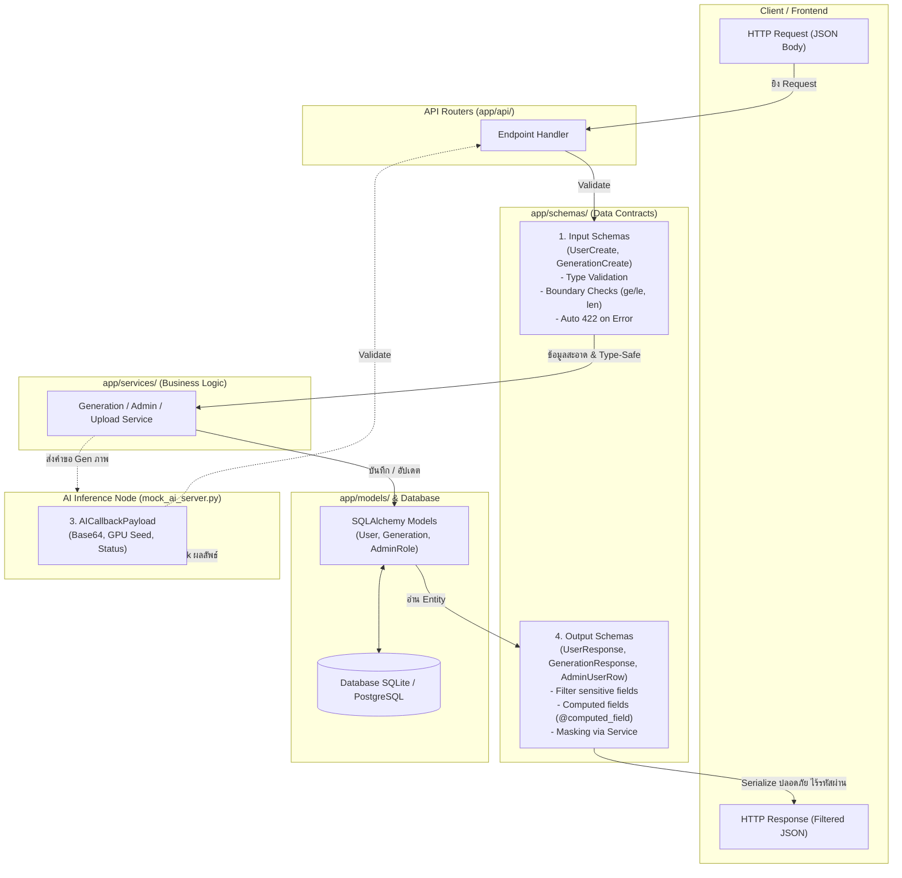

---

## 3. เปรียบเทียบเชิงสถาปัตยกรรม: ทำไมต้องแยก Pydantic Schemas ออกจาก Database Models?

ในระบบ LUMA มีการแยกโฟลเดอร์ระหว่าง `app/models/` (SQLAlchemy) และ `app/schemas/` (Pydantic) อย่างเคร่งครัด ด้วยเหตุผลสำคัญ 4 ประการ:

| มิติการเปรียบเทียบ | Database Models (`app/models/`) | Pydantic Schemas (`app/schemas/`) |
| :--- | :--- | :--- |
| **สถาปัตยกรรมหลัก** | **Persistence Layer** (การจัดเก็บลงฐานข้อมูล) | **Presentation & Contract Layer** (การสื่อสารผ่าน HTTP) |
| **ไลบรารีที่ใช้** | SQLAlchemy ORM (`Base`, `Column`, `relationship`) | Pydantic v2 (`BaseModel`, `Field`, `ConfigDict`) |
| **ความรับผิดชอบ (Responsibility)** | กำหนดโครงสร้างตาราง, Foreign Key, Index, Cascades | ตรวจสอบข้อมูลขาเข้า (Validation), จัดรูปแบบข้อมูลขาออก (Serialization) |
| **ความหลากหลาย (Cardinality)** | **1 ตารางต่อ 1 Model** สะท้อนโครงสร้างจัดเก็บจริง | **1 Entity มีได้หลาย Schemas** ตาม Use Case และสิทธิ์ |
| **การเปิดเผยฟิลด์ (Visibility)** | เก็บข้อมูลครบทุกฟิลด์ (รวม `password_hash`) | เลือกเปิดเผยเฉพาะฟิลด์ที่ปลอดภัยตามบริบท |

### 4 เหตุผลเชิงลึกทางสถาปัตยกรรม:

1. **Information Hiding & Mass Assignment Protection (ความปลอดภัยขั้นสูงสุด):**
   - ตาราง `users` ในฐานข้อมูลจำเป็นต้องมีฟิลด์ `password_hash` เพื่อใช้ตรวจสอบตัวตน แต่ฝั่ง Client จะต้องไม่มีโอกาสเห็นค่านี้เด็ดขาด
   - หากใช้ Model ร่วมกัน Client อาจส่ง JSON ที่มีฟิลด์แอบแฝง เช่น `is_active=false` หรือ `admin_role="owner"` เข้ามาทับค่าในฐานข้อมูล การมี Input Schema (`GenerationCreate`, `UserCreate`) จะสกัดกั้นฟิลด์ที่ไม่ได้รับอนุญาตทิ้งทั้งหมด
2. **One Model, Multiple Perspectives (หนึ่งข้อมูล มีได้หลายมุมมอง):**
   - เอนทิตี `User` เพียงตัวเดียวในฐานข้อมูล ต้องการมุมมองที่แตกต่างกันถึง 4 รูปแบบ:
     - `UserCreate`: รับ `password` ข้อความดิบตอนสมัคร
     - `UserResponse`: ส่งข้อมูลพื้นฐาน ตัด `password_hash` ทิ้ง
     - `UserProfileResponse`: เสริมสถิติ `total_generations` สำหรับแสดงบน Navbar
     - `AdminUserRow`: แสดงสถิติการใช้งาน และ Mask อีเมลสำหรับ Reviewer
3. **Decoupling Database from Public API (การแยกส่วนเพื่อความยืดหยุ่น):**
   - หากในอนาคตต้องการแปลงฐานข้อมูล เช่น เปลี่ยนชื่อคอลัมน์ หรือแยกตาราง Normalization หน้าตา JSON ของ API ที่ Frontend ใช้งานอยู่จะไม่ได้รับผลกระทบใดๆ (No Breaking Changes on Frontend)
4. **Interactive API Documentation & Automated Contract:**
   - Pydantic จะแปลง Type hints และข้อกำหนด `Field()` เป็นเอกสาร OpenAPI (Swagger UI) ที่ `/docs` ทันที พร้อมตัวอย่างข้อมูล ทำให้ทีม Frontend ทำงานต่อได้ทันทีโดยไม่ต้องรอเอกสารแยก

---

## 4. เจาะลึกสเปกใน [`app/schemas/generation.py`](file:///Users/pongkarm/CDTI_work/CDTI_work_69/Term_1/Image_Processing/Project/app/schemas/generation.py)

ไฟล์นี้เป็นแกนกลางในการกำหนดสัญญาคำสั่งสร้างภาพทั้งหมด แบ่งออกเป็น 3 ส่วนสำคัญ:

### 4.1 ตรวจสอบเงื่อนไขก่อนสร้างภาพ (`GenerationCreate` & `GenerationBase`)

คลาส [`GenerationCreate`](file:///Users/pongkarm/CDTI_work/CDTI_work_69/Term_1/Image_Processing/Project/app/schemas/generation.py#L113) สืบทอดมาจาก [`GenerationBase`](file:///Users/pongkarm/CDTI_work/CDTI_work_69/Term_1/Image_Processing/Project/app/schemas/generation.py#L22) ซึ่งกำหนดเงื่อนไขความปลอดภัยและข้อจำกัดของฮาร์ดแวร์ไว้อย่างละเอียด:

```python
class GenerationBase(BaseModel):
    task_type: GenerationTaskType = Field(
        default=GenerationTaskType.TXT2IMG,
        description="ประเภทของงาน (txt2img, img2img, หรือ inpaint)"
    )
    prompt: str = Field(
        ...,
        min_length=1,
        max_length=2000,
        description="ข้อความ Prompt ที่ต้องการให้ AI วาด",
        json_schema_extra={"example": "A cute cat wearing astronaut suit in space, digital art, 8k"}
    )
    negative_prompt: str | None = Field(
        default=None,
        max_length=2000,
        description="สิ่งที่ไม่ต้องการให้มีในภาพ",
        json_schema_extra={"example": "ugly, blurry, low quality"}
    )
    model_name: str = Field(default="sd-v1-5", max_length=100)
    lora_config: Any | None = Field(default=None)
    sampler_name: str = Field(default="Euler a", max_length=50)
    steps: int = Field(default=20, ge=1, le=150)
    cfg_scale: float = Field(default=7.0, ge=0.0, le=30.0)
    seed: int | None = Field(default=None)
    width: int = Field(default=512, ge=64, le=2048)
    height: int = Field(default=512, ge=64, le=2048)
    source_image_path: str | None = Field(default=None, max_length=500)
    mask_image_path: str | None = Field(default=None, max_length=500)
    denoising_strength: float | None = Field(default=None, ge=0.0, le=1.0)
```

#### เงื่อนไขการตรวจสอบที่สำคัญ (Validation Rules):
1. **ป้องกันข้อความล้น (Buffer / DoS Guard):**
   - `prompt`: บังคับต้องมี (`...`), ความยาวระหว่าง 1 ถึง 2,000 อักขระ (`min_length=1, max_length=2000`)
   - `negative_prompt`: ไม่บังคับ แต่ถ้าใส่มาห้ามเกิน 2,000 อักขระ
2. **จำกัดภาระการประมวลผลของ GPU (Resource Exhaustion Defense):**
   - `steps`: บังคับจำนวนเต็มตั้งแต่ **1 ถึง 150** (`ge=1, le=150`) ป้องกันผู้ใช้สั่งรัน 1,000 steps ซึ่งอาจทำให้ GPU ค้าง
   - `width` และ `height`: กำหนดขนาดภาพระหว่าง **64 ถึง 2048 พิกเซล** (`ge=64, le=2048`) ป้องกันปัญหา VRAM Out-of-Memory (OOM)
3. **ควบคุมความถูกต้องทางคณิตศาสตร์ของการคำนวณ:**
   - `cfg_scale`: ทศนิยมระหว่าง **0.0 ถึง 30.0** (`ge=0.0, le=30.0`)
   - `denoising_strength`: ใช้เฉพาะโหมด `img2img` ควบคุมค่าความต่างของภาพเดิม ต้องอยู่ระหว่าง **0.0 ถึง 1.0** (`ge=0.0, le=1.0`)

---

### 4.2 สเปกข้อมูล Callback จาก AI Node ([`AICallbackPayload`](file:///Users/pongkarm/CDTI_work/CDTI_work_69/Term_1/Image_Processing/Project/app/schemas/generation.py#L151-L160))

เมื่อ AI Inference Node ทำงานเสร็จแบบ Asynchronous จะต้องส่ง HTTP POST ย้อนกลับมายัง `/callback/ai-result` ตามโครงสร้างนี้:

```python
class AICallbackPayload(BaseModel):
    task_id: UUID = Field(..., description="ID ประจำ Generation Task")
    status: str = Field(..., description="สถานะจาก AI Server (completed หรือ failed)")
    image_base64: str | None = Field(default=None, description="รูปภาพ Base64")
    error: str | None = Field(default=None, description="ข้อความ Error")
    error_message: str | None = Field(default=None, description="Alias ข้อความ Error")
    generation_time: float | None = Field(default=None, description="เวลาประมวลผล (วินาที)")
    seed: int | None = Field(default=None, description="Seed จริงที่ใช้ในการประมวลผล GPU")
```

- `task_id`: รหัส UUID ประจำงาน เพื่อให้ Backend นำไปค้นหา Record ในฐานข้อมูล
- `status`: บ่งชี้ว่างานสำเร็จ (`completed`) หรือล้มเหลว (`failed`)
- `image_base64`: สตริง Base64 ของไฟล์ภาพ PNG ที่สร้างเสร็จ เพื่อให้ Backend ถอดรหัสและบันทึกลงดิสก์
- `seed`: ค่า Seed ทางสถิติจริงที่ GPU สุ่มขึ้นมา (กรณีคำขอแรกไม่ได้ระบุ seed) เพื่อให้ผู้ใช้สามารถนำค่านี้ไป Reproduce ภาพเดิมซ้ำได้
- `generation_time`: เวลาประมวลผลจริงบนชิป GPU หน่วยเป็นวินาที

---

### 4.3 การส่งผลลัพธ์พร้อม Computed Property ([`GenerationResponse`](file:///Users/pongkarm/CDTI_work/CDTI_work_69/Term_1/Image_Processing/Project/app/schemas/generation.py#L118-L139))

```python
class GenerationResponse(GenerationBase):
    id: UUID
    user_id: UUID
    status: GenerationStatus
    error_message: str | None = None
    duration_seconds: float | None = None
    created_at: datetime
    completed_at: datetime | None = None

    model_config = ConfigDict(from_attributes=True)

    @computed_field
    @property
    def image_url(self) -> str | None:
        if self.status == GenerationStatus.COMPLETED:
            return f"/generations/{self.id}/image"
        return None
```
- **จุดเด่นทางเทคนิค:** ใช้ `@computed_field` ใน Pydantic v2 เพื่อสร้างฟิลด์ `image_url` แบบไดนามิก หากงานเสร็จสิ้น (`COMPLETED`) ระบบจะส่ง URL สำหรับดาวน์โหลดภาพให้โดยอัตโนมัติ โดยที่คอลัมน์นี้ไม่จำเป็นต้องมีอยู่ในฐานข้อมูล

---

## 5. การรักษาความปลอดภัยและการซ่อนข้อมูล (Security & Data Masking)

ระบบของ LUMA วางมาตรการคุ้มครองข้อมูลส่วนบุคคล (PII) และความปลอดภัย 4 ชั้นในระดับ Schema:

### 5.1 ไม่ประกาศฟิลด์ความลับตั้งแต่ระดับ Schema (Information Exclusion by Design)
- **โค้ดใน [`app/schemas/user.py`](file:///Users/pongkarm/CDTI_work/CDTI_work_69/Term_1/Image_Processing/Project/app/schemas/user.py):**
  ```python
  class UserResponse(BaseModel):
      id: UUID
      username: str
      email: str
      is_active: bool
      created_at: datetime

      model_config = ConfigDict(from_attributes=True)
  ```
  - โมเดล Database `User` ใน [`app/models/__init__.py`](file:///Users/pongkarm/CDTI_work/CDTI_work_69/Term_1/Image_Processing/Project/app/models/__init__.py#L31) มีคอลัมน์ `password_hash` แต่ใน `UserResponse` และ `UserProfileResponse` **ไม่มีฟิลด์นี้อยู่เลย**
  - ด้วยกลไก `from_attributes=True` Pydantic จะหยิบเฉพาะคอลัมน์ที่ตรงกับ Schema เท่านั้น ข้อมูล `password_hash` จึงไม่มีทางหลุดออกไปทาง API
- **โค้ดใน [`app/schemas/admin.py`](file:///Users/pongkarm/CDTI_work/CDTI_work_69/Term_1/Image_Processing/Project/app/schemas/admin.py#L65-L80):**
  - แม้จะเป็นแผงควบคุมของแอดมิน (`AdminUserRow`) ซอร์สโค้ดระบุเจตนาไว้ชัดเจน:
    > *"หนึ่งแถวในตารางผู้ใช้ — ไม่มี password_hash อยู่ใน schema เลย ไม่ใช่กรองออกทีหลัง"*
  - ตัดความเสี่ยงเรื่อง Human Error ที่อาจลืมเขียนคำสั่งตัดข้อมูลก่อนส่ง Response

---

### 5.2 การพรางข้อมูลอีเมลสำหรับ Reviewer (Data Masking)
ในระดับแอดมิน ผู้ใช้ที่มีสิทธิ์ระดับ `REVIEWER` (สิทธิ์ต่ำกว่า `ADMIN`) ไม่ควรเห็นอีเมลเต็มของผู้ใช้งาน เพื่อปฏิบัติตามมาตรฐาน PDPA/GDPR:

1. **สเปกใน Schema ([`app/schemas/admin.py`](file:///Users/pongkarm/CDTI_work/CDTI_work_69/Term_1/Image_Processing/Project/app/schemas/admin.py#L70)):**
   ```python
   class AdminUserRow(BaseModel):
       ...
       email: str = Field(description="ถูกปิดบังบางส่วนสำหรับ reviewer")
   ```
2. **ฟังก์ชันแปลงข้อมูลใน Service ([`app/services/admin.py`](file:///Users/pongkarm/CDTI_work/CDTI_work_69/Term_1/Image_Processing/Project/app/services/admin.py#L21-L27)):**
   ```python
   def mask_email(email: str) -> str:
       """a•••@example.com — พอให้จำได้ว่าใคร แต่ไม่ใช่ข้อมูลที่เอาไปใช้ต่อได้"""
       name, _, domain = email.partition("@")
       if not domain:
           return "•••"
       head = name[:1] if name else ""
       return f"{head}•••@{domain}"
   ```
3. **การคัดกรองใน Router ([`app/api/admin.py`](file:///Users/pongkarm/CDTI_work/CDTI_work_69/Term_1/Image_Processing/Project/app/api/admin.py#L41-L50)):**
   ```python
   def _redact(rows: list[dict], role: Role, *, is_run: bool) -> list[dict]:
       if role >= Role.ADMIN:
           return rows
       for r in rows:
           if is_run:
               r["prompt"] = None
           else:
               r["email"] = svc.mask_email(r["email"])
       return rows
   ```
   - ก่อนส่งข้อมูลให้ `AdminUserRow` ตัวกรอง `_redact()` จะตรวจสอบสิทธิ์ของผู้เรียก หากเป็น `REVIEWER` อีเมลจะถูกแปลงเป็น `u•••@domain.com` ทันที

---

### 5.3 การซ่อน Prompt ตามระดับสิทธิ์ (Role-Based Privacy Redaction)
- ใน [`AdminRunRow`](file:///Users/pongkarm/CDTI_work/CDTI_work_69/Term_1/Image_Processing/Project/app/schemas/admin.py#L103):
  ```python
  prompt: str | None = Field(default=None, description="ซ่อนจาก reviewer")
  ```
  - เพื่อรักษาความเป็นส่วนตัวของผู้ใช้งานทั่วไป ข้อความ Prompt จะถูกซ่อนเป็น `None` เมื่อผู้ตรวจสอบเป็นเพียง `Reviewer` แต่สำหรับผู้ดูแลระดับ `Admin` หรือ `Owner` จะยังคงตรวจสอบ Prompt ได้เมื่อจำเป็นต้องสืบสวนปัญหาระบบ

---

### 5.4 การบังคับยืนยันตัวตนใน Schema แก้ไขข้อมูล ([`UserUpdate`](file:///Users/pongkarm/CDTI_work/CDTI_work_69/Term_1/Image_Processing/Project/app/schemas/user.py#L35-L46))
```python
class UserUpdate(BaseModel):
    current_password: str = Field(..., min_length=1)
    username: str | None = Field(default=None, min_length=3, max_length=50)
    email: EmailStr | None = None
    new_password: str | None = Field(default=None, min_length=8)
```
- บังคับให้ `current_password` ต้องส่งมาเสมอ (`...`) แม้ผู้ใช้ต้องการเปลี่ยนเพียงชื่อหรืออีเมล
- **เป้าหมายความปลอดภัย:** ป้องกันกรณี Access Token หลุดไปยังผู้ไม่ประสงค์ดี ผู้โจมตีจะไม่สามารถสวมสิทธิ์เปลี่ยนอีเมล/รหัสผ่านเพื่อยึดบัญชี (Account Takeover) ได้ หากไม่รู้รหัสผ่านเดิม

---

## 6. สรุปความเชื่อมโยงกับโมดูลอื่น (Cross-Module Integration)

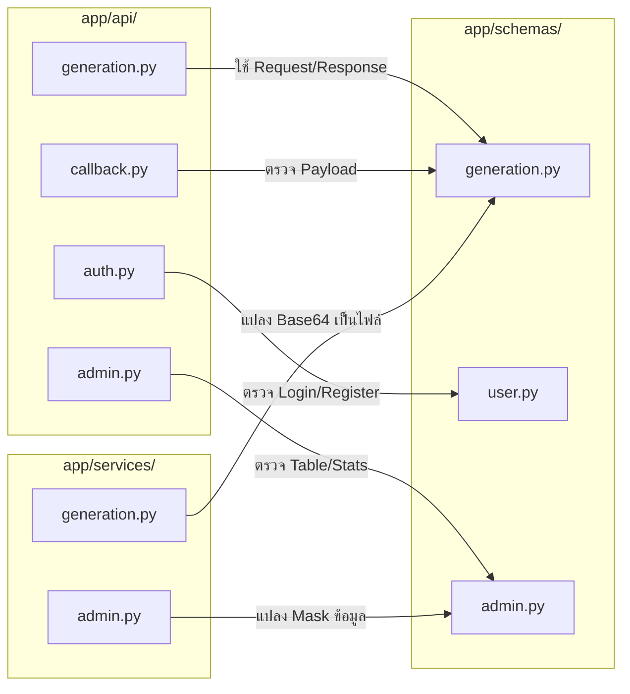

- **เชื่อมโยงกับ `app/api/`:** ทำหน้าที่เป็นตัวแปร Type Hint ใน Endpoint parameters และ `response_model`
- **เชื่อมโยงกับ `app/services/`:** ทำหน้าที่เป็น Clean DTO (Data Transfer Object) ให้ฟังก์ชันใน Service หยิบพารามิเตอร์ไปประมวลผลต่อได้โดยไม่ต้องกังวลเรื่อง Data Type ผิดพลาด
- **เชื่อมโยงกับ `app/models/`:** แมปปิ้งข้อมูลจาก ORM เป็น JSON ขาออกผ่านการตั้งค่า `from_attributes=True`

---

> **เอกสารอ้างอิงลำดับถัดไป:**  
> - สำหรับรายละเอียดการทำงานของ Endpoints ให้ดูที่: **ส่วนที่ 5: API Routers (`app/api/`)**  
> - สำหรับตรรกะเบื้องหลังการส่งงานไป AI และการบันทึกภาพ ให้ดูที่: **ส่วนที่ 6: Business Logic & Services (`app/services/`)**


---

## <a id="part-5-api-routers-appapi"></a>Part 5: API Routers


# LUMA Backend — Technical Specification & Deep Dive
## ส่วนที่ 5: API Routers (`app/api/`) — Generation, Callback & Uploads

> **วันที่จัดทำ:** 21 กันยายน 2026  
> **โมดูล:** `app/api/` (Endpoint Handlers & Request Controllers)  
> **ระบบเป้าหมาย:** LUMA Backend (FastAPI + Pydantic v2 + SQLAlchemy)  
> **ไฟล์ที่เกี่ยวข้อง:** `app/api/generation.py`, `app/api/callback.py`, `app/api/upload.py`  
> **อ้างอิงเอกสารหลัก:** `BACKEND_ONBOARDING_GUIDE.md` (ส่วนที่ 5)

---

## 1. วัตถุประสงค์และขอบเขต (Objectives & Scope)

### 1.1 วัตถุประสงค์หลัก
โมดูล API Routers ทำหน้าที่เป็น **Front Door Controllers** ของระบบ คอยรับ HTTP Requests จากผู้ใช้งานและระบบภายนอก ดำเนินการตรวจสอบสิทธิ์ความปลอดภัย ตรวจสอบความถูกต้องของข้อมูล (Validation) และส่งต่องานไปยังชั้น Business Logic (Services) รวมถึงการควบคุมการตอบกลับ (HTTP Status & Response Formatting)

### 1.2 ขอบเขตการทำงาน (In-Scope)
- **ระบบสั่งงานสร้างภาพ (`app/api/generation.py`):**
  - จัดการสร้างงาน (`POST /generations`) และกระจายงานเข้า Background Task แบบ Non-blocking
  - ตรวจสอบสถานะงานและประวัติของผู้ใช้พร้อมระบบ Data Isolation (ป้องกันไม่ให้ผู้ใช้เห็นงานของคนอื่น)
  - รายงานสถานะสดและลำดับคิวประมวลผลผ่าน Proxy ไปยัง AI Node (`GET /{id}/progress`)
  - ยกเลิกงานที่กำลังประมวลผล (`POST /{id}/cancel`) และการดาวน์โหลดไฟล์ภาพ
- **ระบบรับผลลัพธ์จาก AI Node (`app/api/callback.py`):**
  - ตรวจสอบความปลอดภัยด้วย Secret Header (`X-LUMA-INTERNAL-SECRET`)
  - ป้องกันการประมวลผลซ้ำซ้อนด้วยกลไก Idempotency
  - ประมวลผลภาพ Base64 และบันทึกลงดิสก์แบบ Atomic Write
- **ระบบอัปโหลดรูปภาพ (`app/api/upload.py`):**
  - รับภาพต้นฉบับสำหรับโหมด `img2img` และ `inpaint`
  - ตรวจสอบสิทธิ์ผู้ใช้และกรองไฟล์ภาพด้วยมาตรการความปลอดภัย 5 ชั้น (Magic Bytes, Decompression Bomb, EXIF Stripping)

### 1.3 นอกขอบเขต (Out-of-Scope)
- การจัดการสิทธิ์ระดับแอดมินและการตรวจสอบ Audit Log (อยู่ใน `app/api/admin.py`)
- ตรรกะการคำนวณ GPU ภายในโมเดล Stable Diffusion (อยู่ใน AI Node / `mock_ai_server.py`)

---

## 2. แผนผังสถาปัตยกรรมการไหลของข้อมูล (Request & Data Flow Architecture)

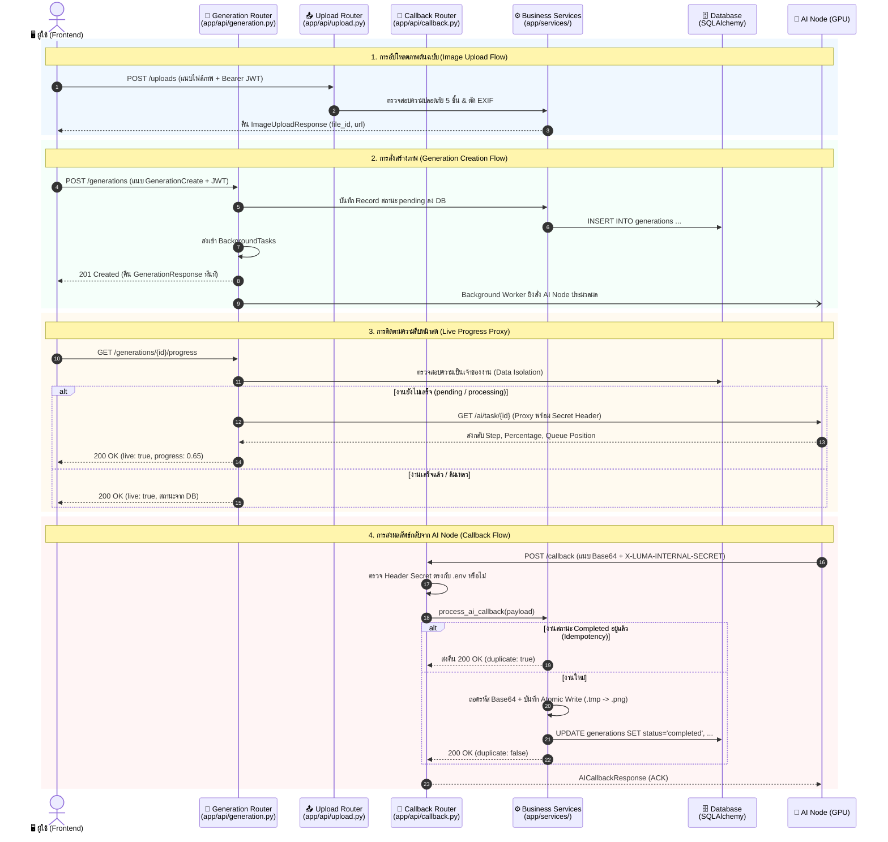

---

## 3. เจาะลึกการทำงานทีละ Endpoint (Endpoint Deep Dive)

---

### 3.1 [`app/api/generation.py`](file:///Users/pongkarm/CDTI_work/CDTI_work_69/Term_1/Image_Processing/Project/app/api/generation.py) (ระบบจัดการงานสร้างภาพ)

#### 1) `POST /generations` — สั่งสร้างภาพใหม่
* **จุดประสงค์:** รับคำสั่งสร้างภาพ บันทึกงานเป็น `pending` และปล่อยให้ Background Task ทำงานกับ GPU Node ต่อโดยไม่บล็อกผู้ใช้
* **การรับค่า (Input):**
  * `data: GenerationCreate`: ข้อมูลพารามิเตอร์ (Prompt, Steps, CFG, Model, Task Type ฯลฯ)
  * `background_tasks: BackgroundTasks`: เครื่องมือจัดการ Async Background Execution
  * `db: Session = Depends(get_db)`: SQLAlchemy Database Session
  * `current_user: User = Depends(get_current_user)`: บัญชีผู้ใช้ที่ส่งคำขอ
* **การตรวจสอบสิทธิ์ (Authentication):**
  * บังคับยืนยันตัวตนด้วย Bearer JWT Token ผ่าน `get_current_user` หากไม่ถูกต้องจะตัดสิทธิ์ด้วย `401 Unauthorized`
* **ตรรกะการทำงาน (Logic Flow):**
  ```python
  new_job = generation_service.create_generation_job(db=db, user_id=current_user.id, data=data)
  background_tasks.add_task(generation_service.process_generation_task, generation_id=new_job.id)
  return GenerationResponse.model_validate(new_job)
  ```
  1. สร้างแถวข้อมูลใหม่ในตาราง `generations` ผูกกับ `current_user.id` สถานะเริ่มต้นคือ `pending`
  2. ส่งฟังก์ชัน `process_generation_task` ไปรันเบื้องหลังเพื่อสื่อสารกับ AI Server
* **ส่งอะไรกลับ (Output):**
  * HTTP `201 Created`
  * Body: `GenerationResponse` ที่มี `id`, `status: "pending"`, และพารามิเตอร์ทั้งหมด

---

#### 2) `GET /generations/{generation_id}` — ตรวจสอบสถานะงานเดี่ยว
* **จุดประสงค์:** เรียกดูสถานะงาน พารามิเตอร์ และ URL รูปภาพเมื่อประมวลผลเสร็จ
* **การรับค่า (Input):**
  * `generation_id: UUID`: รหัสประจำงาน
* **การตรวจสอบสิทธิ์ & Data Isolation:**
  * ตรวจสอบ JWT Token และบังคับค้นหาแบบมีเงื่อนไขเจ้าของงาน:
    ```python
    generation = generation_service.get_generation_by_id(
        db=db, user_id=current_user.id, generation_id=generation_id
    )
    ```
  * หากไม่มีงานนี้ หรือผู้ใช้คนอื่นพยายามเปิดดู ระบบจะส่งคืน `404 Not Found` เสมอ เพื่อไม่ให้ผู้โจมตีทราบว่ามี ID นี้อยู่ในระบบหรือไม่
* **การทำงานพิเศษ (Auto-fail on Timeout):**
  * ฟังก์ชัน Service จะตรวจสอบว่าหากงานอยู่ในสถานะ `pending` หรือ `processing` เกิน 5 นาทีโดยไม่มีการตอบสนอง ระบบจะปรับเป็น `failed` อัตโนมัติ เพื่อป้องกันงานค้างในระบบ
* **ส่งอะไรกลับ (Output):**
  * HTTP `200 OK`
  * Body: `GenerationResponse` (หากสถานะเป็น `completed` จะมีฟิลด์ `image_url` แนบมาด้วย)

---

#### 3) `GET /generations/{generation_id}/progress` — ดู Live Progress และคิวประมวลผล
* **จุดประสงค์:** หน้าบ้านใช้ Polling ดูเปอร์เซ็นต์ความคืบหน้าของ GPU และตำแหน่งคิว
* **การรับค่า (Input):**
  * `generation_id: UUID`
* **การทำงานแบบ Reverse Proxy:**
  1. ตรวจสอบสิทธิ์ความเป็นเจ้าของงานผ่าน DB
  2. หากงานเสร็จสิ้นหรือล้มเหลวไปแล้ว จะคืนข้อมูลจากฐานข้อมูลทันที ไม่ยิงรบกวน AI Node
  3. หากงานยังอยู่ระหว่างประมวลผล Backend จะทำหน้าที่เป็น **Proxy** ยิงต่อไปยัง AI Node (`GET /ai/task/{id}`) พร้อมแนบ Header `X-LUMA-INTERNAL-SECRET`
  4. หาก AI Node ตอบกลับ จะส่งคืนข้อมูล `progress`, `step`, `total_steps`, `queue_position` พร้อมระบุ `live: true`
  5. **Graceful Fallback:** หากเชื่อมต่อ AI Node ไม่ได้ จะส่งคืนสถานะจาก DB พร้อมคำนวณเวลา `elapsed` และระบุ `live: false` ป้องกันไม่ให้หน้าบ้านแครช
* **ส่งอะไรกลับ (Output):**
  * HTTP `200 OK`
  * Body: `GenerationProgressResponse`

---

#### 4) `POST /generations/{generation_id}/cancel` — ขอยกเลิกงานสร้างภาพ
* **จุดประสงค์:** ยกเลิกงานที่กำลังรอคิวหรือกำลังรันอยู่บน GPU
* **การรับค่า (Input):**
  * `generation_id: UUID`
* **ตรรกะการตรวจสอบและยกเลิก:**
  1. ตรวจสอบสิทธิ์ความเป็นเจ้าของงาน
  2. หากงานมีสถานะ `completed` แล้ว ระบบจะปฏิเสธด้วย `409 Conflict` (ไม่สามารถยกเลิกงานที่เสร็จแล้วได้)
  3. หากงานยังรันอยู่ Backend จะส่งคำขอ `DELETE /ai/task/{generation_id}` ไปยัง AI Node เพื่อสั่งหยุดการคำนวณ GPU ทันที
  4. อัปเดตสถานะใน DB เป็น `failed` ระบุ `error_message = 'Cancelled by user'` บันทึกเวลา `completed_at`
* **ส่งอะไรกลับ (Output):**
  * HTTP `200 OK`
  * Body: `GenerationResponse` ที่มีสถานะเป็น `failed`

---

#### 5) `GET /generations/{generation_id}/image` — ดาวน์โหลดไฟล์ภาพผลลัพธ์
* **จุดประสงค์:** บริการส่งไฟล์ภาพไบนารีให้แก่เบราว์เซอร์
* **การตรวจสอบความปลอดภัย:**
  * ตรวจสอบสิทธิ์เจ้าของงาน
  * ตรวจสอบ Magic Bytes ของไฟล์บนดิสก์ผ่าน `_detect_media_type` เพื่อส่ง Header `Content-Type` ที่ถูกต้อง (`image/png`, `image/jpeg`, `image/webp`)
* **ส่งอะไรกลับ (Output):**
  * HTTP `200 OK` พร้อม `FileResponse` ของรูปภาพ

---

### 3.2 [`app/api/callback.py`](file:///Users/pongkarm/CDTI_work/CDTI_work_69/Term_1/Image_Processing/Project/app/api/callback.py) (ระบบรับผลลัพธ์จาก AI Server)

Endpoint คือ `POST /callback` และ `POST /api/callback` สำหรับรับผลลัพธ์แบบ Webhook เมื่อ GPU ประมวลผลเสร็จสิ้น:

#### 1) การตรวจ Security Header (`verify_callback_secret`)
```python
def verify_callback_secret(
    x_luma_internal_secret: Optional[str] = Header(None, alias="X-LUMA-INTERNAL-SECRET")
):
    expected_secret = settings.AI_CALLBACK_SECRET
    if not expected_secret:
        return
    if not x_luma_internal_secret or x_luma_internal_secret != expected_secret:
        logger.warning("Rejected callback with invalid or missing X-LUMA-INTERNAL-SECRET")
        raise HTTPException(
            status_code=status.HTTP_403_FORBIDDEN,
            detail="Invalid or missing X-LUMA-INTERNAL-SECRET header"
        )
```
- **เหตุผลความปลอดภัย:** ป้องกันไม่ให้ผู้ใช้ภายนอกหรือ Hacker ยิงข้อมูล Base64 ปลอมเข้ามาแอบอ้างว่างานเสร็จสิ้น มีเพียง AI Server ที่รู้ค่า Shared Secret เท่านั้นที่ส่งข้อมูลได้

#### 2) กลไกป้องกัน Callback ซ้ำซ้อน (Idempotency Guard)
ในสถาปัตยกรรมกระจายศูนย์ เมื่อเครือข่ายมีปัญหา AI Server อาจยิง Webhook ซ้ำ (Retry) ฟังก์ชัน `process_ai_callback` จัดการดังนี้:
```python
if generation.status == GenerationStatus.COMPLETED.value:
    logger.info(f"Duplicate callback ignored for completed task | id={payload.task_id}")
    return 200, AICallbackResponse(
        received=True,
        task_id=payload.task_id,
        status=generation.status,
        duplicate=True,
        message="Task already completed"
    )
```
- หากพบว่างวดก่อนหน้าประมวลผลจนเป็น `completed` ไปแล้ว ระบบจะตอบกลับ `200 OK` ทันทีพร้อมแฟล็ก `duplicate: True` **โดยไม่มีการเขียนไฟล์ทับ หรือคำนวณ Base64 ซ้ำ**

#### 3) การบันทึกไฟล์ภาพแบบ Atomic Write
```python
temp_path = file_path.with_suffix(".tmp")
temp_path.write_bytes(image_data)
temp_path.replace(file_path)
```
- เขียนข้อมูลลงไฟล์ `.tmp` ก่อนจนเสร็จสมบูรณ์ แล้วใช้ OS-level Atomic Operation (`os.replace`) สลับชื่อไฟล์เป็นชื่อจริง เพื่อป้องกันไม่ให้ผู้ใช้ดาวน์โหลดไฟล์ภาพที่เขียนค้างอยู่ครึ่งๆ กลางๆ (Partial Read)

---

### 3.3 [`app/api/upload.py`](file:///Users/pongkarm/CDTI_work/CDTI_work_69/Term_1/Image_Processing/Project/app/api/upload.py) (ระบบอัปโหลดรูปภาพต้นฉบับ)

Endpoint คือ `POST /uploads` และ `POST /generations/upload` สำหรับผู้ใช้ที่ต้องการใช้งานฟีเจอร์ **Image-to-Image** หรือ **Inpainting**:

#### 1) การรับไฟล์และการตรวจสอบตัวตน
- รับไฟล์ภาพผ่าน `UploadFile = File(...)` (Multipart Form-Data)
- ตรวจสอบ JWT Bearer Token ผ่าน `current_user = Depends(get_current_user)` บันทึก Audit Log ว่าผู้ใช้รายใดเป็นคนอัปโหลด

#### 2) ระบบคัดกรองความปลอดภัย 5 ชั้น ([`save_uploaded_image`](file:///Users/pongkarm/CDTI_work/CDTI_work_69/Term_1/Image_Processing/Project/app/services/upload.py#L58-L168))
1. **ชั้นที่ 1 (MIME Type Check):** ตรวจ `file.content_type` ต้องเป็น `image/jpeg`, `image/png`, หรือ `image/webp` หากไม่ใช่ คืน `415 Unsupported Media Type`
2. **ชั้นที่ 2 (File Size Limit):** ตรวจขนาดไบนารีจริง ต้องไม่ว่างเปล่าและไม่เกิน 10 MB (`settings.MAX_UPLOAD_SIZE_BYTES`) หากเกิน คืน `413 Request Entity Too Large`
3. **ชั้นที่ 3 (Magic Bytes Validation):** สแกนไบต์เริ่มต้นของไฟล์จริงด้วย `validate_magic_bytes`:
   - PNG: `89 50 4E 47 0D 0A 1A 0A`
   - JPEG: `FF D8 FF`
   - WEBP: `RIFF....WEBP`
   *หาก Header ไม่ตรง แม้จะเปลี่ยนนามสกุลมาเป็น .png ระบบจะปฏิเสธด้วย `422 Unprocessable Entity`*
4. **ชั้นที่ 4 (Decompression Bomb & Dimension Boundary):**
   - โหลดภาพผ่าน Pillow พร้อมตั้ง `Image.MAX_IMAGE_PIXELS = 4096 * 4096` ป้องกันการโจมตีแบบ Memory Exhaustion
   - ตรวจสอบขนาดความกว้างและความสูงต้องไม่เกิน 4096 พิกเซล
5. **ชั้นที่ 5 (Privacy Strip & Atomic Storage):**
   - ถอดรหัสและบันทึกรูปใหม่ผ่าน Buffer เพื่อ **ตัด Metadata และข้อมูลส่วนบุคคล EXIF (พิกัด GPS, รุ่นกล้อง) ทิ้งทั้งหมด**
   - สุ่มตั้งชื่อไฟล์ใหม่ด้วย `UUIDv4` เพื่อป้องกันช่องโหว่ Path Traversal
   - บันทึกไฟล์แบบ Atomic Write ในโฟลเดอร์ `uploads/`

#### 3) ข้อมูลตอบกลับ (`ImageUploadResponse`)
ส่งคืน URL สำหรับอ้างอิง และข้อมูลมิติภาพเพื่อให้หน้าบ้านนำไปเรนเดอร์ Preview และส่งต่อเป็น `source_image_path` ในการสั่งสร้างภาพ:
```json
{
  "file_id": "9b1deb4d-3b7d-4bad-9bdd-2b0d7b3dcb6d",
  "filename": "9b1deb4d-3b7d-4bad-9bdd-2b0d7b3dcb6d.png",
  "url": "/uploads/9b1deb4d-3b7d-4bad-9bdd-2b0d7b3dcb6d.png",
  "width": 1024,
  "height": 1024,
  "size_bytes": 1048576,
  "format": "PNG"
}
```

---

## 4. ตารางสรุป API Specification Matrix

| Method | Path | การยืนยันสิทธิ์ / Header | Request Body / Params | Response Model | HTTP Status | วัตถุประสงค์ |
| :--- | :--- | :--- | :--- | :--- | :--- | :--- |
| **POST** | `/generations` | Bearer JWT | `GenerationCreate` (JSON) | `GenerationResponse` | `201 Created` | สร้างคิวงานใหม่และสั่งรันเบื้องหลัง |
| **GET** | `/generations` | Bearer JWT | Query: `page`, `page_size` | `GenerationListResponse` | `200 OK` | ดึงประวัติงานสร้างภาพของตนเอง |
| **GET** | `/generations/{id}` | Bearer JWT (Owner Check) | Path: `id` (UUID) | `GenerationResponse` | `200 OK` | ดูสถานะงานเดี่ยวและ URL รูปภาพ |
| **GET** | `/generations/{id}/progress` | Bearer JWT (Owner Check) | Path: `id` (UUID) | `GenerationProgressResponse` | `200 OK` | Proxy ดู Step สดและคิวประมวลผล |
| **POST** | `/generations/{id}/cancel` | Bearer JWT (Owner Check) | Path: `id` (UUID) | `GenerationResponse` | `200 OK` | ยกเลิกงานและส่งคำสั่งระงับ GPU |
| **GET** | `/generations/{id}/image` | Bearer JWT (Owner Check) | Path: `id` (UUID) | Binary Stream (FileResponse) | `200 OK` | ดาวน์โหลดไฟล์ภาพที่เสร็จแล้ว |
| **DELETE**| `/generations/{id}` | Bearer JWT (Owner Check) | Path: `id` (UUID) | None | `204 No Content` | ลบประวัติงานและลบไฟล์ภาพบนดิสก์ |
| **POST** | `/callback` | `X-LUMA-INTERNAL-SECRET` | `AICallbackPayload` (JSON) | `AICallbackResponse` | `200 OK` | AI Node ส่งผลลัพธ์ภาพ Base64 กลับ |
| **POST** | `/uploads` | Bearer JWT | Multipart: `file` | `ImageUploadResponse` | `201 Created` | อัปโหลดรูปภาพต้นฉบับสำหรับ img2img |
| **GET** | `/uploads/{filename}` | Bearer JWT | Path: `filename` | Binary Stream (FileResponse) | `200 OK` | ดึงดูภาพที่อัปโหลดไว้ (Cache 24 ชม.) |

---

## 5. จุดเด่นด้านความปลอดภัยและเสถียรภาพ (Security & Reliability Highlights)

1. **Strict Data Isolation:**
   - ผู้ใช้ไม่สามารถคาดเดาหรือเข้าถึงข้อมูลงานหรือดาวน์โหลดภาพของผู้ใช้อื่นได้ เนื่องจากมีการตรวจสอบ `Generation.user_id == current_user.id` ทุกครั้ง และตอบกลับด้วย `404 Not Found` เสมอ
2. **Reverse Proxy Masking:**
   - การดึงความคืบหน้าผ่าน `/generations/{id}/progress` ช่วยซ่อน AI GPU Node ไม่ให้เปิดพอร์ตสู่สาธารณะโดยตรง และควบคุมปริมาณ Request ได้ที่ฝั่ง Backend
3. **Idempotent Webhook Processing:**
   - ป้องกันสภาวะ Race Condition และการบันทึกไฟล์ซ้ำซ้อนจาก Webhook Retries ของ AI Node
4. **Zero-Trust Upload Validation:**
   - ไม่เชื่อถือ Content-Type หรือนามสกุลไฟล์ที่ Client ส่งมา แต่บังคับตรวจ Magic Bytes และเปิดอ่านโครงสร้างไฟล์จริงด้วย Pillow เพื่อป้องกัน Shellcode และ Decompression Bomb


---

## <a id="part-6-services--business-logic-appservices"></a>Part 6: Services & Business Logic


# LUMA Backend — Technical Specification & Deep Dive
## ส่วนที่ 6: Business Logic & Services (`app/services/`)

> **วันที่จัดทำ:** 21 กันยายน 2026  
> **โมดูล:** `app/services/` (Business Logic, AI Dispatcher, Image Storage & File Security)  
> **ระบบเป้าหมาย:** LUMA Backend (FastAPI + SQLAlchemy + HTTPX + Pillow)  
> **ไฟล์ที่เกี่ยวข้อง:** `app/services/generation.py`, `app/services/upload.py`, `app/services/admin.py`  
> **อ้างอิงเอกสารหลัก:** `BACKEND_ONBOARDING_GUIDE.md` (ส่วนที่ 6)

---

## 1. วัตถุประสงค์และขอบเขต (Objectives & Scope)

### 1.1 วัตถุประสงค์ (Objectives)
- แยก **Core Business Logic** ออกจาก API Router (Controller) อย่างเด็ดขาด เพื่อความง่ายในการบำรุงรักษาและการทดสอบแบบแยกส่วน (Unit/Integration Tests)
- ควบคุมวงจรชีวิตของงานสร้างภาพ (Generation Lifecycle) ตั้งแต่การรับ Request, ตรวจสอบความถูกต้อง, สร้างคิวงานในฐานข้อมูล, สื่อสารกับ Node AI ภายนอก ไปจนถึงการรับผลลัพธ์
- ควบคุมมาตรฐานความปลอดภัยสูงสุดในการรับไฟล์เข้าสู่เซิร์ฟเวอร์ (Image Upload Pipeline) เพื่อป้องกัน Malicious Executables, Polyglot Shells, Image Bombs และการรั่วไหลของข้อมูลส่วนบุคคล (EXIF/GPS)
- วางกลไกการเขียนไฟล์แบบ **Atomic Write** และการจัดเก็บไฟล์แยกโฟลเดอร์ตามผู้ใช้ (Data Isolation) ป้องกันการชนกันของไฟล์และปัญหา Race Condition

### 1.2 ขอบเขต (Scope)
- **In-Scope:**
  - การทำงานของ `create_generation_job` ในการจัดเตรียมข้อมูลและสร้าง Record เริ่มต้นสถานะ `pending`
  - การเปรียบเทียบสถาปัตยกรรม **Callback Mode** (Asynchronous Webhook) กับ **Direct Mode** (Synchronous Blocking) ใน `process_generation_task`
  - กลไกการถอดรหัส Base64 อย่างปลอดภัย, การตรวจจับนามสกุลไฟล์จาก Magic Bytes และการเขียนไฟล์ภาพแบบ Atomic Write
  - ระบบคัดกรองความปลอดภัยไฟล์อัปโหลด 5 ชั้น (5-Layer Upload Security Pipeline) ใน `save_uploaded_image`
  - ตรรกะ **Server Timeout Auto-fail 5 นาที** (`_check_and_apply_timeout`) พร้อมแนวคิดการประเมินแบบ Passive/Lazy Evaluation
  - หน้าที่ของ `app/services/admin.py` ในการจัดการสถิติ, บัญชีผู้ใช้ และ Audit Trail
- **Out-of-Scope:**
  - รายละเอียดระดับลึกของ Diffusion Model หรือโครงสร้าง Graph ภายใน ComfyUI (จัดการแยกใน Node 7: AI Inference)

---

## 2. แผนผังสถาปัตยกรรมและ Data Flow (Services Architecture)

```mermaid
flowchart TD
    subgraph ClientLayer ["🖥️ หน้าบ้าน (Client / Frontend)"]
        ClientReq["POST /generations<br/>(Prompt, Model, Steps)"]
        UploadReq["POST /uploads<br/>(Multipart Form File)"]
        PollReq["GET /generations/{id}<br/>(Polling Status)"]
    end

    subgraph ServiceLayer ["⚙️ app/services/ (Business Logic Core)"]
        direction TB
        
        subgraph UploadService ["app/services/upload.py"]
            L1["1. MIME Type Check"]
            L2["2. Size Limit (10MB)"]
            L3["3. Magic Bytes Verify"]
            L4["4. Pillow Decode & Bomb Guard"]
            L5["5. EXIF Strip & UUID Atomic Save"]
            L1 --> L2 --> L3 --> L4 --> L5
        end

        subgraph GenService ["app/services/generation.py"]
            CreateJob["create_generation_job()<br/>- Resolve paths<br/>- DB Insert (pending)"]
            Dispatcher["process_generation_task()<br/>(Background Task)"]
            DirectMode["⚡ Direct Mode<br/>(Wait 180s & Decode Image)"]
            CallbackMode["🔄 Callback Mode<br/>(Fire & Forget + Webhook URL)"]
            CallbackReceiver["process_ai_callback()<br/>(Idempotent Receiver)"]
            TimeoutGuard["_check_and_apply_timeout()<br/>(Passive Fail > 300s)"]
        end
    end

    subgraph StorageLayer ["💾 Local Storage & Database"]
        DB[(Database: generations / users)]
        UploadsDir["uploads/{uuid}.png"]
        OutputsDir["outputs/{user_id}/{gen_id}.png"]
    end

    subgraph AINode ["🤖 AI Inference Cluster (Port 8001 / GPU)"]
        AIWorker["ComfyUI / Mock AI Server"]
    end

    %% Upload Flow
    UploadReq --> UploadService
    L5 -->|Save Image| UploadsDir

    %% Create Job Flow
    ClientReq --> CreateJob
    CreateJob -->|1. Insert Pending| DB
    CreateJob -->|2. Enqueue Task| Dispatcher

    %% AI Dispatching
    Dispatcher -->|Mode = Direct| DirectMode
    Dispatcher -->|Mode = Callback| CallbackMode
    DirectMode -->|HTTP POST (Block)| AIWorker
    CallbackMode -->|HTTP POST (Async Task)| AIWorker
    AIWorker -.->|Webhook POST /callback/ai-result| CallbackReceiver

    %% Storage & State Updates
    DirectMode -->|Atomic Write| OutputsDir
    DirectMode -->|Update Completed| DB
    CallbackReceiver -->|Atomic Write| OutputsDir
    CallbackReceiver -->|Update Completed| DB

    %% Polling & Timeout
    PollReq --> TimeoutGuard
    TimeoutGuard -->|If delta > 300s| DB
```

---

## 3. เจาะลึกการทำงานของ `app/services/generation.py` (Prompt 6.1 & 6.3)

### 3.1 การสร้างและบันทึกงานลงฐานข้อมูล (`create_generation_job`)

ฟังก์ชัน `create_generation_job(db: Session, user_id: UUID, data: GenerationCreate) -> Generation` ทำหน้าที่สร้างคำขอสร้างภาพใหม่เข้าสู่ระบบ มีขั้นตอนทำงานดังนี้:

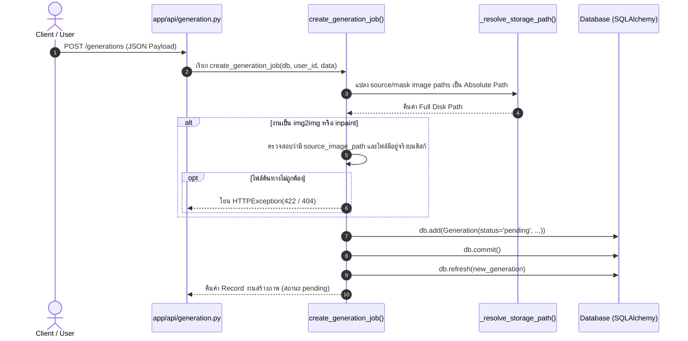

1. **Path Resolution (`_resolve_storage_path`):**  
   แปลง URL สัมพัทธ์ เช่น `/uploads/550e8400.png` หรือชื่อไฟล์ ให้เป็น Absolute Path บนระบบไฟล์จริง (`/path/to/uploads/550e8400.png`)
2. **Business Rule Validation:**  
   ตรวจสอบเงื่อนไขเฉพาะของโมเดล หาก `task_type` คือ `img2img` หรือ `inpaint` ตัวแปร `source_image_path` ต้องไม่ว่างเปล่า และไฟล์ภาพต้องปรากฏอยู่บนเซิร์ฟเวอร์จริง หากไม่พบจะโยนข้อผิดพลาด `HTTP 422 Unprocessable Entity` หรือ `HTTP 404 Not Found` ทันที
3. **Database Insertion:**  
   สร้างออบเจกต์โมเดล `Generation` พร้อมสุ่ม `id = uuid.uuid4()` กำหนดค่าสถานะเริ่มต้นเป็น `pending` และผูกพารามิเตอร์ครบถ้วน (`prompt`, `negative_prompt`, `model_name`, `lora_config`, `sampler_name`, `steps`, `cfg_scale`, `seed`, `width`, `height`, `denoising_strength`)
4. **Commit Transaction:**  
   สั่ง `db.commit()` และ `db.refresh()` เพื่อคืน Record ที่มีสถานะสมบูรณ์กลับไปให้ API Layer เพื่อส่งต่อไปรันใน Background Task ต่อไป

---

### 3.2 ความแตกต่างระหว่าง Callback Mode กับ Direct Mode

ในฟังก์ชัน `process_generation_task(generation_id: UUID)` ระบบรองรับการทำงานกับ AI Node สองรูปแบบตามการตั้งค่า `settings.AI_MODE` ใน `.env`:

| มิติการเปรียบเทียบ | ⚡ Direct Mode (`AI_MODE=direct`) | 🔄 Callback Mode (`AI_MODE=callback`) |
| :--- | :--- | :--- |
| **สถาปัตยกรรมหลัก** | **Synchronous Blocking Request** | **Asynchronous Fire-and-Forget (Webhook)** |
| **Target Endpoint** | `AI_SERVER_DIRECT_URL` (เช่น `/generate`) | `AI_SERVER_CALLBACK_URL` (`/ai/generate` หรือ `/ai/edit`) |
| **HTTP Timeout** | ยาวนาน (`timeout=180.0s`, `connect=10.0s`) | สั้นกระชับ (`timeout=30.0s`, `connect=10.0s`) |
| **Payload ขาไป** | ส่งเฉพาะพารามิเตอร์ของภาพและ Base64 ภาพต้นฉบับ | แนบ `task_id` และ `callback_url` (`settings.BACKEND_CALLBACK_URL`) |
| **วงจรชีวิตสถานะงาน** | `pending` $\rightarrow$ `processing` $\rightarrow$ `completed`/`failed` (ใน Background Task เดียวกัน) | `pending` $\rightarrow$ `processing` (จบ Background Task โดยยังคงสถานะ `processing` ไว้) |
| **การรับภาพผลลัพธ์** | รับ Base64 กลับมาใน Response Payload ทันที แล้วบันทึกไฟล์ | AI Node ส่ง HTTP POST Base64 กลับมาที่ `POST /callback/ai-result` ในภายหลัง |
| **Header ความปลอดภัย** | แนบ `X-LUMA-INTERNAL-SECRET` | แนบ `X-LUMA-INTERNAL-SECRET` ทั้งขาไปและขากลับ |
| **การจัดการคิวงาน** | Backend ต้องเปิด Connection แช่ไว้จนกระทั่ง AI วาดเสร็จ | AI Node จัดคิวภายใน (Queue Engine) และ Backend พร้อมรับงานอื่นต่อทันที |
| **กรณีการใช้งาน** | การพัฒนาและทดสอบ (Local Dev / Mock AI Server) | การใช้งานจริงบน Production ร่วมกับ GPU Inference Cluster |

---

### 3.3 กลไกการบันทึกภาพ Base64 เป็นไฟล์ลงโฟลเดอร์ `outputs/`

ทั้งใน Direct Mode และ Callback Mode มีขั้นตอนการแปลงและบันทึกภาพลงดิสก์ที่ปลอดภัยสูงสุด 4 ขั้นตอน:

1. **ปลอดภัยจาก Header ขยะด้วย `_safe_b64decode`:**
   ```python
   def _safe_b64decode(b64_str: str) -> bytes:
       if "," in b64_str:
           b64_str = b64_str.split(",", 1)[1]
       return base64.b64decode(b64_str.strip())
   ```
   ตัด Prefix เช่น `data:image/png;base64,` ออกอย่างปลอดภัย ป้องกันปัญหา Byte Header ของ Data URL ปะปนเข้าไปทำลายความถูกต้องของไฟล์ภาพไบนารี
2. **ระบุนามสกุลไฟล์จาก Magic Bytes จริง (`_detect_image_extension`):**
   ```python
   def _detect_image_extension(image_bytes: bytes) -> str:
       if image_bytes.startswith(b"\x89PNG\r\n\x1a\n"):
           return ".png"
       if image_bytes.startswith(b"\xff\xd8\xff"):
           return ".jpg"
       if image_bytes.startswith(b"RIFF") and len(image_bytes) >= 12 and image_bytes[8:12] == b"WEBP":
           return ".webp"
       return ".png"
   ```
   ไม่เชื่อใจข้อมูลนามสกุลจาก AI Node แต่ตรวจสอบ Signature ไบนารีโดยตรง
3. **การแยกโฟลเดอร์ตามผู้ใช้งาน (User Isolation):**  
   ภาพจะถูกจัดเก็บลงใน `outputs/{user_id}/{generation_id}{ext}` เพื่อป้องกันการสับสนของข้อมูล และรองรับการจัดการสิทธิ์การเข้าถึงไฟล์ในอนาคต
4. **การบันทึกแบบ Atomic Write:**
   ```python
   temp_path = file_path.with_suffix(".tmp")
   temp_path.write_bytes(image_data)   # 1. เขียนลงไฟล์ชั่วคราว .tmp
   temp_path.replace(file_path)        # 2. ทำ Atomic Swap สลับชื่อไฟล์
   ```
   > **ประโยชน์ทางวิศวกรรม:** ป้องกันปัญหา Race Condition กรณี Client ยิง Request ดาวน์โหลดภาพในมิลลิวินาทีที่ Backend กำลังเขียนไฟล์ลงดิสก์ ซึ่งอาจทำให้ได้ไฟล์ที่ไม่สมบูรณ์ (Corrupted/Partial Read)

---

### 3.4 ระบบตรวจจับงานค้าง (Timeout Auto-fail 5 นาที)

ระบบมีกลไกป้องกันงานค้างในระบบตลอดกาล กรณีที่ AI Node เกิดขัดข้อง (Crash) หรือเน็ตเวิร์กขาดการเชื่อมต่อจนไม่สามารถส่ง Callback กลับมาได้

#### โค้ดใน `_check_and_apply_timeout`:
```python
def _check_and_apply_timeout(generation: Generation, db: Session, timeout_seconds: int = 300) -> bool:
    if generation.status in (GenerationStatus.PENDING.value, GenerationStatus.PROCESSING.value):
        if generation.created_at is not None:
            now = datetime.now(timezone.utc)
            created = generation.created_at
            if created.tzinfo is None:
                created = created.replace(tzinfo=timezone.utc)
            delta = (now - created).total_seconds()
            if delta > timeout_seconds:
                generation.status = GenerationStatus.FAILED.value
                generation.error_message = f"Generation timed out after {timeout_seconds // 60} minutes (no callback received from AI node)"
                generation.duration_seconds = delta
                generation.completed_at = now
                db.commit()
                db.refresh(generation)
                logger.warning(f"Generation timed out | id={generation.id} | elapsed={delta:.1f}s")
                return True
    return False
```

#### แนวคิด Passive / Lazy Evaluation:
แทนที่จะใช้ Background Cron Daemon คอยสแกนฐานข้อมูลทุกวินาที (ซึ่งสิ้นเปลือง CPU และ Database Connection โดยไม่จำเป็น) LUMA Backend เลือกใช้แนวคิด **Lazy Evaluation (ตรวจสอบเมื่อมีการเรียกใช้งาน)** โดยฟังก์ชันนี้จะทำงานทันทีใน 3 จังหวะ:
1. **เมื่อเช็กสถานะงานรายตัว (`get_generation_by_id`):** ทำงานเมื่อ Client ยิง Polling `GET /generations/{id}`
2. **เมื่อดึงประวัติงานทั้งหมด (`get_user_generations`):** ทำงานเมื่อ User เปิดหน้า History `GET /generations` โดยวนลูปตรวจจับทุกงานที่แสดงผลในหน้านั้น
3. **เมื่อดู Live Progress (`get_generation_progress`):** ทำงานเมื่อ Client ขอ Progress สด `GET /generations/{id}/progress`

---

## 4. ระบบความปลอดภัยไฟล์อัปโหลด 5 ชั้น ใน `app/services/upload.py` (Prompt 6.2)

ฟังก์ชัน `save_uploaded_image(file: UploadFile) -> ImageUploadResponse` ออกแบบตามมาตรฐานความปลอดภัย OWASP Secure File Upload Guidelines โดยแบ่งด่านคัดกรองออกเป็น 5 ชั้น:

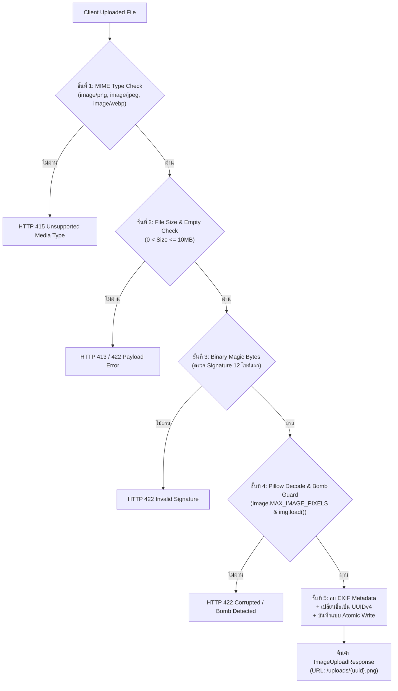

### รายละเอียดการป้องกันในแต่ละชั้น:

#### ชั้นที่ 1: Content-Type Header Verification
- ตรวจสอบ `file.content_type` ว่าตรงกับรายการ Whitelist ใน `ALLOWED_MIME_TYPES` หรือไม่
- สกัดกั้นไฟล์สคริปต์อันตรายตั้งแต่ด่านแรก (เช่น `.php`, `.py`, `.sh`, `.exe`, `.html`)
- หากไม่ตรง จะตัดการทำงานทันทีด้วย `HTTP 415 Unsupported Media Type`

#### ชั้นที่ 2: File Size & Empty Payload Guard
- อ่านไบนารีเข้าสู่หน่วยความจำและวัดขนาดจริง `len(content)`
- บล็อกไฟล์ขนาดเกิน `settings.MAX_UPLOAD_SIZE_BYTES` (10MB) ด้วย `HTTP 413 Request Entity Too Large`
- บล็อกไฟล์ว่าง (0 Bytes) ด้วย `HTTP 422 Unprocessable Entity`
- ป้องกันการโจมตีประเภท Storage/Memory Exhaustion Denial of Service (DoS)

#### ชั้นที่ 3: Binary Magic Bytes Verification (`validate_magic_bytes`)
- ป้องกันการหลอกลวง (Header Spoofing) เช่น แฮกเกอร์ส่งไฟล์ Webshell แต่ปลอม Header เป็น `image/jpeg`
- ฟังก์ชันจะตรวจอ่าน Signature ไบนารี 12 ไบต์แรกของไฟล์จริง:
  - **PNG:** `89 50 4E 47 0D 0A 1A 0A` (`\x89PNG\r\n\x1a\n`)
  - **JPEG:** `FF D8 FF` (`\xff\xd8\xff`)
  - **WEBP:** `RIFF` + (4 ไบต์) + `WEBP`
- หากไบต์ส่วนหัวไม่ตรงกับสเปก จะตอบกลับด้วย `HTTP 422 Unprocessable Entity` ทันที

#### ชั้นที่ 4: Pillow Integrity Verification & Decompression Bomb Guard
- **ป้องกัน Decompression Bomb (Pixel Flood Attack):**  
  กำหนดเพดานพิกเซลสูงสุด `Image.MAX_IMAGE_PIXELS = settings.MAX_IMAGE_DIMENSION ** 2` (เช่น $2048 \times 2048 = 4,194,304$ พิกเซล) หากไฟล์มีขนาดบีบอัดเล็กแต่เมื่อขยายใน RAM มีขนาดมหาศาล Pillow จะดักจับด้วย `Image.DecompressionBombError` ทันที
- **บังคับ Decode ทั้งผืน (`img.load()`):**  
  บังคับอ่านพิกเซลทั้งภาพเพื่อตรวจจับไฟล์เสีย (Corrupted Image) หรือไฟล์ Polyglot ที่ซ่อนไบนารีแปลกปลอมไว้ครึ่งหลังของไฟล์
- **จำกัดสัดส่วนภาพ:**  
  ตรวจเช็กว่าทั้งความกว้างและความสูงไม่เกิน `MAX_IMAGE_DIMENSION` (2048px)

#### ชั้นที่ 5: EXIF Stripping & UUIDv4 Atomic Storage
- **คุ้มครองความเป็นส่วนตัว (Privacy & Anti-Stalking):**  
  ภาพถ่ายจริงมักฝังข้อมูล EXIF เช่น พิกัดดาวเทียม (GPS Lat/Long), วันเวลาที่ถ่าย, รุ่นกล้อง หรือเลขซีเรียล ระบบจะเรนเดอร์ภาพใหม่ผ่าน Pillow ลงใน Memory Buffer สะอาด ทำให้ Metadata เดิมหลุดหายไปทั้งหมด
- **ป้องกัน Path Traversal:**  
  ไม่ใช้ชื่อไฟล์เดิมที่ Client ส่งมา (ป้องกันชื่อไฟล์อย่าง `../../etc/passwd` หรือ `shell.php`) แต่สุ่มตั้งชื่อใหม่ด้วย `uuid.uuid4()` เสมอ
- **Atomic Write:**  
  เขียนลง `.tmp` ก่อนทำ `replace()` ป้องกันไฟล์เสียหายระหว่างเขียนข้อมูล

---

## 5. ภาพรวมโมดูลเสริม: `app/services/admin.py`

โมดูล `admin.py` ทำหน้าที่สนับสนุนงานฝั่ง System Management และ Governance:
- **System Statistics Aggregation:** คำนวณยอดผู้ใช้ทั้งหมด, จำนวนงานสร้างภาพ, อัตราความสำเร็จ/ความล้มเหลว (Success/Failure Rate) และปริมาณพื้นที่จัดเก็บภาพบนดิสก์
- **User Management:** สลับสถานะเปิด/ปิดบัญชี (`is_active` สำหรับแบนหรือปลดแบนผู้ใช้)
- **Role Assignment:** ตรวจสอบลำดับขั้นสิทธิ์ (Owner > Admin > Reviewer) ก่อนอนุมัติการเปลี่ยนแปลง
- **Audit Logging:** บันทึกทุกกิจกรรมของแอดมินลงในตาราง `audit_events` โดยอัตโนมัติ เพื่อให้สามารถตรวจสอบย้อนหลัง (Audit Trail) ได้อย่างโปร่งใส

---

## 6. สรุปสำหรับนักพัฒนา (Engineering Key Takeaways)

1. **ไม่เขียน Logic ใน API Router:** โค้ดใน `app/api/` ต้องทำหน้าที่เพียงรับ Request, ตรวจสอบ Authentication, ส่งต่อไปยัง `app/services/` และคืน HTTP Response เท่านั้น
2. **ความปลอดภัยของไฟล์ภาพต้องเป็นแบบ Defense-in-Depth:** การตรวจสอบ Header เพียงอย่างเดียวไม่เพียงพอ ต้องผสานทั้ง Header + Size + Magic Bytes + Decoder Verification + EXIF Sanitization
3. **Atomic File Operations:** ทุกฟังก์ชันที่เกี่ยวข้องกับการเขียนไฟล์ลงดิสก์ (`outputs/` หรือ `uploads/`) ต้องใช้แบบแผน `.tmp` แล้วตามด้วย `replace()` เสมอ เพื่อรับประกันความสมบูรณ์ของข้อมูล
4. **Idempotent Webhooks:** ฟังก์ชัน `process_ai_callback` รองรับการยิงซ้ำ (Duplicate Requests) จาก AI Node โดยตรวจสถานะก่อนหน้า หากงานเสร็จสมบูรณ์ไปแล้วจะตอบกลับ `200 OK` ทันทีโดยไม่ประมวลผลซ้ำ


---

## <a id="part-7-ai-integration--testing-suite"></a>Part 7: AI Integration & Testing Suite


# LUMA Backend: Technical Specification & Architecture Deep Dive
## ส่วนที่ 7: AI Integration & Testing Suite (`mock_ai_server.py`, `tests/`, `test_e2e_flow.py`)

> **วันที่จัดทำ:** 21 กันยายน 2026  
> **หมวดหมู่:** Backend Architecture, AI Node Integration & Quality Assurance  
> **เวอร์ชัน:** 1.0.0  
> **ระบบเป้าหมาย:** LUMA Distributed Inference Architecture & Automated Verification Suite  
> **ไฟล์ที่เกี่ยวข้อง:**  
> - `mock_ai_server.py` (AI Inference Node Mock Server - Port 8001)  
> - `tests/conftest.py` (Pytest Shared Fixtures & Test Client)  
> - `tests/test_*.py` (Automated Security, Isolation, Upload, & Service Test Suite)  
> - `test_e2e_flow.py` (Live End-to-End Multi-Service Pipeline Verification)  
> **อ้างอิงเอกสารหลัก:** `BACKEND_ONBOARDING_GUIDE.md` (ส่วนที่ 7)

---

## 1. วัตถุประสงค์และขอบเขต (Objectives & Scope)

### 1.1 วัตถุประสงค์ (Objectives)
1. อธิบายสถาปัตยกรรมจำลอง **AI Inference Node** ([mock_ai_server.py](file:///Users/pongkarm/CDTI_work/CDTI_work_69/Term_1/Image_Processing/Project/mock_ai_server.py)) ที่ทำงานแยกขาดจาก Backend หลักแบบ Asynchronous Decoupled System รองรับทั้ง Direct Mode และ Async Callback Mode
2. เจาะลึกการทำงานของ **Pytest Automation Suite** ในโฟลเดอร์ [tests/](file:///Users/pongkarm/CDTI_work/CDTI_work_69/Term_1/Image_Processing/Project/tests) ครอบคลุมการจัดการ Fixtures ใน [tests/conftest.py](file:///Users/pongkarm/CDTI_work/CDTI_work_69/Term_1/Image_Processing/Project/tests/conftest.py), การทดสอบ Data Isolation, Security Hardening, SQL Injection, JWT Tampering, Magic Bytes Image Verification และ Error Handling
3. วิเคราะห์สคริปต์ **Live Pipeline Verification** ([test_e2e_flow.py](file:///Users/pongkarm/CDTI_work/CDTI_work_69/Term_1/Image_Processing/Project/test_e2e_flow.py)) แสดงขั้นตอนการจำลองตั้งแต่เริ่มสมัครสมาชิก สั่งสร้างงาน จัดการความปลอดภัยของ Callback จนถึงการทำ Image-to-Image (img2img) แบบครบวงจร
4. ให้แนวทางการปรับแต่ง (Tuning Guide) สำหรับนักพัฒนาในการปรับค่า Latency หรือจำลอง Error สภาพแวดล้อมจริง เช่น GPU Out of Memory (OOM), Secret Header ผิดพลาด หรือ Network Timeout

### 1.2 ขอบเขต (Scope)
- **In-Scope:**
  - สถาปัตยกรรม Dual-Mode ของ `mock_ai_server.py` (`POST /generate`, `POST /ai/generate`, `POST /ai/edit`)
  - กลไกการวาดภาพสังเคราะห์ด้วย Pillow รองรับโหมด `txt2img`, `img2img` (Side-by-side) และ `inpaint`
  - การรักษาความปลอดภัยของ Callback Endpoint ด้วย `X-LUMA-INTERNAL-SECRET` และ Idempotency Handling
  - 8 ชุดทดสอบอัตโนมัติใน `tests/` รวม 67+ เคสทดสอบ
  - การรันและวิเคราะห์ Assertions ใน `test_e2e_flow.py` ทั้ง 9 ขั้นตอน
- **Out-of-Scope:**
  - การติดตั้งไดรเวอร์ CUDA หรือคอมไพล์ TensorRT จริงบน Hardware GPU
  - การต่อระบบ Message Broker ภายนอก (เช่น RabbitMQ / Celery / Redis Queue)

---

## 2. ภาพรวมสถาปัตยกรรมระบบ (System Architecture & Sequence Diagrams)

### 2.1 โครงสร้างการเชื่อมต่อระหว่าง Backend และ AI Node

```mermaid
flowchart TD
    subgraph Client ["Client Layer (Frontend / Test Runner)"]
        UI["React Web UI / test_e2e_flow.py"]
    end

    subgraph BackendCore ["LUMA Backend (FastAPI - Port 8000)"]
        API["API Router (/generations, /uploads)"]
        Service["Generation Service (app/services/generation.py)"]
        CallbackEP["Callback Handler (POST /api/callback)"]
        DB[(PostgreSQL / SQLite Database)]
        Storage[("./outputs / Static Storage")]
    end

    subgraph AINode ["AI Node Cluster (mock_ai_server.py - Port 8001)"]
        MockRouter["Inference Gateway (/ai/generate, /ai/edit)"]
        BGTask["BackgroundTasks Engine"]
        CanvasSynth["Pillow Canvas Synthesizer"]
    end

    UI -->|1. POST /generations (Prompt, Params)| API
    API -->|2. Insert Job 'pending'| DB
    API -->|3. Delegate Job| Service
    
    Service -->|4. HTTP 202 Accepted Trigger| MockRouter
    MockRouter -->|5. Queue Job to Background| BGTask
    
    BGTask -->|6. Render Synthetic Latent / Image| CanvasSynth
    BGTask -->|7. POST /api/callback (X-LUMA-INTERNAL-SECRET)| CallbackEP
    
    CallbackEP -->|8. Verify Secret & Idempotency| CallbackEP
    CallbackEP -->|9. Atomic Write PNG File| Storage
    CallbackEP -->|10. Update Job 'completed'| DB
    
    UI -.->|11. Poll Status / GET /generations/:id| API
    UI -.->|12. Download Completed Image| Storage
```

### 2.2 วงจร Async Callback Lifecycle Sequence

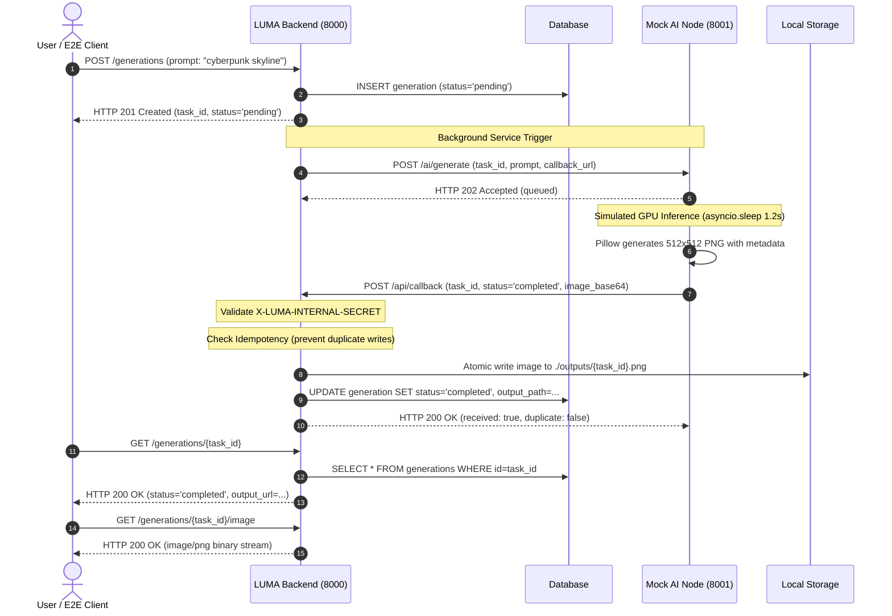

---

## 3. เจาะลึกการทำงานของ `mock_ai_server.py`

ไฟล์ [`mock_ai_server.py`](file:///Users/pongkarm/CDTI_work/CDTI_work_69/Term_1/Image_Processing/Project/mock_ai_server.py) ทำหน้าที่เป็น Digital Twin เสมือนระบบ AI Worker บนพอร์ต 8001

### 3.1 Pydantic Request Schemas
ระบบประกาศ Schema ชัดเจนเพื่อรองรับ 3 สเปกงาน:

```python
class DirectGenerateRequest(BaseModel):
    task_type: Optional[str] = "txt2img"
    prompt: str = Field(..., min_length=1)
    negative_prompt: Optional[str] = None
    steps: Optional[int] = 25
    cfg_scale: Optional[float] = 7.5
    width: Optional[int] = 512
    height: Optional[int] = 512
    sampler_name: Optional[str] = "Euler a"
    seed: Optional[int] = -1
    model_name: Optional[str] = "counterfeitV30_v30.safetensors"
    lora_config: Optional[Any] = None
    source_image_path: Optional[str] = None
    image_base64: Optional[str] = None
    mask_base64: Optional[str] = None
    denoising_strength: Optional[float] = None

class CallbackGenerateRequest(BaseModel):
    task_id: str
    prompt: str = Field(..., min_length=1)
    negative_prompt: Optional[str] = None
    model: Optional[str] = "counterfeitV30_v30.safetensors"
    lora: Optional[str] = None
    steps: Optional[int] = 25
    cfg_scale: Optional[float] = 7.5
    width: Optional[int] = 512
    height: Optional[int] = 512
    callback_url: Optional[str] = "http://localhost:8000/api/callback"

class CallbackEditRequest(BaseModel):
    task_id: str
    prompt: str = Field(..., min_length=1)
    image_base64: str
    mask_base64: Optional[str] = None
    mode: Optional[str] = "img2img"  # "img2img" | "inpaint"
    steps: Optional[int] = 25
    cfg_scale: Optional[float] = 7.5
    callback_url: Optional[str] = "http://localhost:8000/api/callback"
```

### 3.2 เอนจินวาดภาพจำลอง (`generate_mock_image_base64`)
เพื่อลดภาระไม่ต้องรันโมเดลหลายกิกะไบต์ระหว่างการพัฒนา ระบบใช้ Pillow (`PIL.Image`, `PIL.ImageDraw`) สร้างภาพ PNG ความละเอียดสูงแบบ Dynamic ตาม Task Type:
1. **โหมด Inpainting (`task_type == "inpaint"`)**:
   - อ่าน `source_b64` ต้นฉบับ
   - ตีกรอบ Highlight สี่เหลี่ยมสี Cyan `(56, 189, 248)` บริเวณกึ่งกลางภาพเพื่อจำลองพื้นที่ Mask ที่ถูก Inpaint
   - พิมพ์ข้อความ `✨ LUMA Inpainted Region` และ Prompt กำกับบนภาพ
2. **โหมด Image-to-Image (`task_type == "img2img"`)**:
   - นำภาพต้นฉบับมาวางทางฝั่งซ้าย (`📷 Original`)
   - สร้างแคนวาสฝั่งขวาพร้อมแต่งแต้มสีสันจำลองภาพสไตล์ AI Restyled (`🎨 AI Restyled`)
   - ตีเส้นแบ่งกึ่งกลางสีม่วง `(168, 85, 247)` ให้เห็นผลลัพธ์แบบ Side-by-Side ชัดเจน
3. **โหมด Text-to-Image (`task_type == "txt2img"`)**:
   - สร้างแคนวาสธีม Modern Dark `(15, 23, 42)` พร้อมขอบเส้นนีออน
   - วาด Badge ระบุ Prompt, Model, Resolution, Timestamp และตราสัญลักษณ์ LUMA AI

### 3.3 การทำงานของ Background Task และ Callback Delivery
ฟังก์ชัน [`execute_callback_task()`](file:///Users/pongkarm/CDTI_work/CDTI_work_69/Term_1/Image_Processing/Project/mock_ai_server.py#L223-L270) คือหัวใจของกระบวนการอะซิงโครนัส:

```python
async def execute_callback_task(
    task_id: str,
    prompt: str,
    model_name: str,
    width: int,
    height: int,
    task_type: str,
    callback_url: str,
    secret_header: Optional[str],
    source_b64: Optional[str] = None,
    mask_b64: Optional[str] = None
):
    logger.info(f"[Callback Mode] Started task_id: {task_id} (type={task_type})")
    await asyncio.sleep(1.2)  # จำลองระยะเวลาประมวลผลบน GPU

    img_b64 = generate_mock_image_base64(...)

    callback_payload = {
        "task_id": task_id,
        "status": "completed",
        "image_base64": img_b64,
        "error": None,
        "generation_time": 1.2
    }

    headers = {
        "Content-Type": "application/json",
        "X-LUMA-INTERNAL-SECRET": secret_header or os.environ.get("AI_CALLBACK_SECRET", "")
    }

    if callback_url:
        async with httpx.AsyncClient(timeout=10.0) as client:
            try:
                res = await client.post(callback_url, json=callback_payload, headers=headers)
                logger.info(f"[Callback Mode] Callback delivered with status: {res.status_code}")
            except Exception as e:
                logger.error(f"[Callback Mode] Failed to deliver callback: {e}")
```

### 3.4 คู่มือการปรับแต่งและการทดสอบสภาวะผิดพลาด (Tuning & Chaos Engineering)
นักพัฒนาสามารถแก้ไข [`mock_ai_server.py`](file:///Users/pongkarm/CDTI_work/CDTI_work_69/Term_1/Image_Processing/Project/mock_ai_server.py) เพื่อจำลองสถานการณ์ต่างๆ ได้ดังนี้:

| วัตถุประสงค์ในการทดสอบ | บรรทัดโค้ดที่ต้องแก้ไข | ตัวอย่างโค้ดที่ปรับเปลี่ยน |
|---|---|---|
| **ปรับความเร็วให้ตอบสนองทันที** (Fast-track) | บรรทัด 237 (`execute_callback_task`) | `await asyncio.sleep(0.05)` |
| **จำลองงานประมวลผลนาน** (High GPU Load) | บรรทัด 237 (`execute_callback_task`) | `await asyncio.sleep(8.0)` |
| **จำลอง GPU Out Of Memory (OOM)** | บรรทัด 249-255 (`callback_payload`) | `"status": "failed", "error": "CUDA Out Of Memory"` |
| **จำลองกุญแจความลับผิด** (Secret Mismatch) | บรรทัด 260 (`headers`) | `"X-LUMA-INTERNAL-SECRET": "wrong-secret-token"` |
| **จำลอง AI Node ขาดการเชื่อมต่อ** (Server Drop) | บรรทัด 266 (`res = await client.post(...)`) | สั่ง `return` หรือคอมเมนต์บรรทัดยิง Callback ทิ้งเพื่อทดสอบ Timeout Auto-fail ของ Backend |

---

## 4. เจาะลึกชุดทดสอบ Pytest (`tests/`) และ `conftest.py`

ชุดทดสอบใน [`tests/`](file:///Users/pongkarm/CDTI_work/CDTI_work_69/Term_1/Image_Processing/Project/tests) ถูกออกแบบตามหลัก Test Pyramid มีความครอบคลุมทั้ง Unit, Functional, และ Security Integration

### 4.1 บทบาทของ Fixtures ใน [`tests/conftest.py`](file:///Users/pongkarm/CDTI_work/CDTI_work_69/Term_1/Image_Processing/Project/tests/conftest.py)

```python
# tests/conftest.py
@pytest.fixture(scope="session")
def client():
    """FastAPI TestClient แบบ In-Memory Session"""
    with TestClient(app) as c:
        yield c

@pytest.fixture
def db():
    """Database Session พร้อมการตัดการเชื่อมต่ออัตโนมัติ (Tear-down Isolation)"""
    session: Session = SessionLocal()
    try:
        yield session
    finally:
        session.close()

@pytest.fixture
def test_user(db: Session):
    """สร้าง User หลักพร้อมรหัสผ่านที่ผ่าน Bcrypt อย่างถูกต้อง"""
    unique_id = uuid.uuid4().hex[:8]
    user = User(
        username=f"tester_{unique_id}",
        email=f"tester_{unique_id}@luma.ai",
        password_hash=hash_password("SecureTestPass123!"),
        is_active=True,
    )
    db.add(user)
    db.commit()
    db.refresh(user)
    return user

@pytest.fixture
def auth_headers(test_user: User):
    """สร้าง Bearer Access Token ของ test_user"""
    token = create_access_token(data={"sub": str(test_user.id)})
    return {"Authorization": f"Bearer {token}"}

@pytest.fixture
def other_user(db: Session):
    """สร้าง User คนที่สองเพื่อใช้ในเคสทดสอบ Data Isolation"""
    unique_id = uuid.uuid4().hex[:8]
    user = User(...)
    return user

@pytest.fixture
def other_auth_headers(other_user: User):
    """สร้าง Bearer Access Token ของ User คนที่สอง"""
    token = create_access_token(data={"sub": str(other_user.id)})
    return {"Authorization": f"Bearer {token}"}

@pytest.fixture
def sample_image_base64():
    """สร้าง Base64 ของรูปภาพ PNG จริงสำหรับทดสอบ Image Pipeline"""
    return generate_mock_image_base64("sample prompt for test", 512, 512)
```

### 4.2 สรุปการครอบคลุมของชุดทดสอบทั้ง 8 ไฟล์

```
tests/
├── conftest.py                   (Core Shared Fixtures & TestClient)
├── test_auth.py                  (User Registration, Login & Profile Specs)
├── test_security.py              (Bcrypt, JWT Expiry/Tampering, SQL Injection, CORS)
├── test_generations.py           (Job Lifecycle, Pagination, Timeout, Data Isolation)
├── test_callback.py              (Secret Verification, Idempotency, Atomic File Write)
├── test_upload.py                (MIME vs Magic Bytes, Oversized Files, Static Cache)
├── test_services.py              (Service Unit Tests, 504 Timeout, Rollback Safety)
├── test_admin_permissions.py     (Role-Based Access Control, Email Masking, Owner Guard)
└── test_healthz.py               (Readiness Probes & Database Health Monitoring)
```

#### รายละเอียดเชิงลึกรายโมดูล:
1. **[`test_security.py`](file:///Users/pongkarm/CDTI_work/CDTI_work_69/Term_1/Image_Processing/Project/tests/test_security.py)**:
   - **Bcrypt Salt & Hash**: ยืนยันว่ารหัสผ่านถูกแฮชขึ้นต้นด้วย `$2b$` หรือ `$2a$` และฟังก์ชัน `verify_password` แยกความแตกต่างระหว่างรหัสที่ถูกกับผิดได้จริง
   - **JWT Tampering**: สร้าง Token ด้วย Key ปลอม (`wrong-secret-key-12345`) ฟังก์ชัน `decode_token` ต้องคืนค่า `None`
   - **JWT Expiration**: สร้าง Token ที่ตั้งเวลา `exp` ย้อนหลัง 10 นาที ระบบต้องปฏิเสธทันที
   - **SQL Injection Guard**: ทดสอบส่ง Payload อันตราย เช่น `' OR '1'='1`, `admin' --`, `' OR 1=1 --` ในช่องกรอก Username ผลลัพธ์ต้องถูกบล็อกด้วย `HTTP 401 Unauthorized` ไม่เกิด SQL Syntax Error หรือ Bypass สำเร็จ
   - **CORS Compliance**: ส่ง Preflight Request (`OPTIONS`) พร้อมตรวจสอบ Header `Access-Control-Allow-Origin`
2. **[`test_generations.py`](file:///Users/pongkarm/CDTI_work/CDTI_work_69/Term_1/Image_Processing/Project/tests/test_generations.py)**:
   - **Data Isolation**: ทดสอบนำ Token ของ `other_user` พยายามเรียกดูงาน `GET /generations/{id}` หรือดาวน์โหลดภาพของ `test_user` ต้องได้รับ `HTTP 404 Not Found` (Masking ป้องกันการสุ่มไอดี)
   - **Timeout Auto-Fail**: จำลองงานสถานะ `processing` ที่ค้างเกินเวลา Timeout ระบบ Service จะแปลงสถานะเป็น `failed` อัตโนมัติเมื่อมีการตรวจสอบ
   - **Cancellation Safeguard**: ห้ามยกเลิกงานที่ขึ้นสถานะ `completed` แล้ว (`HTTP 400 Bad Request`)
3. **[`test_callback.py`](file:///Users/pongkarm/CDTI_work/CDTI_work_69/Term_1/Image_Processing/Project/tests/test_callback.py)**:
   - **Secret Validation**: ปฏิเสธ Request ที่ไม่มี Header `X-LUMA-INTERNAL-SECRET` หรือ Secret ไม่ตรงด้วย `HTTP 403 Forbidden`
   - **Idempotency Protection**: เมื่อมีการยิง Callback ที่ `task_id` เดิมซ้ำสองครั้ง ระบบจะคืนค่า `HTTP 200 OK` พร้อม `"duplicate": true` โดยไม่ทำการบันทึกทับซ้ำซ้อนหรือบันทึกข้อมูลสับสน
   - **Atomic File Writing**: แปลง Base64 เป็นไฟล์ PNG ไบนารีจริงในระบบไฟล์อย่างปลอดภัย
4. **[`test_upload.py`](file:///Users/pongkarm/CDTI_work/CDTI_work_69/Term_1/Image_Processing/Project/tests/test_upload.py)**:
   - **Magic Bytes Validation**: ป้องกันการแฮกด้วยการเปลี่ยนนามสกุลไฟล์ เช่น ไฟล์ `.exe` หรือ `.txt` ที่ถูกเปลี่ยนชื่อเป็น `.png` จะถูกตรวจสอบไบนารีส่วนหัว (Header Magic Bytes) และปฏิเสธทันที
   - **Corrupted Image Rejection**: ไฟล์ภาพที่โครงสร้างไบนารีเสียหายจนเปิดอ่านไม่ได้ จะถูกปฏิเสธ
   - **Static Cache-Control**: ตรวจสอบ Header รูปภาพที่อัปโหลดต้องมี `Cache-Control: max-age=86400, public` เพื่อลดโหลดเซิร์ฟเวอร์
5. **[`test_admin_permissions.py`](file:///Users/pongkarm/CDTI_work/CDTI_work_69/Term_1/Image_Processing/Project/tests/test_admin_permissions.py)**:
   - **Owner Retention Guard**: ห้ามระบบเพิกถอนสิทธิ์หรือลบ Admin ผู้ถือบทบาท `OWNER` คนสุดท้าย
   - **Privacy Masking**: ระดับ `REVIEWER` จะเห็นอีเมลที่ถูกมาสก์ (เช่น `te***@luma.ai`) และไม่สามารถเข้าถึง Prompt ลับของผู้ใช้ได้

---

## 5. การรันและการทำงานของ `test_e2e_flow.py`

ไฟล์ [`test_e2e_flow.py`](file:///Users/pongkarm/CDTI_work/CDTI_work_69/Term_1/Image_Processing/Project/test_e2e_flow.py) เป็นสคริปต์ทดสอบสดที่รันแบบ Full Pipeline ผ่านเครือข่าย HTTP จริงระหว่าง Backend (พอร์ต 8000) และ Mock AI Node (พอร์ต 8001)

### 5.1 ขั้นตอนการรันระบบ (Execution Guide)

ต้องรัน Service ทั้ง 2 ตัวแยก Terminal ดังนี้:

```bash
# Terminal 1: เริ่มการทำงาน Backend API Server
cd /Users/pongkarm/CDTI_work/CDTI_work_69/Term_1/Image_Processing/Project
source .venv/bin/activate
uvicorn main:app --host 0.0.0.0 --port 8000 --reload

# Terminal 2: เริ่มการทำงาน Mock AI Server
cd /Users/pongkarm/CDTI_work/CDTI_work_69/Term_1/Image_Processing/Project
source .venv/bin/activate
python mock_ai_server.py

# Terminal 3: สั่งรันชุดทดสอบ End-to-End Flow
cd /Users/pongkarm/CDTI_work/CDTI_work_69/Term_1/Image_Processing/Project
source .venv/bin/activate
python test_e2e_flow.py
```

### 5.2 ตรรกะการทำงาน 9 ขั้นตอน (Step-by-Step Flow Breakdown)

| ขั้นตอน | การดำเนินการ (Actions) | การตรวจสอบและยืนยันผล (Assertions) |
|---|---|---|
| **1. Health Check** | ส่ง `GET http://localhost:8001/` ไปยัง Mock AI Server | Status Code ต้องเป็น `200 OK` และมีโหมด Direct, Callback พร้อมใช้งาน |
| **2. Registration & Login** | ส่ง `POST /auth/register` ด้วย Username สุ่ม แล้วตามด้วย `POST /auth/login` | สมัครสำเร็จ `201 Created` ได้รับ JWT Access Token สถานะ `200 OK` |
| **3. Profile Audit** | ส่ง `GET /auth/me` แนบ Bearer Token | Username ถูกต้อง และต้องไม่มีฟิลด์ `password_hash` รั่วไหลออกมาใน JSON Response |
| **4. Direct Mode Execution** | ส่ง `POST /generations` (txt2img), รอ 1.5 วินาที, ดึงสถานะผ่าน `GET /generations/{id}` | สถานะเปลี่ยนเป็น `completed` และสามารถดาวน์โหลดภาพไบนารีผ่าน `/image` ได้ขนาดไบต์ > 0 |
| **5. Callback Security Test** | ส่ง `POST /api/callback` ด้วย Header `X-LUMA-INTERNAL-SECRET: "wrong-secret"` | Backend ต้องตอบกลับด้วย `HTTP 403 Forbidden` ทันที |
| **6. Async Callback Flow** | 1. `POST /generations` (สร้างงานใน Backend)<br/>2. `POST /ai/generate` ไปยังพอร์ต 8001<br/>3. รอ 2.5 วินาทีให้ AI ยิง Callback กลับมา | สถานะงานใน Backend อัปเดตเป็น `completed` อัตโนมัติ พร้อมระยะเวลา `duration_seconds` และดาวน์โหลดภาพผลลัพธ์ได้สมบูรณ์ |
| **7. Idempotency Check** | ยิง Callback ซ้ำของงานในขั้นตอนที่ 6 ด้วย Payload เดิม | Backend ต้องตอบ `200 OK` โดยระบุแฟล็ก `"duplicate": true` ป้องกันไฟล์ชนกัน |
| **8. Upload & img2img Pipeline** | 1. อัปโหลดภาพสเก็ตช์ `input_sketch.png` ผ่าน `POST /uploads`<br/>2. ตรวจสอบ Static Cache Header<br/>3. ยิง `POST /generations` สั่งแปลงภาพด้วย `task_type="img2img"` | ได้รับ URL ภาพอัปโหลดพร้อม Cache 24 ชม., กระบวนการ img2img สำเร็จได้ภาพ Split แบบ Restyled |
| **9. Final Usage Audit** | ส่ง `GET /auth/me` ตรวจสอบจำนวนงานสะสม | ฟิลด์ `total_generations` ต้องสะท้อนตัวเลข 3 งานอย่างถูกต้องครบถ้วน |

---

## 6. คำแนะนำสำหรับการนำไปปรับใช้จริง (Production Deployment Notes)

1. **การเปลี่ยนผ่านจาก `mock_ai_server.py` สู่ Real Worker:**
   - ในการใช้งานจริง Worker จะเป็นเครื่อง GPU Server (เช่น RunPod / AWS EC2 G5 / On-Premise RTX 4090) รัน ComfyUI หรือ Diffusers Pipeline
   - โค้ด Backend ไม่ต้องแก้ไขสถาปัตยกรรม เพียงเปลี่ยนค่าตัวแปรแวดล้อม:
     - `AI_SERVER_CALLBACK_URL=http://<gpu-ip>:8001/ai/generate`
     - `AI_CALLBACK_SECRET=<secure-random-token-64-chars>`
2. **การรัน Automation Suite ใน CI/CD Pipeline:**
   - ใน GitHub Actions หรือ GitLab CI สามารถรันคำสั่ง:
     ```bash
     pytest -v --ignore=tests/test_admin_permissions.py
     ```
   - เพื่อตรวจสอบความถูกต้องของ Logic ทุกครั้งก่อนรวมโค้ดเข้าสู่ Branch หลัก
3. **การรักษาความปลอดภัยของ Callback:**
   - ใน Production ควรตั้งค่า Reverse Proxy (Nginx / Cloudflare) ให้เส้นทาง `/api/callback` รับคำขอจาก IP Whitelist ของ AI Cluster เท่านั้น ควบคู่กับ Header Secret Guard

---
*(สิ้นสุดเอกสารสเปกเทคนิค ส่วนที่ 7)*


---

## <a id="glossary--architectural-decisions"></a>ภาคผนวก: สรุปศัพท์เทคนิคและการตัดสินใจทางสถาปัตยกรรม (Glossary & Architectural Decisions)

| คำศัพท์ / แนวคิด | คำอธิบายและความสำคัญในระบบ LUMA | การนำไปใช้จริงในโค้ดเบส |
| :--- | :--- | :--- |
| **Decoupled Architecture** | การแยก Core Web Backend ออกจาก AI Worker เพื่อป้องกันไม่ให้งาน Heavy GPU รบกวน API Service | FastAPI รันที่ Port 8000 ส่วน AI Inference Server รันที่ Port 8001 |
| **Lifespan Protocol** | ฟีเจอร์สมัยใหม่ของ FastAPI สำหรับจัดการ Startup และ Shutdown Tasks แทน event handler แบบเก่า | อยู่ใน `main.py` ทำ Database Creation และ Bootstrap Owner อัตโนมัติ |
| **Realtime RBAC Check** | การตรวจสอบสิทธิ์ Admin จาก Database โดยตรงทุก Request แทนที่จะฝังไว้ใน Token ป้องกันปัญหาถอดสิทธิ์แล้วยังมีผล | ฟังก์ชัน `require_permission` ใน `app/core/permissions.py` |
| **Pydantic v2 Schema Validation** | การตรวจสอบความถูกต้องของข้อมูล Request Body ก่อนเข้าถึง Controller ป้องกัน Input Malformed | คลาส `GenerationCreate`, `GenerationResponse` ใน `app/schemas/` |
| **Asynchronous Job Callback** | เมื่อ AI ใช้เวลาคำนวณนาน ระบบจะตอบกลับ HTTP 202 Accepted ทันที แล้วรอให้ AI ส่งผลลัพธ์ผ่าน Webhook | Endpoint `/api/callback/job-complete` ใน `app/api/callback.py` |
| **Magic Byte File Validation** | การตรวจสอบนามสกุลไฟล์จาก Header ไบต์จริง ไม่เชื่อตาม Extension ของชื่อไฟล์ | ฟังก์ชัน `validate_image_bytes` ใน `app/services/upload.py` |
| **Global CORS Exception Guard** | การดักจับ HTTP 500 Unhandled Exception แล้วคืนค่า JSON พร้อม CORS Headers ป้องกันบราวเซอร์แจ้งเตือน CORS Error ปลอม | Global Exception Handler ใน `main.py` |

