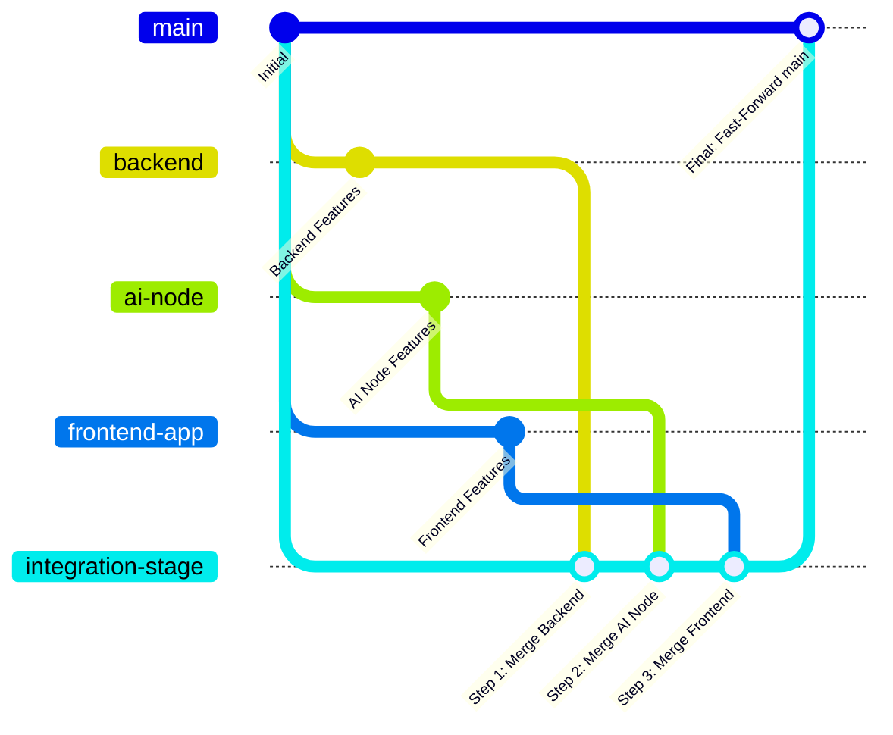

# 🔀 LUMA Multi-Node Merge Strategy & Plan

**เอกสารแผนผังการรวมสาขา (Merge Plan) สำหรับการผสานระบบทั้ง 3 โหนดเข้าสู่สาขาหลัก (`main`)**  
**สถานะ:** DRAFT & READY (เตรียมพร้อมสำหรับการดำเนินการร่วมกันของทีม)  
**เป้าหมาย:** รวมโค้ดจาก `backend`, `ai-node`, และ `frontend-app` เข้าสู่ `main` โดยไม่มีข้อขัดแย้ง (Zero-Conflict) และระบบทดสอบผ่าน 100%

---

## 🗺️ 1. สถาปัตยกรรมโครงสร้างไฟล์และการแบ่งขอบเขต (File Isolation Strategy)

โปรเจกต์ LUMA ได้รับการออกแบบโครงสร้างโฟลเดอร์ให้แยกขาดจากกันตั้งแต่ต้น เพื่อป้องกันการเกิด Merge Conflict เมื่อรวมโค้ด:

| โหนด | สาขาต้นทาง (Source Branch) | โฟลเดอร์ที่ครอบครอง (Isolated Directory) | สัญญาที่เชื่อมโยง (Shared Contracts) |
|---|---|---|---|
| **Node 1** (Frontend) | `origin/frontend-app` | `frontend/` | REST Endpoints, Blob Image Fetching, Live Progress Schema |
| **Node 2** (Backend) | `origin/backend` | Root (`main.py`, `app/`, `tests/`, `requirements.txt`) | Database Models, API Schemas, Webhook Callback Receiver |
| **Node 3** (AI Node) | `origin/ai-node` | `ai_server/`, `start_ai_server.bat` | `X-LUMA-INTERNAL-SECRET`, LoRA Registry, Safety Bounds |

---

## 📋 2. ลำดับขั้นตอนการ Merge สู่ `main` (Step-by-Step Merge Sequence)

เพื่อความปลอดภัยสูงสุดและสามารถทดสอบย้อนกลับได้ (Auditability) แนะนำให้ทำบน Staging Branch (`integration-stage`) ก่อนผลักเข้า `main`:



### ขั้นที่ 1: เตรียมสภาพแวดล้อมและแตกกิ่ง Integration Stage
```bash
# อัปเดตข้อมูลจาก remote
git fetch origin

# ดึง main ล่าสุดแล้วสร้าง staging branch
git checkout -b integration-stage origin/main
```

### ขั้นที่ 2: Merge Node 2 (`origin/backend`) — โครงสร้างฐานข้อมูลและ Core API
Backend เป็นแกนหลักของระบบ (Database, Auth, Logic) จึงต้องถูกนำเข้ามาก่อนเป็นฐาน:
```bash
git merge origin/backend -m "chore(merge): integrate backend core services into main"
```
* **การทดสอบ:** 
  ```bash
  pytest -v
  ```
  *(ต้องผ่าน 51/51 Tests)*

### ขั้นที่ 3: Merge Node 3 (`origin/ai-node`) — เซิร์ฟเวอร์ประมวลผล AI และ GPU Wrapper
นำโฟลเดอร์ `ai_server/` เข้ามาประสานกับ Backend:
```bash
git merge origin/ai-node -m "chore(merge): integrate AI inference node services into main"
```
* **การทดสอบ:** 
  ```bash
  $env:PYTHONUTF8=1; python -u -m unittest -v ai_server.tests.test_edge_cases ai_server.tests.test_server
  ```
  *(ต้องผ่าน 16/16 Tests)*

### ขั้นที่ 4: Merge Node 1 (`origin/frontend-app`) — ส่วนติดต่อผู้ใช้และเว็บแอป
นำโฟลเดอร์ `frontend/` เข้ามาเสริมส่วนติดต่อผู้ใช้:
```bash
git merge origin/frontend-app -m "chore(merge): integrate frontend client application into main"
```
* **การทดสอบ:** 
  ```bash
  cd frontend
  npm run check
  cd ..
  ```
  *(Build, Lint, และ Test ของ Frontend ต้องเป็นสีเขียวทั้งหมด)*

### ขั้นที่ 5: ตรวจสอบแบบบูรณาการและ Push สู่ `main`
เมื่อทุกชุดทดสอบผ่านสมบูรณ์:
```bash
git checkout main
git merge --ff-only integration-stage
git push origin main
```

---

## ⚙️ 3. Environment Variables Configuration Checklist

หลังจากการรวมสาขาเสร็จสมบูรณ์ แต่ละโหนดจะใช้ไฟล์ `.env` ประจำโฟลเดอร์ของตนเอง:

1. **Backend (`.env` ที่ root):**
   - `DATABASE_URL=postgresql://...`
   - `AI_MODE=callback`
   - `AI_SERVER_CALLBACK_URL=http://<AI_NODE_IP>:7860/ai/generate`
   - `AI_CALLBACK_SECRET=<SECURE_TOKEN>`
   - `BACKEND_CALLBACK_URL=http://<BACKEND_IP>:8000/api/callback`

2. **AI Node (`ai_server/.env`):**
   - `AI_HOST=0.0.0.0`
   - `AI_PORT=7860`
   - `LUMA_INTERNAL_SECRET=<SECURE_TOKEN>`
   - `ALLOW_FALLBACK_RENDER=true`

3. **Frontend (`frontend/.env`):**
   - `VITE_API_BASE_URL=http://<BACKEND_IP>:8000`

---

## 🛡️ 4. แผนการ Rollback (ย้อนกลับกรณีเกิดเหตุฉุกเฉิน)
หากพบปัญหาที่ไม่สามารถแก้ไขได้ระหว่างการรวมระบบ:
- สามารถสลับกลับมาทำงานบนแต่ละ Feature Branch (`ai-node`, `backend`, `frontend-app`) ได้ทันทีโดยที่งานเดิมไม่สูญหาย
- สามารถลบกิ่ง Staging ทิ้งได้โดยไม่กระทบ `main`:
  ```bash
  git checkout main
  git branch -D integration-stage
  ```
