# 📋 แผนงานละเอียด - Distributed Image Project (P2P Connection)
## 👥 ทีม 4 คน

> [!NOTE]
> งานของคนที่ 5 (Nginx / Reverse Proxy / Routing) ถูกรวมเข้ากับ **คนที่ 4 (QA/DevOps)** เนื่องจากเป็นงานด้าน Infrastructure ที่เกี่ยวข้องกันโดยตรง

---

## 🌐 ภาพรวมระบบ P2P Network (4 PCs)

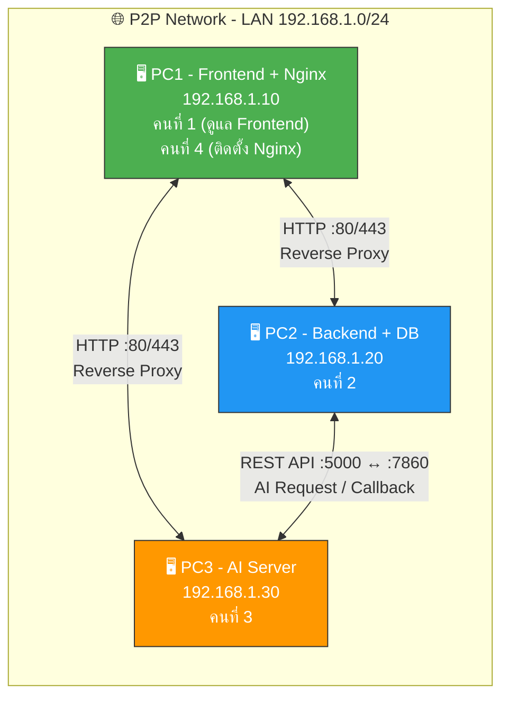

---

## 📊 สรุปการแบ่งงาน 4 คน

| สมาชิก | หน้าที่หลัก | สิ่งที่ส่งมอบ | PC |
|--------|------------|--------------|-----|
| **คนที่ 1** | UX/UI Frontend | หน้าเว็บ, Bootstrap, JavaScript, API Integration | 192.168.1.10 |
| **คนที่ 2** | Flask Backend | Authentication, REST API, Database, Queue, Logging | 192.168.1.20 |
| **คนที่ 3** | AI Engineer | Image Generation, Image Editing, Model/LoRA, AI API | 192.168.1.30 |
| **คนที่ 4** | QA / DevOps + **Nginx** | Testing, **Nginx/Reverse Proxy**, Deployment, Dashboard, Backup, Docs | 192.168.1.10 (Nginx) + ทุก PC |

---

## 👤 คนที่ 1 — UX/UI Frontend Developer

### 📊 Workflow Diagram

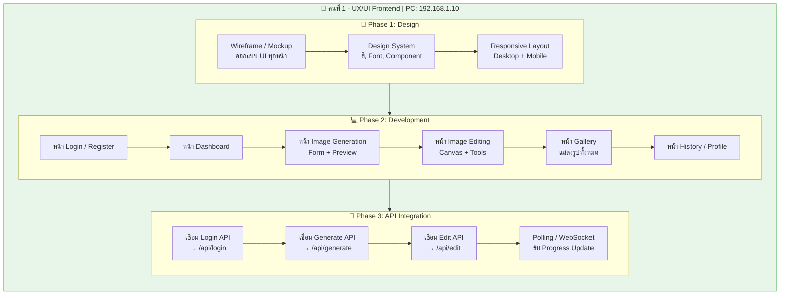

### 🛠️ Tools ที่ต้องใช้

| หมวด | Tool | วัตถุประสงค์ |
|------|------|-------------|
| **Editor** | VS Code | เขียน HTML/CSS/JS |
| **Design** | Figma / Canva | ออกแบบ UI Mockup |
| **CSS Framework** | Bootstrap 5 | Responsive Layout + Components |
| **JavaScript** | Vanilla JS / jQuery | DOM Manipulation, Event Handling |
| **API Client** | Fetch API / Axios | เรียก REST API จาก Backend |
| **WebSocket** | Socket.IO Client | รับ real-time progress update |
| **Image Preview** | Canvas API | แสดงผลภาพ, crop, rotate |
| **Version Control** | Git + GitHub | จัดการ Source Code |
| **Browser Dev** | Chrome DevTools | Debug, Network Monitor |

### 🔌 การเชื่อมต่อ P2P ของคนที่ 1

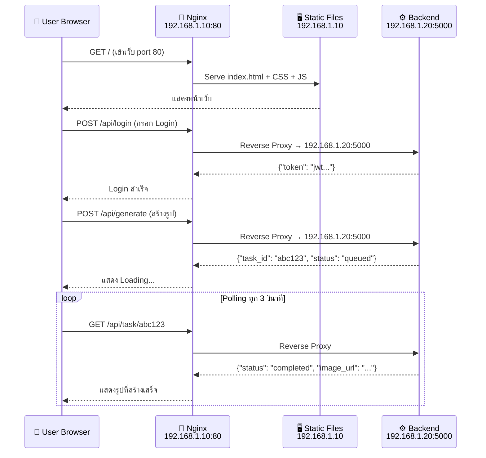

### 📁 ไฟล์ที่ต้องส่งมอบ

```
frontend/
├── index.html              # หน้าแรก / Landing
├── login.html              # หน้า Login
├── register.html           # หน้า Register
├── dashboard.html          # หน้า Dashboard
├── generate.html           # หน้า Generate Image
├── edit.html               # หน้า Edit Image
├── gallery.html            # หน้า Gallery
├── profile.html            # หน้า Profile / History
├── css/
│   ├── style.css           # Global Styles
│   ├── bootstrap.min.css   # Bootstrap Framework
│   └── components.css      # Custom Components
├── js/
│   ├── app.js              # Main App Logic
│   ├── auth.js             # Login/Register Logic
│   ├── api.js              # API Helper (Fetch wrapper)
│   ├── generate.js         # Image Generation Logic
│   ├── edit.js             # Image Editing Logic (Canvas)
│   └── gallery.js          # Gallery Logic
└── assets/
    ├── images/             # Static Images / Logo
    └── icons/              # Icons
```

---

## 👤 คนที่ 2 — Flask Backend Developer

### 📊 Workflow Diagram

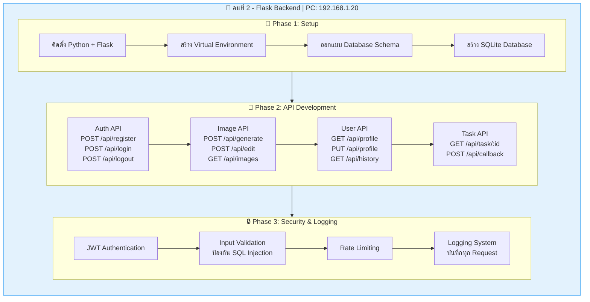

### 🛠️ Tools ที่ต้องใช้

| หมวด | Tool | วัตถุประสงค์ |
|------|------|-------------|
| **Language** | Python 3.10+ | ภาษาหลัก |
| **Framework** | Flask 3.x | Web Framework |
| **Database** | SQLite3 | เก็บข้อมูล User, Image, Task |
| **ORM** | Flask-SQLAlchemy | จัดการ Database ผ่าน Python Object |
| **Auth** | Flask-JWT-Extended | JWT Token Authentication |
| **Validation** | Marshmallow / Flask-WTF | Input Validation |
| **CORS** | Flask-CORS | อนุญาต Cross-Origin จาก Frontend |
| **HTTP Client** | requests (Python) | ส่ง Request ไป AI Server |
| **Logging** | Python logging module | บันทึก Log ระบบ |
| **API Testing** | Postman / Thunder Client | ทดสอบ API ระหว่างพัฒนา |
| **Editor** | VS Code + Python Extension | เขียนโค้ด |
| **Version Control** | Git + GitHub | จัดการ Source Code |
| **Process Manager** | Waitress (Windows) / Gunicorn (Linux) | Production Server |

### 🔌 การเชื่อมต่อ P2P ของคนที่ 2

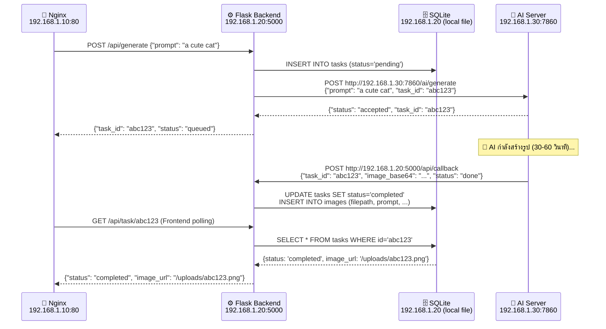

### 📊 Database Schema (ER Diagram)

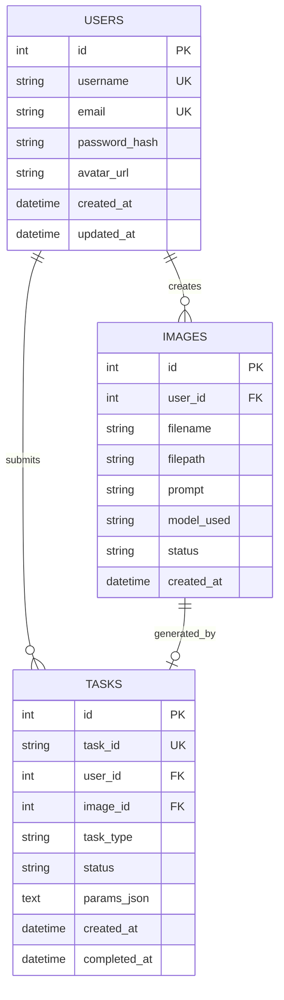

### 📁 ไฟล์ที่ต้องส่งมอบ

```
backend/
├── app.py                  # Flask App Entry Point
├── config.py               # Configuration (DB path, Secret Key, AI URL)
├── requirements.txt        # Python Dependencies
├── models/
│   ├── __init__.py
│   ├── user.py             # User Model
│   ├── image.py            # Image Model
│   └── task.py             # Task Model
├── routes/
│   ├── __init__.py
│   ├── auth.py             # POST /api/register, /api/login, /api/logout
│   ├── image.py            # POST /api/generate, /api/edit
│   ├── task.py             # GET /api/task/:id, POST /api/callback
│   ├── user.py             # GET/PUT /api/profile
│   └── gallery.py          # GET /api/images
├── services/
│   ├── __init__.py
│   ├── ai_client.py        # HTTP Client → AI Server (192.168.1.30)
│   ├── auth_service.py     # Hash password, JWT Logic
│   └── image_service.py    # Save/Resize image
├── utils/
│   ├── validators.py       # Input Validation
│   ├── logger.py           # Logging Config
│   └── helpers.py          # Helper Functions
├── uploads/                # ที่เก็บรูปที่ Generate แล้ว
├── database/
│   └── app.db              # SQLite Database File
└── logs/
    └── app.log             # Application Logs
```

---

## 👤 คนที่ 3 — AI Engineer

### 📊 Workflow Diagram

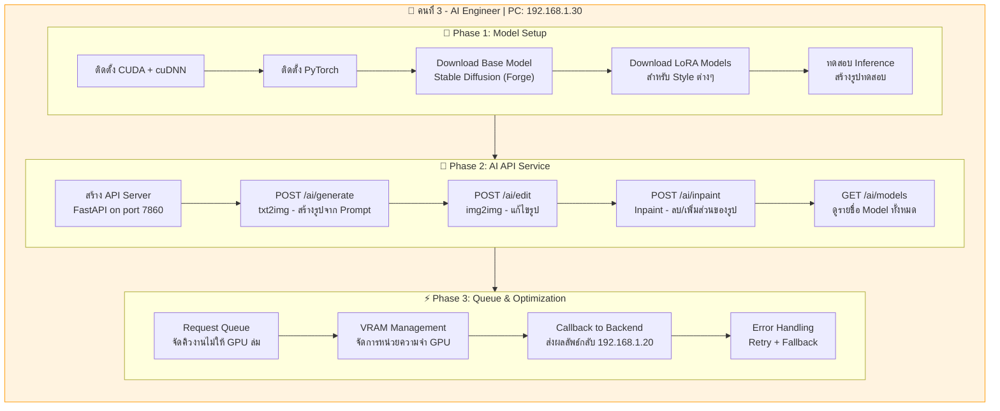

### 🛠️ Tools ที่ต้องใช้

| หมวด | Tool | วัตถุประสงค์ |
|------|------|-------------|
| **Language** | Python 3.10+ | ภาษาหลัก |
| **AI Framework** | PyTorch 2.x | Deep Learning Framework |
| **GPU Driver** | CUDA 11.8+ / cuDNN | GPU Acceleration |
| **Image Gen** | Stable Diffusion WebUI Forge | Image Generation Engine |
| **Model Format** | Safetensors | Model Weight Files |
| **LoRA** | LoRA / LoHa adapters | Fine-tuned Style (anime, realistic, etc.) |
| **API Server** | FastAPI + Uvicorn | Serve AI เป็น REST API |
| **Image Processing** | Pillow (PIL) | Resize, Crop, Format Convert |
| **HTTP Client** | requests / httpx | Callback กลับ Backend |
| **GPU Monitor** | nvidia-smi / GPUtil | Monitor VRAM Usage |
| **Editor** | VS Code + Jupyter Notebook | เขียนโค้ด + ทดลอง Model |
| **Version Control** | Git + Git LFS | จัดการ Source + Model Files ขนาดใหญ่ |

### 🔌 การเชื่อมต่อ P2P ของคนที่ 3

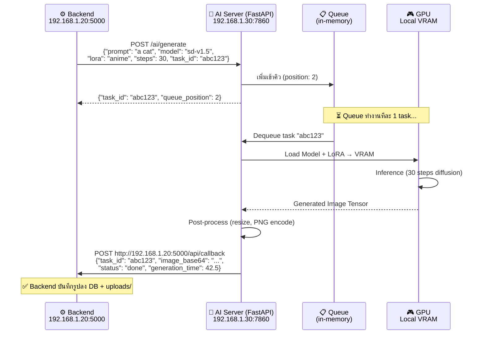

### 📁 ไฟล์ที่ต้องส่งมอบ

```
ai_server/
├── server.py               # Main AI API Server (FastAPI + Uvicorn)
├── config.py               # AI Config (model path, default params)
├── requirements.txt        # Python Dependencies
├── models/
│   ├── checkpoints/        # Base Models (.safetensors)
│   │   └── sd-v1-5.safetensors
│   ├── lora/               # LoRA Adapters
│   │   ├── anime_style.safetensors
│   │   └── realistic_style.safetensors
│   ├── vae/                # VAE Models
│   └── embeddings/         # Textual Inversions
├── services/
│   ├── __init__.py
│   ├── generator.py        # txt2img Generation Service
│   ├── editor.py           # img2img + Inpaint Service
│   ├── model_manager.py    # Load/Switch Model + LoRA
│   └── queue_manager.py    # Request Queue (FIFO)
├── utils/
│   ├── image_utils.py      # Resize, Encode, Format Convert
│   ├── gpu_monitor.py      # VRAM Usage Monitor
│   └── callbacks.py        # HTTP Callback → Backend
├── tests/
│   ├── test_generate.py    # ทดสอบ txt2img API
│   └── test_edit.py        # ทดสอบ img2img API
└── logs/
    └── ai_server.log       # AI Server Logs
```

---

## 👤 คนที่ 4 — QA / DevOps + Nginx Reverse Proxy

> [!IMPORTANT]
> คนที่ 4 รับงาน **Nginx / Reverse Proxy** จากคนที่ 5 เพิ่มเติม เพราะเป็นงาน Infrastructure ที่เกี่ยวข้องกับ Deployment โดยตรง

### 📊 Workflow Diagram

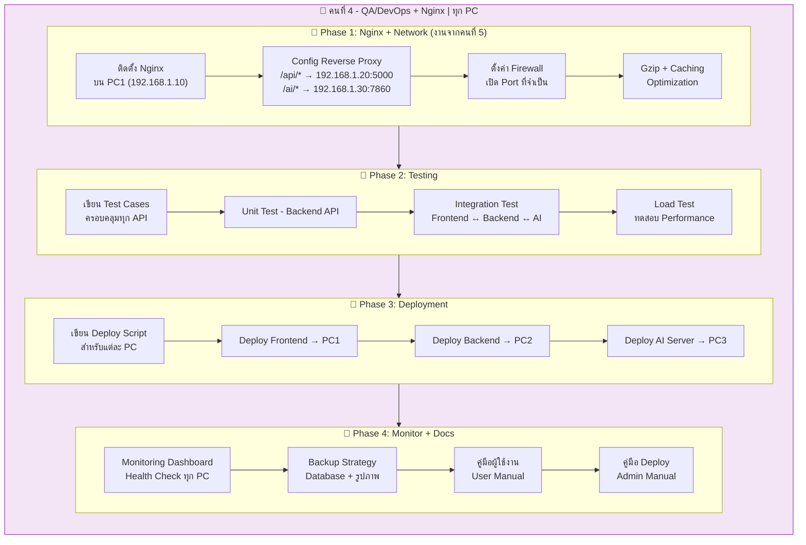

### 🛠️ Tools ที่ต้องใช้

| หมวด | Tool | วัตถุประสงค์ |
|------|------|-------------|
| **Web Server** | Nginx | Reverse Proxy + Static File Serving |
| **SSL** | OpenSSL | สร้าง Self-signed Certificate (optional) |
| **Testing** | pytest | Unit/Integration Test สำหรับ Python |
| **API Testing** | Postman / Newman (CLI) | ทดสอบ API ทุก Endpoint |
| **Load Testing** | Locust | ทดสอบ Performance / Concurrent Users |
| **Browser Test** | Selenium / Playwright | UI Automation Test (optional) |
| **SSH Client** | OpenSSH / PuTTY | Remote Access ทุก PC |
| **Deploy** | Shell Scripts (Bash/PowerShell) | Automate Deployment |
| **Backup** | rsync / robocopy | Backup Database + Images |
| **Monitoring** | Custom HTML Dashboard + cron | Monitor Health ทุก Service |
| **Network** | curl / ping / netstat | ทดสอบ Connection ระหว่าง PC |
| **Docs** | Markdown | เขียนคู่มือ |
| **Diagrams** | draw.io / Mermaid | System Architecture Diagrams |
| **Version Control** | Git + GitHub | จัดการ Source Code |

### 🔌 การเชื่อมต่อ P2P ของคนที่ 4 (DevOps View)

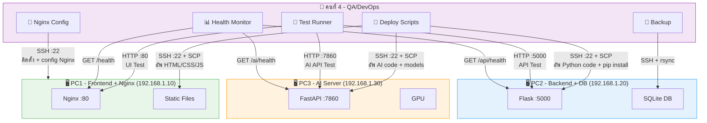

### 📁 ไฟล์ที่ต้องส่งมอบ

```
devops/
├── nginx/
│   └── nginx.conf              # ⭐ Nginx Reverse Proxy Config
├── tests/
│   ├── test_auth_api.py        # Auth API Tests
│   ├── test_image_api.py       # Image API Tests
│   ├── test_ai_api.py          # AI API Tests
│   ├── test_integration.py     # Full Integration Tests (FE↔BE↔AI)
│   ├── test_load.py            # Load/Performance Tests (Locust)
│   └── conftest.py             # Test Configuration + Fixtures
├── deploy/
│   ├── deploy_frontend.sh      # Deploy Frontend → PC1
│   ├── deploy_backend.sh       # Deploy Backend → PC2
│   ├── deploy_ai.sh            # Deploy AI Server → PC3
│   ├── deploy_nginx.sh         # ⭐ Deploy Nginx Config → PC1
│   ├── deploy_all.sh           # Deploy ทั้งหมด
│   └── rollback.sh             # Rollback Script
├── monitoring/
│   ├── dashboard.html          # Simple Monitoring Dashboard
│   ├── health_check.py         # Health Check Script (ทุก PC)
│   └── alert.py                # Alert on Failure
├── backup/
│   ├── backup_db.sh            # Database Backup Script
│   └── backup_images.sh        # Image Backup Script
└── docs/
    ├── user_manual.md          # คู่มือผู้ใช้งาน
    ├── admin_manual.md         # คู่มือ Admin / Deploy
    ├── api_docs.md             # API Documentation ทุก Endpoint
    └── network_setup.md        # ⭐ Network + Nginx Setup Guide
```

---

## 🔗 แผนผังการเชื่อมต่อ P2P ทั้งระบบ (Complete)

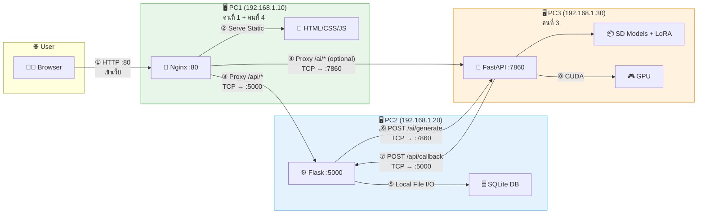

---

## 📋 Nginx Configuration (คนที่ 4 เป็นคนตั้งค่า)

```nginx
# nginx.conf — ติดตั้งบน PC1 (192.168.1.10)
# คนที่ 4 เป็นผู้รับผิดชอบ config นี้

upstream backend {
    server 192.168.1.20:5000;    # Flask Backend (PC2)
}

upstream ai_server {
    server 192.168.1.30:7860;    # AI Server (PC3)
}

server {
    listen 80;
    server_name 192.168.1.10;

    # ── Frontend Static Files (คนที่ 1 สร้าง) ──
    location / {
        root /var/www/frontend;
        index index.html;
        try_files $uri $uri/ /index.html;
    }

    # ── Backend API Proxy (คนที่ 2) ──
    location /api/ {
        proxy_pass http://backend;
        proxy_set_header Host $host;
        proxy_set_header X-Real-IP $remote_addr;
        proxy_set_header X-Forwarded-For $proxy_add_x_forwarded_for;
        proxy_read_timeout 300s;
    }

    # ── AI Server Proxy (คนที่ 3) ──
    location /ai/ {
        proxy_pass http://ai_server;
        proxy_set_header Host $host;
        proxy_set_header X-Real-IP $remote_addr;
        proxy_read_timeout 600s;  # AI ใช้เวลานาน
    }

    # ── WebSocket (ถ้าใช้) ──
    location /ws/ {
        proxy_pass http://backend;
        proxy_http_version 1.1;
        proxy_set_header Upgrade $http_upgrade;
        proxy_set_header Connection "upgrade";
    }

    # ── Gzip Compression ──
    gzip on;
    gzip_types text/plain text/css application/json application/javascript;
    gzip_min_length 1024;
}
```

---

## 🔥 P2P Port Summary (Firewall Rules)

| Source | Destination | Port | Protocol | Purpose |
|--------|------------|------|----------|---------|
| User Browser | 192.168.1.10 | **80** | HTTP | เข้าเว็บผ่าน Nginx |
| Nginx (PC1) | 192.168.1.20 | **5000** | HTTP | Proxy → Flask Backend |
| Nginx (PC1) | 192.168.1.30 | **7860** | HTTP | Proxy → AI Server |
| Flask (PC2) | 192.168.1.30 | **7860** | HTTP | Backend ส่งงานให้ AI |
| AI (PC3) | 192.168.1.20 | **5000** | HTTP | AI ส่งผลลัพธ์กลับ Backend |
| DevOps (PC4) | ทุก PC | **22** | SSH | Remote Deploy + Management |
| DevOps (PC4) | 192.168.1.10 | **80** | HTTP | Health Check Frontend |
| DevOps (PC4) | 192.168.1.20 | **5000** | HTTP | Health Check Backend |
| DevOps (PC4) | 192.168.1.30 | **7860** | HTTP | Health Check AI |

---

## 📅 Timeline 4 คน

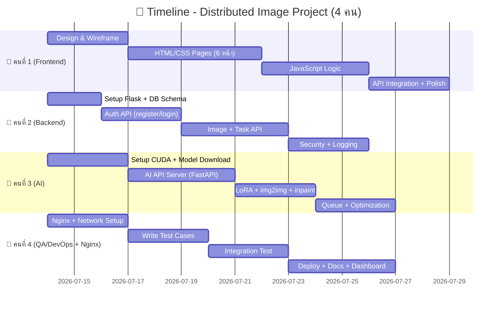

---

## 📊 สรุปภาระงานแต่ละคน

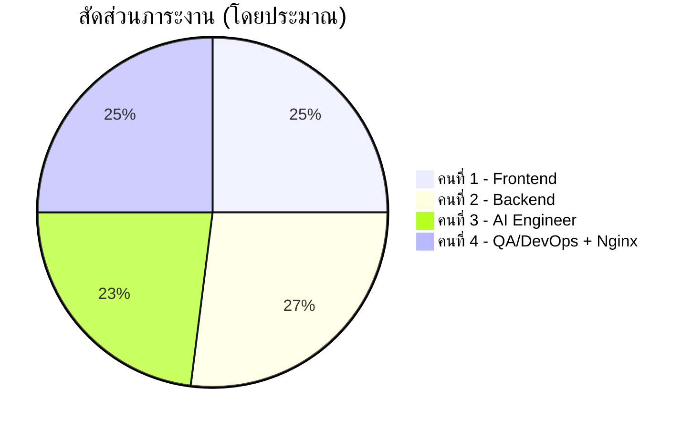

> [!TIP]
> คนที่ 4 รับงาน Nginx เพิ่ม แต่ Nginx config ไม่ซับซ้อนมาก (ประมาณ 1-2 วัน) จึงยังสมดุลกับคนอื่นๆ ได้ดี
