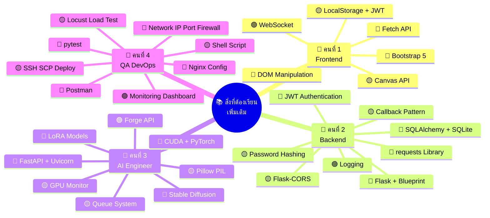

# 📚 สิ่งที่ต้องทำ & ต้องเรียนรู้เพิ่มเติม — แต่ละตำแหน่ง

> [!NOTE]
> เอกสารนี้เน้น **สิ่งที่ต้องเรียนรู้เพิ่มเติม** ในแต่ละตำแหน่ง พร้อมระดับความสำคัญ 🔴 ต้องรู้ 🟡 ควรรู้ 🟢 รู้ไว้ดี

---

## 👤 คนที่ 1 — UX/UI Frontend Developer

### 📋 สิ่งที่ต้องทำ (Task List)

| # | งาน | รายละเอียด |
|---|------|-----------|
| 1 | ออกแบบ UI ทุกหน้า | Wireframe → Mockup → Prototype |
| 2 | สร้างหน้า Login / Register | Form, Validation, แสดง Error |
| 3 | สร้างหน้า Dashboard | แสดงสรุปข้อมูลผู้ใช้, รูปล่าสุด |
| 4 | สร้างหน้า Generate Image | Form กรอก Prompt, เลือก Model/LoRA, แสดง Loading + ผลลัพธ์ |
| 5 | สร้างหน้า Edit Image | Upload รูป, Canvas สำหรับ crop/draw mask, ส่งไป img2img |
| 6 | สร้างหน้า Gallery | แสดงรูปทั้งหมด, Filter, Pagination, Download |
| 7 | สร้างหน้า Profile / History | แสดงข้อมูลผู้ใช้, ประวัติการสร้างรูป |
| 8 | เชื่อม API ทั้งหมด | Login, Generate, Edit, Gallery ผ่าน Fetch API |
| 9 | Polling / WebSocket | ตรวจสอบสถานะงาน AI แบบ real-time |

---

### 🎓 สิ่งที่ต้องเรียนรู้เพิ่มเติม

#### 🔴 1. Bootstrap 5 — CSS Framework (ต้องรู้)

**ทำไมต้องเรียน:** ใช้สร้างหน้าเว็บ Responsive ได้เร็ว ไม่ต้องเขียน CSS จากศูนย์

**สิ่งที่ต้องรู้:**
- Grid System (container, row, col-md-6, col-lg-4)
- Components: Navbar, Card, Modal, Form, Button, Alert, Spinner
- Utility Classes: d-flex, justify-content-center, mt-3, p-2
- Responsive Breakpoints: sm, md, lg, xl

**ตัวอย่างที่ต้องทำได้:**
```html
<!-- Layout 2 คอลัมน์ Responsive -->
<div class="container mt-4">
  <div class="row">
    <div class="col-md-4">
      <!-- Sidebar: เลือก Model, LoRA -->
      <div class="card">
        <div class="card-body">
          <h5 class="card-title">Settings</h5>
          <div class="mb-3">
            <label class="form-label">Prompt</label>
            <textarea class="form-control" id="prompt" rows="3"></textarea>
          </div>
          <button class="btn btn-primary w-100" id="generateBtn">
            Generate Image
          </button>
        </div>
      </div>
    </div>
    <div class="col-md-8">
      <!-- Main: แสดงรูป -->
      <div id="result" class="text-center">
        <div class="spinner-border text-primary d-none" id="loading"></div>
        
      </div>
    </div>
  </div>
</div>
```

**แหล่งเรียนรู้:**
- 📖 [Bootstrap 5 Docs](https://getbootstrap.com/docs/5.3/)
- 🎬 YouTube: "Bootstrap 5 Crash Course" — Traversy Media
- 🎬 YouTube: "Bootstrap 5 Tutorial ภาษาไทย" — ค้นหาใน YouTube

---

#### 🔴 2. Fetch API — เรียก REST API (ต้องรู้)

**ทำไมต้องเรียน:** ต้องส่ง/รับข้อมูลจาก Backend (192.168.1.20) ทุกหน้าต้องใช้

**สิ่งที่ต้องรู้:**
- `fetch()` — GET, POST, PUT, DELETE
- ส่ง JSON body + Headers
- รับ JSON response
- จัดการ Error (try/catch)
- ส่ง JWT Token ใน Header

**ตัวอย่างที่ต้องทำได้:**
```javascript
// ===== api.js — Helper สำหรับเรียก API ทุกหน้า =====

const API_BASE = '/api';  // Nginx จะ proxy ไป 192.168.1.20:5000

// ฟังก์ชันกลาง สำหรับเรียก API
async function apiCall(endpoint, method = 'GET', body = null) {
    const token = localStorage.getItem('token');
    const headers = { 'Content-Type': 'application/json' };
    if (token) headers['Authorization'] = `Bearer ${token}`;

    try {
        const response = await fetch(`${API_BASE}${endpoint}`, {
            method,
            headers,
            body: body ? JSON.stringify(body) : null
        });
        
        const data = await response.json();
        
        if (!response.ok) {
            throw new Error(data.message || 'API Error');
        }
        return data;
    } catch (error) {
        console.error('API Error:', error);
        throw error;
    }
}

// ===== ตัวอย่างการใช้งาน =====

// Login
async function login(username, password) {
    const data = await apiCall('/login', 'POST', { username, password });
    localStorage.setItem('token', data.token);  // เก็บ JWT
    window.location.href = '/dashboard.html';
}

// Generate Image
async function generateImage(prompt, model, lora) {
    const data = await apiCall('/generate', 'POST', { prompt, model, lora });
    return data.task_id;  // ได้ task_id กลับมา
}

// Polling — เช็คสถานะงาน
async function pollTaskStatus(taskId) {
    return new Promise((resolve) => {
        const interval = setInterval(async () => {
            const data = await apiCall(`/task/${taskId}`);
            if (data.status === 'completed') {
                clearInterval(interval);
                resolve(data);  // ได้ image_url กลับมา
            }
        }, 3000);  // เช็คทุก 3 วินาที
    });
}
```

**แหล่งเรียนรู้:**
- 📖 [MDN Fetch API](https://developer.mozilla.org/en-US/docs/Web/API/Fetch_API)
- 🎬 YouTube: "JavaScript Fetch API" — Web Dev Simplified
- 🎬 YouTube: "Async/Await & Fetch" — Fireship

---

#### 🔴 3. JavaScript DOM Manipulation (ต้องรู้)

**ทำไมต้องเรียน:** ต้องอัพเดทหน้าเว็บแบบ Dynamic เมื่อได้ข้อมูลจาก API

**สิ่งที่ต้องรู้:**
- `document.getElementById()` / `querySelector()`
- `element.innerHTML` / `textContent`
- `element.classList.add()` / `remove()` / `toggle()`
- `element.addEventListener('click', ...)`
- สร้าง Element ด้วย `createElement()` + `appendChild()`

**ตัวอย่างที่ต้องทำได้:**
```javascript
// แสดง Loading → เรียก API → แสดงรูป
document.getElementById('generateBtn').addEventListener('click', async () => {
    const prompt = document.getElementById('prompt').value;
    const loading = document.getElementById('loading');
    const resultImg = document.getElementById('resultImage');
    
    // แสดง Loading
    loading.classList.remove('d-none');
    resultImg.src = '';
    
    try {
        // 1. ส่ง Prompt ไป Backend
        const taskId = await generateImage(prompt, 'sd-v1.5', 'anime');
        
        // 2. Polling รอผลลัพธ์
        const result = await pollTaskStatus(taskId);
        
        // 3. แสดงรูป
        resultImg.src = result.image_url;
    } catch (error) {
        alert('Error: ' + error.message);
    } finally {
        loading.classList.add('d-none');
    }
});
```

**แหล่งเรียนรู้:**
- 🎬 YouTube: "JavaScript DOM Manipulation" — Traversy Media
- 📖 [MDN DOM Reference](https://developer.mozilla.org/en-US/docs/Web/API/Document_Object_Model)

---

#### 🟡 4. Canvas API — วาด/แก้ไขรูปภาพ (ควรรู้)

**ทำไมต้องเรียน:** หน้า Edit Image ต้องให้ User วาด Mask บนรูปสำหรับ Inpaint

**สิ่งที่ต้องรู้:**
- `<canvas>` element, `getContext('2d')`
- วาดรูปลงบน Canvas: `drawImage()`
- วาดเส้น: `beginPath()`, `lineTo()`, `stroke()`
- Export Canvas: `toDataURL('image/png')`
- จัดการ Mouse Events: mousedown, mousemove, mouseup

**ตัวอย่างที่ต้องทำได้:**
```javascript
// ให้ User วาด Mask บนรูปสำหรับ Inpaint
const canvas = document.getElementById('editCanvas');
const ctx = canvas.getContext('2d');
let isDrawing = false;

// โหลดรูปลง Canvas
function loadImage(src) {
    const img = new Image();
    img.onload = () => {
        canvas.width = img.width;
        canvas.height = img.height;
        ctx.drawImage(img, 0, 0);
    };
    img.src = src;
}

// วาด Mask (สีขาว = บริเวณที่ต้อง Inpaint)
canvas.addEventListener('mousedown', (e) => {
    isDrawing = true;
    ctx.beginPath();
    ctx.moveTo(e.offsetX, e.offsetY);
});

canvas.addEventListener('mousemove', (e) => {
    if (!isDrawing) return;
    ctx.lineWidth = 20;
    ctx.lineCap = 'round';
    ctx.strokeStyle = 'white';
    ctx.lineTo(e.offsetX, e.offsetY);
    ctx.stroke();
});

canvas.addEventListener('mouseup', () => { isDrawing = false; });

// Export Mask → ส่งไป API
function exportMask() {
    return canvas.toDataURL('image/png');  // base64 string
}
```

**แหล่งเรียนรู้:**
- 🎬 YouTube: "HTML5 Canvas Drawing App" — Chris Courses
- 📖 [MDN Canvas Tutorial](https://developer.mozilla.org/en-US/docs/Web/API/Canvas_API/Tutorial)

---

#### 🟡 5. LocalStorage + JWT Token (ควรรู้)

**ทำไมต้องเรียน:** เก็บ Token หลัง Login แล้วส่งไปกับทุก Request

**สิ่งที่ต้องรู้:**
- `localStorage.setItem('token', value)` / `getItem('token')`
- ตรวจสอบ Token หมดอายุ
- Redirect ไปหน้า Login ถ้าไม่มี Token

```javascript
// เช็คว่า Login หรือยัง (ใส่ทุกหน้าที่ต้อง Login)
function checkAuth() {
    const token = localStorage.getItem('token');
    if (!token) {
        window.location.href = '/login.html';
    }
}
window.addEventListener('load', checkAuth);
```

**แหล่งเรียนรู้:**
- 🎬 YouTube: "JWT Authentication in JavaScript"
- 📖 [MDN Web Storage API](https://developer.mozilla.org/en-US/docs/Web/API/Web_Storage_API)

---

#### 🟢 6. WebSocket / Socket.IO Client (รู้ไว้ดี)

**ทำไมต้องเรียน:** ถ้าอยากแสดง Progress แบบ real-time แทน Polling

```javascript
// เชื่อมต่อ WebSocket (ถ้าใช้)
const socket = io('http://192.168.1.10');  // ผ่าน Nginx proxy
socket.on('task_update', (data) => {
    if (data.task_id === currentTaskId) {
        updateProgress(data.progress);  // 0-100%
    }
});
```

**แหล่งเรียนรู้:**
- 🎬 YouTube: "Socket.IO Tutorial" — Traversy Media

---

### ✅ Checklist ความพร้อมคนที่ 1

- [ ] เขียน HTML + CSS ได้คล่อง
- [ ] ใช้ Bootstrap 5 Grid + Components ได้
- [ ] ใช้ Fetch API เรียก REST API ได้ (GET, POST + JSON)
- [ ] ใช้ async/await จัดการ Promise ได้
- [ ] ส่ง JWT Token ใน Authorization Header ได้
- [ ] ใช้ Canvas API วาดรูป + export ได้
- [ ] Polling เช็คสถานะงานได้
- [ ] ใช้ Git commit + push ได้

---
---

## 👤 คนที่ 2 — Flask Backend Developer

### 📋 สิ่งที่ต้องทำ (Task List)

| # | งาน | รายละเอียด |
|---|------|-----------|
| 1 | Setup Flask Project | สร้างโครงสร้าง, Virtual Environment, requirements.txt |
| 2 | ออกแบบ Database | สร้าง Schema สำหรับ users, images, tasks |
| 3 | Auth API | POST /api/register, POST /api/login, POST /api/logout |
| 4 | Image API | POST /api/generate, POST /api/edit, GET /api/images |
| 5 | Task API | GET /api/task/:id (สำหรับ Frontend polling), POST /api/callback (สำหรับ AI ส่งผลกลับ) |
| 6 | User API | GET /api/profile, PUT /api/profile, GET /api/history |
| 7 | เชื่อม AI Server | ส่ง HTTP Request ไปยัง 192.168.1.30:7860 |
| 8 | JWT Authentication | ป้องกัน API ที่ต้อง Login ก่อน |
| 9 | Input Validation | ตรวจสอบข้อมูลก่อน INSERT |
| 10 | Logging | บันทึก Log ทุก Request |

---

### 🎓 สิ่งที่ต้องเรียนรู้เพิ่มเติม

#### 🔴 1. Flask — Web Framework (ต้องรู้)

**ทำไมต้องเรียน:** เป็น Framework หลักที่ใช้สร้าง Backend API ทั้งหมด

**สิ่งที่ต้องรู้:**
- สร้าง Flask App + Route
- `@app.route()` + methods (GET, POST, PUT, DELETE)
- `request.json` — รับ JSON body
- `jsonify()` — ส่ง JSON response
- Blueprint — แยก Route เป็นไฟล์

**ตัวอย่างที่ต้องทำได้:**
```python
# app.py — Flask App หลัก
from flask import Flask, jsonify, request
from flask_cors import CORS
from routes.auth import auth_bp
from routes.image import image_bp

app = Flask(__name__)
CORS(app)  # อนุญาต Frontend ข้าม Origin
app.config['SECRET_KEY'] = 'your-secret-key'

# Register Blueprints (แยก Route เป็นไฟล์)
app.register_blueprint(auth_bp, url_prefix='/api')
app.register_blueprint(image_bp, url_prefix='/api')

@app.route('/api/health')
def health():
    return jsonify({"status": "ok"})

if __name__ == '__main__':
    app.run(host='0.0.0.0', port=5000, debug=True)
    # host='0.0.0.0' สำคัญ! ให้ PC อื่นเข้าถึงได้
```

```python
# routes/auth.py — Auth Blueprint
from flask import Blueprint, request, jsonify

auth_bp = Blueprint('auth', __name__)

@auth_bp.route('/register', methods=['POST'])
def register():
    data = request.json  # รับ JSON จาก Frontend
    username = data.get('username')
    password = data.get('password')
    email = data.get('email')
    
    # Validate...
    # Insert to DB...
    
    return jsonify({"message": "Register successful"}), 201

@auth_bp.route('/login', methods=['POST'])
def login():
    data = request.json
    username = data.get('username')
    password = data.get('password')
    
    # Check credentials...
    # Generate JWT Token...
    
    return jsonify({"token": "jwt_token_here"}), 200
```

**แหล่งเรียนรู้:**
- 📖 [Flask Official Docs](https://flask.palletsprojects.com/)
- 🎬 YouTube: "Flask REST API Tutorial" — Tech With Tim
- 🎬 YouTube: "Python Flask Tutorial ภาษาไทย" — ค้นหาใน YouTube
- 🎬 YouTube: "Flask Blueprint Tutorial" — Corey Schafer

---

#### 🔴 2. Flask-SQLAlchemy + SQLite (ต้องรู้)

**ทำไมต้องเรียน:** ต้องสร้าง Database เก็บข้อมูล User, Image, Task

**สิ่งที่ต้องรู้:**
- สร้าง Model (Python Class → Table)
- CRUD: Create, Read, Update, Delete
- Relationship: One-to-Many (User → Images)
- Query: filter_by, order_by, paginate

**ตัวอย่างที่ต้องทำได้:**
```python
# models/user.py
from flask_sqlalchemy import SQLAlchemy
from datetime import datetime

db = SQLAlchemy()

class User(db.Model):
    __tablename__ = 'users'
    id = db.Column(db.Integer, primary_key=True)
    username = db.Column(db.String(80), unique=True, nullable=False)
    email = db.Column(db.String(120), unique=True, nullable=False)
    password_hash = db.Column(db.String(256), nullable=False)
    created_at = db.Column(db.DateTime, default=datetime.utcnow)
    
    # Relationship: User มีหลายรูป
    images = db.relationship('Image', backref='owner', lazy=True)

class Image(db.Model):
    __tablename__ = 'images'
    id = db.Column(db.Integer, primary_key=True)
    user_id = db.Column(db.Integer, db.ForeignKey('users.id'), nullable=False)
    filename = db.Column(db.String(256))
    prompt = db.Column(db.Text)
    model_used = db.Column(db.String(100))
    status = db.Column(db.String(20), default='pending')
    created_at = db.Column(db.DateTime, default=datetime.utcnow)
```

```python
# ตัวอย่าง CRUD
# สร้าง User
new_user = User(username='john', email='john@mail.com', password_hash='...')
db.session.add(new_user)
db.session.commit()

# ค้นหา User
user = User.query.filter_by(username='john').first()

# ดึงรูปทั้งหมดของ User
images = Image.query.filter_by(user_id=user.id).order_by(Image.created_at.desc()).all()
```

**แหล่งเรียนรู้:**
- 📖 [Flask-SQLAlchemy Docs](https://flask-sqlalchemy.readthedocs.io/)
- 🎬 YouTube: "Flask SQLAlchemy Tutorial" — Corey Schafer
- 🎬 YouTube: "SQLite + Python" — freeCodeCamp

---

#### 🔴 3. Flask-JWT-Extended — Authentication (ต้องรู้)

**ทำไมต้องเรียน:** ทุก API (ยกเว้น login/register) ต้องตรวจสอบว่า User Login แล้ว

**สิ่งที่ต้องรู้:**
- สร้าง JWT Token เมื่อ Login สำเร็จ
- ใส่ `@jwt_required()` decorator ที่ Route ที่ต้อง Login
- ดึง current user จาก Token ด้วย `get_jwt_identity()`

**ตัวอย่างที่ต้องทำได้:**
```python
from flask_jwt_extended import (
    JWTManager, create_access_token, 
    jwt_required, get_jwt_identity
)

app.config['JWT_SECRET_KEY'] = 'super-secret-key'
jwt = JWTManager(app)

# Login → สร้าง Token
@auth_bp.route('/login', methods=['POST'])
def login():
    data = request.json
    user = User.query.filter_by(username=data['username']).first()
    
    if user and check_password(user.password_hash, data['password']):
        token = create_access_token(identity=user.id)  # สร้าง JWT
        return jsonify({"token": token}), 200
    
    return jsonify({"message": "Invalid credentials"}), 401

# API ที่ต้อง Login ก่อน
@image_bp.route('/generate', methods=['POST'])
@jwt_required()  # ← ต้องมี Token ถึงจะเข้าได้
def generate_image():
    user_id = get_jwt_identity()  # ดึง user_id จาก Token
    data = request.json
    prompt = data.get('prompt')
    # ... ส่งงานไป AI Server ...
```

**แหล่งเรียนรู้:**
- 📖 [Flask-JWT-Extended Docs](https://flask-jwt-extended.readthedocs.io/)
- 🎬 YouTube: "Flask JWT Authentication" — Pretty Printed

---

#### 🔴 4. requests Library — เชื่อม AI Server (ต้องรู้)

**ทำไมต้องเรียน:** Backend ต้องส่ง HTTP Request ไปหา AI Server (192.168.1.30:7860)

**สิ่งที่ต้องรู้:**
- `requests.post()` — ส่งข้อมูลไป AI
- `requests.get()` — เช็คสถานะ AI
- Handle timeout + error
- ส่ง/รับ JSON

**ตัวอย่างที่ต้องทำได้:**
```python
# services/ai_client.py — เชื่อมต่อ AI Server
import requests

AI_SERVER_URL = 'http://192.168.1.30:7860'

def send_to_ai(task_id, prompt, model='sd-v1.5', lora=None):
    """ส่งงานไป AI Server"""
    try:
        response = requests.post(
            f'{AI_SERVER_URL}/ai/generate',
            json={
                'task_id': task_id,
                'prompt': prompt,
                'model': model,
                'lora': lora,
                'callback_url': 'http://192.168.1.20:5000/api/callback'
            },
            timeout=10  # รอ response 10 วินาที
        )
        return response.json()
    except requests.exceptions.ConnectionError:
        return {'error': 'AI Server is not reachable'}
    except requests.exceptions.Timeout:
        return {'error': 'AI Server timeout'}
```

**แหล่งเรียนรู้:**
- 📖 [requests Library Docs](https://requests.readthedocs.io/)
- 🎬 YouTube: "Python Requests Tutorial" — Corey Schafer

---

#### 🟡 5. Password Hashing — werkzeug (ควรรู้)

**ทำไมต้องเรียน:** ห้ามเก็บ Password เป็น Plain Text ต้อง Hash ก่อนเก็บ

```python
from werkzeug.security import generate_password_hash, check_password_hash

# ตอน Register → Hash password ก่อนเก็บ
password_hash = generate_password_hash('user_password')

# ตอน Login → เทียบ Hash
is_valid = check_password_hash(password_hash, 'user_password')  # True
```

**แหล่งเรียนรู้:**
- 📖 [Werkzeug Security Docs](https://werkzeug.palletsprojects.com/en/stable/utils/#module-werkzeug.security)

---

#### 🟡 6. Flask-CORS — Cross-Origin (ควรรู้)

**ทำไมต้องเรียน:** Frontend (192.168.1.10) เรียก API จาก Backend (192.168.1.20) คนละ Origin ถ้าไม่เปิด CORS จะโดน Browser บล็อก

```python
from flask_cors import CORS

app = Flask(__name__)
CORS(app)  # อนุญาตทุก Origin (ง่ายสุด)

# หรือจำกัดเฉพาะ Frontend
CORS(app, origins=['http://192.168.1.10'])
```

**แหล่งเรียนรู้:**
- 📖 [Flask-CORS Docs](https://flask-cors.readthedocs.io/)

---

#### 🟡 7. Callback API — รับผลจาก AI (ควรรู้)

**ทำไมต้องเรียน:** AI Server จะส่งรูปกลับมาทาง POST /api/callback

```python
# routes/task.py
import base64, os

@task_bp.route('/callback', methods=['POST'])
def ai_callback():
    """AI Server เรียก endpoint นี้เมื่อสร้างรูปเสร็จ"""
    data = request.json
    task_id = data['task_id']
    image_base64 = data['image_base64']
    
    # Decode base64 → save file
    image_data = base64.b64decode(image_base64)
    filename = f'{task_id}.png'
    filepath = os.path.join('uploads', filename)
    with open(filepath, 'wb') as f:
        f.write(image_data)
    
    # Update DB
    task = Task.query.filter_by(task_id=task_id).first()
    task.status = 'completed'
    
    image = Image(user_id=task.user_id, filename=filename, 
                  filepath=filepath, prompt=task.prompt)
    db.session.add(image)
    db.session.commit()
    
    return jsonify({"message": "ok"}), 200
```

---

#### 🟢 8. Logging — บันทึก Log (รู้ไว้ดี)

```python
import logging

logging.basicConfig(
    filename='logs/app.log',
    level=logging.INFO,
    format='%(asctime)s - %(levelname)s - %(message)s'
)

# ใช้งาน
logging.info(f'User {user_id} generated image with prompt: {prompt}')
logging.error(f'AI Server connection failed: {error}')
```

---

### ✅ Checklist ความพร้อมคนที่ 2

- [ ] สร้าง Flask App + Blueprint ได้
- [ ] สร้าง Database Model ด้วย SQLAlchemy ได้
- [ ] เขียน CRUD API (Create, Read, Update, Delete) ได้
- [ ] ใช้ JWT Token ป้องกัน API ได้
- [ ] Hash Password ด้วย werkzeug ได้
- [ ] ส่ง HTTP Request ไป AI Server ด้วย `requests` ได้
- [ ] รับ Callback จาก AI Server ได้
- [ ] เปิด CORS ให้ Frontend เรียกได้
- [ ] บันทึก Log ได้
- [ ] รัน Flask ด้วย `host='0.0.0.0'` ให้ PC อื่นเข้าถึงได้
- [ ] ใช้ Git commit + push ได้

---
---

## 👤 คนที่ 3 — AI Engineer

### 📋 สิ่งที่ต้องทำ (Task List)

| # | งาน | รายละเอียด |
|---|------|-----------|
| 1 | ติดตั้ง CUDA + PyTorch | ให้ GPU ใช้งานได้ |
| 2 | Download Model | Stable Diffusion checkpoint (.safetensors) |
| 3 | Download LoRA | Style models (anime, realistic, etc.) |
| 4 | ทดสอบ Generate รูป | ใช้ Python script สร้างรูปทดสอบ |
| 5 | สร้าง API Server | FastAPI on port 7860 |
| 6 | POST /ai/generate | txt2img — สร้างรูปจาก Prompt |
| 7 | POST /ai/edit | img2img — แก้ไขรูป |
| 8 | POST /ai/inpaint | Inpaint — ลบ/เพิ่มบางส่วน |
| 9 | Queue System | จัดคิวงานไม่ให้ GPU ล่ม |
| 10 | Callback | ส่งผลลัพธ์กลับไป Backend (192.168.1.20) |

---

### 🎓 สิ่งที่ต้องเรียนรู้เพิ่มเติม

#### 🔴 1. CUDA + PyTorch Setup (ต้องรู้)

**ทำไมต้องเรียน:** Stable Diffusion ทำงานบน GPU ต้องติดตั้ง CUDA Driver + PyTorch ให้ถูก Version

**สิ่งที่ต้องรู้:**
- ตรวจสอบ GPU: `nvidia-smi`
- ติดตั้ง CUDA Toolkit ให้ตรงกับ GPU
- ติดตั้ง PyTorch ที่รองรับ CUDA version นั้น
- ตรวจสอบ: `torch.cuda.is_available()` ต้องเป็น `True`

**ขั้นตอนติดตั้ง:**
```bash
# 1. ตรวจสอบ GPU
nvidia-smi
# ดูว่า CUDA Version เป็นอะไร (เช่น 12.1)

# 2. ติดตั้ง PyTorch (เลือกให้ตรง CUDA)
pip install torch torchvision --index-url https://download.pytorch.org/whl/cu121

# 3. ทดสอบ
python -c "import torch; print(torch.cuda.is_available())"
# ต้องได้ True
python -c "import torch; print(torch.cuda.get_device_name(0))"
# ต้องแสดงชื่อ GPU เช่น "NVIDIA GeForce RTX 3060"
```

**แหล่งเรียนรู้:**
- 📖 [PyTorch Install Guide](https://pytorch.org/get-started/locally/)
- 🎬 YouTube: "Install CUDA & PyTorch on Windows" — ค้นหา

---

#### 🔴 2. Stable Diffusion (Forge WebUI) (ต้องรู้)

**ทำไมต้องเรียน:** เป็น Engine หลักที่ใช้สร้างรูป

**สิ่งที่ต้องรู้:**
- ติดตั้ง Stable Diffusion WebUI Forge
- Download Model: checkpoint (.safetensors) จาก CivitAI / HuggingFace
- เข้าใจ Parameter: prompt, negative_prompt, steps, cfg_scale, sampler, seed, width, height
- เข้าใจ txt2img (สร้างรูปจาก text) vs img2img (แก้ไขรูป) vs inpaint (ลบ/เพิ่มบางส่วน)

**Parameter ที่ต้องเข้าใจ:**
```python
# พารามิเตอร์สำหรับ Generate รูป
params = {
    "prompt": "a cute cat sitting on a table, high quality",
    "negative_prompt": "blurry, bad quality, ugly",
    "steps": 30,          # จำนวน step (มาก = ละเอียด แต่ช้า)
    "cfg_scale": 7.0,     # ความเข้มของ prompt (7-12 ปกติ)
    "sampler": "Euler a",  # วิธีการ sample
    "seed": -1,           # -1 = random
    "width": 512,
    "height": 512,
}
```

**แหล่งเรียนรู้:**
- 📖 [Stable Diffusion WebUI Forge GitHub](https://github.com/lllyasviel/stable-diffusion-webui-forge)
- 🎬 YouTube: "Stable Diffusion Forge Tutorial" — Sebastian Kamph
- 🎬 YouTube: "Stable Diffusion สำหรับมือใหม่ ภาษาไทย"
- 📖 [CivitAI](https://civitai.com/) — Download Models + LoRA

---

#### 🔴 3. FastAPI — AI API Server (ต้องรู้)

**ทำไมต้องเรียน:** ต้องเปิด AI เป็น REST API ให้ Backend เรียกได้

**สิ่งที่ต้องรู้:**
- สร้าง FastAPI App + Route
- `@app.post()` — รับ Request
- Pydantic Model — Validate input
- Background Tasks — ประมวลผลเบื้องหลัง
- รัน ด้วย Uvicorn บน port 7860

**ตัวอย่างที่ต้องทำได้:**
```python
# server.py — AI API Server
from fastapi import FastAPI, BackgroundTasks
from pydantic import BaseModel
import uvicorn

app = FastAPI(title="AI Image Server")

class GenerateRequest(BaseModel):
    task_id: str
    prompt: str
    negative_prompt: str = ""
    model: str = "sd-v1.5"
    lora: str = None
    steps: int = 30
    cfg_scale: float = 7.0
    width: int = 512
    height: int = 512
    callback_url: str  # URL ที่จะส่งผลกลับ

@app.post("/ai/generate")
async def generate(req: GenerateRequest, bg: BackgroundTasks):
    """รับ Request แล้วเข้าคิว"""
    bg.add_task(process_generation, req)  # ทำเบื้องหลัง
    return {"task_id": req.task_id, "status": "accepted"}

async def process_generation(req: GenerateRequest):
    """ประมวลผลจริง (ใน Background)"""
    # 1. Load Model
    # 2. Generate Image
    # 3. Callback ส่งผลกลับ Backend
    import requests
    result_base64 = generate_image(req)  # ← ฟังก์ชันสร้างรูป
    requests.post(req.callback_url, json={
        "task_id": req.task_id,
        "image_base64": result_base64,
        "status": "done"
    })

@app.get("/ai/health")
async def health():
    return {"status": "ok", "gpu": get_gpu_info()}

if __name__ == "__main__":
    uvicorn.run(app, host="0.0.0.0", port=7860)
    # host='0.0.0.0' สำคัญ! ให้ PC อื่นเข้าถึงได้
```

**แหล่งเรียนรู้:**
- 📖 [FastAPI Official Docs](https://fastapi.tiangolo.com/)
- 🎬 YouTube: "FastAPI Tutorial" — Tech With Tim
- 🎬 YouTube: "FastAPI Full Course" — freeCodeCamp

---

#### 🔴 4. LoRA — Fine-tuned Style Models (ต้องรู้)

**ทำไมต้องเรียน:** LoRA ทำให้สร้างรูปในสไตล์เฉพาะ (anime, realistic, watercolor, etc.)

**สิ่งที่ต้องรู้:**
- LoRA คืออะไร (Low-Rank Adaptation)
- วิธี Download LoRA จาก CivitAI
- วิธี Load LoRA ทับ Base Model
- Trigger words ของแต่ละ LoRA
- LoRA weight (0.0-1.0) — ปรับความเข้ม

```python
# โหลด LoRA ทับ Base Model (ตัวอย่าง diffusers)
from diffusers import StableDiffusionPipeline

pipe = StableDiffusionPipeline.from_single_file(
    "models/checkpoints/sd-v1-5.safetensors"
)
pipe.load_lora_weights("models/lora/anime_style.safetensors")
pipe.to("cuda")

image = pipe(
    prompt="a girl, anime style",
    num_inference_steps=30,
    guidance_scale=7.0,
).images[0]

image.save("output.png")
```

**แหล่งเรียนรู้:**
- 📖 [CivitAI](https://civitai.com/) — Download LoRA + ดูตัวอย่างรูป
- 🎬 YouTube: "How to use LoRA in Stable Diffusion"
- 📖 [HuggingFace Diffusers - LoRA](https://huggingface.co/docs/diffusers/training/lora)

---

#### 🟡 5. Queue System — จัดคิวงาน (ควรรู้)

**ทำไมต้องเรียน:** GPU ทำงานได้ทีละ 1 รูป ถ้ามีหลาย Request พร้อมกันต้องเข้าคิว

```python
# services/queue_manager.py
import asyncio
from collections import deque

class TaskQueue:
    def __init__(self):
        self.queue = deque()
        self.is_processing = False
    
    def add_task(self, task):
        self.queue.append(task)
        position = len(self.queue)
        return position
    
    async def process_loop(self):
        """Loop ประมวลผลทีละ 1 task"""
        while True:
            if self.queue:
                self.is_processing = True
                task = self.queue.popleft()
                await self._process(task)
                self.is_processing = False
            else:
                await asyncio.sleep(1)  # รอ 1 วินาทีแล้วเช็คใหม่
```

**แหล่งเรียนรู้:**
- 🎬 YouTube: "Python asyncio Tutorial" — mCoding

---

#### 🟡 6. Pillow (PIL) — Image Processing (ควรรู้)

**ทำไมต้องเรียน:** ต้อง Resize รูป, Convert format, Encode เป็น base64

```python
from PIL import Image
import base64, io

# Resize รูป
img = Image.open("output.png")
img = img.resize((512, 512))

# Convert Image → base64 (สำหรับส่งกลับ Backend)
buffer = io.BytesIO()
img.save(buffer, format="PNG")
img_base64 = base64.b64encode(buffer.getvalue()).decode('utf-8')

# base64 → Image (สำหรับรับรูปจาก Frontend)
img_data = base64.b64decode(img_base64)
img = Image.open(io.BytesIO(img_data))
```

**แหล่งเรียนรู้:**
- 📖 [Pillow Docs](https://pillow.readthedocs.io/)

---

#### 🟡 7. GPU/VRAM Monitor (ควรรู้)

**ทำไมต้องเรียน:** ต้องรู้ว่า GPU มี VRAM เหลือเท่าไหร่ก่อน Load Model

```python
# utils/gpu_monitor.py
import torch

def get_gpu_info():
    if torch.cuda.is_available():
        gpu_name = torch.cuda.get_device_name(0)
        vram_total = torch.cuda.get_device_properties(0).total_mem / 1024**3  # GB
        vram_used = torch.cuda.memory_allocated(0) / 1024**3
        vram_free = vram_total - vram_used
        return {
            "gpu": gpu_name,
            "vram_total_gb": round(vram_total, 2),
            "vram_used_gb": round(vram_used, 2),
            "vram_free_gb": round(vram_free, 2)
        }
    return {"gpu": "No GPU detected"}
```

---

#### 🟢 8. Forge API (ถ้าใช้ WebUI Forge แทน diffusers) (รู้ไว้ดี)

**ทำไมต้องเรียน:** ถ้าใช้ Forge WebUI สามารถเรียก API ของ Forge ได้เลย ไม่ต้องเขียน Pipeline เอง

```python
# ถ้าใช้ Forge WebUI → เรียก API ของมันได้เลย
import requests

FORGE_URL = "http://127.0.0.1:7860"

def generate_via_forge(prompt, steps=30):
    payload = {
        "prompt": prompt,
        "negative_prompt": "blurry, bad",
        "steps": steps,
        "cfg_scale": 7,
        "width": 512,
        "height": 512,
    }
    response = requests.post(f"{FORGE_URL}/sdapi/v1/txt2img", json=payload)
    result = response.json()
    return result['images'][0]  # base64 encoded image
```

**แหล่งเรียนรู้:**
- 📖 [Forge API Docs](https://github.com/lllyasviel/stable-diffusion-webui-forge/wiki/API)

---

### ✅ Checklist ความพร้อมคนที่ 3

- [ ] `nvidia-smi` แสดง GPU ได้
- [ ] `torch.cuda.is_available()` = True
- [ ] Download Stable Diffusion Model (.safetensors) แล้ว
- [ ] สร้างรูปด้วย Python script ได้ (txt2img)
- [ ] ใช้ LoRA สร้างรูปสไตล์ต่างๆ ได้
- [ ] สร้าง FastAPI Server บน port 7860 ได้
- [ ] เรียก API จาก PC อื่น (192.168.1.20) ได้
- [ ] ส่ง Callback กลับ Backend ได้
- [ ] จัดคิวงานได้ (ไม่ให้ GPU ล่ม)
- [ ] ใช้ Git commit + push ได้

---
---

## 👤 คนที่ 4 — QA / DevOps + Nginx Reverse Proxy

### 📋 สิ่งที่ต้องทำ (Task List)

| # | งาน | รายละเอียด |
|---|------|-----------|
| 1 | ติดตั้ง Nginx บน PC1 | Reverse Proxy สำหรับระบบทั้งหมด |
| 2 | Config Routing | `/` → Frontend, `/api/*` → Backend, `/ai/*` → AI |
| 3 | ตั้งค่า Firewall | เปิด Port ที่จำเป็นทุก PC |
| 4 | เขียน Test Cases | ครอบคลุมทุก API Endpoint |
| 5 | Unit Test | ทดสอบ Backend API ทีละ Endpoint |
| 6 | Integration Test | ทดสอบ Frontend ↔ Backend ↔ AI ทั้งระบบ |
| 7 | Load Test | ทดสอบรับ Request พร้อมกันหลายคน |
| 8 | เขียน Deploy Script | Script สำหรับ Deploy ไปแต่ละ PC |
| 9 | Monitoring Dashboard | Health Check ทุก Service |
| 10 | Backup | สำรอง Database + รูปภาพ |
| 11 | เขียนคู่มือ | User Manual + Admin Manual |

---

### 🎓 สิ่งที่ต้องเรียนรู้เพิ่มเติม

#### 🔴 1. Nginx — Reverse Proxy (ต้องรู้)

**ทำไมต้องเรียน:** Nginx เป็นหัวใจของระบบ P2P ทำหน้าที่เชื่อมทุก PC เข้าด้วยกัน

**สิ่งที่ต้องรู้:**
- ติดตั้ง Nginx (Windows / Linux)
- Config `nginx.conf`
- `upstream` — กำหนดเครื่องปลายทาง
- `location` — Routing URL ไปเครื่องต่างๆ
- `proxy_pass` — ส่ง Request ไปเครื่องอื่น
- `proxy_set_header` — ส่ง Header ที่จำเป็น
- Start / Stop / Reload Nginx

**ตัวอย่างที่ต้องทำได้:**
```nginx
# nginx.conf — ติดตั้งบน PC1 (192.168.1.10)

# กำหนดเครื่องปลายทาง
upstream backend {
    server 192.168.1.20:5000;   # Flask Backend
}

upstream ai_server {
    server 192.168.1.30:7860;   # AI Server
}

server {
    listen 80;                   # รับ Request ที่ Port 80
    server_name 192.168.1.10;

    # "/" → Serve หน้าเว็บ (HTML/CSS/JS)
    location / {
        root /var/www/frontend;
        index index.html;
        try_files $uri $uri/ /index.html;
    }

    # "/api/" → ส่งไป Backend (192.168.1.20:5000)
    location /api/ {
        proxy_pass http://backend;
        proxy_set_header Host $host;
        proxy_set_header X-Real-IP $remote_addr;
        proxy_set_header X-Forwarded-For $proxy_add_x_forwarded_for;
        proxy_read_timeout 300s;
    }

    # "/ai/" → ส่งไป AI Server (192.168.1.30:7860)
    location /ai/ {
        proxy_pass http://ai_server;
        proxy_set_header Host $host;
        proxy_read_timeout 600s;
    }

    # Gzip Compression
    gzip on;
    gzip_types text/plain text/css application/json application/javascript;
}
```

```bash
# คำสั่ง Nginx ที่ใช้บ่อย
nginx -t              # ทดสอบ config ถูกไหม
nginx -s reload       # Reload config โดยไม่ restart
nginx -s stop         # หยุด Nginx
```

**แหล่งเรียนรู้:**
- 📖 [Nginx Official Docs](https://nginx.org/en/docs/)
- 🎬 YouTube: "Nginx Reverse Proxy Tutorial" — TechWorld with Nana
- 🎬 YouTube: "Nginx Tutorial for Beginners" — freeCodeCamp
- 🎬 YouTube: "Nginx on Windows" — ค้นหาใน YouTube

---

#### 🔴 2. Network Basics — IP, Port, Firewall (ต้องรู้)

**ทำไมต้องเรียน:** ต้องทำให้ PC ทุกเครื่องเชื่อมต่อกันได้ผ่าน LAN

**สิ่งที่ต้องรู้:**
- ตั้ง Static IP Address ให้แต่ละ PC
- เปิด Port ใน Windows Firewall
- ทดสอบ Connection: `ping`, `curl`
- เข้าใจ Private IP (192.168.x.x)

**ตัวอย่างที่ต้องทำได้:**
```powershell
# === Windows ===

# 1. ตั้ง Static IP (ผ่าน Network Settings หรือ PowerShell)
# Control Panel → Network → Change adapter settings → IPv4
# IP: 192.168.1.10  Subnet: 255.255.255.0  Gateway: 192.168.1.1

# 2. เปิด Port ใน Windows Firewall
netsh advfirewall firewall add rule name="Allow Port 80" ^
    dir=in action=allow protocol=tcp localport=80
netsh advfirewall firewall add rule name="Allow Port 5000" ^
    dir=in action=allow protocol=tcp localport=5000
netsh advfirewall firewall add rule name="Allow Port 7860" ^
    dir=in action=allow protocol=tcp localport=7860

# 3. ทดสอบ Connection
ping 192.168.1.20                    # ทดสอบเข้าถึง Backend PC ได้ไหม
curl http://192.168.1.20:5000/api/health   # ทดสอบ Backend API
curl http://192.168.1.30:7860/ai/health    # ทดสอบ AI Server
```

**แหล่งเรียนรู้:**
- 🎬 YouTube: "Windows Firewall Port Forwarding"
- 🎬 YouTube: "How to Set Static IP Windows"
- 🎬 YouTube: "Networking Basics" — NetworkChuck

---

#### 🔴 3. pytest — Unit / Integration Test (ต้องรู้)

**ทำไมต้องเรียน:** ต้องทดสอบว่า API ทำงานถูกต้องทุก Endpoint

**สิ่งที่ต้องรู้:**
- เขียน test function: `def test_xxx():`
- assert — ตรวจสอบผลลัพธ์
- fixtures — setup/teardown
- รัน: `pytest tests/ -v`

**ตัวอย่างที่ต้องทำได้:**
```python
# tests/test_auth_api.py
import requests

BASE_URL = "http://192.168.1.20:5000"

class TestAuthAPI:
    def test_register_success(self):
        """ทดสอบ Register สำเร็จ"""
        response = requests.post(f"{BASE_URL}/api/register", json={
            "username": "testuser",
            "email": "test@mail.com",
            "password": "password123"
        })
        assert response.status_code == 201
        assert "message" in response.json()
    
    def test_register_duplicate(self):
        """ทดสอบ Register ซ้ำ → ต้อง Error"""
        response = requests.post(f"{BASE_URL}/api/register", json={
            "username": "testuser",  # ซ้ำ
            "email": "test@mail.com",
            "password": "password123"
        })
        assert response.status_code == 409  # Conflict
    
    def test_login_success(self):
        """ทดสอบ Login สำเร็จ → ได้ Token"""
        response = requests.post(f"{BASE_URL}/api/login", json={
            "username": "testuser",
            "password": "password123"
        })
        assert response.status_code == 200
        assert "token" in response.json()
    
    def test_login_wrong_password(self):
        """ทดสอบ Login ผิด Password → 401"""
        response = requests.post(f"{BASE_URL}/api/login", json={
            "username": "testuser",
            "password": "wrongpassword"
        })
        assert response.status_code == 401

# tests/test_image_api.py
class TestImageAPI:
    def setup_method(self):
        """Login ก่อนทุก Test"""
        resp = requests.post(f"{BASE_URL}/api/login", json={
            "username": "testuser",
            "password": "password123"
        })
        self.token = resp.json()["token"]
        self.headers = {"Authorization": f"Bearer {self.token}"}
    
    def test_generate_image(self):
        """ทดสอบ Generate → ได้ task_id"""
        response = requests.post(f"{BASE_URL}/api/generate", 
            json={"prompt": "a cute cat"},
            headers=self.headers
        )
        assert response.status_code == 200
        assert "task_id" in response.json()
    
    def test_generate_no_auth(self):
        """ทดสอบ Generate โดยไม่ Login → 401"""
        response = requests.post(f"{BASE_URL}/api/generate",
            json={"prompt": "a cute cat"}
            # ไม่ส่ง Token
        )
        assert response.status_code == 401

# tests/test_integration.py
class TestIntegration:
    def test_full_flow(self):
        """ทดสอบ Flow ทั้งหมด: Login → Generate → Poll → ได้รูป"""
        import time
        
        # 1. Login
        resp = requests.post(f"{BASE_URL}/api/login", json={
            "username": "testuser", "password": "password123"
        })
        token = resp.json()["token"]
        headers = {"Authorization": f"Bearer {token}"}
        
        # 2. Generate
        resp = requests.post(f"{BASE_URL}/api/generate",
            json={"prompt": "a sunset over ocean"},
            headers=headers
        )
        task_id = resp.json()["task_id"]
        
        # 3. Poll (รอสูงสุด 120 วินาที)
        for _ in range(40):
            resp = requests.get(f"{BASE_URL}/api/task/{task_id}", headers=headers)
            if resp.json()["status"] == "completed":
                assert "image_url" in resp.json()
                return  # ✅ สำเร็จ
            time.sleep(3)
        
        assert False, "Timeout: Image generation took too long"
```

```bash
# รัน Tests
pytest tests/ -v                     # รัน Test ทั้งหมด
pytest tests/test_auth_api.py -v     # รันเฉพาะ Auth Test
pytest tests/ -v --tb=short          # แสดง Error แบบสั้น
```

**แหล่งเรียนรู้:**
- 📖 [pytest Docs](https://docs.pytest.org/)
- 🎬 YouTube: "pytest Tutorial" — Tech With Tim
- 🎬 YouTube: "Python Testing with pytest" — freeCodeCamp

---

#### 🔴 4. Postman — API Testing Tool (ต้องรู้)

**ทำไมต้องเรียน:** ทดสอบ API ด้วยมือก่อนเขียน Test อัตโนมัติ ใช้ตรวจสอบงานคนที่ 2 และ 3

**สิ่งที่ต้องรู้:**
- สร้าง Request (GET, POST, PUT, DELETE)
- ใส่ Headers (Authorization: Bearer xxx)
- ส่ง JSON Body
- ดู Response Status + Body
- สร้าง Collection (รวม API ทั้งหมด)
- Export / Share Collection ให้ทีม

**แหล่งเรียนรู้:**
- 🎬 YouTube: "Postman Beginner Tutorial" — freeCodeCamp
- 📖 [Postman Docs](https://learning.postman.com/)

---

#### 🟡 5. SSH + SCP — Remote Deploy (ควรรู้)

**ทำไมต้องเรียน:** ต้อง Deploy โค้ดไปเครื่องอื่นผ่าน Network

**สิ่งที่ต้องรู้:**
- SSH เข้า PC อื่น: `ssh user@192.168.1.20`
- Copy ไฟล์ไป PC อื่น: `scp` (Linux) หรือ `robocopy` (Windows)
- เขียน Script อัตโนมัติ

**ตัวอย่างที่ต้องทำได้:**
```bash
# === Deploy Script (ถ้าใช้ Linux/WSL) ===

# deploy_frontend.sh
#!/bin/bash
echo "=== Deploying Frontend to PC1 ==="
scp -r frontend/* user@192.168.1.10:/var/www/frontend/
ssh user@192.168.1.10 "sudo nginx -s reload"
echo "✅ Frontend deployed!"

# deploy_backend.sh
#!/bin/bash
echo "=== Deploying Backend to PC2 ==="
scp -r backend/* user@192.168.1.20:~/backend/
ssh user@192.168.1.20 "cd ~/backend && pip install -r requirements.txt && sudo systemctl restart flask-app"
echo "✅ Backend deployed!"
```

```powershell
# === Deploy Script (Windows PowerShell) ===

# deploy_frontend.ps1
Write-Host "=== Deploying Frontend to PC1 ==="
robocopy .\frontend\ \\192.168.1.10\www\frontend\ /MIR
Write-Host "Done! Reload Nginx manually."

# deploy_backend.ps1
Write-Host "=== Deploying Backend to PC2 ==="
robocopy .\backend\ \\192.168.1.20\backend\ /MIR /XD __pycache__ .venv
Write-Host "Done! Restart Flask on PC2."
```

**แหล่งเรียนรู้:**
- 🎬 YouTube: "SSH Tutorial for Beginners" — NetworkChuck
- 🎬 YouTube: "SCP File Transfer"

---

#### 🟡 6. Shell Script / PowerShell — Automation (ควรรู้)

**ทำไมต้องเรียน:** เขียน Script อัตโนมัติสำหรับ Deploy, Backup, Health Check

```powershell
# health_check.ps1 — ตรวจสอบทุก Service
$services = @(
    @{Name="Frontend (Nginx)"; URL="http://192.168.1.10"},
    @{Name="Backend (Flask)"; URL="http://192.168.1.20:5000/api/health"},
    @{Name="AI Server"; URL="http://192.168.1.30:7860/ai/health"}
)

foreach ($svc in $services) {
    try {
        $response = Invoke-WebRequest -Uri $svc.URL -TimeoutSec 5
        if ($response.StatusCode -eq 200) {
            Write-Host "✅ $($svc.Name) - OK" -ForegroundColor Green
        }
    } catch {
        Write-Host "❌ $($svc.Name) - DOWN!" -ForegroundColor Red
    }
}
```

```powershell
# backup_db.ps1 — Backup Database
$date = Get-Date -Format "yyyyMMdd_HHmmss"
$src = "\\192.168.1.20\backend\database\app.db"
$dst = ".\backups\app_$date.db"
Copy-Item $src $dst
Write-Host "✅ Backup saved: $dst"
```

**แหล่งเรียนรู้:**
- 🎬 YouTube: "PowerShell Tutorial for Beginners"
- 🎬 YouTube: "Bash Shell Scripting Tutorial"

---

#### 🟡 7. Locust — Load Testing (ควรรู้)

**ทำไมต้องเรียน:** ทดสอบว่าระบบรับ User พร้อมกันหลายคนได้ไหม

```python
# tests/test_load.py — Locust Load Test
from locust import HttpUser, task, between

class WebsiteUser(HttpUser):
    wait_time = between(1, 3)
    host = "http://192.168.1.10"
    
    def on_start(self):
        # Login ก่อน
        resp = self.client.post("/api/login", json={
            "username": "testuser",
            "password": "password123"
        })
        self.token = resp.json()["token"]
    
    @task(3)
    def view_gallery(self):
        self.client.get("/api/images",
            headers={"Authorization": f"Bearer {self.token}"})
    
    @task(1)
    def generate_image(self):
        self.client.post("/api/generate",
            json={"prompt": "test image"},
            headers={"Authorization": f"Bearer {self.token}"})
```

```bash
# รัน Load Test
locust -f tests/test_load.py --headless -u 10 -r 2 -t 60s
# -u 10: 10 users, -r 2: เพิ่ม 2 users/sec, -t 60s: ทดสอบ 60 วินาที
```

**แหล่งเรียนรู้:**
- 📖 [Locust Docs](https://locust.io/)
- 🎬 YouTube: "Load Testing with Locust"

---

#### 🟢 8. Monitoring Dashboard (รู้ไว้ดี)

**ทำไมต้องเรียน:** สร้างหน้าจอแสดงสถานะระบบทั้งหมด

```html
<!-- monitoring/dashboard.html — Simple Health Dashboard -->
<!-- ใช้ Fetch API เรียก /health ของแต่ละ Service ทุก 30 วินาที -->
<script>
async function checkHealth() {
    const services = [
        { name: 'Frontend', url: 'http://192.168.1.10', el: 'status-fe' },
        { name: 'Backend',  url: 'http://192.168.1.20:5000/api/health', el: 'status-be' },
        { name: 'AI Server', url: 'http://192.168.1.30:7860/ai/health', el: 'status-ai' },
    ];
    
    for (const svc of services) {
        try {
            const resp = await fetch(svc.url, { signal: AbortSignal.timeout(5000) });
            document.getElementById(svc.el).textContent = resp.ok ? '✅ Online' : '⚠️ Error';
        } catch {
            document.getElementById(svc.el).textContent = '❌ Offline';
        }
    }
}

setInterval(checkHealth, 30000);  // เช็คทุก 30 วินาที
checkHealth();  // เช็คทันที
</script>
```

---

### ✅ Checklist ความพร้อมคนที่ 4

- [ ] ติดตั้ง Nginx บน PC1 และ config Reverse Proxy ได้
- [ ] ตั้งค่า Static IP ให้ทุก PC ได้
- [ ] เปิด Firewall Port ที่จำเป็นได้
- [ ] ทดสอบ `ping` + `curl` ระหว่าง PC ได้
- [ ] เขียน pytest ทดสอบ API ได้
- [ ] ใช้ Postman ทดสอบ API ได้
- [ ] เขียน Deploy Script (PowerShell / Bash) ได้
- [ ] เขียน Health Check Script ได้
- [ ] เขียน Backup Script ได้
- [ ] เขียนคู่มือ (Markdown) ได้
- [ ] ใช้ Git commit + push ได้

---
---

## 📊 สรุปสิ่งที่ต้องเรียนรู้ (ภาพรวม)



---

## 🎯 ลำดับการเรียนรู้ที่แนะนำ (สัปดาห์ที่ 1-2)

| วัน | คนที่ 1 (Frontend) | คนที่ 2 (Backend) | คนที่ 3 (AI) | คนที่ 4 (DevOps) |
|-----|----|----|----|----|
| **1-2** | เรียน Bootstrap 5 | เรียน Flask Basics | ติดตั้ง CUDA + PyTorch | เรียน Nginx + Network |
| **3-4** | เรียน Fetch API + async/await | เรียน SQLAlchemy | Download Model + ทดสอบ | ตั้ง Static IP + Firewall |
| **5-6** | ฝึก DOM + Canvas | เรียน JWT Auth | เรียน FastAPI | เรียน pytest + Postman |
| **7** | **ทุกคนรวมกัน:** ทดสอบเชื่อมต่อ P2P ระหว่าง PC ครั้งแรก 🔗 |
| **8-14** | สร้างหน้าเว็บจริง | สร้าง API จริง | สร้าง AI Server จริง | ทดสอบ + Deploy |
