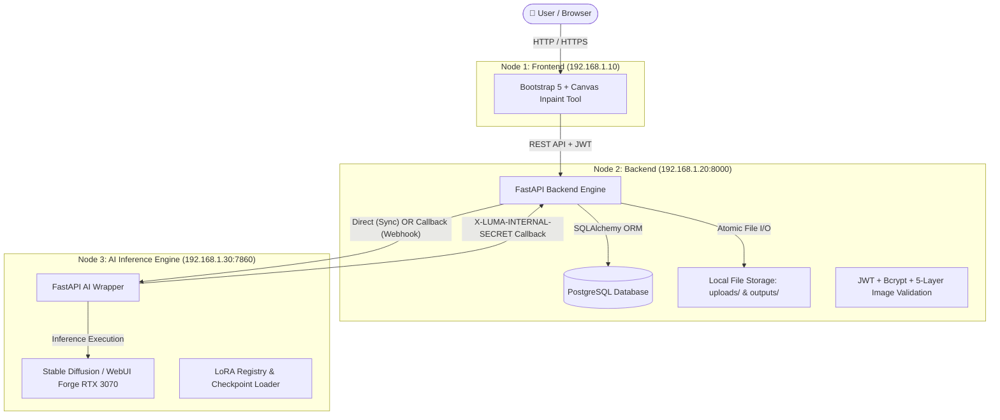
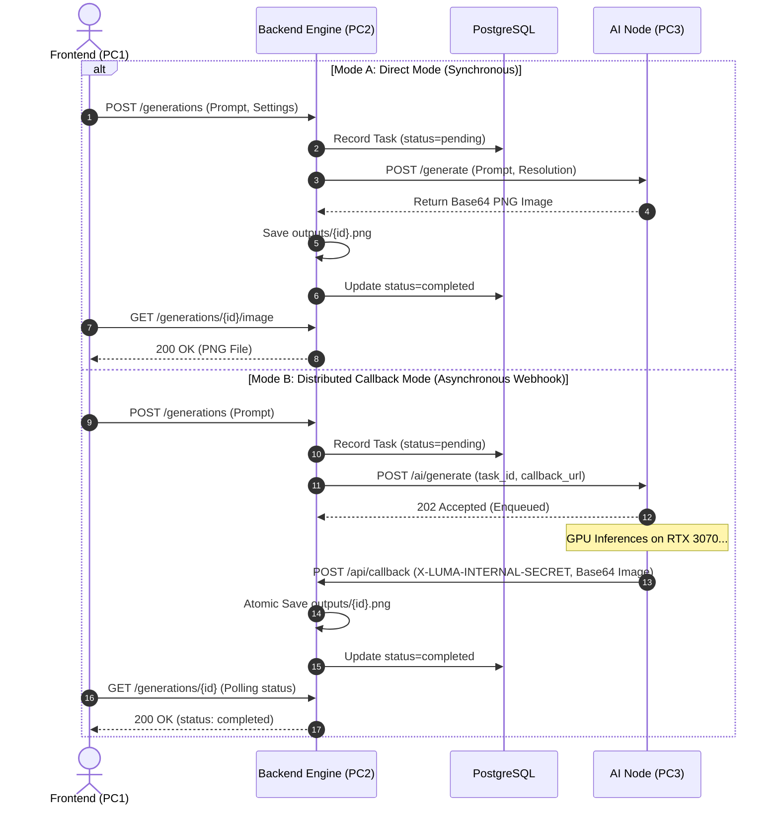
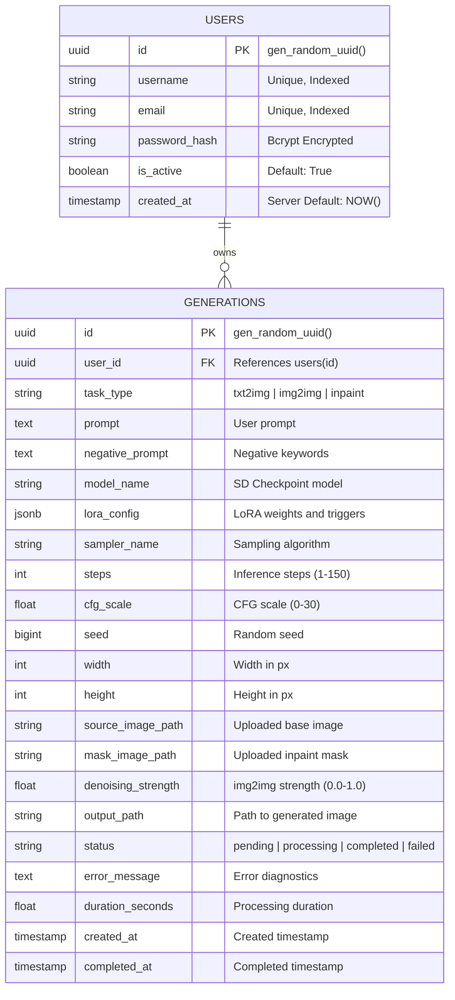

# 🎨 LUMA: Distributed AI Image Generation Platform

[](https://python.org)
[](https://fastapi.tiangolo.com)
[](https://www.postgresql.org)
[](https://pytest.org)
[](https://coverage.readthedocs.io)

**LUMA** เป็นระบบประมวลผลและสร้างภาพด้วยปัญญาประดิษฐ์ (AI Image Generation Platform) ที่ถูกออกแบบด้วยสถาปัตยกรรมแบบ **Distributed Computing** รองรับการสร้างภาพแบบ Multi-Modal ทั้ง **Text-to-Image (txt2img)**, **Image-to-Image (img2img)**, และ **Canvas Inpainting**

---

## 🏛️ 1. Architecture Overview (สถาปัตยกรรมระบบ)

ระบบแบ่งออกเป็น 3 Nodes อิสระ เชื่อมต่อกันผ่าน Local Area Network (LAN):



---

## 🔄 2. Dual-Mode Inference Strategy

ระบบรองรับการทำงานกับ AI Node ใน 2 รูปแบบ สลับได้ง่ายๆ ผ่านการตั้งค่า `AI_MODE` ใน `.env`:



---

## 🗄️ 3. Database Schema (Entity-Relationship)



---

## 🛡️ 4. Five-Layer Image Security Validation

| Layer | Validation Type | Defense Purpose |
|---|---|---|
| **Layer 1** | Content-Type Header | กรองเบื้องต้นเฉพาะ `image/png`, `image/jpeg`, `image/webp` |
| **Layer 2** | File Size Limit (10MB) | ป้องกัน DoS จากไฟล์ขนาดใหญ่ (HTTP 413) |
| **Layer 3** | Magic Bytes Inspection | ตรวจสอบ Header ไบนารีแท้ ป้องกันมัลแวร์ที่ปลอมนามสกุล (HTTP 422) |
| **Layer 4** | Decompression Bomb Defense | จำกัด `Image.MAX_IMAGE_PIXELS = 16M` (4096x4096px) ตาม OWASP |
| **Layer 5** | EXIF Stripping & Atomic Write | ลบพิกัด GPS/Metadata เพื่อความเป็นส่วนตัว และบันทึกแบบ Atomic |

---

## 🧪 5. Testing & Quality Assurance (51 Tests, 90% Coverage)

```text
================================ tests coverage ================================
Name                         Stmts   Miss  Cover
------------------------------------------------
app/api/auth.py                 34      1    97%
app/api/callback.py             23      1    96%
app/api/generation.py           32      1    97%
app/api/upload.py               22      0   100% ⭐
app/core/config.py              19      0   100% ⭐
app/core/security.py            53      7    87%
app/db/database.py              11      0   100% ⭐
app/models/__init__.py          42      0   100% ⭐
app/schemas/generation.py       75      1    99%
app/schemas/token.py             4      0   100% ⭐
app/schemas/user.py             22      0   100% ⭐
app/services/generation.py     216     41    81%
app/services/upload.py          73     10    86%
------------------------------------------------
TOTAL                          630     62    90% 🏆
======================== 51 passed in 8.57s ========================
```

---

## 🚀 6. Quick Start Guide

### วิธีที่ 1: รันผ่าน Local Python Virtualenv
```bash
# 1. ติดตั้ง Dependencies
python -m venv .venv
source .venv/bin/activate
pip install -r requirements.txt

# 2. รัน Mock AI Server (Port 8001)
python mock_ai_server.py

# 3. รัน Backend API (Port 8000)
uvicorn main:app --host 0.0.0.0 --port 8000 --reload

# 4. สั่งรัน Automated Tests
pytest --cov=app --cov-report=term-missing
```

### วิธีที่ 2: รันผ่าน Docker Compose
```bash
docker-compose up --build
```

---

## 🎬 7. Live Demonstration Flow (สำหรับนำเสนออาจารย์)

1. **เปิด Swagger UI:** ไปที่ `http://localhost:8000/docs`
2. **Register & Login:** สมัครสมาชิกและล็อกอินรับ Token
3. **Check Profile:** เรียก `GET /auth/me` แสดงยอด `total_generations: 0`
4. **Live Demo 1 (txt2img):** สั่งสร้างภาพด้วย Prompt $\rightarrow$ เรียก `GET /generations/{id}/image` ดูภาพที่สร้างเสร็จ
5. **Live Demo 2 (img2img):** อัปโหลดภาพผ่าน `POST /uploads` $\rightarrow$ สั่ง `task_type="img2img"` $\rightarrow$ แสดงภาพ Before/After
6. **Live Demo 3 (Distributed Callback):** แสดงการทำงานแบบ Asynchronous Webhook
7. **Show Test Results:** รัน `pytest` แสดงผล 51/51 Tests ผ่าน 100% (Coverage 90%)
