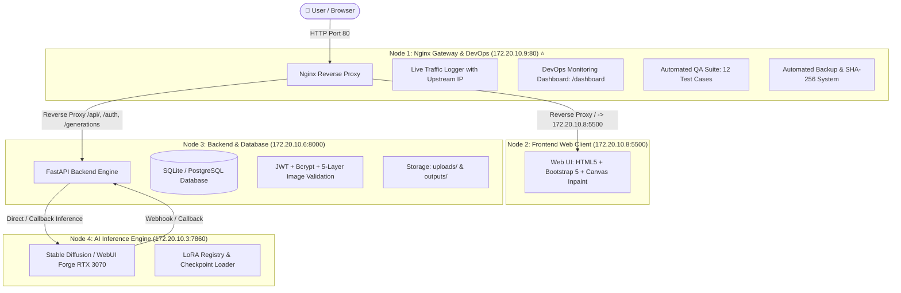

# 🎨 LUMA: Distributed AI Image Generation Platform

[](https://github.com/Pongkarm/Project_Luma_PKW/tree/devops)
[](http://172.20.10.9)
[-brightgreen.svg)](nginx/test_distributed_system.py)
[](https://fastapi.tiangolo.com)
[](https://python.org)
[](nginx/backup_system.py)

**LUMA** เป็นระบบประมวลผลและสร้างภาพด้วยปัญญาประดิษฐ์ (AI Image Generation Platform) ที่ออกแบบด้วยสถาปัตยกรรมแบบ **Distributed Computing (ระบบประมวลผลแบบกระจายศูนย์)** รองรับการสร้างภาพทั้ง **Text-to-Image (txt2img)**, **Image-to-Image (img2img)**, และ **Canvas Inpainting**

> 📌 **สำหรับ Branch `devops`:** สาขานี้เน้นการทำงานของ **คนที่ 4: QA / DevOps** รับผิดชอบสถาปัตยกรรมเครือข่ายด่านหน้า (Nginx Reverse Proxy Gateway), ระบบตรวจสอบและมอนิเตอร์ริ่ง (DevOps Health Dashboard), การทดสอบระบบทั้ง 4 เครื่อง (Automated QA Test Suite), ระบบสำรองข้อมูล (Automated Backup & Archive) และคู่มือการดูแลระบบ (DevOps Manual)

---

## 🏛️ 1. Architecture Overview (สถาปัตยกรรมระบบ 4 เครื่อง)

ระบบแบ่งแยกหน้าที่การทำงานอย่างชัดเจนออกเป็น **4 Physical Nodes** เชื่อมต่อกันผ่านเครือข่ายวงแลน (Local Area Network):



### ตารางแจกแจงอุปกรณ์และพอร์ตในเครือข่าย (Network & Hardware Matrix)

| Node | เครื่อง / บทบาท | ผู้รับผิดชอบ | ระบบปฏิบัติการ | IP Address | Port | หน้าที่หลัก |
| :---: | :--- | :---: | :---: | :---: | :---: | :--- |
| **1** | **Nginx Gateway & DevOps** | **คนที่ 4 (QA / DevOps)** | Windows | `172.20.10.9` | `80` | จุดรับ Traffic จุดเดียว (Single Entry Point), Reverse Proxy กระจายงาน, Realtime Log, Monitoring Dashboard, QA Testing, Backup |
| **2** | **Frontend Client** | คนที่ 1 | macOS | `172.20.10.8` | `5500` | บริการหน้าเว็บ UI, Canvas Inpainting Tool, Responsive Dashboard |
| **3** | **Backend & Database** | คนที่ 2 | macOS | `172.20.10.6` | `8000` | จัดการ Authentication, บันทึก Task คิว, ฐานข้อมูล, จัดเก็บรูปภาพ |
| **4** | **AI Inference Engine** | คนที่ 3 | Windows | `172.20.10.3` | `7860` | ประมวลผลโมเดล Stable Diffusion ด้วย GPU Nvidia RTX 3070 |

---

## 🛠️ 2. ผลงานและหน้าที่ความรับผิดชอบ (คนที่ 4: QA / DevOps Deliverables)

| เสาหลัก | รายการ | ไฟล์ที่เกี่ยวข้อง | คำอธิบาย |
|---|---|---|---|
| 🌐 **Gateway & Proxy** | Nginx Reverse Proxy | [`nginx/conf/nginx.conf`](nginx/conf/nginx.conf) | จุดรวมศูนย์พอร์ต 80 เชื่อมต่อ Frontend (`:5500`) และ Backend (`:8000`) ป้องกันปัญหา CORS พร้อมระบุ Upstream ใน Log |
| 🚀 **Automation Launcher** | One-Click Scripts | [`nginx/run_nginx_with_logs.bat`](nginx/run_nginx_with_logs.bat)<br>[`nginx/stop_nginx.bat`](nginx/stop_nginx.bat) | รัน Nginx พร้อมหน้าต่างสตรีม Log สด แสดง IP ต้นทางและปลายทางที่ส่งต่อ |
| 🧪 **QA Testing Suite** | ระบบทดสอบอัตโนมัติ 12 Tests | [`nginx/test_distributed_system.py`](nginx/test_distributed_system.py)<br>[`nginx/run_tests.bat`](nginx/run_tests.bat) | ทดสอบการเชื่อมต่อและความพร้อมของทั้ง 4 โหนดแบบ End-to-End ครอบคลุม Routing, Data Ingestion, Image Validation และ Security |
| 📊 **DevOps Dashboard** | ระบบตรวจวัดสถานะเรียลไทม์ | [`nginx/html/dashboard.html`](nginx/html/dashboard.html) | มอนิเตอร์ Health Status ของทั้ง 4 โหนด อัปเดตอัตโนมัติทุก 5 วินาที พร้อมระบบจำกัดสิทธิ์ (IP Whitelist เข้าได้เฉพาะเครื่อง Nginx) |
| 💾 **Backup System** | ระบบสำรองข้อมูลอัตโนมัติ | [`nginx/backup_system.py`](nginx/backup_system.py)<br>[`nginx/run_backup.bat`](nginx/run_backup.bat) | สำรอง Config, Web Assets, Source Code เป็น Zip Archive พร้อมคำนวณ Checksum SHA-256 และ System Health Snapshot |
| 📖 **Documentation** | คู่มือปฏิบัติการ DevOps ฉบับสมบูรณ์ | [`nginx/DEVOPS_MANUAL.md`](nginx/DEVOPS_MANUAL.md) | คู่มือการติดตั้ง, การทดสอบ, การแก้ปัญหา (Troubleshooting) และแผนการกู้คืนระบบ |

---

## 🧪 3. สรุปผลการทดสอบระบบ (QA Verification Matrix — 12/12 Passed)

ชุดทดสอบ [`nginx/test_distributed_system.py`](nginx/test_distributed_system.py) ทำการทดสอบอัตโนมัติ 12 รายการครอบคลุมทุกโหนด:

| ลำดับ | รายการทดสอบ | โหนดเป้าหมาย | คาดหวัง | ผลการทดสอบ |
| :---: | :--- | :---: | :---: | :---: |
| **01** | Gateway Health Check | Node 1 (`172.20.10.9:80`) | HTTP 200 / HTML | ✅ **PASS** |
| **02** | Gateway Reverse Proxy: Frontend Routing | Node 1 -> Node 2 | Forward to Frontend | ✅ **PASS** |
| **03** | Gateway Reverse Proxy: Backend API Routing | Node 1 -> Node 3 | Forward to Backend | ✅ **PASS** |
| **04** | Direct Connection: Frontend Node | Node 2 (`172.20.10.8:5500`) | HTTP 200 | ✅ **PASS** |
| **05** | Direct Connection: Backend Node | Node 3 (`172.20.10.6:8000`) | HTTP 200 / `{"status":"ok"}` | ✅ **PASS** |
| **06** | Direct Connection: AI Node | Node 4 (`172.20.10.3:7860`) | HTTP 200 / JSON | ✅ **PASS** |
| **07** | Backend OpenAPI Documentation | Node 3 / Node 1 | HTTP 200 / OpenAPI Spec | ✅ **PASS** |
| **08** | End-to-End User Authentication Flow | Node 1 (`/api/auth/login`) | HTTP 200 / Token Validation | ✅ **PASS** |
| **09** | Image Upload & Ingestion Validation | Node 1 (`/api/uploads`) | HTTP 200 / MIME Checked | ✅ **PASS** |
| **10** | End-to-End Image Generation Dispatch | Node 1 (`/api/generations`) | HTTP 200 / 202 Accepted | ✅ **PASS** |
| **11** | Backend Multi-Layer Security Defense | Node 1 (`/api/uploads`) | Reject invalid file (HTTP 422) | ✅ **PASS** |
| **12** | DevOps Monitoring Dashboard Access | Node 1 (`/dashboard`) | HTTP 200 / Dashboard UI | ✅ **PASS** |

> 🏆 **อัตราความสำเร็จ (Pass Rate): 100% (12 ผ่าน / 0 ไม่ผ่าน)**

---

## 🔒 4. สถาปัตยกรรมความปลอดภัย (Security & Access Control)

ระบบออกแบบการป้องกันเป็นชั้น (Defense-in-Depth):

1. **Gateway IP Whitelist (DevOps Access Protection):**
   * เส้นทาง `http://172.20.10.9/dashboard` จำกัดสิทธิ์ให้เข้าถึงได้เฉพาะเครื่อง Nginx เท่านั้น (`172.20.10.9` และ `localhost`) ป้องกันผู้อื่นแอบเข้าดูข้อมูลระบบ
   ```nginx
   location ~* ^/dashboard(\.html)?$ {
       allow 127.0.0.1;
       allow ::1;
       allow 172.20.10.9;
       deny all;
       root html;
       try_files /dashboard.html =404;
   }
   ```
2. **Reverse Proxy Masking & CORS Elimination:**
   * ผู้ใช้เข้าถึงระบบผ่าน `172.20.10.9:80` เพียงพอร์ตเดียว ทำให้ทั้งหน้าเว็บและ API อยู่บน Origin เดียวกัน ไม่เกิดปัญหา CORS ข้ามโดเมน
3. **Five-Layer Image Security Validation (Backend):**
   * ตรวจสอบ Content-Type, จำกัดขนาดไฟล์ (10MB), ตรวจสอบ Magic Bytes, ป้องกัน Decompression Bomb (OWASP standard), และตัด EXIF metadata ก่อนบันทึกไฟล์แบบ Atomic

---

## 🚀 5. คู่มือการใช้งานสำหรับ DevOps (DevOps Quickstart)

### 1) การเปิด Nginx Gateway
ดับเบิลคลิกไฟล์:
```text
nginx\run_nginx_with_logs.bat
```
*ระบบจะเปิด Nginx บนพอร์ต 80 และเริ่มสตรีม Log การส่งต่อข้อมูลแบบเรียลไทม์ทันที*

### 2) การสั่งรันชุดทดสอบ QA อัตโนมัติ (12 Test Cases)
ดับเบิลคลิกไฟล์:
```text
nginx\run_tests.bat
```
หรือรันผ่าน PowerShell:
```powershell
python nginx/test_distributed_system.py
```

### 3) การเข้าดู DevOps Health Dashboard
เปิด Browser บนเครื่อง Nginx ไปที่:
```text
http://localhost/dashboard
หรือ
http://172.20.10.9/dashboard
```

### 4) การสำรองข้อมูลระบบ (Automated Backup)
ดับเบิลคลิกไฟล์:
```text
nginx\run_backup.bat
```
หรือรันผ่าน PowerShell:
```powershell
python nginx/backup_system.py
```
*ไฟล์สำรองข้อมูลจะถูกสร้างไว้ในโฟลเดอร์ `nginx/backups/LUMA_BACKUP_*.zip` พร้อมพิมพ์ค่า SHA-256 Checksum*

### 5) การปิด Nginx Gateway
ดับเบิลคลิกไฟล์:
```text
nginx\stop_nginx.bat
```

---

## 🎬 6. ลำดับขั้นตอนการนำเสนอสด (Live Demonstration Flow)

1. **เปิด Nginx Console:** ดับเบิลคลิก `nginx/run_nginx_with_logs.bat` แสดงหน้าต่าง Live Access Logs
2. **เข้าใช้งานระบบผ่าน Gateway:** เปิดเบราว์เซอร์ไปที่ `http://172.20.10.9/` โชว์ว่าสามารถโหลดหน้าเว็บจาก Node 2 (`172.20.10.8:5500`) ได้อย่างราบรื่น
3. **ทดสอบสร้างภาพ:** สั่งประมวลผลภาพ โชว์ Nginx Access Log ที่แสดงการส่งต่อ Traffic ไปยัง Backend (`172.20.10.6:8000`)
4. **เปิด DevOps Monitoring Dashboard:** ไปที่ `http://172.20.10.9/dashboard` แสดงสถานะความพร้อมของทั้ง 4 โหนด และทดสอบเปิดจากเครื่องอื่นเพื่อโชว์ HTTP 403 Forbidden (Security Whitelist)
5. **รัน QA Automated Verification:** ดับเบิลคลิก `nginx/run_tests.bat` โชว์ผลการทดสอบผ่าน 12/12 Tests (100% Pass)
6. **รัน Automated Backup:** ดับเบิลคลิก `nginx/run_backup.bat` แสดงการสร้างไฟล์สำรองข้อมูล Zip และคำนวณ Checksum SHA-256 สำเร็จ

---

## 👥 ทีมผู้จัดทำ (Distributed Systems Project)

* **คนที่ 1 (Frontend):** Web UI, Responsive Design, Canvas Inpainting (`172.20.10.8:5500`)
* **คนที่ 2 (Backend & Database):** FastAPI Engine, Authentication, Storage, Database (`172.20.10.6:8000`)
* **คนที่ 3 (AI Engine):** Stable Diffusion Pipeline, GPU Acceleration RTX 3070 (`172.20.10.3:7860`)
* **คนที่ 4 (QA / DevOps):** Nginx Gateway, Automated Testing Suite, Monitoring Dashboard, Backup & Security (`172.20.10.9:80`)
