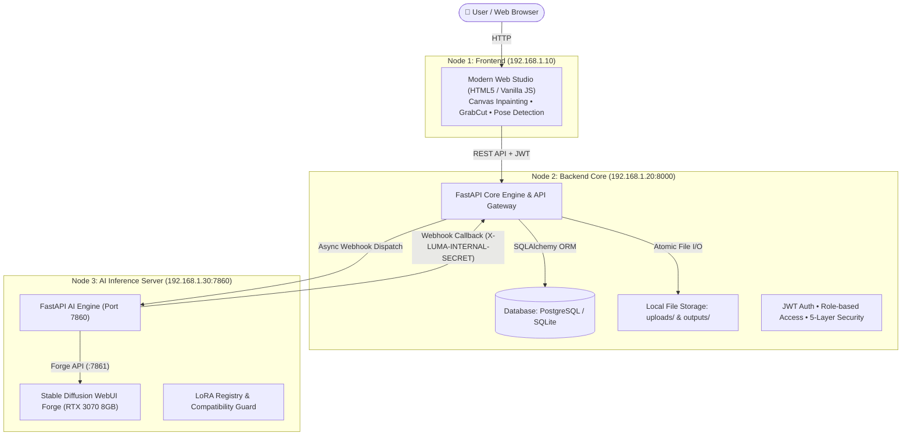
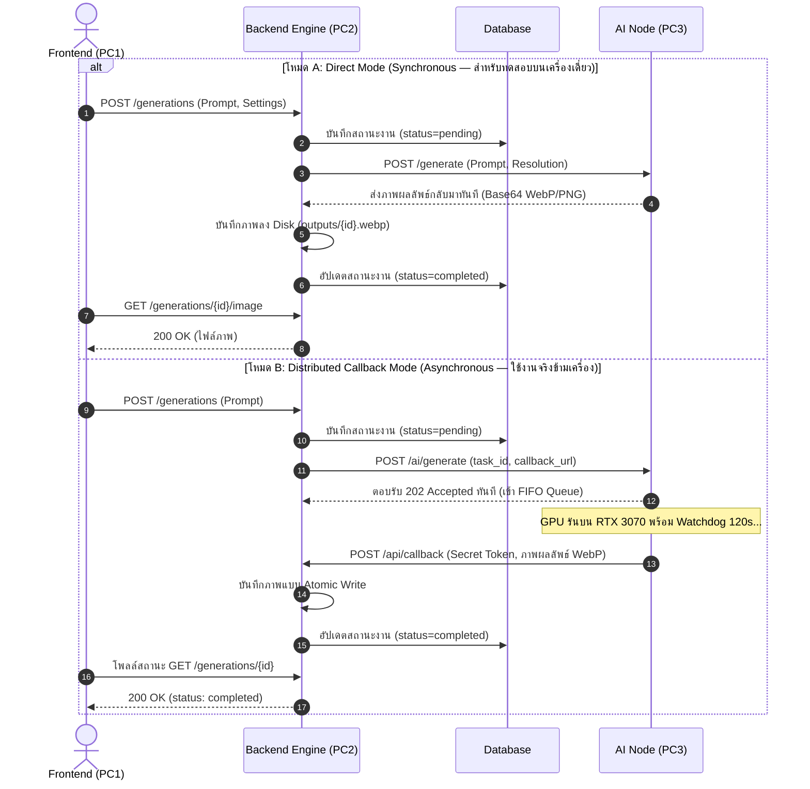
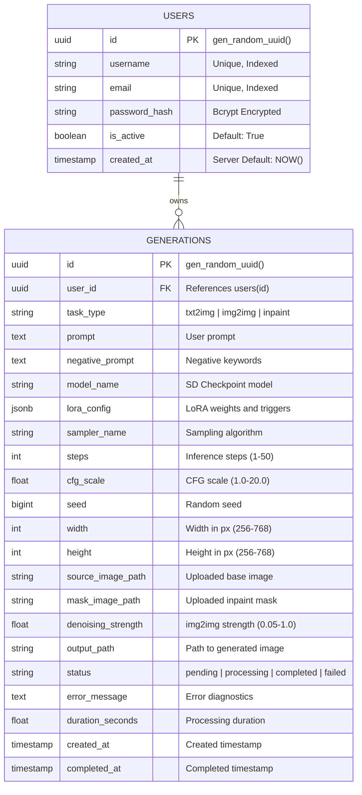

# 🎨 LUMA: Distributed AI Image Generation Platform

[](https://python.org)
[](https://fastapi.tiangolo.com)
[](#-1-architecture-overview-สถาปัตยกรรมระบบ)
[](#-6-testing--quality-assurance)
[](#-4-model--lora-architecture-compatibility-ระบบตรวจจับความเข้ากันได้)

**LUMA** เป็นแพลตฟอร์มสร้างและตัดต่อภาพด้วยปัญญาประดิษฐ์ระดับสตูดิโอ (AI Studio & Image Generation Platform) ที่ออกแบบด้วยสถาปัตยกรรม **Distributed Computing 3 โหนด** รองรับการสร้างภาพแบบ Multi-Modal ทั้ง **Text-to-Image (txt2img)**, **Image-to-Image (img2img)**, และ **Canvas Inpainting** พร้อมเครื่องมือประมวลผลภาพขั้นสูงในตัว

---

## 🏛️ 1. Architecture Overview (สถาปัตยกรรมระบบ 3 โหนด)

ระบบทำงานร่วมกันผ่าน Local Area Network (LAN) โดยแยกหน้าที่กันอย่างเด็ดขาดตามหลักการ Separation of Concerns:



---

## 🔄 2. Dual-Mode Inference Strategy (กลยุทธ์การเชื่อมโยงระบบ AI)

Backend รองรับการทำงานร่วมกับ AI Node ใน 2 รูปแบบ สลับได้ผ่านตัวแปรสภาพแวดล้อม `AI_MODE`:



---

## 🧠 3. Model & LoRA Architecture Compatibility (ระบบตรวจสอบความเข้ากันได้)

เนื่องจาก LoRA Adapter แต่ละตัวถูกเทรนขึ้นมาสำหรับ Base Model เฉพาะตระกูล หากนำ LoRA ข้ามรุ่นไปผสม (เช่น นำ LoRA ของ Illustrious XL ไปใช้กับ SD 1.5) ภาพที่ได้จะแตกลายและเกิด Artifacts ผิดเพี้ยน LUMA จึงมีระบบป้องกัน 2 ชั้น (**Defense-in-Depth**):

### ตารางจำแนกตระกูลโมเดล (Model Family Matrix)

| ตระกูลสถาปัตยกรรม (Family) | ตัวอย่าง Checkpoint Model | LoRA Adapter ที่รองรับ |
| :--- | :--- | :--- |
| **`sd15`** (Stable Diffusion 1.5) | `counterfeitV30_v30.safetensors` | `tachi-e`, `niji_and_midj_mix217` |
| **`illustrious_xl`** (Illustrious XL) | `novaAnimeXL_ilV190.safetensors` | `SousouNoFrieren`, `Char-Frieren-IL-V1`, `himmel` |
| **`pony_xl`** (Pony XL) | `prefectPonyXL_v6.safetensors` | `[Artstyle] SomethingWeird_Geekpower [PDXL]` |

### กลไกการป้องกัน 2 ระดับ:
1. **Frontend Level (UI Filter & Auto-Reset)**:
   * หน้าเว็บจะกรอง Dropdown ของ LoRA ให้แสดงเฉพาะตัวที่ตรงกับ Base Model ที่เลือก
   * หากผู้ใช้สลับโมเดลแล้ว LoRA เดิมเข้ากันไม่ได้ ระบบจะรีเซ็ตกลับเป็น `"ไม่ใช้"` และบันทึก Draft อัตโนมัติ ป้องกันความสับสนของผู้ใช้
2. **AI Server Level (Auto-skip Safety Guard)**:
   * กรณีมีคำขอยิงข้ามตระกูลส่งตรงมาทาง API ตัว Server จะไม่ทำให้ Request ล่ม (ไม่ Throw Error 500) แต่จะ **Auto-skip** ตัดแท็ก LoRA นั้นออก พร้อมบันทึก Warning Log เพื่อให้งานสร้างภาพยังคงดำเนินต่อไปได้อย่างปลอดภัย (**Zero Breaking Change**)

---

## 🗄️ 4. Database Schema (โครงสร้างฐานข้อมูล)



---

## 🛡️ 5. Five-Layer Image Security Validation (ระบบความปลอดภัย 5 ชั้น)

เพื่อป้องกันการโจมตีทางไซเบอร์และการส่งไฟล์อันตรายเข้าสู่ GPU ระบบมีระบบคัดกรองไฟล์ภาพที่เข้มงวด 5 ระดับ:

| ลำดับชั้น (Layer) | การตรวจสอบ (Validation Type) | วัตถุประสงค์ในการป้องกัน (Defense Purpose) |
|---|---|---|
| **Layer 1** | Content-Type Header Check | กรองเบื้องต้นเฉพาะ `image/png`, `image/jpeg`, `image/webp` |
| **Layer 2** | File Size Bound (10MB Limit) | ป้องกัน DoS จากไฟล์ขนาดยักษ์ (ตอบกลับ HTTP 413) |
| **Layer 3** | Magic Bytes Deep Inspection | ตรวจสอบ Header ไบนารีแท้จริง ป้องกันมัลแวร์ที่เปลี่ยนนามสกุลไฟล์หลอก (HTTP 422) |
| **Layer 4** | Decompression Bomb Defense | ควบคุม `Image.MAX_IMAGE_PIXELS = 16M` (4096×4096px) ตามมาตรฐาน OWASP |
| **Layer 5** | EXIF Stripping & Atomic Write | ลบพิกัด GPS/ข้อมูลส่วนบุคคลออกจากภาพ และบันทึกไฟล์แบบ Atomic ป้องกันไฟล์เสียหาย |

---

## 🧪 6. Testing & Quality Assurance (ผลการทดสอบเต็มระบบ)

ระบบผ่านการทดสอบแบบอัตโนมัติ (Automated Tests) ครบถ้วนทุกชั้นสถาปัตยกรรม:

* **Node 1 Frontend (`frontend-html`)**: ผ่านการทดสอบ **14/14 Tests** ครอบคลุมการคำนวณขนาดภาพ, กฎรหัสผ่าน, และการกรอง LoRA ตามตระกูลโมเดล
* **Node 2 Backend Core (`backend_node`)**: ผ่านการทดสอบ **83+ Integration Tests** ครอบคลุม Auth, Permissions, Upload Security, และ Webhook Idempotency
* **Node 3 AI Inference Node (`Project_Luma_PKW`)**: ผ่านการทดสอบ **17/17 Tests** ครอบคลุม GPU Monitor, Queue FIFO, Safety Bounds, และ Auto-skip Guard
* **Multi-Node Full Pipeline (`test_multi_node_e2e.py`)**: ผ่านการทดสอบจำลองเชื่อมโยง 3 โหนดพร้อมกันแบบครบวงจร

---

## 🚀 7. Quick Start Guide (วิธีเปิดใช้งานระบบ)

### รัน Node 3: AI Inference Server (พอร์ต 7860)
```powershell
# ในโฟลเดอร์ Project_Luma_PKW
python -m uvicorn ai_server.server:app --host 0.0.0.0 --port 7860
```

### รัน Node 2: Backend Core API (พอร์ต 8000)
```powershell
# ในโฟลเดอร์ backend_node
uvicorn main:app --host 0.0.0.0 --port 8000 --reload
```

### รัน Node 1: Web Frontend (พอร์ต 5500)
```bash
# ในโฟลเดอร์ frontend_node/frontend-html
python -m http.server 5500
# เปิดเบราว์เซอร์ไปที่ http://localhost:5500
```

---

## 🎬 8. Live Demonstration Flow (ลำดับการนำเสนอโปรเจกต์)

1. **เปิดหน้าเว็บสตูดิโอ:** ไปที่ `http://localhost:5500` และล็อกอินเข้าสู่ระบบ
2. **ทดสอบ Model & LoRA Filtering:**
   * เลือกโมเดล **Counterfeit v3.0 (SD 1.5)** ➔ สังเกตว่าช่อง LoRA จะแสดงเฉพาะ Tachi-e และ Niji Mix
   * สลับไปเลือก **Nova Anime XL** ➔ สังเกตว่าตัวเลือก LoRA เปลี่ยนเป็น Frieren และ Himmel ทันที
3. **ทดสอบสร้างภาพ (txt2img):** กรอก Prompt ➔ กดสร้างภาพ ➔ สังเกต Task Queue บน AI Server รับงานและประมวลผล
4. **ทดสอบ Inpainting & Image Edit:** อัปโหลดภาพต้นฉบับ ➔ ระบาย Mask สีบนแคนวาส ➔ สั่ง Inpaint แปลงวัตถุเฉพาะจุด
5. **ทดสอบเครื่องมือสตูดิโอ (Studio Tools):** ทดสอบการตรวจจับท่าทาง (Pose Detection) และการตัดพื้นหลัง (GrabCut)
6. **แสดงผลความปลอดภัยและการทดสอบ:** รันคำสั่งทดสอบ `python -m unittest ai_server.tests.test_server` แสดงความสมบูรณ์ของระบบ
