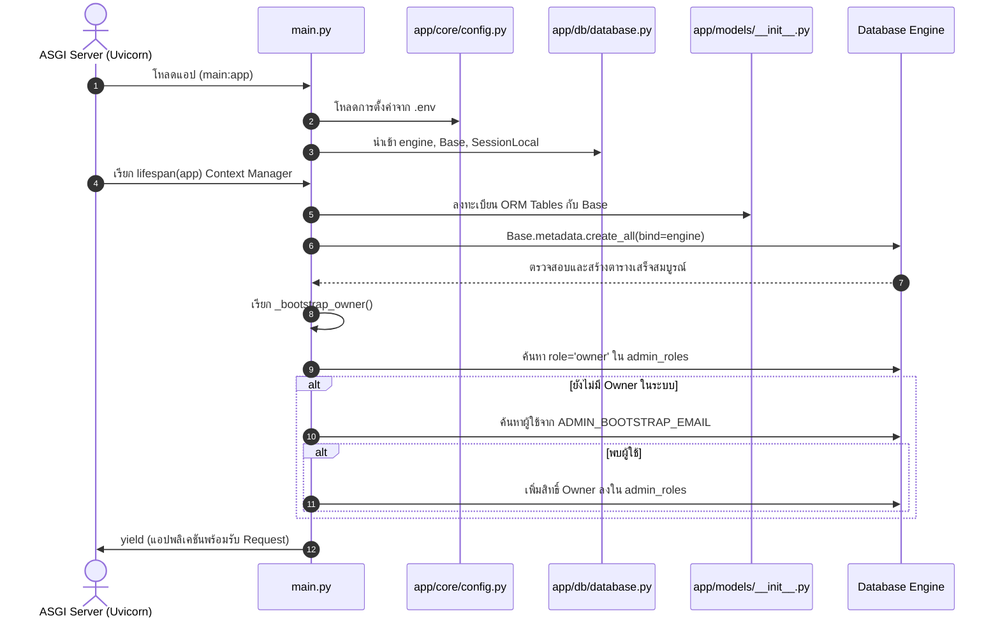
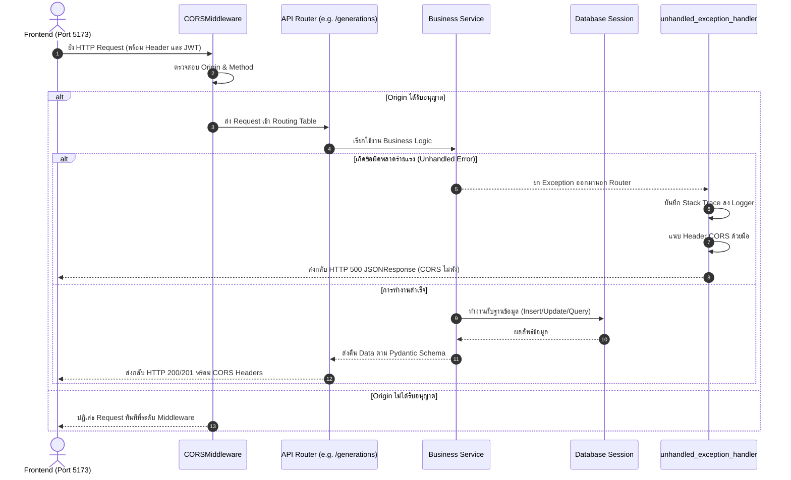

# LUMA Backend: Technical Specification & Code Architecture (Part 1: Entry Point & `main.py`)

> **วันที่จัดทำ:** 2026-09-21  
> **หมวดหมู่:** Backend Architecture & Technical Specification  
> **เวอร์ชัน:** 1.0.0  
> **ระบบเป้าหมาย:** LUMA Image Generation Backend API (`main.py`)  
> **อ้างอิงเอกสารหลัก:** `BACKEND_ONBOARDING_GUIDE.md`

---

## 1. วัตถุประสงค์และขอบเขต (Objectives & Scope)

### 1.1 วัตถุประสงค์ (Objectives)
- อธิบายและสรุปสถาปัตยกรรมระบบโดยรวมของ **LUMA Backend** ทั้ง 7 ส่วนหลักตามที่ระบุไว้ใน `BACKEND_ONBOARDING_GUIDE.md`
- เจาะลึกการทำงานของไฟล์ **`main.py`** ซึ่งเป็น Application Entry Point ครอบคลุมการตั้งค่า **CORS**, **Lifespan Lifecycle**, **Router Inclusion**, และ **Global Exception Handler**
- วิเคราะห์ Control Flow และ Data Flow แบบทีละบรรทัด (Line-by-Line Execution Trace) ชี้ชัดว่าแต่ละฟังก์ชันส่งต่องานไปยังไฟล์ใดและคืนค่าอย่างไร

### 1.2 ขอบเขต (Scope)
- **In-Scope:**
  - โครงสร้างและปฏิสัมพันธ์ระหว่าง 7 องค์ประกอบหลักของ Backend
  - การบูตระบบด้วย Modern Lifespan Protocol และการทำ Database Auto-creation (`Base.metadata.create_all`)
  - กลไก One-Time Bootstrap เจ้าของระบบ (`_bootstrap_owner`)
  - การจัดการ Cross-Origin Resource Sharing (CORS) และการป้องกันปัญหา CORS Header หลุดหายเมื่อเกิด Unhandled 500
  - สเปกของ Health Check (`/healthz`) และ System Status (`/api/status`)
- **Out-of-Scope:**
  - รายละเอียดระดับลึกของโมเดล AI ใน `mock_ai_server.py` หรือ ComfyUI Workflow (จะสรุปแยกในส่วนของ AI Integration)

---

## 2. ภาพรวมสถาปัตยกรรมระบบ (System Architecture Overview)

LUMA Backend ทำหน้าที่เป็น Core Orchestrator ระหว่าง Frontend (UI) และ AI Inference Node โดยแบ่งโครงสร้างภายในเป็น 7 ส่วนหลัก:

```mermaid
flowchart TD
    subgraph ClientLayer ["🖥️ หน้าบ้าน (Client / Frontend)"]
        UI["Web Frontend (React / Vite / Next.js - Port 3000 / 5173)"]
    end

    subgraph BackendApp ["⚙️ LUMA Backend (FastAPI - Port 8000)"]
        direction TB
        Main["1. Entry Point & Lifecycle (main.py)"]
        Core["2. Core, Config & Security (app/core/)"]
        Routers["5. API Routers (app/api/)"]
        Schemas["4. Schemas Contracts (app/schemas/)"]
        Services["6. Business Services (app/services/)"]
        DB[(3. Database & Models / SQLite & PostgreSQL)]
        
        Main --> Routers
        Routers --> Schemas
        Routers --> Core
        Routers --> Services
        Services --> DB
    end

    subgraph AINodeCluster ["🤖 ส่วนประมวลผล AI (Port 8001 / Worker)"]
        AINode["7. AI Inference Node (mock_ai_server.py / ComfyUI)"]
    end

    UI -->|1. HTTP Request (แนบ Bearer JWT)| Routers
    Services -->|2. ส่ง Prompt & สเปกไปประมวลผล| AINode
    AINode -.->|3. Callback ผลลัพธ์ Base64 กลับมา| Routers
    Services -->|4. Decode Base64 บันทึกไฟล์ PNG & อัปเดต DB| DB
```

### สรุปสาระสำคัญ 7 ส่วนหลักของระบบ:
1. **Entry Point & Lifecycle (`main.py`):** ประตูหน้าบ้านของ API, จัดการ CORS Middleware, Lifespan Startup/Shutdown, Route Registration, และ Global Exception Handling
2. **Core, Configuration & Security (`app/core/`):** โหลด `.env` ผ่าน Pydantic Settings (`config.py`), แฮชรหัสผ่าน `bcrypt` และออก Token JWT (`security.py`), ตรวจสอบระดับสิทธิ์ Role-Based Access Control (`permissions.py`: Owner=3, Admin=2, Reviewer=1)
3. **Database & ORM Models (`app/db/`, `app/models/`):** จัดการ SQLAlchemy Engine, Session Pool, `get_db()` Dependency และตารางหลัก 4 ตาราง (`User`, `Generation`, `AdminRole`, `AuditEvent`)
4. **Schemas & Data Contracts (`app/schemas/`):** Pydantic Models ตรวจสอบ Input Validation และแปลงโครงสร้าง Response ให้เป็นมาตรฐาน
5. **API Routers (`app/api/`):** แหล่งรวม Endpoints 6 โมดูลหลัก (`/auth`, `/generations`, `/callback`, `/uploads`, `/models`, `/admin`)
6. **Business Logic & Services (`app/services/`):** ตรรกะงานสร้างภาพ AI (`generation.py`), การคัดกรองความปลอดภัยไฟล์อัปโหลด 5 ชั้น (`upload.py`), และการจัดการบัญชี/Audit Log (`admin.py`)
7. **AI Integration & Testing (`mock_ai_server.py`, `tests/`):** เซิร์ฟเวอร์จำลอง AI Node (Port 8001) และชุดทดสอบ Pytest 67+ เทสต์

---

## 3. เจาะลึก `main.py` — ไล่โค้ดทีละบรรทัด (Line-by-Line Walkthrough)

โครงสร้างโค้ดทั้งหมด 136 บรรทัด แบ่งการทำงานออกเป็น 7 ส่วน ดังนี้:

### ท่อนที่ 1: การโหลด Library และการตั้งค่า Logging (บรรทัด 1 - 19)

```python
1: import logging
2: from contextlib import asynccontextmanager
3: from fastapi import FastAPI, Request
4: from fastapi.responses import JSONResponse
5: from fastapi.middleware.cors import CORSMiddleware
6: from sqlalchemy import text
7: 
8: from app.db.database import engine, Base, SessionLocal
9: from app.api import auth, generation, callback, upload, models, admin
10: from app.core.config import settings
```

#### 🔍 Control Flow & Memory Analysis:
- **บรรทัด 1-6:** โหลด Standard Library และ Core Modules ของ FastAPI และ SQLAlchemy
- **บรรทัด 8 (`from app.db.database import engine, Base, SessionLocal`):**
  - **การทำงาน:** Python กระโดดไปยัง `app/db/database.py`
  - ทำการรัน `create_engine(settings.DATABASE_URL)` เพื่อสร้าง Connection Pool ไปยัง Database
  - ประกาศ `Base = declarative_base()` สำหรับ ORM Registry
  - สร้าง Session Factory `SessionLocal = sessionmaker(...)`
- **บรรทัด 9 (`from app.api import auth, generation, ...`):**
  - **การทำงาน:** Python วิ่งไปโหลดโมดูลย่อยทั้งหมดใน `app/api/` คอมไพล์ Path Operations, Parameter Validators และ Dependency Injection (`get_current_user`, `get_db`) เข้าสู่ Memory
- **บรรทัด 10 (`from app.core.config import settings`):**
  - **การทำงาน:** โหลด `app/core/config.py` ซึ่งจะอ่าน Environment Variables จาก `.env` และเก็บไว้ในตัวแปร `settings`

```python
12: # 💡 ตั้งค่าระบบ Logging กลาง
13: logging.basicConfig(
14:     level=logging.INFO,
15:     format="%(asctime)s | %(levelname)-8s | %(name)s | %(message)s",
16:     datefmt="%Y-%m-%d %H:%M:%S",
17: )
18: logger = logging.getLogger(__name__)
```
- **บรรทัด 13-18:** กำหนดฟอร์แมต Log ระดับระบบให้แสดงวันเวลา, ระดับ Log (`INFO`, `WARNING`, `ERROR`), ชื่อโมดูล และเนื้อหาข้อความ

---

### ท่อนที่ 2: ฟังก์ชัน Bootstrap เจ้าของระบบ `_bootstrap_owner()` (บรรทัด 21 - 50)

```python
21: def _bootstrap_owner() -> None:
...
29:     from sqlalchemy.orm import Session
30: 
31:     from app.core.config import settings
32:     from app.models import AdminRole, User
33: 
34:     email = (settings.ADMIN_BOOTSTRAP_EMAIL or "").strip()
35:     if not email:
36:         return
```
- **บรรทัด 29-32 (Lazy Import):** นำเข้าโมเดลภายในฟังก์ชัน เพื่อป้องกันปัญหา **Circular Import** ระหว่าง `main.py`, `database.py` และ `models`
- **บรรทัด 34-36:** อ่านค่า `ADMIN_BOOTSTRAP_EMAIL` จาก Settings หากไม่ได้ระบุไว้ จะ `return` จบทันที ไม่เปลือง Connection

```python
38:     with Session(engine) as db:
39:         if db.query(AdminRole).filter(AdminRole.role == "owner").first():
40:             return
41:         user = db.query(User).filter(User.email == email).first()
42:         if user is None:
43:             logger.warning(
44:                 "ADMIN_BOOTSTRAP_EMAIL=%s ยังไม่ได้สมัครสมาชิก — ข้ามการมอบสิทธิ์", email
45:             )
46:             return
47:         db.add(AdminRole(user_id=user.id, role="owner", granted_by=None))
48:         db.commit()
49:         logger.info("มอบสิทธิ์ owner ให้ %s เรียบร้อย", email)
```

#### 🔍 Execution Flow & Data Flow:
1. **บรรทัด 38:** เปิด Database Session เฉพาะกิจด้วย Context Manager `with Session(engine) as db:` เพื่อรับประกันการปิด Connection เมื่อเสร็จสิ้น
2. **บรรทัด 39-40 (Idempotency Check):** ยิงคำสั่ง SQL:
   ```sql
   SELECT * FROM admin_roles WHERE role = 'owner' LIMIT 1;
   ```
   **Security Concept:** หากมี Owner อยู่ในระบบแล้ว ฟังก์ชันจะออกจากระบบทันที ป้องกันไม่ให้ค่าคงเหลือใน `.env` แอบคืนสิทธิ์ให้ผู้ใช้ที่เคยถูกปลดออกไปแล้ว
3. **บรรทัด 41-46:** หากยังไม่มี Owner ในระบบ จะค้นหาผู้ใช้จากอีเมล:
   ```sql
   SELECT * FROM users WHERE email = :email LIMIT 1;
   ```
   หากไม่พบ ผู้ใช้จะบันทึก Warning Log และไม่ทำอะไรต่อ (ต้องรอให้ User บัญชีนั้นสมัครสมาชิกเข้ามาก่อน)
4. **บรรทัด 47-49:** หากพบบัญชีผู้ใช้ จะสร้าง Record ลงในตาราง `AdminRole`:
   ```sql
   INSERT INTO admin_roles (user_id, role, granted_by) VALUES (:user_id, 'owner', NULL);
   ```
   สั่ง `db.commit()` บันทึกข้อมูลลงฐานข้อมูลถาวร และแจ้ง Info Log

---

### ท่อนที่ 3: วงจรชีวิตของแอปพลิเคชัน `lifespan` (บรรทัด 52 - 62)

```python
52: @asynccontextmanager
53: async def lifespan(app: FastAPI):
54:     # สร้างตารางใน Database เมื่อเซิร์ฟเวอร์เริ่มทำงาน
55:     try:
56:         Base.metadata.create_all(bind=engine)
57:         logger.info("Database tables initialized successfully.")
58:         _bootstrap_owner()
59:     except Exception as e:
60:         logger.warning(f"Could not initialize tables on startup: {e}")
61:     yield
```

#### 🔍 ลำดับขั้นตอนตาม Lifespan Protocol:
- **Phase 1: Startup (ก่อน `yield` - บรรทัด 56-58):**
  - รันคำสั่ง `Base.metadata.create_all(bind=engine)` เพื่อสร้างตารางทั้งหมดตามที่โมเดลประกาศไว้ หากตารางยังไม่เคยมีในระบบ
  - เรียก `_bootstrap_owner()` ทันทีหลังสร้างตารางเสร็จ
  - มีบล็อก `try...except` ป้องกันเซิร์ฟเวอร์ Crash ทันทีหากการเชื่อมต่อ Database ช่วงบูตสะดุด
- **Phase 2: Hand-off (`yield` - บรรทัด 61):**
  - คืนการควบคุมให้ ASGI Server (Uvicorn) เพื่อเปิดรับ HTTP Request จากภายนอก
- **Phase 3: Shutdown (หลัง `yield`):**
  - เมื่อได้รับสัญญาณปิดระบบ (`SIGTERM` หรือ `Ctrl+C`) โค้ดหลังบรรทัด `yield` จะถูกเรียกเพื่อคืนทรัพยากร

---

### ท่อนที่ 4: การประกาศแอปพลิเคชัน และ CORS Middleware (บรรทัด 64 - 79)

```python
64: app = FastAPI(
65:     title="LUMA Backend API",
66:     description="Backend API for LUMA Image Generation Platform",
67:     version="1.0.0",
68:     lifespan=lifespan
69: )
70: 
71: # 💡 เพิ่ม CORS Middleware เพื่อให้ Frontend สามารถยิง API ข้าม Origin ได้
72: app.add_middleware(
73:     CORSMiddleware,
74:     allow_origins=["http://localhost:3000", "http://localhost:5173", "http://localhost:8080", "*"],
75:     allow_credentials=True,
76:     allow_methods=["*"],
77:     allow_headers=["*"],
78: )
```

#### 🔍 การทำงานของ CORS Middleware:
- **เบราว์เซอร์กับนโยบาย Same-Origin Policy (SOP):** เมื่อเว็บแอปพลิเคชันฝั่ง Frontend (เช่น `http://localhost:5173`) พยายามเรียก API ไปที่ `http://localhost:8000` เบราว์เซอร์จะส่ง Preflight Request (`OPTIONS`) มาถามสิทธิ์ก่อน
- `CORSMiddleware` ทำหน้าที่เป็น Gatekeeper ชั้นนอกสุด:
  - `allow_origins`: กำหนด Origin ที่อนุญาต
  - `allow_credentials=True`: อนุญาตให้แนบข้อมูลสิทธิ์ยืนยันตัวตน (Cookies, Authorization Bearer Header)
  - `allow_methods=["*"]`: รองรับ Method `GET`, `POST`, `PUT`, `DELETE`, `OPTIONS`
  - `allow_headers=["*"]`: รองรับ Header ทั้งหมด เช่น `Content-Type`, `Authorization`, `X-LUMA-INTERNAL-SECRET`

---

### ท่อนที่ 5: การรวบรวม Routers (บรรทัด 80 - 86)

```python
80: # 🆕 เชื่อมต่อ Routers
81: app.include_router(auth.router)
82: app.include_router(generation.router)
83: app.include_router(callback.router)
84: app.include_router(upload.router)
85: app.include_router(models.router)
86: app.include_router(admin.router)
```

#### 🔍 การกระจายงานตาม URL Path:
| Router | Prefix / จุดประสงค์หลัก | ปลายทางไฟล์โค้ด |
| :--- | :--- | :--- |
| `auth.router` | `/auth/register`, `/auth/login`, `/auth/me` | `app/api/auth.py` |
| `generation.router` | `/generations`, `/generations/{id}/progress`, cancel | `app/api/generation.py` |
| `callback.router` | `/callback/ai-result` (รับภาพ Base64 จาก AI Node) | `app/api/callback.py` |
| `upload.router` | `/uploads` (รับภาพต้นฉบับสำหรับ Image-to-Image) | `app/api/upload.py` |
| `models.router` | `/models` (รายชื่อโมเดล, Sampler, LoRA) | `app/api/models.py` |
| `admin.router` | `/admin/stats`, `/admin/users`, `/admin/audit` | `app/api/admin.py` |

---

### ท่อนที่ 6: Root Route และ Global Exception Handler (บรรทัด 89 - 104)

```python
89: @app.get("/", tags=["Health Check"])
90: def read_root():
91:     return {"message": "LUMA Backend is running! 🚀"}
```
- Endpoint พื้นฐานสำหรับ Smoke Test ตรวจสอบสถานะการรัน

```python
94: @app.exception_handler(Exception)
95: async def unhandled_exception_handler(request: Request, exc: Exception):
96:     logger.exception(f"Unhandled error on {request.method} {request.url.path}: {exc}")
97:     headers = {}
98:     origin = request.headers.get("origin")
99:     if origin:
100:         headers["Access-Control-Allow-Origin"] = origin
101:         headers["Access-Control-Allow-Credentials"] = "true"
102:         headers["Access-Control-Allow-Methods"] = "*"
103:         headers["Access-Control-Allow-Headers"] = "*"
104:     return JSONResponse(status_code=500, content={"detail": "Internal Server Error"}, headers=headers)
```

#### 🔍 ความสำคัญเชิงเทคนิคของ Exception Handler:
- **ปัญหาทางเทคนิค (The 500 CORS Issue):** เมื่อเกิด Unhandled Exception ร้ายแรงใน FastAPI/Starlette response ข้อผิดพลาดอาจข้ามผ่าน Middleware Pipeline ทำให้ Response 500 ไม่มี Header CORS แนบไปด้วย เบราว์เซอร์จึงตัดการเชื่อมต่อและแจ้งเตือนว่าติด CORS แทนที่จะแสดงเนื้อหา Error ที่แท้จริง
- **การแก้ไข:** ฟังก์ชันนี้จะดึง `origin` จาก Header ของ Request ต้นทาง แล้วประกอบ Header CORS ด้วยตนเอง ก่อนส่งกลับ `JSONResponse(status_code=500)` ทำให้ Frontend ได้รับสถานะ 500 และแสดง Error Dialog บนหน้าบ้านได้อย่างถูกต้อง

---

### ท่อนที่ 7: Endpoint ตรวจสอบความพร้อมของระบบ (Health Checks) (บรรทัด 107 - 136)

```python
107: @app.get("/healthz", tags=["Health Check"])
108: def health_check():
109:     """Health check endpoint สำหรับ Nginx, Frontend, และ DevOps"""
110:     db_state = "connected"
111:     try:
112:         with SessionLocal() as db:
113:             db.execute(text("SELECT 1"))
114:     except Exception as exc:
115:         logger.error(f"Health check: database unreachable | {exc}")
116:         db_state = "unreachable"
117: 
118:     body = {
119:         "status": "healthy" if db_state == "connected" else "degraded",
120:         "service": "LUMA Backend API",
121:         "version": "1.2.0",
122:         "ai_mode": settings.AI_MODE,
123:         "database": db_state,
124:     }
125:     return JSONResponse(status_code=200 if db_state == "connected" else 503, content=body)
```

#### 🔍 Logic การประเมินสถานะระบบ:
- บรรทัด 112-113: ทดสอบยิง SQL เบาที่สุด `SELECT 1` เพื่อตรวจสอบการตอบสนองของฐานข้อมูลจริง
- บรรทัด 125 (Smart Status Response):
  - หาก Database พร้อมใช้งาน $\rightarrow$ ตอบกลับ `200 OK`
  - หาก Database ล่ม $\rightarrow$ ตอบกลับ `503 Service Unavailable` ทำให้ Load Balancer (Nginx / Kubernetes Probe) ทราบทันทีและตัดเซิร์ฟเวอร์ออกจาก Traffic Pool

```python
128: @app.get("/api/status", tags=["System"])
129: def system_status():
130:     """System info endpoint สำหรับ Frontend Dashboard"""
131:     return {
132:         "status": "online",
133:         "supported_tasks": ["txt2img", "img2img", "inpaint"],
134:         "max_upload_mb": settings.MAX_UPLOAD_SIZE_BYTES // (1024 * 1024),
135:         "ai_mode": settings.AI_MODE
136:     }
```
- ส่งข้อมูลสเปกของระบบที่แปลงหน่วยแล้ว (เช่น ขนาด Upload สูงสุดในหน่วย MB) เพื่อให้ Dashboard ของ Frontend ดึงไปปรับแต่ง UI

---

## 4. แผนผังการทำงาน (Sequence Diagrams)

### 4.1 ลำดับการบูตระบบ (Startup Lifecycle Flow)



### 4.2 วงจรชีวิตของ HTTP Request (Inbound Request Lifecycle)



---

## 5. ข้อพิจารณาด้านความปลอดภัยและเสถียรภาพ (Security & Reliability Highlights)

1. **One-Time Bootstrap:**  
   การเช็ก `role == "owner"` ก่อนทำการมอบสิทธิ์เสมอ ป้องกันไม่ให้ไฟล์ `.env` ที่ยังหลงเหลืออยู่ในเซิร์ฟเวอร์ย้อนคืนสิทธิ์ให้ผู้ใช้ที่ถูกถอดถอนไปแล้ว
2. **CORS Preservation on Unhandled Exceptions:**  
   การแทรก Header CORS ใน `unhandled_exception_handler` ช่วยแก้ปัญหาเบราว์เซอร์แจ้งเตือนผิดพลาด ทำให้นักพัฒนาหาสาเหตุของ Internal Server Error ได้อย่างตรงจุด
3. **Database Health Isolation:**  
   คำสั่ง `SELECT 1` ใน `/healthz` รันแบบแยก Session โดดเดี่ยวและส่งรหัส HTTP 503 เมื่อฐานข้อมูลดับ ช่วยให้ระบบ Orchestrator (เช่น Docker, Kubernetes, Nginx) ป้องกันการส่ง Traffic ไปยังโหนดที่ไม่พร้อมทำงาน
