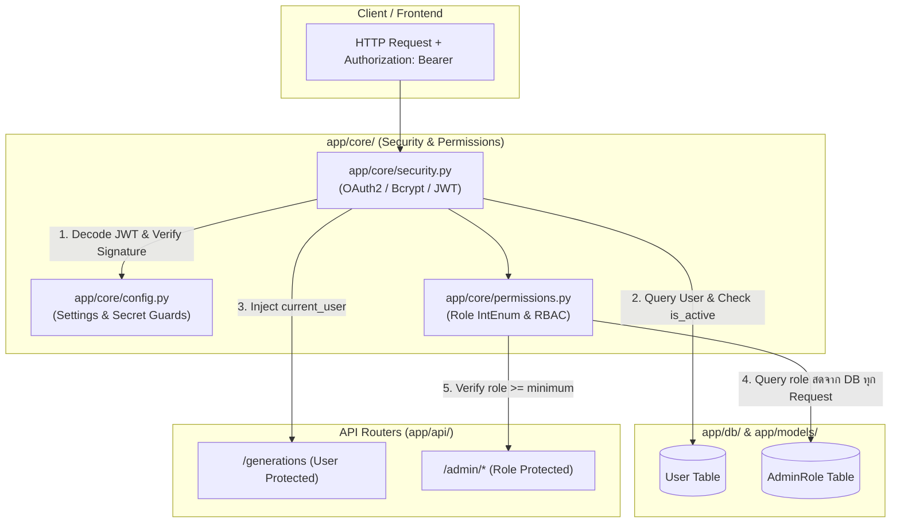

# LUMA Backend — Technical Specification & Deep Dive
## ส่วนที่ 2: Core, Configuration & Security (`app/core/`)

> **วันที่จัดทำ:** 21 กันยายน 2026  
> **โมดูล:** `app/core/` (Configuration, Security, Permissions)  
> **ระบบเป้าหมาย:** LUMA Backend (FastAPI + SQLAlchemy)  
> **ไฟล์ที่เกี่ยวข้อง:** `app/core/config.py`, `app/core/security.py`, `app/core/permissions.py`

---

## 1. วัตถุประสงค์และขอบเขต (Objectives & Scope)

- **วัตถุประสงค์หลัก:**  
  เป็นแกนกลางด้านความปลอดภัยและการตั้งค่าของระบบ LUMA Backend ทำหน้าที่จัดการคอนฟิกระบบ, ป้องกันกุญแจความลับรั่วไหล, เข้ารหัสและตรวจสอบรหัสผ่าน, สร้างและถอดรหัส JWT Token สำหรับยืนยันตัวตน (Authentication) รวมถึงควบคุมสิทธิ์การเข้าถึงของผู้ดูแลระบบแบบ Role-Based Access Control (Authorization)
- **ขอบเขตการทำงาน (In-Scope):**
  - จัดการ Environment Variables แบบ Type-safe พร้อมระบบตัดการทำงานทันทีหากพบ Weak/Leaked Secrets
  - แฮชรหัสผ่านด้วย `bcrypt` พร้อมการจัดการข้อจำกัดความยาว 72 ไบต์อย่างปลอดภัย
  - ตรวจสอบและสร้าง Access Token ตามมาตรฐาน `OAuth2 Bearer` (JWT HS256)
  - ให้บริการ Dependency Injection (`get_current_user`) สำหรับ Route ที่ต้องการความปลอดภัย
  - จัดการลำดับสิทธิ์แอดมิน 3 ระดับ (`REVIEWER`, `ADMIN`, `OWNER`) ด้วยการดึงข้อมูลสดจากฐานข้อมูล (Real-time DB query) เพื่อรองรับการเพิกถอนสิทธิ์ทันที (Instant Revocation)
- **นอกขอบเขต (Out-of-Scope):**
  - การลงทะเบียนผู้ใช้ใหม่หรือจัดการข้อมูลโปรไฟล์ (เป็นหน้าที่ของ `app/api/auth.py` และ `app/services/`)
  - การเชื่อมต่อ AI Inference โดยตรง (เป็นหน้าที่ของ `app/services/generation.py`)

---

## 2. สถาปัตยกรรมและแผนผังความปลอดภัย (Security Architecture)



---

## 3. รายละเอียดโค้ดและการทำงานทีละบรรทัด (Line-by-Line Breakdown)

### 3.1 [`app/core/config.py`](file:///Users/pongkarm/CDTI_work/CDTI_work_69/Term_1/Image_Processing/Project/app/core/config.py)
ไฟล์กำหนดค่าคอนฟิกส่วนกลางของระบบ อ่านค่าจากสภาพแวดล้อมและ `.env`

```python
from pathlib import Path
from pydantic_settings import BaseSettings, SettingsConfigDict

class Settings(BaseSettings):
    DATABASE_URL: str
    SECRET_KEY: str
    ALGORITHM: str = "HS256"
    ACCESS_TOKEN_EXPIRE_MINUTES: int = 30
```
- **คำอธิบาย:**
  - `DATABASE_URL` และ `SECRET_KEY` ถูกประกาศโดยไม่มีค่าเริ่มต้น แปลว่าตัวแปรทั้งสองตัวนี้**บังคับต้องมี**ในสภาพแวดล้อมหรือไฟล์ `.env` หากไม่มี เซิร์ฟเวอร์จะปฏิเสธการเริ่มทำงานทันที
  - `ALGORITHM`: ใช้มาตรฐาน `HS256` (HMAC with SHA-256) สำหรับการเซ็น JWT
  - `ACCESS_TOKEN_EXPIRE_MINUTES`: กำหนดอายุ Access Token ไว้ที่ 30 นาที

```python
    # อีเมลของเจ้าของระบบคนแรก แก้ปัญหาไก่กับไข่: ไม่มีใครมอบสิทธิ์ให้คนแรกได้
    # อ่านตอนเริ่มเซิร์ฟเวอร์เท่านั้น และไม่ทำอะไรเลยถ้ามี owner อยู่แล้ว
    ADMIN_BOOTSTRAP_EMAIL: str = ""
```
- **คำอธิบาย:**
  - กำหนดอีเมลผู้ดูแลคนแรก (`ADMIN_BOOTSTRAP_EMAIL`) เพื่อแก้ปัญหา Chicken-and-Egg ในระบบ RBAC โดยฟังก์ชัน `_bootstrap_owner()` ใน `main.py` จะแต่งตั้งอีเมลนี้เป็น `OWNER` ทันทีที่ระบบเปิดใช้งานครั้งแรก

```python
    # AI Service Configuration
    AI_MODE: str = "direct"  # "direct" | "callback"
    AI_SERVER_URL: str = "http://localhost:8001/generate"
    AI_SERVER_DIRECT_URL: str = "http://localhost:8001/generate"
    AI_SERVER_CALLBACK_URL: str = "http://localhost:8001/ai/generate"
    AI_CALLBACK_SECRET: str
    BACKEND_CALLBACK_URL: str = "http://localhost:8000/api/callback"
    OUTPUTS_DIR: Path = Path("./outputs")
    UPLOADS_DIR: Path = Path("./uploads")
    MAX_UPLOAD_SIZE_BYTES: int = 10 * 1024 * 1024  # 10 MB limit
    MAX_IMAGE_DIMENSION: int = 4096  # Max 4096x4096 px

    model_config = SettingsConfigDict(env_file=".env", extra="ignore")

settings = Settings()
```
- **คำอธิบาย:**
  - ตั้งค่าการเชื่อมต่อ AI Node, พาธโฟลเดอร์สำหรับเก็บภาพ (`outputs/`, `uploads/`)
  - กำหนดขนาดไฟล์สูงสุดที่อนุญาตให้อัปโหลดคือ 10 MB และขนาดภาพไม่เกิน 4096×4096 พิกเซล
  - `extra="ignore"` อนุญาตให้มีตัวแปรอื่นๆ ใน `.env` โดยไม่ทำให้ Pydantic เกิด Validation Error

```python
LEAKED_SECRETS = {
    "luma-super-secret-jwt-key-2024-cdti-image-processing",
    "luma-distributed-token-secret-6710301009",
    "CHANGE_ME_GENERATE_A_NEW_ONE",
}

for name, value in (
    ("SECRET_KEY", settings.SECRET_KEY),
    ("AI_CALLBACK_SECRET", settings.AI_CALLBACK_SECRET),
):
    if value in LEAKED_SECRETS or len(value) < 32:
        raise RuntimeError(
            f"{name} ยังเป็นค่าที่หลุดสาธารณะหรือสั้นเกินไป — "
            'สร้างใหม่: python -c "import secrets; print(secrets.token_urlsafe(64))"'
        )
```
- **จุดเด่นด้านความปลอดภัย (Security Guard):**
  - ดักจับคีย์ตัวอย่างที่เคยหลุดในเอกสารหรือ Git Repository หากเซิร์ฟเวอร์พบว่า `SECRET_KEY` หรือ `AI_CALLBACK_SECRET` ตรงกับ Blacklist หรือมีความยาวไม่ถึง 32 อักขระ ระบบจะสั่งหยุดทำงานทันที (`raise RuntimeError`)

---

### 3.2 [`app/core/security.py`](file:///Users/pongkarm/CDTI_work/CDTI_work_69/Term_1/Image_Processing/Project/app/core/security.py)
ไฟล์จัดการการเข้ารหัสรหัสผ่าน, สร้างและตรวจทาน JWT Token, และ Dependency ดึงข้อมูลผู้ใช้ปัจจุบัน

```python
from datetime import datetime, timedelta, timezone
from uuid import UUID
from fastapi import Depends, HTTPException, status
from fastapi.security import OAuth2PasswordBearer
from jose import jwt, JWTError
from passlib.context import CryptContext
from sqlalchemy.orm import Session

from app.core.config import settings
from app.db.database import get_db
from app.models import User

import bcrypt

oauth2_scheme = OAuth2PasswordBearer(tokenUrl="/auth/login")
```
- **คำอธิบาย:**
  - `oauth2_scheme`: อินสแตนซ์ของ `OAuth2PasswordBearer` ทำหน้าที่แกะ Token ออกมาจาก Header `Authorization: Bearer <token>` อัตโนมัติ พร้อมทั้งเชื่อมโยง Endpoint `/auth/login` กับเอกสาร Swagger OpenAPI

```python
def hash_password(password: str) -> str:
    """แปลง password ธรรมดา → hash ด้วย bcrypt"""
    pwd_bytes = password.encode('utf-8')[:72]
    salt = bcrypt.gensalt()
    return bcrypt.hashpw(pwd_bytes, salt).decode('utf-8')
```
- **คำอธิบาย:**
  - `[:72]`: การตัด Slice ข้อความให้ไม่เกิน 72 ไบต์ เป็นข้อบังคับสำคัญของอัลกอริทึม Bcrypt (Bcrypt Specification รองรับ Input สูงสุด 72 ไบต์) เพื่อป้องกันปัญหา Crash เมื่อมีข้อความยาวเกิน
  - สุ่ม Salt ใหม่ทุกครั้งด้วย `bcrypt.gensalt()` เพื่อป้องกันการโจมตีแบบ Rainbow Table

```python
def verify_password(plain_password: str, hashed_password: str) -> bool:
    """เช็กว่า password ที่กรอก ตรงกับ hash มั้ย"""
    try:
        pwd_bytes = plain_password.encode('utf-8')[:72]
        hashed_bytes = hashed_password.encode('utf-8')
        return bcrypt.checkpw(pwd_bytes, hashed_bytes)
    except Exception:
        return False
```
- **คำอธิบาย:**
  - ใช้ `bcrypt.checkpw` ซึ่งมีการทำงานแบบ Constant-Time Comparison ช่วยป้องกันการโจมตีผ่านการจับเวลา (Timing Attack) หากพบ Error ใดๆ จะคืนค่า `False` เสมอ

```python
def create_access_token(data: dict) -> str:
    """สร้าง JWT Token"""
    to_encode = data.copy()
    expire = datetime.now(timezone.utc) + timedelta(minutes=settings.ACCESS_TOKEN_EXPIRE_MINUTES)
    to_encode.update({"exp": expire})
    encoded_jwt = jwt.encode(to_encode, settings.SECRET_KEY, algorithm=settings.ALGORITHM)
    return encoded_jwt

def decode_token(token: str) -> dict | None:
    """ถอดรหัส JWT Token"""
    try:
        payload = jwt.decode(token, settings.SECRET_KEY, algorithms=[settings.ALGORITHM])
        return payload
    except JWTError:
        return None
```
- **คำอธิบาย:**
  - `create_access_token`: ฝังค่าเวลาหมดอายุ (`exp`) ตาม UTC และเข้ารหัสด้วย `SECRET_KEY`
  - `decode_token`: ถอดรหัสและตรวจสอบลายเซ็นดิจิทัล หาก Token หมดอายุหรือถูกปลอมแปลง จะดักจับ `JWTError` แล้วคืนค่า `None`

```python
def get_current_user(
    token: str = Depends(oauth2_scheme),
    db: Session = Depends(get_db)
) -> User:
    credentials_exception = HTTPException(
        status_code=status.HTTP_401_UNAUTHORIZED,
        detail="Could not validate credentials",
        headers={"WWW-Authenticate": "Bearer"},
    )
    payload = decode_token(token)
    if payload is None:
        raise credentials_exception

    user_id_str = payload.get("sub")
    if not user_id_str:
        raise credentials_exception

    try:
        user_uuid = UUID(user_id_str)
    except ValueError:
        raise credentials_exception

    user = db.query(User).filter(User.id == user_uuid).first()
    if user is None:
        raise credentials_exception
    if not user.is_active:
        raise HTTPException(
            status_code=status.HTTP_400_BAD_REQUEST,
            detail="Inactive user"
        )

    return user
```
- **ขั้นตอนการทำงานของ `get_current_user`:**
  1. ดึง Token ผ่าน `oauth2_scheme` และ Session ฐานข้อมูลผ่าน `get_db`
  2. ถอดรหัส Token หากล้มเหลว โยน HTTP 401
  3. ดึงฟิลด์ `sub` (Subject ซึ่งเก็บ User ID) และตรวจสอบรูปแบบความถูกต้องของ `UUID`
  4. ค้นหาผู้ใช้ในฐานข้อมูล หากไม่พบ โยน HTTP 401
  5. ตรวจสอบสถานะบัญชี หากถูกระงับสิทธิ์ (`is_active == False`) โยน HTTP 400 Inactive user
  6. ส่งคืนอ็อบเจกต์ `User` ให้กับ Route ปลายทาง

---

### 3.3 [`app/core/permissions.py`](file:///Users/pongkarm/CDTI_work/CDTI_work_69/Term_1/Image_Processing/Project/app/core/permissions.py)
ระบบควบคุมสิทธิ์ผู้ดูแลระบบ (Role-Based Access Control)

```python
from enum import IntEnum
from fastapi import Depends, HTTPException, status
from sqlalchemy.orm import Session

from app.core.security import get_current_user
from app.db.database import get_db
from app.models import AdminRole, User

class Role(IntEnum):
    """เรียงจากน้อยไปมาก เพื่อให้เทียบด้วย >= ได้ตรงไปตรงมา"""
    REVIEWER = 1
    ADMIN = 2
    OWNER = 3

ROLE_NAMES = {Role.REVIEWER: "reviewer", Role.ADMIN: "admin", Role.OWNER: "owner"}
NAME_TO_ROLE = {v: k for k, v in ROLE_NAMES.items()}
```
- **คำอธิบาย:**
  - สืบทอดจาก `IntEnum` ทำให้สามารถใช้เครื่องหมายเปรียบเทียบลำดับขั้นสิทธิ์ได้ทันที เช่น `current_role >= Role.ADMIN` โดยไม่ต้องเขียนเงื่อนไขซับซ้อน

```python
def get_role(db: Session, user_id) -> Role | None:
    """
    ระดับสิทธิ์ของผู้ใช้คนนี้ หรือ None ถ้าไม่ใช่แอดมิน

    อ่านจากฐานข้อมูลทุกครั้ง ไม่ได้ฝังไว้ใน JWT โดยตั้งใจ — token ถูกเซ็นครั้งเดียว
    แล้วเชื่อจนหมดอายุ ถ้าเก็บ role ไว้ในนั้น คนที่เพิ่งถูกถอดสิทธิ์จะยังใช้อำนาจ
    ได้จนกว่า token จะหมดอายุ ซึ่งตาม .env ที่ deploy อยู่คือ 24 ชั่วโมง
    """
    row = db.query(AdminRole).filter(AdminRole.user_id == user_id).first()
    if row is None:
        return None
    return NAME_TO_ROLE.get(row.role)
```
- **หลักคิดสำคัญทางสถาปัตยกรรม (Architectural Decision):**
  - **เหตุผลที่ไม่เก็บ Role ใน JWT:** JWT มีสถานะ Stateless และแก้ไขไม่ได้หลังจากการเซ็น หากเก็บ Role ใน JWT เมื่อแอดมินถูกเพิกถอนสิทธิ์ ผู้ใช้จะยังคงยิง API แอดมินได้ต่อไปจนกว่า Token จะหมดอายุ
  - การอ่านจากตาราง `AdminRole` แบบ Real-time ในทุกคำขอ ทำให้การระงับสิทธิ์มีผลในระดับเสี้ยววินาทีทันที (Instant Revocation)

```python
def require_role(minimum: Role):
    """
    Dependency สำหรับติดที่ router ไม่ใช่ที่ endpoint ทีละตัว
    """
    def dependency(
        current_user: User = Depends(get_current_user),
        db: Session = Depends(get_db),
    ) -> User:
        role = get_role(db, current_user.id)
        if role is None or role < minimum:
            raise HTTPException(
                status_code=status.HTTP_403_FORBIDDEN,
                detail=f"ต้องมีสิทธิ์ระดับ {ROLE_NAMES[minimum]} ขึ้นไป",
            )
        current_user.admin_role = role  # ให้ endpoint อ่านต่อได้โดยไม่ต้อง query ซ้ำ
        return current_user

    return dependency
```
- **คำอธิบาย:**
  - เป็น Closure Dependency รับระดับสิทธิ์ขั้นต่ำที่ต้องการ (`minimum`)
  - ตรวจสอบว่ามีสิทธิ์ถึงเกณฑ์หรือไม่ หากไม่ถึง ส่งกลับ **HTTP 403 Forbidden** พร้อมข้อความภาษาไทย
  - เมื่อผ่าน จะผูกค่า `current_user.admin_role = role` เข้ากับอ็อบเจกต์ผู้ใช้ เพื่อให้ Controller ข้างในใช้งานได้ทันทีโดยไม่ต้องยิงคำสั่ง SQL ซ้ำ

---

## 4. ข้อพิจารณาด้านความปลอดภัยและสมรรถนะ (Security & Performance)

| หัวข้อความปลอดภัย | มาตรการที่ใช้ในระบบ | ผลลัพธ์ที่ได้ |
| :--- | :--- | :--- |
| **Bcrypt Buffer Overflow / Crash** | ทำ Slicing รหัสผ่านที่ 72 ไบต์แรก (`[:72]`) | ป้องกันข้อผิดพลาดจากข้อจำกัดฮาร์ดโค้ดของอัลกอริทึม Bcrypt |
| **Hardcoded Secret Leakage** | ระบบตรวจจับคีย์ต้องห้าม (`LEAKED_SECRETS`) และความยาว >= 32 บิต | ป้องกันการลืมเปลี่ยน Default Key เมื่อนำขึ้น Production |
| **Privilege Revocation Lag** | ตรวจสอบสิทธิ์แอดมินสดผ่านฐานข้อมูลแทนการฝังใน JWT Token | สิทธิ์ถูกเพิกถอนทันที (Zero Delay) เมื่อแอดมินถูกปลด |
| **Token Hijacking & Replay** | อายุ Access Token สั้น (30 นาที) และตรวจสอบ `is_active` เสมอ | ลดความเสี่ยงจากการขโมย Token และบล็อกบัญชีที่ถูกแบนได้ทันที |
| **Timing Attacks** | ใช้ฟังก์ชัน `bcrypt.checkpw` ในการตรวจสอบรหัสผ่าน | ป้องกันการเดารหัสผ่านจากการวิเคราะห์เวลาประมวลผล |

---

## 5. แผนการทดสอบที่เกี่ยวข้อง (Testing & Verification)

ชุดทดสอบที่ครอบคลุมการทำงานของโมดูลนี้อยู่ในไดเรกทอรี `tests/`:
- **`tests/test_auth.py`**: ทดสอบการสมัครสมาชิก, การแฮชรหัสผ่าน, การยืนยันตัวตน, และการสร้าง Token
- **`tests/test_security.py`**: ทดสอบการทำงานของ Secret Validator, การตรวจจับ Token ปลอมหรือหมดอายุ, และการบล็อก Inactive User
- **`tests/test_admin_permissions.py`**: ทดสอบ Hierarchy ของสิทธิ์แอดมินทั้ง 3 ระดับ และการปฏิเสธการเข้าถึงด้วย HTTP 403
