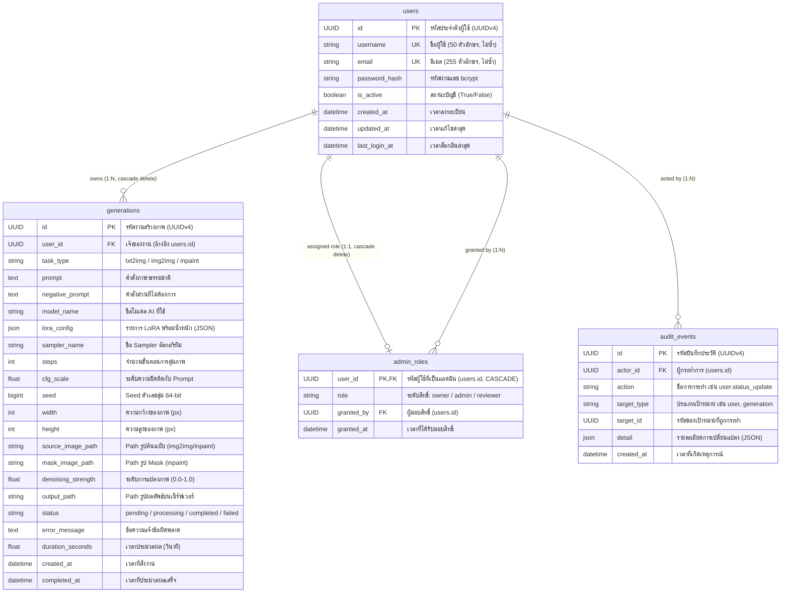
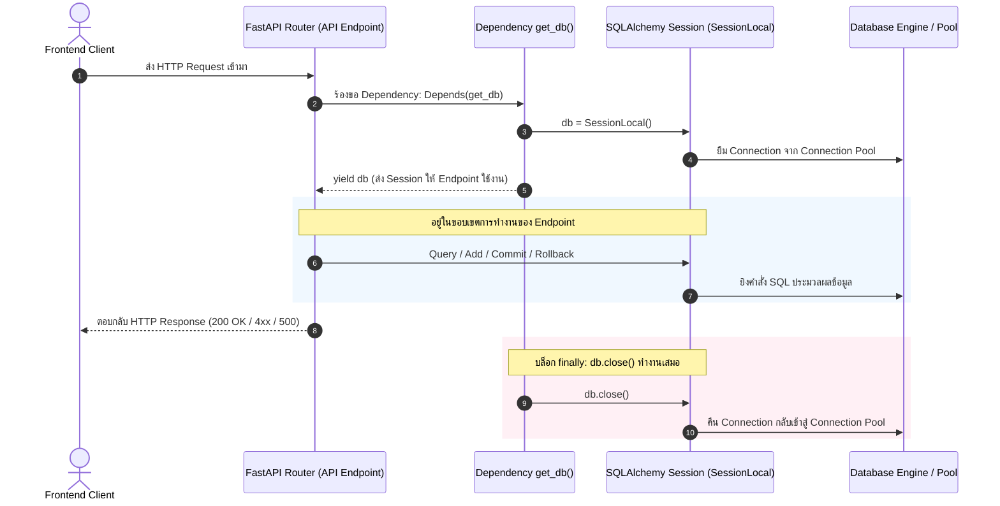
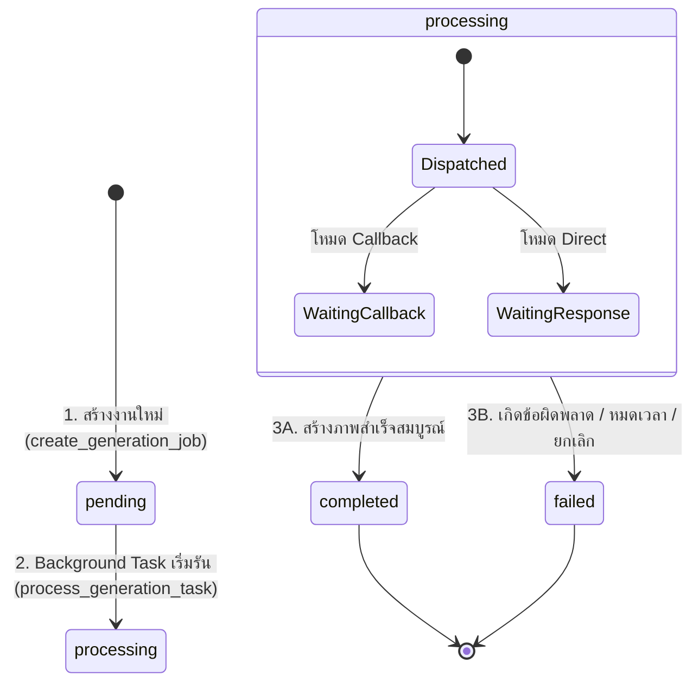

# LUMA Backend: Technical Specification & Database Architecture
## ส่วนที่ 3: Database & ORM Models (`app/db/` และ `app/models/`)

> **วันที่จัดทำ:** 21 กันยายน 2026  
> **หมวดหมู่:** Database Architecture & ORM Technical Specification  
> **เวอร์ชัน:** 1.0.0  
> **ระบบเป้าหมาย:** LUMA Backend (FastAPI + SQLAlchemy)  
> **ไฟล์หลักที่เกี่ยวข้อง:**  
> - [`app/db/database.py`](file:///Users/pongkarm/CDTI_work/CDTI_work_69/Term_1/Image_Processing/Project/app/db/database.py) — การตั้งค่า Database Engine, Session Factory, และ Dependency Injection  
> - [`app/models/__init__.py`](file:///Users/pongkarm/CDTI_work/CDTI_work_69/Term_1/Image_Processing/Project/app/models/__init__.py) — นิยาม ORM Models ทั้ง 4 ตาราง (`users`, `generations`, `admin_roles`, `audit_events`)  
> - [`app/services/generation.py`](file:///Users/pongkarm/CDTI_work/CDTI_work_69/Term_1/Image_Processing/Project/app/services/generation.py) — การจัดการ State และอัปเดตฟิลด์ของโมเดล `Generation`

---

## 1. วัตถุประสงค์และขอบเขต (Objectives & Scope)

### 1.1 วัตถุประสงค์ (Objectives)
- อธิบายโครงสร้างและความสัมพันธ์ของฐานข้อมูลทั้งหมดในระบบ **LUMA Backend** ที่ถูกนิยามผ่าน **SQLAlchemy Declarative Models**
- เจาะลึกฟิลด์และชนิดข้อมูลของโมเดลการสร้างภาพ AI (`Generation`) ทั้งในมิติของ AI Ingestion Parameters, Pipeline Metadata, และวงจรการอัปเดตสถานะเมื่องานสำเร็จหรือล้มเหลว
- วิเคราะห์กลไกการบริหารจัดการ Database Connection และ Session Lifecycle ใน `app/db/database.py` เพื่อให้เข้าใจการทำงานร่วมกับ Dependency Injection ของ FastAPI และการป้องกันปัญหา Connection Leak

### 1.2 ขอบเขต (Scope)
- **ครอบคลุม (In-Scope):**
  - รายละเอียดระดับฟิลด์และคีย์นอก (Foreign Keys/Relationships) ของทั้ง 4 ตาราง: `users`, `generations`, `admin_roles`, และ `audit_events`
  - การจัดการ Primary Key แบบ **UUIDv4** เพื่อความปลอดภัยและขยายตัวได้ง่าย (IDOR Prevention)
  - วงจรชีวิตของ Connection Pool (`engine`), Session Factory (`SessionLocal`), และ Dependency (`get_db()`)
  - โฟลว์การอัปเดตข้อมูลของ `Generation` ทั้งในโหมด Callback (Asynchronous) และ Direct (Synchronous) รวมถึงเงื่อนไข Timeout และ Cancel
  - การรับประกันความปลอดภัยของข้อมูล (Data Isolation & Integrity)
- **ไม่ครอบคลุม (Out-of-Scope):**
  - การตรวจสอบและคัดกรองข้อมูลขาเข้า/ขาออกด้วย Pydantic Schema (อธิบายใน *ส่วนที่ 4: Schemas & Data Contracts*)
  - ตรรกะระดับลึกในการเชื่อมต่อ HTTP ไปยัง AI Node หรือการแปลงภาพ Base64 (อธิบายใน *ส่วนที่ 6: Services*)

---

## 2. แผนผังความสัมพันธ์ข้อมูล (Entity Relationship Diagram)

โครงสร้างฐานข้อมูลออกแบบตามหลักการ **Normalized Relational Model** ผสมผสานกับการเก็บข้อมูลแบบ **Semi-Structured (JSON)** ในส่วนที่ต้องการความยืดหยุ่น:



---

## 3. การจัดการ Connection และ Session (`app/db/database.py`)

ไฟล์ [`app/db/database.py`](file:///Users/pongkarm/CDTI_work/CDTI_work_69/Term_1/Image_Processing/Project/app/db/database.py) เป็นแกนกลางในการเชื่อมต่อกับฐานข้อมูล โดยมีรายละเอียดโค้ดและการทำงานดังนี้:

```python
from sqlalchemy import create_engine
from sqlalchemy.orm import sessionmaker, declarative_base
from app.core.config import settings

# 1. สร้าง "สายเชื่อม" ไปยัง Database (Connection Pool & Engine)
engine = create_engine(settings.DATABASE_URL)

# 2. สร้าง "โรงงานผลิต Session" สำหรับคุยกับ Database
SessionLocal = sessionmaker(autocommit=False, autoflush=False, bind=engine)

# 3. สร้าง "ฐาน" สำหรับให้ Models มาสืบทอด
Base = declarative_base()

# 4. ฟังก์ชัน Dependency สำหรับเปิด-ปิดการเชื่อมต่อ
def get_db():
    db = SessionLocal()
    try:
        yield db
    finally:
        db.close()
```

### 3.1 การวิเคราะห์องค์ประกอบหลัก

| ตัวแปร / ฟังก์ชัน | หน้าที่และความสำคัญ | เหตุผลในการกำหนดค่า (Configuration Rationale) |
| :--- | :--- | :--- |
| **`engine`** | ทำหน้าที่เป็น Connection Pool และตัวแปลง SQL Dialect | เชื่อมต่อไปยังฐานข้อมูลตาม URL ใน `settings.DATABASE_URL` (รองรับทั้ง SQLite สำหรับการทดสอบ และ PostgreSQL บน Production) โดยบริหารจัดการ Pool ของ TCP Connection อัตโนมัติ |
| **`SessionLocal`** | เป็น Session Factory ทำหน้าที่ instantiate Database Session instance ใหม่ | - `autocommit=False`: บังคับให้นักพัฒนาสั่ง `db.commit()` หรือ `db.rollback()` เองอย่างชัดเจน เพื่อรักษาขอบเขต Transaction Integrity<br/>- `autoflush=False`: ไม่ส่งคำสั่ง SQL ไปยัง DB ชั่วคราวโดยอัตโนมัติก่อน Query ช่วยป้องกัน Side-effects ที่ไม่คาดคิดและเพิ่มความเร็ว |
| **`Base`** | คลาสฐาน Declarative Base สำหรับ SQLAlchemy | ตารางทุกโมเดลใน `app/models/` จะสืบทอดจากคลาสนี้ เพื่อให้ SQLAlchemy สามารถลงทะเบียน Metadata ของตาราง และใช้ฟังก์ชัน `Base.metadata.create_all(bind=engine)` สร้างตารางอัตโนมัติได้ |
| **`get_db()`** | Generator function สำหรับ FastAPI Dependency Injection | ถูกเรียกใช้ผ่าน `Depends(get_db)` ใน API Routers เพื่อส่งมอบ `Session` instance ให้กับฟังก์ชัน Controller |

---

### 3.2 แผนผังวงจรชีวิตของ Database Session ต่อ HTTP Request

FastAPI ใช้โครงสร้างแบบ **Context-Managed Dependency Injection** ควบคุมการเปิด-ปิด Connection ผ่าน Pattern `try ... yield ... finally`:



#### กลไกการปิด Connection อัตโนมัติ (Connection Cleanup Guarantee)
1. **เมื่อมีคำขอส่งเข้ามา:** ฟังก์ชัน `get_db()` จะสร้าง Session ตัวใหม่ขึ้นมา 1 ตัว แล้วหยุดรอที่คำสั่ง `yield db` พร้อมส่ง Object นั้นไปให้ฟังก์ชันปลายทางใน Router ใช้งาน
2. **เมื่อการประมวลผลสิ้นสุดลง:** ไม่ว่า Endpoint จะทำงานเสร็จสิ้นปกติ (HTTP 200/201) หรือเกิด Exception ร้ายแรงจนแอปโยน HTTP 4xx/500 Python Runtime จะกระโดดเข้าทำงานในบล็อก **`finally:`** เสมอ
3. **การป้องกันปัญหา Connection Leak:** คำสั่ง `db.close()` จะปิด Session และคืน Connection กลับเข้า Pool ทันที 100% ทำให้ระบบไม่เกิดอาการ Connection ค้างจนพูลเต็ม (Pool Exhaustion) แม้จะมี Request เข้ามาพร้อมกันเป็นจำนวนมาก

---

## 4. เจาะลึกโครงสร้าง 4 ตารางหลัก (`app/models/__init__.py`)

โมเดลทั้งหมดตั้งอยู่บนพื้นฐานการใช้ **UUID Version 4** เป็น Primary Key แทนการใช้ Auto-incrementing Integer เพื่อป้องกันการโจมตีประเภท ID Enumeration / Insecure Direct Object References (IDOR):

```python
id = Column(
    UUID(as_uuid=True),
    primary_key=True,
    default=uuid.uuid4,
    server_default=func.gen_random_uuid(),
)
```

---

### 4.1 ตาราง `users` ([`User`](file:///Users/pongkarm/CDTI_work/CDTI_work_69/Term_1/Image_Processing/Project/app/models/__init__.py#L20-L42))

ทำหน้าที่จัดเก็บบัญชีผู้ใช้งานระบบและสถานะความปลอดภัย:

| คอลัมน์ | ชนิดข้อมูล | คุณสมบัติ (Constraints) | วัตถุประสงค์ |
| :--- | :--- | :--- | :--- |
| `id` | `UUID` | Primary Key, Default=UUID4 | รหัสประจำตัวผู้ใช้สากล |
| `username` | `String(50)` | Unique, Not Null | ชื่อบัญชีผู้ใช้สำหรับการระบุตัวตน |
| `email` | `String(255)` | Unique, Not Null | อีเมลสำหรับเข้าสู่ระบบและการติดต่อ |
| `password_hash` | `String(255)` | Not Null | รหัสผ่านที่เข้ารหัสด้วยอัลกอริทึม `bcrypt` |
| `is_active` | `Boolean` | Default=True, Not Null | สถานะเปิดใช้งาน หากเป็น `False` จะถูกตัดสิทธิ์ทุก API ทันที |
| `created_at` | `DateTime(tz=True)` | Server Default=`now()` | วันเวลาที่สร้างบัญชี (บันทึก Timezone) |
| `updated_at` | `DateTime(tz=True)` | Default=`now()`, OnUpdate=`now()` | วันเวลาที่แก้ไขข้อมูลบัญชีล่าสุด |
| `last_login_at` | `DateTime(tz=True)` | Nullable=True | บันทึกเวลาเข้าสู่ระบบครั้งล่าสุด |

* **Relationships:**
  * `generations`: ผูกกับโมเดล `Generation` แบบ One-to-Many โดยกำหนด `cascade="all, delete-orphan"` เมื่อลบบัญชีผู้ใช้ ประวัติงานสร้างภาพทั้งหมดจะถูกลบตามทันที เพื่อรักษาความสะอาดของฐานข้อมูล (Referential Integrity)

---

### 4.2 ตาราง `generations` ([`Generation`](file:///Users/pongkarm/CDTI_work/CDTI_work_69/Term_1/Image_Processing/Project/app/models/__init__.py#L44-L80))

ตารางสำหรับจัดเก็บรายละเอียดงานสร้างภาพ พารามิเตอร์ AI ทุกชนิด สถานะงาน และไฟล์ผลลัพธ์:

#### หมวดหมู่ที่ 1: การระบุตัวตนและความเป็นเจ้าของ (Identity & Ownership)
* `id`: `UUID` (Primary Key) — รหัสงานสร้างภาพ
* `user_id`: `UUID` (Foreign Key อ้างอิง `users.id`, Not Null) — เจ้าของงาน สำหรับทำ Data Isolation

#### หมวดหมู่ที่ 2: พารามิเตอร์การสร้างภาพ AI (Inference Parameters)
* `task_type`: `String(20)` (Not Null) — ประเภทงานสร้างภาพ ได้แก่:
  * `"txt2img"`: สร้างภาพใหม่จากข้อความ Prompt
  * `"img2img"`: แปลงภาพต้นฉบับตามข้อความ Prompt
  * `"inpaint"`: แก้ไขภาพเฉพาะส่วนด้วย Mask ขาวดำ
* `prompt`: `Text` (Not Null) — คำสั่งภาษาธรรมชาติหลักที่บรรยายภาพที่ต้องการ
* `negative_prompt`: `Text` (Nullable) — คำสั่งระบุสิ่งที่ไม่ต้องการให้ปรากฏในภาพ
* `model_name`: `String(100)` (Not Null) — ชื่อโมเดล Checkpoint (เช่น `"sd-v1-5"`, `"realisticVisionV6"`)
* `lora_config`: `JSON` (Nullable) — การตั้งค่า LoRA ในรูปแบบ JSON เช่น:
  ```json
  [
    {"name": "more_details", "weight": 0.8},
    {"name": "anime_lineart", "weight": 0.5}
  ]
  ```
* `sampler_name`: `String(50)` (Not Null) — ชนิดอัลกอริทึม Sampling (เช่น `"Euler a"`, `"DPM++ 2M Karras"`)
* `steps`: `Integer` (Not Null) — จำนวนรอบการ Denoise (เช่น 20-50 steps)
* `cfg_scale`: `Float` (Not Null) — Classifier-Free Guidance Scale ควบคุมความเคร่งครัดตาม Prompt (เช่น 7.0)
* `seed`: `BigInteger` (Nullable) — ตัวเลขสุ่มแบบ 64-bit Signed Integer สำหรับควบคุมผลลัพธ์ภาพให้สร้างซ้ำได้
* `width`, `height`: `Integer` (Not Null) — ขนาดกว้าง x สูงของภาพ (เช่น 512, 768, 1024 px)

#### หมวดหมู่ที่ 3: ไฟล์นำเข้าและไปป์ไลน์รูปภาพ (Pipeline Image Inputs & Outputs)
* `source_image_path`: `String(500)` (Nullable) — Absolute Path ของภาพต้นฉบับบนเครื่องแม่ข่าย (ใช้ใน `img2img`, `inpaint`)
* `mask_image_path`: `String(500)` (Nullable) — Absolute Path ของไฟล์ภาพ Mask ขาวดำ (ใช้ใน `inpaint`)
* `denoising_strength`: `Float` (Nullable) — ค่าน้ำหนักการดัดแปลงภาพเดิม (0.0 = ไม่เปลี่ยนเลย, 1.0 = เปลี่ยนใหม่ทั้งหมด)
* `output_path`: `String(500)` (Nullable) — Absolute Path ของไฟล์ภาพผลลัพธ์ที่สร้างเสร็จแล้วบนเครื่องแม่ข่าย

#### หมวดหมู่ที่ 4: สถานะและการวัดประสิทธิภาพ (Lifecycle & Performance)
* `status`: `String(20)` (Default=`"pending"`, Not Null) — สถานะการประมวลผล: `"pending"`, `"processing"`, `"completed"`, `"failed"`
* `error_message`: `Text` (Nullable) — บันทึกข้อความแจ้งสาเหตุความล้มเหลว
* `duration_seconds`: `Float` (Nullable) — ระยะเวลาทั้งหมดที่ใช้ในการประมวลผล (หน่วยเป็นวินาที)
* `created_at`: `DateTime(tz=True)` (Default=`now()`) — เวลาที่ระบบเริ่มรับคำขอ
* `completed_at`: `DateTime(tz=True)` (Nullable) — เวลาที่การประมวลผลเสร็จสิ้นสมบูรณ์หรือล้มเหลว

---

### 4.3 ตาราง `admin_roles` ([`AdminRole`](file:///Users/pongkarm/CDTI_work/CDTI_work_69/Term_1/Image_Processing/Project/app/models/__init__.py#L82-L106))

ออกแบบขึ้นมาเพื่อจัดการสิทธิ์ Role-Based Access Control (RBAC) โดยเฉพาะ:

```python
class AdminRole(Base):
    __tablename__ = "admin_roles"

    user_id = Column(
        UUID(as_uuid=True),
        ForeignKey("users.id", ondelete="CASCADE"),
        primary_key=True,
    )
    role = Column(String(20), nullable=False)  # owner | admin | reviewer
    granted_by = Column(UUID(as_uuid=True), ForeignKey("users.id"), nullable=True)
    granted_at = Column(DateTime(timezone=True), server_default=func.now())

    user = relationship("User", foreign_keys=[user_id])
```

#### เหตุผลสำคัญทางสถาปัตยกรรม (Architectural Decision)
1. **การทำงานของ `create_all()` กับ Migration:**  
   คำสั่ง `Base.metadata.create_all()` ของ SQLAlchemy จะสร้างเฉพาะตารางใหม่ที่ยังไม่เคยมีในฐานข้อมูล แต่จะไม่สั่ง `ALTER TABLE` เพื่อเพิ่มคอลัมน์ใหม่ในตารางเดิมที่มีอยู่แล้ว หากเพิ่มคอลัมน์ `admin_role` ลงใน `users` จะทำให้ต้องรัน Migration สคริปต์บน Database จริงด้วยมือ การแยกเป็นตารางใหม่จึงทำให้ทีมพัฒนาเพียงแค่ `git pull` แล้วรีสตาร์ตเซิร์ฟเวอร์ ตารางใหม่จะถูกสร้างขึ้นอัตโนมัติทันที
2. **หลักการปลอดภัยโดยปริยาย (Default Secure):**  
   หากผู้ใช้คนใดไม่มีแถวข้อมูลในตาราง `admin_roles` ระบบจะอนุมานทันทีว่าผู้ใช้คนนั้นเป็นผู้ใช้งานทั่วไป (Non-admin)
3. **การออกแบบ Key:**  
   `user_id` ทำหน้าที่เป็นทั้ง **Primary Key** และ **Foreign Key** (1:1 Relationship) บังคับให้ผู้ใช้ 1 คนสามารถมีบทบาทแอดมินได้สูงสุดเพียง 1 บทบาท พร้อมตั้งค่า `ondelete="CASCADE"` หากลบผู้ใช้ บันทึกสิทธิ์แอดมินจะถูกลบตามทันที

---

### 4.4 ตาราง `audit_events` ([`AuditEvent`](file:///Users/pongkarm/CDTI_work/CDTI_work_69/Term_1/Image_Processing/Project/app/models/__init__.py#L107-L133))

ตารางบันทึกประวัติการกระทำของผู้ดูแลระบบ (Audit Trail / Compliance Log):

```python
class AuditEvent(Base):
    __tablename__ = "audit_events"

    id = Column(
        UUID(as_uuid=True),
        primary_key=True,
        default=uuid.uuid4,
        server_default=func.gen_random_uuid(),
    )
    actor_id = Column(UUID(as_uuid=True), ForeignKey("users.id"), nullable=False)
    action = Column(String(50), nullable=False)
    target_type = Column(String(30), nullable=True)
    target_id = Column(UUID(as_uuid=True), nullable=True)
    detail = Column(JSON, nullable=True)
    created_at = Column(DateTime(timezone=True), server_default=func.now())

    actor = relationship("User", foreign_keys=[actor_id])
```

#### หลักการสำคัญในการออกแบบ (Immutable Audit Trail)
* **Atomic Transaction Guarantee:** บันทึก Audit Log จะถูกบันทึกใน Database Transaction เดียวกันกับการกระทำเสมอ หากการเขียน Log ล้มเหลว การกระทำหลัก (เช่น การแบนผู้ใช้ หรือเปลี่ยนสิทธิ์) จะต้องถูก Rollback ไปด้วย ทำให้ไม่มีการกระทำใดเกิดขึ้นโดยไร้ร่องรอย
* **Append-Only & Tamper-Proof:** ใน API Layer ของระบบ **ไม่มี Route ใดที่อนุญาตให้แก้ไข (UPDATE) หรือลบ (DELETE)** ข้อมูลในตารางนี้ ข้อมูลที่ถูกบันทึกแล้วจะคงอยู่เพื่อใช้เป็นหลักฐานเสมอ

---

## 5. วงจรชีวิตและการเปลี่ยนสถานะของโมเดล `Generation`

การอัปเดตฟิลด์ในตาราง `generations` ถูกควบคุมอย่างเข้มงวดใน Service Layer ([`app/services/generation.py`](file:///Users/pongkarm/CDTI_work/CDTI_work_69/Term_1/Image_Processing/Project/app/services/generation.py)):



### 5.1 รายละเอียดการอัปเดตฟิลด์ในแต่ละสถานะ

| สถานะ (Status) | ฟิลด์ที่ถูกอัปเดต | ค่าที่ถูกบันทึกลงฟิลด์ | จุดที่เรียกใช้งานในโค้ด |
| :--- | :--- | :--- | :--- |
| **`pending`** *(เริ่มต้น)* | `id`, `user_id`, `status`, `task_type`, `prompt`, พารามิเตอร์ AI ทั้งหมด | ข้อมูลที่ได้รับจาก Client หลังผ่านการ Validate จาก Schema | `create_generation_job()` |
| **`processing`** | `status` | เปลี่ยนค่าเป็น `"processing"` | จุดเริ่มต้นของ `process_generation_task()` |
| **`completed`** *(สำเร็จ)* | 1. `status`<br/>2. `output_path`<br/>3. `completed_at`<br/>4. `duration_seconds`<br/>5. `seed` | 1. `"completed"`<br/>2. Absolute Path ของไฟล์ภาพ (เช่น `/outputs/<user_id>/<gen_id>.png`)<br/>3. เวลาปัจจุบัน `datetime.now(timezone.utc)`<br/>4. เวลาที่ใช้ประมวลผลจริง (วินาที)<br/>5. อัปเดตด้วย Seed จริงจาก AI Node (กรณีสุ่มอัตโนมัติ) | - `process_ai_callback()` (Callback Mode)<br/>- `process_generation_task()` (Direct Mode) |
| **`failed`** *(ล้มเหลว)* | 1. `status`<br/>2. `error_message`<br/>3. `completed_at`<br/>4. `duration_seconds` | 1. `"failed"`<br/>2. ข้อความระบุสาเหตุข้อผิดพลาด<br/>3. เวลาปัจจุบัน `datetime.now(timezone.utc)`<br/>4. ระยะเวลาที่ทำงานก่อนล้มเหลว | - `_mark_as_failed()`<br/>- `_check_and_apply_timeout()`<br/>- `cancel_generation()` |

---

### 5.2 กรณีศึกษา: 4 สาเหตุที่ทำให้งานปรับเป็นสถานะ `failed`

```mermaid
flowchart TD
    Job["งานที่กำลังประมวลผล (pending / processing)"]
    
    C1["1. Node AI ล้มเหลว"]
    C2["2. เซิร์ฟเวอร์หมดเวลา (Timeout)"]
    C3["3. ผู้ใช้สั่งยกเลิก (Cancel)"]
    C4["4. ข้อมูลหรือเน็ตเวิร์กผิดพลาด"]

    Job --> C1
    Job --> C2
    Job --> C3
    Job --> C4

    C1 -->|Callback ส่ง status='failed'| F1["บันทึก error_message จาก AI Node"]
    C2 -->|ค้างเกิน 300 วินาที (5 นาที)| F2["บันทึก 'Generation timed out after 5 minutes...'"]
    C3 -->|ยิง POST /cancel| F3["บันทึก 'Cancelled by user'"]
    C4 -->|Base64 เสียหาย / เน็ตเวิร์กหลุด| F4["บันทึก Exception Message"]

    F1 --> FailedState["status = 'failed'<br/>completed_at = now()<br/>db.commit()"]
    F2 --> FailedState
    F3 --> FailedState
    F4 --> FailedState
```

1. **AI Node Failure:**  
   AI Server ส่ง Callback กลับมาพร้อม `status: "failed"` และข้อความใน `error` หรือ `error_message` ระบบจะบันทึกข้อความนั้นลงใน `generation.error_message`
2. **Server Timeout Auto-fail (`_check_and_apply_timeout`):**  
   ฟังก์ชันตรวจสอบงานที่ค้างในสถานะ `pending` หรือ `processing` นานเกิน 300 วินาที (5 นาที) โดยไม่มีความเคลื่อนไหว ระบบจะปรับสถานะเป็น `failed` ทันที ป้องกันงานติดค้างในระบบตลอดกาล
3. **User Cancellation (`cancel_generation`):**  
   ผู้ใช้ส่งคำขอยกเลิกงานผ่าน `POST /generations/{id}/cancel` ระบบจะยิงคำขอลบ Task ไปยัง AI Node (`DELETE /ai/task/{id}`) และปรับสถานะใน DB เป็น `failed` พร้อมข้อความ `"Cancelled by user"`
4. **Data Corruption / Network Error:**  
   หากไฟล์ภาพ Base64 ที่ได้รับเสียหาย (Invalid Base64), ไม่สามารถแปลงไฟล์ภาพได้, หรือไม่พบภาพต้นฉบับบนดิสก์ ฟังก์ชัน `_mark_as_failed` จะบันทึกข้อผิดพลาดและปรับสถานะเป็น `failed`

---

## 6. ข้อพิจารณาด้านความปลอดภัยและสมรรถนะ (Security & Integrity)

| หัวข้อการออกแบบ | กลไกที่นำมาใช้ในโค้ด | ประโยชน์และผลลัพธ์ที่ได้ |
| :--- | :--- | :--- |
| **Data Isolation & IDOR Protection** | ใช้ `UUIDv4` ร่วมกับการเพิ่มเงื่อนไข `where(Generation.user_id == current_user.id)` เสมอ | ป้องกันผู้ใช้จากการเดา ID ของผู้อื่น และไม่สามารถดูหรือแก้ไขงานของคนอื่นได้ |
| **Atomic File & DB Operations** | ใช้การบันทึกภาพลงไฟล์ชั่วคราว (`.tmp`) แล้วใช้คำสั่ง `replace()` สลับไฟล์จริงก่อน Commit ลง DB | ป้องกันไฟล์รูปภาพขาดหายหรืออ่านได้ไม่สมบูรณ์ (Corrupted file) กรณีเกิดไฟดับหรือเซิร์ฟเวอร์แครชขณะเขียนดิสก์ |
| **Referential Integrity** | ใช้ Foreign Key Constraints ควบคู่กับ `ondelete="CASCADE"` บน SQLAlchemy และ DB Engine | รักษาความสอดคล้องของข้อมูล ป้องกันปัญหา Orphan Records เมื่อผู้ใช้ถูกลบออกจากระบบ |
| **Real-time Role Verification** | ตรวจสอบสิทธิ์แอดมินโดย Query ตรงจากตาราง `admin_roles` ทุกคำขอ ไม่เก็บ Role ลงใน JWT | สิทธิ์จะถูกเพิกถอนทันทีในระดับมิลลิวินาที (Zero Latency Revocation) ทันทีที่แอดมินถูกถอดถอน |
| **Transaction Rollback Guard** | มีบล็อก `try ... except ... db.rollback()` ครอบคลุมทุกการสั่ง Commit ข้อมูล | ป้องกัน Session อยู่ในสถานะค้าง (Dirty Transaction) ซึ่งจะกระทบต่อคำขอถัดไปใน Connection เดียวกัน |

---

## 7. แผนการทดสอบที่เกี่ยวข้อง (Testing & Verification)

ตารางฐานข้อมูลและโมเดลทั้งหมดได้รับการทดสอบอย่างครอบคลุมในชุดเทสต์อัตโนมัติผ่าน `pytest`:

1. **`tests/test_generations.py`**:
   - ทดสอบการสร้างงานใหม่และบันทึกลงในตาราง `generations`
   - ทดสอบการดึงข้อมูลเฉพาะของตนเอง (Data Isolation)
   - ทดสอบฟังก์ชัน Auto-timeout เมื่องานค้างเกิน 5 นาที
   - ทดสอบการยกเลิกงานและการปรับสถานะเป็น `failed`
2. **`tests/test_callback.py`**:
   - ทดสอบการรับ Callback จาก AI Server และการอัปเดตฟิลด์สถานะเป็น `completed`
   - ทดสอบการตรวจสอบความซ้ำซ้อน (Idempotency) เพื่อไม่ให้อัปเดตงานเดิมซ้ำสอง
3. **`tests/test_auth.py`**:
   - ทดสอบการบันทึกข้อมูลผู้ใช้และการเข้ารหัสผ่านในตาราง `users`
   - ทดสอบ Unique Constraints ของ `username` และ `email`
