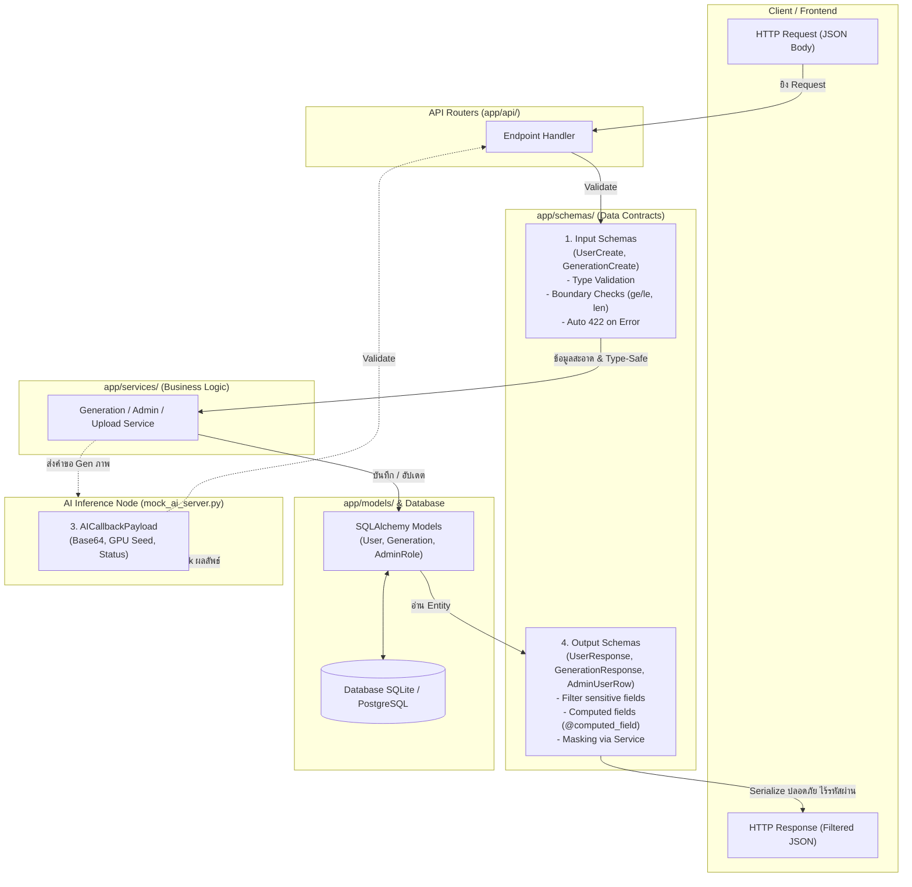
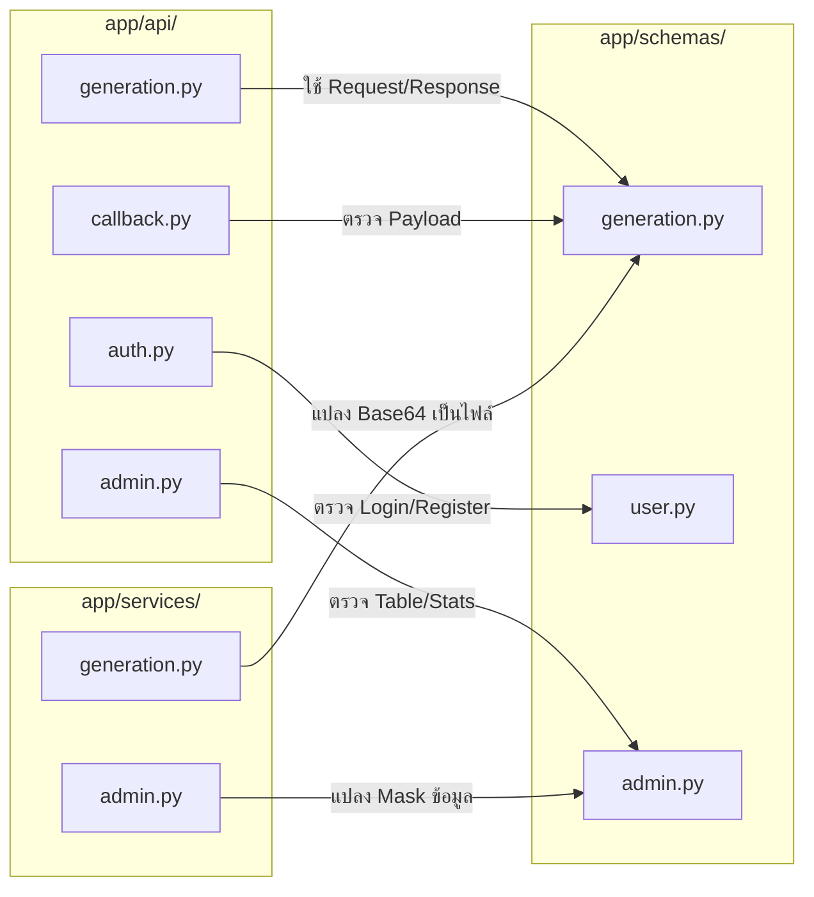

# LUMA Backend — Technical Specification & Deep Dive
## ส่วนที่ 4: Schemas & Data Contracts (`app/schemas/`)

> **วันที่จัดทำ:** 21 กันยายน 2026  
> **หมวดหมู่:** Data Contracts & Schema Validation (Pydantic v2)  
> **เวอร์ชัน:** 1.0.0  
> **ระบบเป้าหมาย:** LUMA Image Generation Backend API (`FastAPI` + `Pydantic v2`)  
> **อ้างอิงเอกสารหลัก:** `BACKEND_ONBOARDING_GUIDE.md` (ส่วนที่ 4)  
> **ไฟล์ที่เกี่ยวข้อง:**  
> - [`app/schemas/generation.py`](file:///Users/pongkarm/CDTI_work/CDTI_work_69/Term_1/Image_Processing/Project/app/schemas/generation.py)  
> - [`app/schemas/user.py`](file:///Users/pongkarm/CDTI_work/CDTI_work_69/Term_1/Image_Processing/Project/app/schemas/user.py)  
> - [`app/schemas/admin.py`](file:///Users/pongkarm/CDTI_work/CDTI_work_69/Term_1/Image_Processing/Project/app/schemas/admin.py)  
> - [`app/schemas/token.py`](file:///Users/pongkarm/CDTI_work/CDTI_work_69/Term_1/Image_Processing/Project/app/schemas/token.py)  

---

## 1. วัตถุประสงค์และขอบเขต (Objectives & Scope)

### 1.1 วัตถุประสงค์ (Objectives)
- อธิบายบทบาทหน้าที่ของ **Pydantic Schemas** ในฐานะ **Data Contract** สัญญาข้อตกลงข้อมูลกลางระหว่าง Frontend, Backend Router, Business Service, Database Layer และ AI Node
- เจาะลึกเหตุผลทางวิศวกรรมซอฟต์แวร์ (Software Engineering Rationale) ว่าทำไมต้องแยก Data Schemas ออกจาก Database ORM Models ใน `app/models/`
- วิเคราะห์สเปกของงานสร้างภาพ (`GenerationCreate`), ผลลัพธ์ (`GenerationResponse`), และข้อมูลสื่อสารย้อนกลับจาก AI Cluster (`AICallbackPayload`)
- อธิบายกลยุทธ์ความปลอดภัยและการปกป้องข้อมูลส่วนบุคคล (Data Privacy & Information Hiding) เช่น การกำจัด `password_hash` ในระดับ Schema, การทำ Data Masking สำหรับ Reviewer และ Role-Based Selective Redaction

### 1.2 ขอบเขต (Scope)
- **In-Scope:**
  - สถาปัตยกรรมการตรวจสอบข้อมูล (Validation Lifecycle) และ Type Coercion ของ Pydantic v2
  - การกำหนดขอบเขตตัวเลขและความยาว (Boundary Guards) เพื่อป้องกันปัญหา GPU Exhaustion / Denial of Service
  - การทำงานของ `from_attributes=True` และ `@computed_field`
  - สเปก Callback ข้อมูลรูปภาพ Base64, Seed, สถานะ และเวลาประมวลผล
  - การแบ่งระดับการเปิดเผยข้อมูลตามสิทธิ์ผู้ใช้ (`AdminMeResponse`, `AdminUserRow`, `AdminRunRow`)
- **Out-of-Scope:**
  - ตรรกะการประมวลผลคิวใน AI Worker (อยู่ใน `mock_ai_server.py` และ ComfyUI)
  - รายละเอียดการสร้างตารางและคอลัมน์ใน SQLAlchemy (อยู่ใน `app/models/`)

---

## 2. สถาปัตยกรรมและการไหลของข้อมูล (Architecture & Data Flow)

Pydantic ทำหน้าที่เป็น **Security & Contract Boundary** ที่หน้าด่านของระบบ ก่อนที่ข้อมูลจะเดินทางเข้าสู่ Business Logic หรือส่งกลับไปยัง Client:



---

## 3. เปรียบเทียบเชิงสถาปัตยกรรม: ทำไมต้องแยก Pydantic Schemas ออกจาก Database Models?

ในระบบ LUMA มีการแยกโฟลเดอร์ระหว่าง `app/models/` (SQLAlchemy) และ `app/schemas/` (Pydantic) อย่างเคร่งครัด ด้วยเหตุผลสำคัญ 4 ประการ:

| มิติการเปรียบเทียบ | Database Models (`app/models/`) | Pydantic Schemas (`app/schemas/`) |
| :--- | :--- | :--- |
| **สถาปัตยกรรมหลัก** | **Persistence Layer** (การจัดเก็บลงฐานข้อมูล) | **Presentation & Contract Layer** (การสื่อสารผ่าน HTTP) |
| **ไลบรารีที่ใช้** | SQLAlchemy ORM (`Base`, `Column`, `relationship`) | Pydantic v2 (`BaseModel`, `Field`, `ConfigDict`) |
| **ความรับผิดชอบ (Responsibility)** | กำหนดโครงสร้างตาราง, Foreign Key, Index, Cascades | ตรวจสอบข้อมูลขาเข้า (Validation), จัดรูปแบบข้อมูลขาออก (Serialization) |
| **ความหลากหลาย (Cardinality)** | **1 ตารางต่อ 1 Model** สะท้อนโครงสร้างจัดเก็บจริง | **1 Entity มีได้หลาย Schemas** ตาม Use Case และสิทธิ์ |
| **การเปิดเผยฟิลด์ (Visibility)** | เก็บข้อมูลครบทุกฟิลด์ (รวม `password_hash`) | เลือกเปิดเผยเฉพาะฟิลด์ที่ปลอดภัยตามบริบท |

### 4 เหตุผลเชิงลึกทางสถาปัตยกรรม:

1. **Information Hiding & Mass Assignment Protection (ความปลอดภัยขั้นสูงสุด):**
   - ตาราง `users` ในฐานข้อมูลจำเป็นต้องมีฟิลด์ `password_hash` เพื่อใช้ตรวจสอบตัวตน แต่ฝั่ง Client จะต้องไม่มีโอกาสเห็นค่านี้เด็ดขาด
   - หากใช้ Model ร่วมกัน Client อาจส่ง JSON ที่มีฟิลด์แอบแฝง เช่น `is_active=false` หรือ `admin_role="owner"` เข้ามาทับค่าในฐานข้อมูล การมี Input Schema (`GenerationCreate`, `UserCreate`) จะสกัดกั้นฟิลด์ที่ไม่ได้รับอนุญาตทิ้งทั้งหมด
2. **One Model, Multiple Perspectives (หนึ่งข้อมูล มีได้หลายมุมมอง):**
   - เอนทิตี `User` เพียงตัวเดียวในฐานข้อมูล ต้องการมุมมองที่แตกต่างกันถึง 4 รูปแบบ:
     - `UserCreate`: รับ `password` ข้อความดิบตอนสมัคร
     - `UserResponse`: ส่งข้อมูลพื้นฐาน ตัด `password_hash` ทิ้ง
     - `UserProfileResponse`: เสริมสถิติ `total_generations` สำหรับแสดงบน Navbar
     - `AdminUserRow`: แสดงสถิติการใช้งาน และ Mask อีเมลสำหรับ Reviewer
3. **Decoupling Database from Public API (การแยกส่วนเพื่อความยืดหยุ่น):**
   - หากในอนาคตต้องการแปลงฐานข้อมูล เช่น เปลี่ยนชื่อคอลัมน์ หรือแยกตาราง Normalization หน้าตา JSON ของ API ที่ Frontend ใช้งานอยู่จะไม่ได้รับผลกระทบใดๆ (No Breaking Changes on Frontend)
4. **Interactive API Documentation & Automated Contract:**
   - Pydantic จะแปลง Type hints และข้อกำหนด `Field()` เป็นเอกสาร OpenAPI (Swagger UI) ที่ `/docs` ทันที พร้อมตัวอย่างข้อมูล ทำให้ทีม Frontend ทำงานต่อได้ทันทีโดยไม่ต้องรอเอกสารแยก

---

## 4. เจาะลึกสเปกใน [`app/schemas/generation.py`](file:///Users/pongkarm/CDTI_work/CDTI_work_69/Term_1/Image_Processing/Project/app/schemas/generation.py)

ไฟล์นี้เป็นแกนกลางในการกำหนดสัญญาคำสั่งสร้างภาพทั้งหมด แบ่งออกเป็น 3 ส่วนสำคัญ:

### 4.1 ตรวจสอบเงื่อนไขก่อนสร้างภาพ (`GenerationCreate` & `GenerationBase`)

คลาส [`GenerationCreate`](file:///Users/pongkarm/CDTI_work/CDTI_work_69/Term_1/Image_Processing/Project/app/schemas/generation.py#L113) สืบทอดมาจาก [`GenerationBase`](file:///Users/pongkarm/CDTI_work/CDTI_work_69/Term_1/Image_Processing/Project/app/schemas/generation.py#L22) ซึ่งกำหนดเงื่อนไขความปลอดภัยและข้อจำกัดของฮาร์ดแวร์ไว้อย่างละเอียด:

```python
class GenerationBase(BaseModel):
    task_type: GenerationTaskType = Field(
        default=GenerationTaskType.TXT2IMG,
        description="ประเภทของงาน (txt2img, img2img, หรือ inpaint)"
    )
    prompt: str = Field(
        ...,
        min_length=1,
        max_length=2000,
        description="ข้อความ Prompt ที่ต้องการให้ AI วาด",
        json_schema_extra={"example": "A cute cat wearing astronaut suit in space, digital art, 8k"}
    )
    negative_prompt: str | None = Field(
        default=None,
        max_length=2000,
        description="สิ่งที่ไม่ต้องการให้มีในภาพ",
        json_schema_extra={"example": "ugly, blurry, low quality"}
    )
    model_name: str = Field(default="sd-v1-5", max_length=100)
    lora_config: Any | None = Field(default=None)
    sampler_name: str = Field(default="Euler a", max_length=50)
    steps: int = Field(default=20, ge=1, le=150)
    cfg_scale: float = Field(default=7.0, ge=0.0, le=30.0)
    seed: int | None = Field(default=None)
    width: int = Field(default=512, ge=64, le=2048)
    height: int = Field(default=512, ge=64, le=2048)
    source_image_path: str | None = Field(default=None, max_length=500)
    mask_image_path: str | None = Field(default=None, max_length=500)
    denoising_strength: float | None = Field(default=None, ge=0.0, le=1.0)
```

#### เงื่อนไขการตรวจสอบที่สำคัญ (Validation Rules):
1. **ป้องกันข้อความล้น (Buffer / DoS Guard):**
   - `prompt`: บังคับต้องมี (`...`), ความยาวระหว่าง 1 ถึง 2,000 อักขระ (`min_length=1, max_length=2000`)
   - `negative_prompt`: ไม่บังคับ แต่ถ้าใส่มาห้ามเกิน 2,000 อักขระ
2. **จำกัดภาระการประมวลผลของ GPU (Resource Exhaustion Defense):**
   - `steps`: บังคับจำนวนเต็มตั้งแต่ **1 ถึง 150** (`ge=1, le=150`) ป้องกันผู้ใช้สั่งรัน 1,000 steps ซึ่งอาจทำให้ GPU ค้าง
   - `width` และ `height`: กำหนดขนาดภาพระหว่าง **64 ถึง 2048 พิกเซล** (`ge=64, le=2048`) ป้องกันปัญหา VRAM Out-of-Memory (OOM)
3. **ควบคุมความถูกต้องทางคณิตศาสตร์ของการคำนวณ:**
   - `cfg_scale`: ทศนิยมระหว่าง **0.0 ถึง 30.0** (`ge=0.0, le=30.0`)
   - `denoising_strength`: ใช้เฉพาะโหมด `img2img` ควบคุมค่าความต่างของภาพเดิม ต้องอยู่ระหว่าง **0.0 ถึง 1.0** (`ge=0.0, le=1.0`)

---

### 4.2 สเปกข้อมูล Callback จาก AI Node ([`AICallbackPayload`](file:///Users/pongkarm/CDTI_work/CDTI_work_69/Term_1/Image_Processing/Project/app/schemas/generation.py#L151-L160))

เมื่อ AI Inference Node ทำงานเสร็จแบบ Asynchronous จะต้องส่ง HTTP POST ย้อนกลับมายัง `/callback/ai-result` ตามโครงสร้างนี้:

```python
class AICallbackPayload(BaseModel):
    task_id: UUID = Field(..., description="ID ประจำ Generation Task")
    status: str = Field(..., description="สถานะจาก AI Server (completed หรือ failed)")
    image_base64: str | None = Field(default=None, description="รูปภาพ Base64")
    error: str | None = Field(default=None, description="ข้อความ Error")
    error_message: str | None = Field(default=None, description="Alias ข้อความ Error")
    generation_time: float | None = Field(default=None, description="เวลาประมวลผล (วินาที)")
    seed: int | None = Field(default=None, description="Seed จริงที่ใช้ในการประมวลผล GPU")
```

- `task_id`: รหัส UUID ประจำงาน เพื่อให้ Backend นำไปค้นหา Record ในฐานข้อมูล
- `status`: บ่งชี้ว่างานสำเร็จ (`completed`) หรือล้มเหลว (`failed`)
- `image_base64`: สตริง Base64 ของไฟล์ภาพ PNG ที่สร้างเสร็จ เพื่อให้ Backend ถอดรหัสและบันทึกลงดิสก์
- `seed`: ค่า Seed ทางสถิติจริงที่ GPU สุ่มขึ้นมา (กรณีคำขอแรกไม่ได้ระบุ seed) เพื่อให้ผู้ใช้สามารถนำค่านี้ไป Reproduce ภาพเดิมซ้ำได้
- `generation_time`: เวลาประมวลผลจริงบนชิป GPU หน่วยเป็นวินาที

---

### 4.3 การส่งผลลัพธ์พร้อม Computed Property ([`GenerationResponse`](file:///Users/pongkarm/CDTI_work/CDTI_work_69/Term_1/Image_Processing/Project/app/schemas/generation.py#L118-L139))

```python
class GenerationResponse(GenerationBase):
    id: UUID
    user_id: UUID
    status: GenerationStatus
    error_message: str | None = None
    duration_seconds: float | None = None
    created_at: datetime
    completed_at: datetime | None = None

    model_config = ConfigDict(from_attributes=True)

    @computed_field
    @property
    def image_url(self) -> str | None:
        if self.status == GenerationStatus.COMPLETED:
            return f"/generations/{self.id}/image"
        return None
```
- **จุดเด่นทางเทคนิค:** ใช้ `@computed_field` ใน Pydantic v2 เพื่อสร้างฟิลด์ `image_url` แบบไดนามิก หากงานเสร็จสิ้น (`COMPLETED`) ระบบจะส่ง URL สำหรับดาวน์โหลดภาพให้โดยอัตโนมัติ โดยที่คอลัมน์นี้ไม่จำเป็นต้องมีอยู่ในฐานข้อมูล

---

## 5. การรักษาความปลอดภัยและการซ่อนข้อมูล (Security & Data Masking)

ระบบของ LUMA วางมาตรการคุ้มครองข้อมูลส่วนบุคคล (PII) และความปลอดภัย 4 ชั้นในระดับ Schema:

### 5.1 ไม่ประกาศฟิลด์ความลับตั้งแต่ระดับ Schema (Information Exclusion by Design)
- **โค้ดใน [`app/schemas/user.py`](file:///Users/pongkarm/CDTI_work/CDTI_work_69/Term_1/Image_Processing/Project/app/schemas/user.py):**
  ```python
  class UserResponse(BaseModel):
      id: UUID
      username: str
      email: str
      is_active: bool
      created_at: datetime

      model_config = ConfigDict(from_attributes=True)
  ```
  - โมเดล Database `User` ใน [`app/models/__init__.py`](file:///Users/pongkarm/CDTI_work/CDTI_work_69/Term_1/Image_Processing/Project/app/models/__init__.py#L31) มีคอลัมน์ `password_hash` แต่ใน `UserResponse` และ `UserProfileResponse` **ไม่มีฟิลด์นี้อยู่เลย**
  - ด้วยกลไก `from_attributes=True` Pydantic จะหยิบเฉพาะคอลัมน์ที่ตรงกับ Schema เท่านั้น ข้อมูล `password_hash` จึงไม่มีทางหลุดออกไปทาง API
- **โค้ดใน [`app/schemas/admin.py`](file:///Users/pongkarm/CDTI_work/CDTI_work_69/Term_1/Image_Processing/Project/app/schemas/admin.py#L65-L80):**
  - แม้จะเป็นแผงควบคุมของแอดมิน (`AdminUserRow`) ซอร์สโค้ดระบุเจตนาไว้ชัดเจน:
    > *"หนึ่งแถวในตารางผู้ใช้ — ไม่มี password_hash อยู่ใน schema เลย ไม่ใช่กรองออกทีหลัง"*
  - ตัดความเสี่ยงเรื่อง Human Error ที่อาจลืมเขียนคำสั่งตัดข้อมูลก่อนส่ง Response

---

### 5.2 การพรางข้อมูลอีเมลสำหรับ Reviewer (Data Masking)
ในระดับแอดมิน ผู้ใช้ที่มีสิทธิ์ระดับ `REVIEWER` (สิทธิ์ต่ำกว่า `ADMIN`) ไม่ควรเห็นอีเมลเต็มของผู้ใช้งาน เพื่อปฏิบัติตามมาตรฐาน PDPA/GDPR:

1. **สเปกใน Schema ([`app/schemas/admin.py`](file:///Users/pongkarm/CDTI_work/CDTI_work_69/Term_1/Image_Processing/Project/app/schemas/admin.py#L70)):**
   ```python
   class AdminUserRow(BaseModel):
       ...
       email: str = Field(description="ถูกปิดบังบางส่วนสำหรับ reviewer")
   ```
2. **ฟังก์ชันแปลงข้อมูลใน Service ([`app/services/admin.py`](file:///Users/pongkarm/CDTI_work/CDTI_work_69/Term_1/Image_Processing/Project/app/services/admin.py#L21-L27)):**
   ```python
   def mask_email(email: str) -> str:
       """a•••@example.com — พอให้จำได้ว่าใคร แต่ไม่ใช่ข้อมูลที่เอาไปใช้ต่อได้"""
       name, _, domain = email.partition("@")
       if not domain:
           return "•••"
       head = name[:1] if name else ""
       return f"{head}•••@{domain}"
   ```
3. **การคัดกรองใน Router ([`app/api/admin.py`](file:///Users/pongkarm/CDTI_work/CDTI_work_69/Term_1/Image_Processing/Project/app/api/admin.py#L41-L50)):**
   ```python
   def _redact(rows: list[dict], role: Role, *, is_run: bool) -> list[dict]:
       if role >= Role.ADMIN:
           return rows
       for r in rows:
           if is_run:
               r["prompt"] = None
           else:
               r["email"] = svc.mask_email(r["email"])
       return rows
   ```
   - ก่อนส่งข้อมูลให้ `AdminUserRow` ตัวกรอง `_redact()` จะตรวจสอบสิทธิ์ของผู้เรียก หากเป็น `REVIEWER` อีเมลจะถูกแปลงเป็น `u•••@domain.com` ทันที

---

### 5.3 การซ่อน Prompt ตามระดับสิทธิ์ (Role-Based Privacy Redaction)
- ใน [`AdminRunRow`](file:///Users/pongkarm/CDTI_work/CDTI_work_69/Term_1/Image_Processing/Project/app/schemas/admin.py#L103):
  ```python
  prompt: str | None = Field(default=None, description="ซ่อนจาก reviewer")
  ```
  - เพื่อรักษาความเป็นส่วนตัวของผู้ใช้งานทั่วไป ข้อความ Prompt จะถูกซ่อนเป็น `None` เมื่อผู้ตรวจสอบเป็นเพียง `Reviewer` แต่สำหรับผู้ดูแลระดับ `Admin` หรือ `Owner` จะยังคงตรวจสอบ Prompt ได้เมื่อจำเป็นต้องสืบสวนปัญหาระบบ

---

### 5.4 การบังคับยืนยันตัวตนใน Schema แก้ไขข้อมูล ([`UserUpdate`](file:///Users/pongkarm/CDTI_work/CDTI_work_69/Term_1/Image_Processing/Project/app/schemas/user.py#L35-L46))
```python
class UserUpdate(BaseModel):
    current_password: str = Field(..., min_length=1)
    username: str | None = Field(default=None, min_length=3, max_length=50)
    email: EmailStr | None = None
    new_password: str | None = Field(default=None, min_length=8)
```
- บังคับให้ `current_password` ต้องส่งมาเสมอ (`...`) แม้ผู้ใช้ต้องการเปลี่ยนเพียงชื่อหรืออีเมล
- **เป้าหมายความปลอดภัย:** ป้องกันกรณี Access Token หลุดไปยังผู้ไม่ประสงค์ดี ผู้โจมตีจะไม่สามารถสวมสิทธิ์เปลี่ยนอีเมล/รหัสผ่านเพื่อยึดบัญชี (Account Takeover) ได้ หากไม่รู้รหัสผ่านเดิม

---

## 6. สรุปความเชื่อมโยงกับโมดูลอื่น (Cross-Module Integration)



- **เชื่อมโยงกับ `app/api/`:** ทำหน้าที่เป็นตัวแปร Type Hint ใน Endpoint parameters และ `response_model`
- **เชื่อมโยงกับ `app/services/`:** ทำหน้าที่เป็น Clean DTO (Data Transfer Object) ให้ฟังก์ชันใน Service หยิบพารามิเตอร์ไปประมวลผลต่อได้โดยไม่ต้องกังวลเรื่อง Data Type ผิดพลาด
- **เชื่อมโยงกับ `app/models/`:** แมปปิ้งข้อมูลจาก ORM เป็น JSON ขาออกผ่านการตั้งค่า `from_attributes=True`

---

> **เอกสารอ้างอิงลำดับถัดไป:**  
> - สำหรับรายละเอียดการทำงานของ Endpoints ให้ดูที่: **ส่วนที่ 5: API Routers (`app/api/`)**  
> - สำหรับตรรกะเบื้องหลังการส่งงานไป AI และการบันทึกภาพ ให้ดูที่: **ส่วนที่ 6: Business Logic & Services (`app/services/`)**
