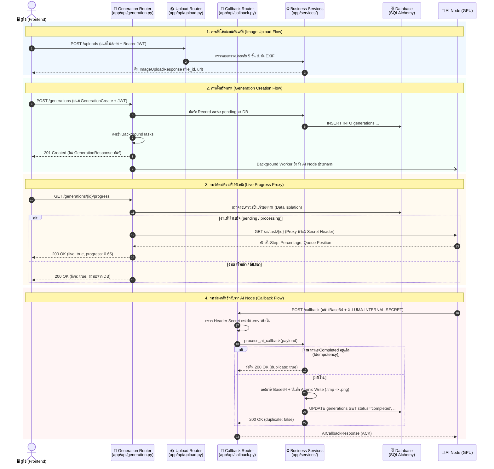

# LUMA Backend — Technical Specification & Deep Dive
## ส่วนที่ 5: API Routers (`app/api/`) — Generation, Callback & Uploads

> **วันที่จัดทำ:** 21 กันยายน 2026  
> **โมดูล:** `app/api/` (Endpoint Handlers & Request Controllers)  
> **ระบบเป้าหมาย:** LUMA Backend (FastAPI + Pydantic v2 + SQLAlchemy)  
> **ไฟล์ที่เกี่ยวข้อง:** `app/api/generation.py`, `app/api/callback.py`, `app/api/upload.py`  
> **อ้างอิงเอกสารหลัก:** `BACKEND_ONBOARDING_GUIDE.md` (ส่วนที่ 5)

---

## 1. วัตถุประสงค์และขอบเขต (Objectives & Scope)

### 1.1 วัตถุประสงค์หลัก
โมดูล API Routers ทำหน้าที่เป็น **Front Door Controllers** ของระบบ คอยรับ HTTP Requests จากผู้ใช้งานและระบบภายนอก ดำเนินการตรวจสอบสิทธิ์ความปลอดภัย ตรวจสอบความถูกต้องของข้อมูล (Validation) และส่งต่องานไปยังชั้น Business Logic (Services) รวมถึงการควบคุมการตอบกลับ (HTTP Status & Response Formatting)

### 1.2 ขอบเขตการทำงาน (In-Scope)
- **ระบบสั่งงานสร้างภาพ (`app/api/generation.py`):**
  - จัดการสร้างงาน (`POST /generations`) และกระจายงานเข้า Background Task แบบ Non-blocking
  - ตรวจสอบสถานะงานและประวัติของผู้ใช้พร้อมระบบ Data Isolation (ป้องกันไม่ให้ผู้ใช้เห็นงานของคนอื่น)
  - รายงานสถานะสดและลำดับคิวประมวลผลผ่าน Proxy ไปยัง AI Node (`GET /{id}/progress`)
  - ยกเลิกงานที่กำลังประมวลผล (`POST /{id}/cancel`) และการดาวน์โหลดไฟล์ภาพ
- **ระบบรับผลลัพธ์จาก AI Node (`app/api/callback.py`):**
  - ตรวจสอบความปลอดภัยด้วย Secret Header (`X-LUMA-INTERNAL-SECRET`)
  - ป้องกันการประมวลผลซ้ำซ้อนด้วยกลไก Idempotency
  - ประมวลผลภาพ Base64 และบันทึกลงดิสก์แบบ Atomic Write
- **ระบบอัปโหลดรูปภาพ (`app/api/upload.py`):**
  - รับภาพต้นฉบับสำหรับโหมด `img2img` และ `inpaint`
  - ตรวจสอบสิทธิ์ผู้ใช้และกรองไฟล์ภาพด้วยมาตรการความปลอดภัย 5 ชั้น (Magic Bytes, Decompression Bomb, EXIF Stripping)

### 1.3 นอกขอบเขต (Out-of-Scope)
- การจัดการสิทธิ์ระดับแอดมินและการตรวจสอบ Audit Log (อยู่ใน `app/api/admin.py`)
- ตรรกะการคำนวณ GPU ภายในโมเดล Stable Diffusion (อยู่ใน AI Node / `mock_ai_server.py`)

---

## 2. แผนผังสถาปัตยกรรมการไหลของข้อมูล (Request & Data Flow Architecture)



---

## 3. เจาะลึกการทำงานทีละ Endpoint (Endpoint Deep Dive)

---

### 3.1 [`app/api/generation.py`](file:///Users/pongkarm/CDTI_work/CDTI_work_69/Term_1/Image_Processing/Project/app/api/generation.py) (ระบบจัดการงานสร้างภาพ)

#### 1) `POST /generations` — สั่งสร้างภาพใหม่
* **จุดประสงค์:** รับคำสั่งสร้างภาพ บันทึกงานเป็น `pending` และปล่อยให้ Background Task ทำงานกับ GPU Node ต่อโดยไม่บล็อกผู้ใช้
* **การรับค่า (Input):**
  * `data: GenerationCreate`: ข้อมูลพารามิเตอร์ (Prompt, Steps, CFG, Model, Task Type ฯลฯ)
  * `background_tasks: BackgroundTasks`: เครื่องมือจัดการ Async Background Execution
  * `db: Session = Depends(get_db)`: SQLAlchemy Database Session
  * `current_user: User = Depends(get_current_user)`: บัญชีผู้ใช้ที่ส่งคำขอ
* **การตรวจสอบสิทธิ์ (Authentication):**
  * บังคับยืนยันตัวตนด้วย Bearer JWT Token ผ่าน `get_current_user` หากไม่ถูกต้องจะตัดสิทธิ์ด้วย `401 Unauthorized`
* **ตรรกะการทำงาน (Logic Flow):**
  ```python
  new_job = generation_service.create_generation_job(db=db, user_id=current_user.id, data=data)
  background_tasks.add_task(generation_service.process_generation_task, generation_id=new_job.id)
  return GenerationResponse.model_validate(new_job)
  ```
  1. สร้างแถวข้อมูลใหม่ในตาราง `generations` ผูกกับ `current_user.id` สถานะเริ่มต้นคือ `pending`
  2. ส่งฟังก์ชัน `process_generation_task` ไปรันเบื้องหลังเพื่อสื่อสารกับ AI Server
* **ส่งอะไรกลับ (Output):**
  * HTTP `201 Created`
  * Body: `GenerationResponse` ที่มี `id`, `status: "pending"`, และพารามิเตอร์ทั้งหมด

---

#### 2) `GET /generations/{generation_id}` — ตรวจสอบสถานะงานเดี่ยว
* **จุดประสงค์:** เรียกดูสถานะงาน พารามิเตอร์ และ URL รูปภาพเมื่อประมวลผลเสร็จ
* **การรับค่า (Input):**
  * `generation_id: UUID`: รหัสประจำงาน
* **การตรวจสอบสิทธิ์ & Data Isolation:**
  * ตรวจสอบ JWT Token และบังคับค้นหาแบบมีเงื่อนไขเจ้าของงาน:
    ```python
    generation = generation_service.get_generation_by_id(
        db=db, user_id=current_user.id, generation_id=generation_id
    )
    ```
  * หากไม่มีงานนี้ หรือผู้ใช้คนอื่นพยายามเปิดดู ระบบจะส่งคืน `404 Not Found` เสมอ เพื่อไม่ให้ผู้โจมตีทราบว่ามี ID นี้อยู่ในระบบหรือไม่
* **การทำงานพิเศษ (Auto-fail on Timeout):**
  * ฟังก์ชัน Service จะตรวจสอบว่าหากงานอยู่ในสถานะ `pending` หรือ `processing` เกิน 5 นาทีโดยไม่มีการตอบสนอง ระบบจะปรับเป็น `failed` อัตโนมัติ เพื่อป้องกันงานค้างในระบบ
* **ส่งอะไรกลับ (Output):**
  * HTTP `200 OK`
  * Body: `GenerationResponse` (หากสถานะเป็น `completed` จะมีฟิลด์ `image_url` แนบมาด้วย)

---

#### 3) `GET /generations/{generation_id}/progress` — ดู Live Progress และคิวประมวลผล
* **จุดประสงค์:** หน้าบ้านใช้ Polling ดูเปอร์เซ็นต์ความคืบหน้าของ GPU และตำแหน่งคิว
* **การรับค่า (Input):**
  * `generation_id: UUID`
* **การทำงานแบบ Reverse Proxy:**
  1. ตรวจสอบสิทธิ์ความเป็นเจ้าของงานผ่าน DB
  2. หากงานเสร็จสิ้นหรือล้มเหลวไปแล้ว จะคืนข้อมูลจากฐานข้อมูลทันที ไม่ยิงรบกวน AI Node
  3. หากงานยังอยู่ระหว่างประมวลผล Backend จะทำหน้าที่เป็น **Proxy** ยิงต่อไปยัง AI Node (`GET /ai/task/{id}`) พร้อมแนบ Header `X-LUMA-INTERNAL-SECRET`
  4. หาก AI Node ตอบกลับ จะส่งคืนข้อมูล `progress`, `step`, `total_steps`, `queue_position` พร้อมระบุ `live: true`
  5. **Graceful Fallback:** หากเชื่อมต่อ AI Node ไม่ได้ จะส่งคืนสถานะจาก DB พร้อมคำนวณเวลา `elapsed` และระบุ `live: false` ป้องกันไม่ให้หน้าบ้านแครช
* **ส่งอะไรกลับ (Output):**
  * HTTP `200 OK`
  * Body: `GenerationProgressResponse`

---

#### 4) `POST /generations/{generation_id}/cancel` — ขอยกเลิกงานสร้างภาพ
* **จุดประสงค์:** ยกเลิกงานที่กำลังรอคิวหรือกำลังรันอยู่บน GPU
* **การรับค่า (Input):**
  * `generation_id: UUID`
* **ตรรกะการตรวจสอบและยกเลิก:**
  1. ตรวจสอบสิทธิ์ความเป็นเจ้าของงาน
  2. หากงานมีสถานะ `completed` แล้ว ระบบจะปฏิเสธด้วย `409 Conflict` (ไม่สามารถยกเลิกงานที่เสร็จแล้วได้)
  3. หากงานยังรันอยู่ Backend จะส่งคำขอ `DELETE /ai/task/{generation_id}` ไปยัง AI Node เพื่อสั่งหยุดการคำนวณ GPU ทันที
  4. อัปเดตสถานะใน DB เป็น `failed` ระบุ `error_message = 'Cancelled by user'` บันทึกเวลา `completed_at`
* **ส่งอะไรกลับ (Output):**
  * HTTP `200 OK`
  * Body: `GenerationResponse` ที่มีสถานะเป็น `failed`

---

#### 5) `GET /generations/{generation_id}/image` — ดาวน์โหลดไฟล์ภาพผลลัพธ์
* **จุดประสงค์:** บริการส่งไฟล์ภาพไบนารีให้แก่เบราว์เซอร์
* **การตรวจสอบความปลอดภัย:**
  * ตรวจสอบสิทธิ์เจ้าของงาน
  * ตรวจสอบ Magic Bytes ของไฟล์บนดิสก์ผ่าน `_detect_media_type` เพื่อส่ง Header `Content-Type` ที่ถูกต้อง (`image/png`, `image/jpeg`, `image/webp`)
* **ส่งอะไรกลับ (Output):**
  * HTTP `200 OK` พร้อม `FileResponse` ของรูปภาพ

---

### 3.2 [`app/api/callback.py`](file:///Users/pongkarm/CDTI_work/CDTI_work_69/Term_1/Image_Processing/Project/app/api/callback.py) (ระบบรับผลลัพธ์จาก AI Server)

Endpoint คือ `POST /callback` และ `POST /api/callback` สำหรับรับผลลัพธ์แบบ Webhook เมื่อ GPU ประมวลผลเสร็จสิ้น:

#### 1) การตรวจ Security Header (`verify_callback_secret`)
```python
def verify_callback_secret(
    x_luma_internal_secret: Optional[str] = Header(None, alias="X-LUMA-INTERNAL-SECRET")
):
    expected_secret = settings.AI_CALLBACK_SECRET
    if not expected_secret:
        return
    if not x_luma_internal_secret or x_luma_internal_secret != expected_secret:
        logger.warning("Rejected callback with invalid or missing X-LUMA-INTERNAL-SECRET")
        raise HTTPException(
            status_code=status.HTTP_403_FORBIDDEN,
            detail="Invalid or missing X-LUMA-INTERNAL-SECRET header"
        )
```
- **เหตุผลความปลอดภัย:** ป้องกันไม่ให้ผู้ใช้ภายนอกหรือ Hacker ยิงข้อมูล Base64 ปลอมเข้ามาแอบอ้างว่างานเสร็จสิ้น มีเพียง AI Server ที่รู้ค่า Shared Secret เท่านั้นที่ส่งข้อมูลได้

#### 2) กลไกป้องกัน Callback ซ้ำซ้อน (Idempotency Guard)
ในสถาปัตยกรรมกระจายศูนย์ เมื่อเครือข่ายมีปัญหา AI Server อาจยิง Webhook ซ้ำ (Retry) ฟังก์ชัน `process_ai_callback` จัดการดังนี้:
```python
if generation.status == GenerationStatus.COMPLETED.value:
    logger.info(f"Duplicate callback ignored for completed task | id={payload.task_id}")
    return 200, AICallbackResponse(
        received=True,
        task_id=payload.task_id,
        status=generation.status,
        duplicate=True,
        message="Task already completed"
    )
```
- หากพบว่างวดก่อนหน้าประมวลผลจนเป็น `completed` ไปแล้ว ระบบจะตอบกลับ `200 OK` ทันทีพร้อมแฟล็ก `duplicate: True` **โดยไม่มีการเขียนไฟล์ทับ หรือคำนวณ Base64 ซ้ำ**

#### 3) การบันทึกไฟล์ภาพแบบ Atomic Write
```python
temp_path = file_path.with_suffix(".tmp")
temp_path.write_bytes(image_data)
temp_path.replace(file_path)
```
- เขียนข้อมูลลงไฟล์ `.tmp` ก่อนจนเสร็จสมบูรณ์ แล้วใช้ OS-level Atomic Operation (`os.replace`) สลับชื่อไฟล์เป็นชื่อจริง เพื่อป้องกันไม่ให้ผู้ใช้ดาวน์โหลดไฟล์ภาพที่เขียนค้างอยู่ครึ่งๆ กลางๆ (Partial Read)

---

### 3.3 [`app/api/upload.py`](file:///Users/pongkarm/CDTI_work/CDTI_work_69/Term_1/Image_Processing/Project/app/api/upload.py) (ระบบอัปโหลดรูปภาพต้นฉบับ)

Endpoint คือ `POST /uploads` และ `POST /generations/upload` สำหรับผู้ใช้ที่ต้องการใช้งานฟีเจอร์ **Image-to-Image** หรือ **Inpainting**:

#### 1) การรับไฟล์และการตรวจสอบตัวตน
- รับไฟล์ภาพผ่าน `UploadFile = File(...)` (Multipart Form-Data)
- ตรวจสอบ JWT Bearer Token ผ่าน `current_user = Depends(get_current_user)` บันทึก Audit Log ว่าผู้ใช้รายใดเป็นคนอัปโหลด

#### 2) ระบบคัดกรองความปลอดภัย 5 ชั้น ([`save_uploaded_image`](file:///Users/pongkarm/CDTI_work/CDTI_work_69/Term_1/Image_Processing/Project/app/services/upload.py#L58-L168))
1. **ชั้นที่ 1 (MIME Type Check):** ตรวจ `file.content_type` ต้องเป็น `image/jpeg`, `image/png`, หรือ `image/webp` หากไม่ใช่ คืน `415 Unsupported Media Type`
2. **ชั้นที่ 2 (File Size Limit):** ตรวจขนาดไบนารีจริง ต้องไม่ว่างเปล่าและไม่เกิน 10 MB (`settings.MAX_UPLOAD_SIZE_BYTES`) หากเกิน คืน `413 Request Entity Too Large`
3. **ชั้นที่ 3 (Magic Bytes Validation):** สแกนไบต์เริ่มต้นของไฟล์จริงด้วย `validate_magic_bytes`:
   - PNG: `89 50 4E 47 0D 0A 1A 0A`
   - JPEG: `FF D8 FF`
   - WEBP: `RIFF....WEBP`
   *หาก Header ไม่ตรง แม้จะเปลี่ยนนามสกุลมาเป็น .png ระบบจะปฏิเสธด้วย `422 Unprocessable Entity`*
4. **ชั้นที่ 4 (Decompression Bomb & Dimension Boundary):**
   - โหลดภาพผ่าน Pillow พร้อมตั้ง `Image.MAX_IMAGE_PIXELS = 4096 * 4096` ป้องกันการโจมตีแบบ Memory Exhaustion
   - ตรวจสอบขนาดความกว้างและความสูงต้องไม่เกิน 4096 พิกเซล
5. **ชั้นที่ 5 (Privacy Strip & Atomic Storage):**
   - ถอดรหัสและบันทึกรูปใหม่ผ่าน Buffer เพื่อ **ตัด Metadata และข้อมูลส่วนบุคคล EXIF (พิกัด GPS, รุ่นกล้อง) ทิ้งทั้งหมด**
   - สุ่มตั้งชื่อไฟล์ใหม่ด้วย `UUIDv4` เพื่อป้องกันช่องโหว่ Path Traversal
   - บันทึกไฟล์แบบ Atomic Write ในโฟลเดอร์ `uploads/`

#### 3) ข้อมูลตอบกลับ (`ImageUploadResponse`)
ส่งคืน URL สำหรับอ้างอิง และข้อมูลมิติภาพเพื่อให้หน้าบ้านนำไปเรนเดอร์ Preview และส่งต่อเป็น `source_image_path` ในการสั่งสร้างภาพ:
```json
{
  "file_id": "9b1deb4d-3b7d-4bad-9bdd-2b0d7b3dcb6d",
  "filename": "9b1deb4d-3b7d-4bad-9bdd-2b0d7b3dcb6d.png",
  "url": "/uploads/9b1deb4d-3b7d-4bad-9bdd-2b0d7b3dcb6d.png",
  "width": 1024,
  "height": 1024,
  "size_bytes": 1048576,
  "format": "PNG"
}
```

---

## 4. ตารางสรุป API Specification Matrix

| Method | Path | การยืนยันสิทธิ์ / Header | Request Body / Params | Response Model | HTTP Status | วัตถุประสงค์ |
| :--- | :--- | :--- | :--- | :--- | :--- | :--- |
| **POST** | `/generations` | Bearer JWT | `GenerationCreate` (JSON) | `GenerationResponse` | `201 Created` | สร้างคิวงานใหม่และสั่งรันเบื้องหลัง |
| **GET** | `/generations` | Bearer JWT | Query: `page`, `page_size` | `GenerationListResponse` | `200 OK` | ดึงประวัติงานสร้างภาพของตนเอง |
| **GET** | `/generations/{id}` | Bearer JWT (Owner Check) | Path: `id` (UUID) | `GenerationResponse` | `200 OK` | ดูสถานะงานเดี่ยวและ URL รูปภาพ |
| **GET** | `/generations/{id}/progress` | Bearer JWT (Owner Check) | Path: `id` (UUID) | `GenerationProgressResponse` | `200 OK` | Proxy ดู Step สดและคิวประมวลผล |
| **POST** | `/generations/{id}/cancel` | Bearer JWT (Owner Check) | Path: `id` (UUID) | `GenerationResponse` | `200 OK` | ยกเลิกงานและส่งคำสั่งระงับ GPU |
| **GET** | `/generations/{id}/image` | Bearer JWT (Owner Check) | Path: `id` (UUID) | Binary Stream (FileResponse) | `200 OK` | ดาวน์โหลดไฟล์ภาพที่เสร็จแล้ว |
| **DELETE**| `/generations/{id}` | Bearer JWT (Owner Check) | Path: `id` (UUID) | None | `204 No Content` | ลบประวัติงานและลบไฟล์ภาพบนดิสก์ |
| **POST** | `/callback` | `X-LUMA-INTERNAL-SECRET` | `AICallbackPayload` (JSON) | `AICallbackResponse` | `200 OK` | AI Node ส่งผลลัพธ์ภาพ Base64 กลับ |
| **POST** | `/uploads` | Bearer JWT | Multipart: `file` | `ImageUploadResponse` | `201 Created` | อัปโหลดรูปภาพต้นฉบับสำหรับ img2img |
| **GET** | `/uploads/{filename}` | Bearer JWT | Path: `filename` | Binary Stream (FileResponse) | `200 OK` | ดึงดูภาพที่อัปโหลดไว้ (Cache 24 ชม.) |

---

## 5. จุดเด่นด้านความปลอดภัยและเสถียรภาพ (Security & Reliability Highlights)

1. **Strict Data Isolation:**
   - ผู้ใช้ไม่สามารถคาดเดาหรือเข้าถึงข้อมูลงานหรือดาวน์โหลดภาพของผู้ใช้อื่นได้ เนื่องจากมีการตรวจสอบ `Generation.user_id == current_user.id` ทุกครั้ง และตอบกลับด้วย `404 Not Found` เสมอ
2. **Reverse Proxy Masking:**
   - การดึงความคืบหน้าผ่าน `/generations/{id}/progress` ช่วยซ่อน AI GPU Node ไม่ให้เปิดพอร์ตสู่สาธารณะโดยตรง และควบคุมปริมาณ Request ได้ที่ฝั่ง Backend
3. **Idempotent Webhook Processing:**
   - ป้องกันสภาวะ Race Condition และการบันทึกไฟล์ซ้ำซ้อนจาก Webhook Retries ของ AI Node
4. **Zero-Trust Upload Validation:**
   - ไม่เชื่อถือ Content-Type หรือนามสกุลไฟล์ที่ Client ส่งมา แต่บังคับตรวจ Magic Bytes และเปิดอ่านโครงสร้างไฟล์จริงด้วย Pillow เพื่อป้องกัน Shellcode และ Decompression Bomb
