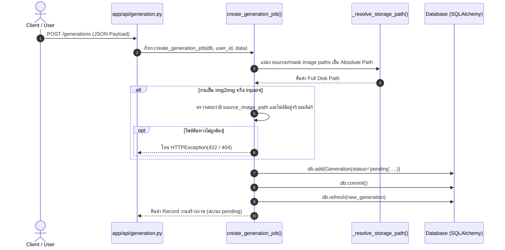
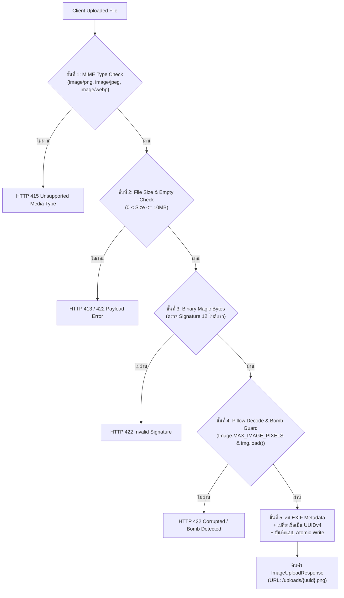

# LUMA Backend — Technical Specification & Deep Dive
## ส่วนที่ 6: Business Logic & Services (`app/services/`)

> **วันที่จัดทำ:** 21 กันยายน 2026  
> **โมดูล:** `app/services/` (Business Logic, AI Dispatcher, Image Storage & File Security)  
> **ระบบเป้าหมาย:** LUMA Backend (FastAPI + SQLAlchemy + HTTPX + Pillow)  
> **ไฟล์ที่เกี่ยวข้อง:** `app/services/generation.py`, `app/services/upload.py`, `app/services/admin.py`  
> **อ้างอิงเอกสารหลัก:** `BACKEND_ONBOARDING_GUIDE.md` (ส่วนที่ 6)

---

## 1. วัตถุประสงค์และขอบเขต (Objectives & Scope)

### 1.1 วัตถุประสงค์ (Objectives)
- แยก **Core Business Logic** ออกจาก API Router (Controller) อย่างเด็ดขาด เพื่อความง่ายในการบำรุงรักษาและการทดสอบแบบแยกส่วน (Unit/Integration Tests)
- ควบคุมวงจรชีวิตของงานสร้างภาพ (Generation Lifecycle) ตั้งแต่การรับ Request, ตรวจสอบความถูกต้อง, สร้างคิวงานในฐานข้อมูล, สื่อสารกับ Node AI ภายนอก ไปจนถึงการรับผลลัพธ์
- ควบคุมมาตรฐานความปลอดภัยสูงสุดในการรับไฟล์เข้าสู่เซิร์ฟเวอร์ (Image Upload Pipeline) เพื่อป้องกัน Malicious Executables, Polyglot Shells, Image Bombs และการรั่วไหลของข้อมูลส่วนบุคคล (EXIF/GPS)
- วางกลไกการเขียนไฟล์แบบ **Atomic Write** และการจัดเก็บไฟล์แยกโฟลเดอร์ตามผู้ใช้ (Data Isolation) ป้องกันการชนกันของไฟล์และปัญหา Race Condition

### 1.2 ขอบเขต (Scope)
- **In-Scope:**
  - การทำงานของ `create_generation_job` ในการจัดเตรียมข้อมูลและสร้าง Record เริ่มต้นสถานะ `pending`
  - การเปรียบเทียบสถาปัตยกรรม **Callback Mode** (Asynchronous Webhook) กับ **Direct Mode** (Synchronous Blocking) ใน `process_generation_task`
  - กลไกการถอดรหัส Base64 อย่างปลอดภัย, การตรวจจับนามสกุลไฟล์จาก Magic Bytes และการเขียนไฟล์ภาพแบบ Atomic Write
  - ระบบคัดกรองความปลอดภัยไฟล์อัปโหลด 5 ชั้น (5-Layer Upload Security Pipeline) ใน `save_uploaded_image`
  - ตรรกะ **Server Timeout Auto-fail 5 นาที** (`_check_and_apply_timeout`) พร้อมแนวคิดการประเมินแบบ Passive/Lazy Evaluation
  - หน้าที่ของ `app/services/admin.py` ในการจัดการสถิติ, บัญชีผู้ใช้ และ Audit Trail
- **Out-of-Scope:**
  - รายละเอียดระดับลึกของ Diffusion Model หรือโครงสร้าง Graph ภายใน ComfyUI (จัดการแยกใน Node 7: AI Inference)

---

## 2. แผนผังสถาปัตยกรรมและ Data Flow (Services Architecture)

```mermaid
flowchart TD
    subgraph ClientLayer ["🖥️ หน้าบ้าน (Client / Frontend)"]
        ClientReq["POST /generations<br/>(Prompt, Model, Steps)"]
        UploadReq["POST /uploads<br/>(Multipart Form File)"]
        PollReq["GET /generations/{id}<br/>(Polling Status)"]
    end

    subgraph ServiceLayer ["⚙️ app/services/ (Business Logic Core)"]
        direction TB
        
        subgraph UploadService ["app/services/upload.py"]
            L1["1. MIME Type Check"]
            L2["2. Size Limit (10MB)"]
            L3["3. Magic Bytes Verify"]
            L4["4. Pillow Decode & Bomb Guard"]
            L5["5. EXIF Strip & UUID Atomic Save"]
            L1 --> L2 --> L3 --> L4 --> L5
        end

        subgraph GenService ["app/services/generation.py"]
            CreateJob["create_generation_job()<br/>- Resolve paths<br/>- DB Insert (pending)"]
            Dispatcher["process_generation_task()<br/>(Background Task)"]
            DirectMode["⚡ Direct Mode<br/>(Wait 180s & Decode Image)"]
            CallbackMode["🔄 Callback Mode<br/>(Fire & Forget + Webhook URL)"]
            CallbackReceiver["process_ai_callback()<br/>(Idempotent Receiver)"]
            TimeoutGuard["_check_and_apply_timeout()<br/>(Passive Fail > 300s)"]
        end
    end

    subgraph StorageLayer ["💾 Local Storage & Database"]
        DB[(Database: generations / users)]
        UploadsDir["uploads/{uuid}.png"]
        OutputsDir["outputs/{user_id}/{gen_id}.png"]
    end

    subgraph AINode ["🤖 AI Inference Cluster (Port 8001 / GPU)"]
        AIWorker["ComfyUI / Mock AI Server"]
    end

    %% Upload Flow
    UploadReq --> UploadService
    L5 -->|Save Image| UploadsDir

    %% Create Job Flow
    ClientReq --> CreateJob
    CreateJob -->|1. Insert Pending| DB
    CreateJob -->|2. Enqueue Task| Dispatcher

    %% AI Dispatching
    Dispatcher -->|Mode = Direct| DirectMode
    Dispatcher -->|Mode = Callback| CallbackMode
    DirectMode -->|HTTP POST (Block)| AIWorker
    CallbackMode -->|HTTP POST (Async Task)| AIWorker
    AIWorker -.->|Webhook POST /callback/ai-result| CallbackReceiver

    %% Storage & State Updates
    DirectMode -->|Atomic Write| OutputsDir
    DirectMode -->|Update Completed| DB
    CallbackReceiver -->|Atomic Write| OutputsDir
    CallbackReceiver -->|Update Completed| DB

    %% Polling & Timeout
    PollReq --> TimeoutGuard
    TimeoutGuard -->|If delta > 300s| DB
```

---

## 3. เจาะลึกการทำงานของ `app/services/generation.py` (Prompt 6.1 & 6.3)

### 3.1 การสร้างและบันทึกงานลงฐานข้อมูล (`create_generation_job`)

ฟังก์ชัน `create_generation_job(db: Session, user_id: UUID, data: GenerationCreate) -> Generation` ทำหน้าที่สร้างคำขอสร้างภาพใหม่เข้าสู่ระบบ มีขั้นตอนทำงานดังนี้:



1. **Path Resolution (`_resolve_storage_path`):**  
   แปลง URL สัมพัทธ์ เช่น `/uploads/550e8400.png` หรือชื่อไฟล์ ให้เป็น Absolute Path บนระบบไฟล์จริง (`/path/to/uploads/550e8400.png`)
2. **Business Rule Validation:**  
   ตรวจสอบเงื่อนไขเฉพาะของโมเดล หาก `task_type` คือ `img2img` หรือ `inpaint` ตัวแปร `source_image_path` ต้องไม่ว่างเปล่า และไฟล์ภาพต้องปรากฏอยู่บนเซิร์ฟเวอร์จริง หากไม่พบจะโยนข้อผิดพลาด `HTTP 422 Unprocessable Entity` หรือ `HTTP 404 Not Found` ทันที
3. **Database Insertion:**  
   สร้างออบเจกต์โมเดล `Generation` พร้อมสุ่ม `id = uuid.uuid4()` กำหนดค่าสถานะเริ่มต้นเป็น `pending` และผูกพารามิเตอร์ครบถ้วน (`prompt`, `negative_prompt`, `model_name`, `lora_config`, `sampler_name`, `steps`, `cfg_scale`, `seed`, `width`, `height`, `denoising_strength`)
4. **Commit Transaction:**  
   สั่ง `db.commit()` และ `db.refresh()` เพื่อคืน Record ที่มีสถานะสมบูรณ์กลับไปให้ API Layer เพื่อส่งต่อไปรันใน Background Task ต่อไป

---

### 3.2 ความแตกต่างระหว่าง Callback Mode กับ Direct Mode

ในฟังก์ชัน `process_generation_task(generation_id: UUID)` ระบบรองรับการทำงานกับ AI Node สองรูปแบบตามการตั้งค่า `settings.AI_MODE` ใน `.env`:

| มิติการเปรียบเทียบ | ⚡ Direct Mode (`AI_MODE=direct`) | 🔄 Callback Mode (`AI_MODE=callback`) |
| :--- | :--- | :--- |
| **สถาปัตยกรรมหลัก** | **Synchronous Blocking Request** | **Asynchronous Fire-and-Forget (Webhook)** |
| **Target Endpoint** | `AI_SERVER_DIRECT_URL` (เช่น `/generate`) | `AI_SERVER_CALLBACK_URL` (`/ai/generate` หรือ `/ai/edit`) |
| **HTTP Timeout** | ยาวนาน (`timeout=180.0s`, `connect=10.0s`) | สั้นกระชับ (`timeout=30.0s`, `connect=10.0s`) |
| **Payload ขาไป** | ส่งเฉพาะพารามิเตอร์ของภาพและ Base64 ภาพต้นฉบับ | แนบ `task_id` และ `callback_url` (`settings.BACKEND_CALLBACK_URL`) |
| **วงจรชีวิตสถานะงาน** | `pending` $\rightarrow$ `processing` $\rightarrow$ `completed`/`failed` (ใน Background Task เดียวกัน) | `pending` $\rightarrow$ `processing` (จบ Background Task โดยยังคงสถานะ `processing` ไว้) |
| **การรับภาพผลลัพธ์** | รับ Base64 กลับมาใน Response Payload ทันที แล้วบันทึกไฟล์ | AI Node ส่ง HTTP POST Base64 กลับมาที่ `POST /callback/ai-result` ในภายหลัง |
| **Header ความปลอดภัย** | แนบ `X-LUMA-INTERNAL-SECRET` | แนบ `X-LUMA-INTERNAL-SECRET` ทั้งขาไปและขากลับ |
| **การจัดการคิวงาน** | Backend ต้องเปิด Connection แช่ไว้จนกระทั่ง AI วาดเสร็จ | AI Node จัดคิวภายใน (Queue Engine) และ Backend พร้อมรับงานอื่นต่อทันที |
| **กรณีการใช้งาน** | การพัฒนาและทดสอบ (Local Dev / Mock AI Server) | การใช้งานจริงบน Production ร่วมกับ GPU Inference Cluster |

---

### 3.3 กลไกการบันทึกภาพ Base64 เป็นไฟล์ลงโฟลเดอร์ `outputs/`

ทั้งใน Direct Mode และ Callback Mode มีขั้นตอนการแปลงและบันทึกภาพลงดิสก์ที่ปลอดภัยสูงสุด 4 ขั้นตอน:

1. **ปลอดภัยจาก Header ขยะด้วย `_safe_b64decode`:**
   ```python
   def _safe_b64decode(b64_str: str) -> bytes:
       if "," in b64_str:
           b64_str = b64_str.split(",", 1)[1]
       return base64.b64decode(b64_str.strip())
   ```
   ตัด Prefix เช่น `data:image/png;base64,` ออกอย่างปลอดภัย ป้องกันปัญหา Byte Header ของ Data URL ปะปนเข้าไปทำลายความถูกต้องของไฟล์ภาพไบนารี
2. **ระบุนามสกุลไฟล์จาก Magic Bytes จริง (`_detect_image_extension`):**
   ```python
   def _detect_image_extension(image_bytes: bytes) -> str:
       if image_bytes.startswith(b"\x89PNG\r\n\x1a\n"):
           return ".png"
       if image_bytes.startswith(b"\xff\xd8\xff"):
           return ".jpg"
       if image_bytes.startswith(b"RIFF") and len(image_bytes) >= 12 and image_bytes[8:12] == b"WEBP":
           return ".webp"
       return ".png"
   ```
   ไม่เชื่อใจข้อมูลนามสกุลจาก AI Node แต่ตรวจสอบ Signature ไบนารีโดยตรง
3. **การแยกโฟลเดอร์ตามผู้ใช้งาน (User Isolation):**  
   ภาพจะถูกจัดเก็บลงใน `outputs/{user_id}/{generation_id}{ext}` เพื่อป้องกันการสับสนของข้อมูล และรองรับการจัดการสิทธิ์การเข้าถึงไฟล์ในอนาคต
4. **การบันทึกแบบ Atomic Write:**
   ```python
   temp_path = file_path.with_suffix(".tmp")
   temp_path.write_bytes(image_data)   # 1. เขียนลงไฟล์ชั่วคราว .tmp
   temp_path.replace(file_path)        # 2. ทำ Atomic Swap สลับชื่อไฟล์
   ```
   > **ประโยชน์ทางวิศวกรรม:** ป้องกันปัญหา Race Condition กรณี Client ยิง Request ดาวน์โหลดภาพในมิลลิวินาทีที่ Backend กำลังเขียนไฟล์ลงดิสก์ ซึ่งอาจทำให้ได้ไฟล์ที่ไม่สมบูรณ์ (Corrupted/Partial Read)

---

### 3.4 ระบบตรวจจับงานค้าง (Timeout Auto-fail 5 นาที)

ระบบมีกลไกป้องกันงานค้างในระบบตลอดกาล กรณีที่ AI Node เกิดขัดข้อง (Crash) หรือเน็ตเวิร์กขาดการเชื่อมต่อจนไม่สามารถส่ง Callback กลับมาได้

#### โค้ดใน `_check_and_apply_timeout`:
```python
def _check_and_apply_timeout(generation: Generation, db: Session, timeout_seconds: int = 300) -> bool:
    if generation.status in (GenerationStatus.PENDING.value, GenerationStatus.PROCESSING.value):
        if generation.created_at is not None:
            now = datetime.now(timezone.utc)
            created = generation.created_at
            if created.tzinfo is None:
                created = created.replace(tzinfo=timezone.utc)
            delta = (now - created).total_seconds()
            if delta > timeout_seconds:
                generation.status = GenerationStatus.FAILED.value
                generation.error_message = f"Generation timed out after {timeout_seconds // 60} minutes (no callback received from AI node)"
                generation.duration_seconds = delta
                generation.completed_at = now
                db.commit()
                db.refresh(generation)
                logger.warning(f"Generation timed out | id={generation.id} | elapsed={delta:.1f}s")
                return True
    return False
```

#### แนวคิด Passive / Lazy Evaluation:
แทนที่จะใช้ Background Cron Daemon คอยสแกนฐานข้อมูลทุกวินาที (ซึ่งสิ้นเปลือง CPU และ Database Connection โดยไม่จำเป็น) LUMA Backend เลือกใช้แนวคิด **Lazy Evaluation (ตรวจสอบเมื่อมีการเรียกใช้งาน)** โดยฟังก์ชันนี้จะทำงานทันทีใน 3 จังหวะ:
1. **เมื่อเช็กสถานะงานรายตัว (`get_generation_by_id`):** ทำงานเมื่อ Client ยิง Polling `GET /generations/{id}`
2. **เมื่อดึงประวัติงานทั้งหมด (`get_user_generations`):** ทำงานเมื่อ User เปิดหน้า History `GET /generations` โดยวนลูปตรวจจับทุกงานที่แสดงผลในหน้านั้น
3. **เมื่อดู Live Progress (`get_generation_progress`):** ทำงานเมื่อ Client ขอ Progress สด `GET /generations/{id}/progress`

---

## 4. ระบบความปลอดภัยไฟล์อัปโหลด 5 ชั้น ใน `app/services/upload.py` (Prompt 6.2)

ฟังก์ชัน `save_uploaded_image(file: UploadFile) -> ImageUploadResponse` ออกแบบตามมาตรฐานความปลอดภัย OWASP Secure File Upload Guidelines โดยแบ่งด่านคัดกรองออกเป็น 5 ชั้น:



### รายละเอียดการป้องกันในแต่ละชั้น:

#### ชั้นที่ 1: Content-Type Header Verification
- ตรวจสอบ `file.content_type` ว่าตรงกับรายการ Whitelist ใน `ALLOWED_MIME_TYPES` หรือไม่
- สกัดกั้นไฟล์สคริปต์อันตรายตั้งแต่ด่านแรก (เช่น `.php`, `.py`, `.sh`, `.exe`, `.html`)
- หากไม่ตรง จะตัดการทำงานทันทีด้วย `HTTP 415 Unsupported Media Type`

#### ชั้นที่ 2: File Size & Empty Payload Guard
- อ่านไบนารีเข้าสู่หน่วยความจำและวัดขนาดจริง `len(content)`
- บล็อกไฟล์ขนาดเกิน `settings.MAX_UPLOAD_SIZE_BYTES` (10MB) ด้วย `HTTP 413 Request Entity Too Large`
- บล็อกไฟล์ว่าง (0 Bytes) ด้วย `HTTP 422 Unprocessable Entity`
- ป้องกันการโจมตีประเภท Storage/Memory Exhaustion Denial of Service (DoS)

#### ชั้นที่ 3: Binary Magic Bytes Verification (`validate_magic_bytes`)
- ป้องกันการหลอกลวง (Header Spoofing) เช่น แฮกเกอร์ส่งไฟล์ Webshell แต่ปลอม Header เป็น `image/jpeg`
- ฟังก์ชันจะตรวจอ่าน Signature ไบนารี 12 ไบต์แรกของไฟล์จริง:
  - **PNG:** `89 50 4E 47 0D 0A 1A 0A` (`\x89PNG\r\n\x1a\n`)
  - **JPEG:** `FF D8 FF` (`\xff\xd8\xff`)
  - **WEBP:** `RIFF` + (4 ไบต์) + `WEBP`
- หากไบต์ส่วนหัวไม่ตรงกับสเปก จะตอบกลับด้วย `HTTP 422 Unprocessable Entity` ทันที

#### ชั้นที่ 4: Pillow Integrity Verification & Decompression Bomb Guard
- **ป้องกัน Decompression Bomb (Pixel Flood Attack):**  
  กำหนดเพดานพิกเซลสูงสุด `Image.MAX_IMAGE_PIXELS = settings.MAX_IMAGE_DIMENSION ** 2` (เช่น $2048 \times 2048 = 4,194,304$ พิกเซล) หากไฟล์มีขนาดบีบอัดเล็กแต่เมื่อขยายใน RAM มีขนาดมหาศาล Pillow จะดักจับด้วย `Image.DecompressionBombError` ทันที
- **บังคับ Decode ทั้งผืน (`img.load()`):**  
  บังคับอ่านพิกเซลทั้งภาพเพื่อตรวจจับไฟล์เสีย (Corrupted Image) หรือไฟล์ Polyglot ที่ซ่อนไบนารีแปลกปลอมไว้ครึ่งหลังของไฟล์
- **จำกัดสัดส่วนภาพ:**  
  ตรวจเช็กว่าทั้งความกว้างและความสูงไม่เกิน `MAX_IMAGE_DIMENSION` (2048px)

#### ชั้นที่ 5: EXIF Stripping & UUIDv4 Atomic Storage
- **คุ้มครองความเป็นส่วนตัว (Privacy & Anti-Stalking):**  
  ภาพถ่ายจริงมักฝังข้อมูล EXIF เช่น พิกัดดาวเทียม (GPS Lat/Long), วันเวลาที่ถ่าย, รุ่นกล้อง หรือเลขซีเรียล ระบบจะเรนเดอร์ภาพใหม่ผ่าน Pillow ลงใน Memory Buffer สะอาด ทำให้ Metadata เดิมหลุดหายไปทั้งหมด
- **ป้องกัน Path Traversal:**  
  ไม่ใช้ชื่อไฟล์เดิมที่ Client ส่งมา (ป้องกันชื่อไฟล์อย่าง `../../etc/passwd` หรือ `shell.php`) แต่สุ่มตั้งชื่อใหม่ด้วย `uuid.uuid4()` เสมอ
- **Atomic Write:**  
  เขียนลง `.tmp` ก่อนทำ `replace()` ป้องกันไฟล์เสียหายระหว่างเขียนข้อมูล

---

## 5. ภาพรวมโมดูลเสริม: `app/services/admin.py`

โมดูล `admin.py` ทำหน้าที่สนับสนุนงานฝั่ง System Management และ Governance:
- **System Statistics Aggregation:** คำนวณยอดผู้ใช้ทั้งหมด, จำนวนงานสร้างภาพ, อัตราความสำเร็จ/ความล้มเหลว (Success/Failure Rate) และปริมาณพื้นที่จัดเก็บภาพบนดิสก์
- **User Management:** สลับสถานะเปิด/ปิดบัญชี (`is_active` สำหรับแบนหรือปลดแบนผู้ใช้)
- **Role Assignment:** ตรวจสอบลำดับขั้นสิทธิ์ (Owner > Admin > Reviewer) ก่อนอนุมัติการเปลี่ยนแปลง
- **Audit Logging:** บันทึกทุกกิจกรรมของแอดมินลงในตาราง `audit_events` โดยอัตโนมัติ เพื่อให้สามารถตรวจสอบย้อนหลัง (Audit Trail) ได้อย่างโปร่งใส

---

## 6. สรุปสำหรับนักพัฒนา (Engineering Key Takeaways)

1. **ไม่เขียน Logic ใน API Router:** โค้ดใน `app/api/` ต้องทำหน้าที่เพียงรับ Request, ตรวจสอบ Authentication, ส่งต่อไปยัง `app/services/` และคืน HTTP Response เท่านั้น
2. **ความปลอดภัยของไฟล์ภาพต้องเป็นแบบ Defense-in-Depth:** การตรวจสอบ Header เพียงอย่างเดียวไม่เพียงพอ ต้องผสานทั้ง Header + Size + Magic Bytes + Decoder Verification + EXIF Sanitization
3. **Atomic File Operations:** ทุกฟังก์ชันที่เกี่ยวข้องกับการเขียนไฟล์ลงดิสก์ (`outputs/` หรือ `uploads/`) ต้องใช้แบบแผน `.tmp` แล้วตามด้วย `replace()` เสมอ เพื่อรับประกันความสมบูรณ์ของข้อมูล
4. **Idempotent Webhooks:** ฟังก์ชัน `process_ai_callback` รองรับการยิงซ้ำ (Duplicate Requests) จาก AI Node โดยตรวจสถานะก่อนหน้า หากงานเสร็จสมบูรณ์ไปแล้วจะตอบกลับ `200 OK` ทันทีโดยไม่ประมวลผลซ้ำ
