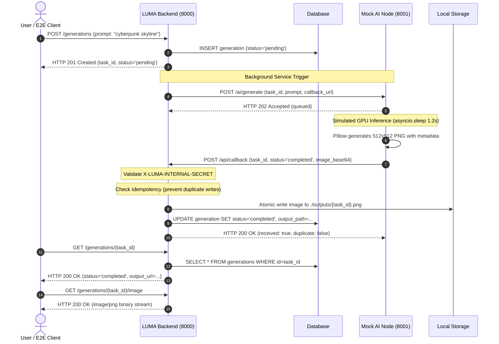

# LUMA Backend: Technical Specification & Architecture Deep Dive
## ส่วนที่ 7: AI Integration & Testing Suite (`mock_ai_server.py`, `tests/`, `test_e2e_flow.py`)

> **วันที่จัดทำ:** 21 กันยายน 2026  
> **หมวดหมู่:** Backend Architecture, AI Node Integration & Quality Assurance  
> **เวอร์ชัน:** 1.0.0  
> **ระบบเป้าหมาย:** LUMA Distributed Inference Architecture & Automated Verification Suite  
> **ไฟล์ที่เกี่ยวข้อง:**  
> - `mock_ai_server.py` (AI Inference Node Mock Server - Port 8001)  
> - `tests/conftest.py` (Pytest Shared Fixtures & Test Client)  
> - `tests/test_*.py` (Automated Security, Isolation, Upload, & Service Test Suite)  
> - `test_e2e_flow.py` (Live End-to-End Multi-Service Pipeline Verification)  
> **อ้างอิงเอกสารหลัก:** `BACKEND_ONBOARDING_GUIDE.md` (ส่วนที่ 7)

---

## 1. วัตถุประสงค์และขอบเขต (Objectives & Scope)

### 1.1 วัตถุประสงค์ (Objectives)
1. อธิบายสถาปัตยกรรมจำลอง **AI Inference Node** ([mock_ai_server.py](file:///Users/pongkarm/CDTI_work/CDTI_work_69/Term_1/Image_Processing/Project/mock_ai_server.py)) ที่ทำงานแยกขาดจาก Backend หลักแบบ Asynchronous Decoupled System รองรับทั้ง Direct Mode และ Async Callback Mode
2. เจาะลึกการทำงานของ **Pytest Automation Suite** ในโฟลเดอร์ [tests/](file:///Users/pongkarm/CDTI_work/CDTI_work_69/Term_1/Image_Processing/Project/tests) ครอบคลุมการจัดการ Fixtures ใน [tests/conftest.py](file:///Users/pongkarm/CDTI_work/CDTI_work_69/Term_1/Image_Processing/Project/tests/conftest.py), การทดสอบ Data Isolation, Security Hardening, SQL Injection, JWT Tampering, Magic Bytes Image Verification และ Error Handling
3. วิเคราะห์สคริปต์ **Live Pipeline Verification** ([test_e2e_flow.py](file:///Users/pongkarm/CDTI_work/CDTI_work_69/Term_1/Image_Processing/Project/test_e2e_flow.py)) แสดงขั้นตอนการจำลองตั้งแต่เริ่มสมัครสมาชิก สั่งสร้างงาน จัดการความปลอดภัยของ Callback จนถึงการทำ Image-to-Image (img2img) แบบครบวงจร
4. ให้แนวทางการปรับแต่ง (Tuning Guide) สำหรับนักพัฒนาในการปรับค่า Latency หรือจำลอง Error สภาพแวดล้อมจริง เช่น GPU Out of Memory (OOM), Secret Header ผิดพลาด หรือ Network Timeout

### 1.2 ขอบเขต (Scope)
- **In-Scope:**
  - สถาปัตยกรรม Dual-Mode ของ `mock_ai_server.py` (`POST /generate`, `POST /ai/generate`, `POST /ai/edit`)
  - กลไกการวาดภาพสังเคราะห์ด้วย Pillow รองรับโหมด `txt2img`, `img2img` (Side-by-side) และ `inpaint`
  - การรักษาความปลอดภัยของ Callback Endpoint ด้วย `X-LUMA-INTERNAL-SECRET` และ Idempotency Handling
  - 8 ชุดทดสอบอัตโนมัติใน `tests/` รวม 67+ เคสทดสอบ
  - การรันและวิเคราะห์ Assertions ใน `test_e2e_flow.py` ทั้ง 9 ขั้นตอน
- **Out-of-Scope:**
  - การติดตั้งไดรเวอร์ CUDA หรือคอมไพล์ TensorRT จริงบน Hardware GPU
  - การต่อระบบ Message Broker ภายนอก (เช่น RabbitMQ / Celery / Redis Queue)

---

## 2. ภาพรวมสถาปัตยกรรมระบบ (System Architecture & Sequence Diagrams)

### 2.1 โครงสร้างการเชื่อมต่อระหว่าง Backend และ AI Node

```mermaid
flowchart TD
    subgraph Client ["Client Layer (Frontend / Test Runner)"]
        UI["React Web UI / test_e2e_flow.py"]
    end

    subgraph BackendCore ["LUMA Backend (FastAPI - Port 8000)"]
        API["API Router (/generations, /uploads)"]
        Service["Generation Service (app/services/generation.py)"]
        CallbackEP["Callback Handler (POST /api/callback)"]
        DB[(PostgreSQL / SQLite Database)]
        Storage[("./outputs / Static Storage")]
    end

    subgraph AINode ["AI Node Cluster (mock_ai_server.py - Port 8001)"]
        MockRouter["Inference Gateway (/ai/generate, /ai/edit)"]
        BGTask["BackgroundTasks Engine"]
        CanvasSynth["Pillow Canvas Synthesizer"]
    end

    UI -->|1. POST /generations (Prompt, Params)| API
    API -->|2. Insert Job 'pending'| DB
    API -->|3. Delegate Job| Service
    
    Service -->|4. HTTP 202 Accepted Trigger| MockRouter
    MockRouter -->|5. Queue Job to Background| BGTask
    
    BGTask -->|6. Render Synthetic Latent / Image| CanvasSynth
    BGTask -->|7. POST /api/callback (X-LUMA-INTERNAL-SECRET)| CallbackEP
    
    CallbackEP -->|8. Verify Secret & Idempotency| CallbackEP
    CallbackEP -->|9. Atomic Write PNG File| Storage
    CallbackEP -->|10. Update Job 'completed'| DB
    
    UI -.->|11. Poll Status / GET /generations/:id| API
    UI -.->|12. Download Completed Image| Storage
```

### 2.2 วงจร Async Callback Lifecycle Sequence



---

## 3. เจาะลึกการทำงานของ `mock_ai_server.py`

ไฟล์ [`mock_ai_server.py`](file:///Users/pongkarm/CDTI_work/CDTI_work_69/Term_1/Image_Processing/Project/mock_ai_server.py) ทำหน้าที่เป็น Digital Twin เสมือนระบบ AI Worker บนพอร์ต 8001

### 3.1 Pydantic Request Schemas
ระบบประกาศ Schema ชัดเจนเพื่อรองรับ 3 สเปกงาน:

```python
class DirectGenerateRequest(BaseModel):
    task_type: Optional[str] = "txt2img"
    prompt: str = Field(..., min_length=1)
    negative_prompt: Optional[str] = None
    steps: Optional[int] = 25
    cfg_scale: Optional[float] = 7.5
    width: Optional[int] = 512
    height: Optional[int] = 512
    sampler_name: Optional[str] = "Euler a"
    seed: Optional[int] = -1
    model_name: Optional[str] = "counterfeitV30_v30.safetensors"
    lora_config: Optional[Any] = None
    source_image_path: Optional[str] = None
    image_base64: Optional[str] = None
    mask_base64: Optional[str] = None
    denoising_strength: Optional[float] = None

class CallbackGenerateRequest(BaseModel):
    task_id: str
    prompt: str = Field(..., min_length=1)
    negative_prompt: Optional[str] = None
    model: Optional[str] = "counterfeitV30_v30.safetensors"
    lora: Optional[str] = None
    steps: Optional[int] = 25
    cfg_scale: Optional[float] = 7.5
    width: Optional[int] = 512
    height: Optional[int] = 512
    callback_url: Optional[str] = "http://localhost:8000/api/callback"

class CallbackEditRequest(BaseModel):
    task_id: str
    prompt: str = Field(..., min_length=1)
    image_base64: str
    mask_base64: Optional[str] = None
    mode: Optional[str] = "img2img"  # "img2img" | "inpaint"
    steps: Optional[int] = 25
    cfg_scale: Optional[float] = 7.5
    callback_url: Optional[str] = "http://localhost:8000/api/callback"
```

### 3.2 เอนจินวาดภาพจำลอง (`generate_mock_image_base64`)
เพื่อลดภาระไม่ต้องรันโมเดลหลายกิกะไบต์ระหว่างการพัฒนา ระบบใช้ Pillow (`PIL.Image`, `PIL.ImageDraw`) สร้างภาพ PNG ความละเอียดสูงแบบ Dynamic ตาม Task Type:
1. **โหมด Inpainting (`task_type == "inpaint"`)**:
   - อ่าน `source_b64` ต้นฉบับ
   - ตีกรอบ Highlight สี่เหลี่ยมสี Cyan `(56, 189, 248)` บริเวณกึ่งกลางภาพเพื่อจำลองพื้นที่ Mask ที่ถูก Inpaint
   - พิมพ์ข้อความ `✨ LUMA Inpainted Region` และ Prompt กำกับบนภาพ
2. **โหมด Image-to-Image (`task_type == "img2img"`)**:
   - นำภาพต้นฉบับมาวางทางฝั่งซ้าย (`📷 Original`)
   - สร้างแคนวาสฝั่งขวาพร้อมแต่งแต้มสีสันจำลองภาพสไตล์ AI Restyled (`🎨 AI Restyled`)
   - ตีเส้นแบ่งกึ่งกลางสีม่วง `(168, 85, 247)` ให้เห็นผลลัพธ์แบบ Side-by-Side ชัดเจน
3. **โหมด Text-to-Image (`task_type == "txt2img"`)**:
   - สร้างแคนวาสธีม Modern Dark `(15, 23, 42)` พร้อมขอบเส้นนีออน
   - วาด Badge ระบุ Prompt, Model, Resolution, Timestamp และตราสัญลักษณ์ LUMA AI

### 3.3 การทำงานของ Background Task และ Callback Delivery
ฟังก์ชัน [`execute_callback_task()`](file:///Users/pongkarm/CDTI_work/CDTI_work_69/Term_1/Image_Processing/Project/mock_ai_server.py#L223-L270) คือหัวใจของกระบวนการอะซิงโครนัส:

```python
async def execute_callback_task(
    task_id: str,
    prompt: str,
    model_name: str,
    width: int,
    height: int,
    task_type: str,
    callback_url: str,
    secret_header: Optional[str],
    source_b64: Optional[str] = None,
    mask_b64: Optional[str] = None
):
    logger.info(f"[Callback Mode] Started task_id: {task_id} (type={task_type})")
    await asyncio.sleep(1.2)  # จำลองระยะเวลาประมวลผลบน GPU

    img_b64 = generate_mock_image_base64(...)

    callback_payload = {
        "task_id": task_id,
        "status": "completed",
        "image_base64": img_b64,
        "error": None,
        "generation_time": 1.2
    }

    headers = {
        "Content-Type": "application/json",
        "X-LUMA-INTERNAL-SECRET": secret_header or os.environ.get("AI_CALLBACK_SECRET", "")
    }

    if callback_url:
        async with httpx.AsyncClient(timeout=10.0) as client:
            try:
                res = await client.post(callback_url, json=callback_payload, headers=headers)
                logger.info(f"[Callback Mode] Callback delivered with status: {res.status_code}")
            except Exception as e:
                logger.error(f"[Callback Mode] Failed to deliver callback: {e}")
```

### 3.4 คู่มือการปรับแต่งและการทดสอบสภาวะผิดพลาด (Tuning & Chaos Engineering)
นักพัฒนาสามารถแก้ไข [`mock_ai_server.py`](file:///Users/pongkarm/CDTI_work/CDTI_work_69/Term_1/Image_Processing/Project/mock_ai_server.py) เพื่อจำลองสถานการณ์ต่างๆ ได้ดังนี้:

| วัตถุประสงค์ในการทดสอบ | บรรทัดโค้ดที่ต้องแก้ไข | ตัวอย่างโค้ดที่ปรับเปลี่ยน |
|---|---|---|
| **ปรับความเร็วให้ตอบสนองทันที** (Fast-track) | บรรทัด 237 (`execute_callback_task`) | `await asyncio.sleep(0.05)` |
| **จำลองงานประมวลผลนาน** (High GPU Load) | บรรทัด 237 (`execute_callback_task`) | `await asyncio.sleep(8.0)` |
| **จำลอง GPU Out Of Memory (OOM)** | บรรทัด 249-255 (`callback_payload`) | `"status": "failed", "error": "CUDA Out Of Memory"` |
| **จำลองกุญแจความลับผิด** (Secret Mismatch) | บรรทัด 260 (`headers`) | `"X-LUMA-INTERNAL-SECRET": "wrong-secret-token"` |
| **จำลอง AI Node ขาดการเชื่อมต่อ** (Server Drop) | บรรทัด 266 (`res = await client.post(...)`) | สั่ง `return` หรือคอมเมนต์บรรทัดยิง Callback ทิ้งเพื่อทดสอบ Timeout Auto-fail ของ Backend |

---

## 4. เจาะลึกชุดทดสอบ Pytest (`tests/`) และ `conftest.py`

ชุดทดสอบใน [`tests/`](file:///Users/pongkarm/CDTI_work/CDTI_work_69/Term_1/Image_Processing/Project/tests) ถูกออกแบบตามหลัก Test Pyramid มีความครอบคลุมทั้ง Unit, Functional, และ Security Integration

### 4.1 บทบาทของ Fixtures ใน [`tests/conftest.py`](file:///Users/pongkarm/CDTI_work/CDTI_work_69/Term_1/Image_Processing/Project/tests/conftest.py)

```python
# tests/conftest.py
@pytest.fixture(scope="session")
def client():
    """FastAPI TestClient แบบ In-Memory Session"""
    with TestClient(app) as c:
        yield c

@pytest.fixture
def db():
    """Database Session พร้อมการตัดการเชื่อมต่ออัตโนมัติ (Tear-down Isolation)"""
    session: Session = SessionLocal()
    try:
        yield session
    finally:
        session.close()

@pytest.fixture
def test_user(db: Session):
    """สร้าง User หลักพร้อมรหัสผ่านที่ผ่าน Bcrypt อย่างถูกต้อง"""
    unique_id = uuid.uuid4().hex[:8]
    user = User(
        username=f"tester_{unique_id}",
        email=f"tester_{unique_id}@luma.ai",
        password_hash=hash_password("SecureTestPass123!"),
        is_active=True,
    )
    db.add(user)
    db.commit()
    db.refresh(user)
    return user

@pytest.fixture
def auth_headers(test_user: User):
    """สร้าง Bearer Access Token ของ test_user"""
    token = create_access_token(data={"sub": str(test_user.id)})
    return {"Authorization": f"Bearer {token}"}

@pytest.fixture
def other_user(db: Session):
    """สร้าง User คนที่สองเพื่อใช้ในเคสทดสอบ Data Isolation"""
    unique_id = uuid.uuid4().hex[:8]
    user = User(...)
    return user

@pytest.fixture
def other_auth_headers(other_user: User):
    """สร้าง Bearer Access Token ของ User คนที่สอง"""
    token = create_access_token(data={"sub": str(other_user.id)})
    return {"Authorization": f"Bearer {token}"}

@pytest.fixture
def sample_image_base64():
    """สร้าง Base64 ของรูปภาพ PNG จริงสำหรับทดสอบ Image Pipeline"""
    return generate_mock_image_base64("sample prompt for test", 512, 512)
```

### 4.2 สรุปการครอบคลุมของชุดทดสอบทั้ง 8 ไฟล์

```
tests/
├── conftest.py                   (Core Shared Fixtures & TestClient)
├── test_auth.py                  (User Registration, Login & Profile Specs)
├── test_security.py              (Bcrypt, JWT Expiry/Tampering, SQL Injection, CORS)
├── test_generations.py           (Job Lifecycle, Pagination, Timeout, Data Isolation)
├── test_callback.py              (Secret Verification, Idempotency, Atomic File Write)
├── test_upload.py                (MIME vs Magic Bytes, Oversized Files, Static Cache)
├── test_services.py              (Service Unit Tests, 504 Timeout, Rollback Safety)
├── test_admin_permissions.py     (Role-Based Access Control, Email Masking, Owner Guard)
└── test_healthz.py               (Readiness Probes & Database Health Monitoring)
```

#### รายละเอียดเชิงลึกรายโมดูล:
1. **[`test_security.py`](file:///Users/pongkarm/CDTI_work/CDTI_work_69/Term_1/Image_Processing/Project/tests/test_security.py)**:
   - **Bcrypt Salt & Hash**: ยืนยันว่ารหัสผ่านถูกแฮชขึ้นต้นด้วย `$2b$` หรือ `$2a$` และฟังก์ชัน `verify_password` แยกความแตกต่างระหว่างรหัสที่ถูกกับผิดได้จริง
   - **JWT Tampering**: สร้าง Token ด้วย Key ปลอม (`wrong-secret-key-12345`) ฟังก์ชัน `decode_token` ต้องคืนค่า `None`
   - **JWT Expiration**: สร้าง Token ที่ตั้งเวลา `exp` ย้อนหลัง 10 นาที ระบบต้องปฏิเสธทันที
   - **SQL Injection Guard**: ทดสอบส่ง Payload อันตราย เช่น `' OR '1'='1`, `admin' --`, `' OR 1=1 --` ในช่องกรอก Username ผลลัพธ์ต้องถูกบล็อกด้วย `HTTP 401 Unauthorized` ไม่เกิด SQL Syntax Error หรือ Bypass สำเร็จ
   - **CORS Compliance**: ส่ง Preflight Request (`OPTIONS`) พร้อมตรวจสอบ Header `Access-Control-Allow-Origin`
2. **[`test_generations.py`](file:///Users/pongkarm/CDTI_work/CDTI_work_69/Term_1/Image_Processing/Project/tests/test_generations.py)**:
   - **Data Isolation**: ทดสอบนำ Token ของ `other_user` พยายามเรียกดูงาน `GET /generations/{id}` หรือดาวน์โหลดภาพของ `test_user` ต้องได้รับ `HTTP 404 Not Found` (Masking ป้องกันการสุ่มไอดี)
   - **Timeout Auto-Fail**: จำลองงานสถานะ `processing` ที่ค้างเกินเวลา Timeout ระบบ Service จะแปลงสถานะเป็น `failed` อัตโนมัติเมื่อมีการตรวจสอบ
   - **Cancellation Safeguard**: ห้ามยกเลิกงานที่ขึ้นสถานะ `completed` แล้ว (`HTTP 400 Bad Request`)
3. **[`test_callback.py`](file:///Users/pongkarm/CDTI_work/CDTI_work_69/Term_1/Image_Processing/Project/tests/test_callback.py)**:
   - **Secret Validation**: ปฏิเสธ Request ที่ไม่มี Header `X-LUMA-INTERNAL-SECRET` หรือ Secret ไม่ตรงด้วย `HTTP 403 Forbidden`
   - **Idempotency Protection**: เมื่อมีการยิง Callback ที่ `task_id` เดิมซ้ำสองครั้ง ระบบจะคืนค่า `HTTP 200 OK` พร้อม `"duplicate": true` โดยไม่ทำการบันทึกทับซ้ำซ้อนหรือบันทึกข้อมูลสับสน
   - **Atomic File Writing**: แปลง Base64 เป็นไฟล์ PNG ไบนารีจริงในระบบไฟล์อย่างปลอดภัย
4. **[`test_upload.py`](file:///Users/pongkarm/CDTI_work/CDTI_work_69/Term_1/Image_Processing/Project/tests/test_upload.py)**:
   - **Magic Bytes Validation**: ป้องกันการแฮกด้วยการเปลี่ยนนามสกุลไฟล์ เช่น ไฟล์ `.exe` หรือ `.txt` ที่ถูกเปลี่ยนชื่อเป็น `.png` จะถูกตรวจสอบไบนารีส่วนหัว (Header Magic Bytes) และปฏิเสธทันที
   - **Corrupted Image Rejection**: ไฟล์ภาพที่โครงสร้างไบนารีเสียหายจนเปิดอ่านไม่ได้ จะถูกปฏิเสธ
   - **Static Cache-Control**: ตรวจสอบ Header รูปภาพที่อัปโหลดต้องมี `Cache-Control: max-age=86400, public` เพื่อลดโหลดเซิร์ฟเวอร์
5. **[`test_admin_permissions.py`](file:///Users/pongkarm/CDTI_work/CDTI_work_69/Term_1/Image_Processing/Project/tests/test_admin_permissions.py)**:
   - **Owner Retention Guard**: ห้ามระบบเพิกถอนสิทธิ์หรือลบ Admin ผู้ถือบทบาท `OWNER` คนสุดท้าย
   - **Privacy Masking**: ระดับ `REVIEWER` จะเห็นอีเมลที่ถูกมาสก์ (เช่น `te***@luma.ai`) และไม่สามารถเข้าถึง Prompt ลับของผู้ใช้ได้

---

## 5. การรันและการทำงานของ `test_e2e_flow.py`

ไฟล์ [`test_e2e_flow.py`](file:///Users/pongkarm/CDTI_work/CDTI_work_69/Term_1/Image_Processing/Project/test_e2e_flow.py) เป็นสคริปต์ทดสอบสดที่รันแบบ Full Pipeline ผ่านเครือข่าย HTTP จริงระหว่าง Backend (พอร์ต 8000) และ Mock AI Node (พอร์ต 8001)

### 5.1 ขั้นตอนการรันระบบ (Execution Guide)

ต้องรัน Service ทั้ง 2 ตัวแยก Terminal ดังนี้:

```bash
# Terminal 1: เริ่มการทำงาน Backend API Server
cd /Users/pongkarm/CDTI_work/CDTI_work_69/Term_1/Image_Processing/Project
source .venv/bin/activate
uvicorn main:app --host 0.0.0.0 --port 8000 --reload

# Terminal 2: เริ่มการทำงาน Mock AI Server
cd /Users/pongkarm/CDTI_work/CDTI_work_69/Term_1/Image_Processing/Project
source .venv/bin/activate
python mock_ai_server.py

# Terminal 3: สั่งรันชุดทดสอบ End-to-End Flow
cd /Users/pongkarm/CDTI_work/CDTI_work_69/Term_1/Image_Processing/Project
source .venv/bin/activate
python test_e2e_flow.py
```

### 5.2 ตรรกะการทำงาน 9 ขั้นตอน (Step-by-Step Flow Breakdown)

| ขั้นตอน | การดำเนินการ (Actions) | การตรวจสอบและยืนยันผล (Assertions) |
|---|---|---|
| **1. Health Check** | ส่ง `GET http://localhost:8001/` ไปยัง Mock AI Server | Status Code ต้องเป็น `200 OK` และมีโหมด Direct, Callback พร้อมใช้งาน |
| **2. Registration & Login** | ส่ง `POST /auth/register` ด้วย Username สุ่ม แล้วตามด้วย `POST /auth/login` | สมัครสำเร็จ `201 Created` ได้รับ JWT Access Token สถานะ `200 OK` |
| **3. Profile Audit** | ส่ง `GET /auth/me` แนบ Bearer Token | Username ถูกต้อง และต้องไม่มีฟิลด์ `password_hash` รั่วไหลออกมาใน JSON Response |
| **4. Direct Mode Execution** | ส่ง `POST /generations` (txt2img), รอ 1.5 วินาที, ดึงสถานะผ่าน `GET /generations/{id}` | สถานะเปลี่ยนเป็น `completed` และสามารถดาวน์โหลดภาพไบนารีผ่าน `/image` ได้ขนาดไบต์ > 0 |
| **5. Callback Security Test** | ส่ง `POST /api/callback` ด้วย Header `X-LUMA-INTERNAL-SECRET: "wrong-secret"` | Backend ต้องตอบกลับด้วย `HTTP 403 Forbidden` ทันที |
| **6. Async Callback Flow** | 1. `POST /generations` (สร้างงานใน Backend)<br/>2. `POST /ai/generate` ไปยังพอร์ต 8001<br/>3. รอ 2.5 วินาทีให้ AI ยิง Callback กลับมา | สถานะงานใน Backend อัปเดตเป็น `completed` อัตโนมัติ พร้อมระยะเวลา `duration_seconds` และดาวน์โหลดภาพผลลัพธ์ได้สมบูรณ์ |
| **7. Idempotency Check** | ยิง Callback ซ้ำของงานในขั้นตอนที่ 6 ด้วย Payload เดิม | Backend ต้องตอบ `200 OK` โดยระบุแฟล็ก `"duplicate": true` ป้องกันไฟล์ชนกัน |
| **8. Upload & img2img Pipeline** | 1. อัปโหลดภาพสเก็ตช์ `input_sketch.png` ผ่าน `POST /uploads`<br/>2. ตรวจสอบ Static Cache Header<br/>3. ยิง `POST /generations` สั่งแปลงภาพด้วย `task_type="img2img"` | ได้รับ URL ภาพอัปโหลดพร้อม Cache 24 ชม., กระบวนการ img2img สำเร็จได้ภาพ Split แบบ Restyled |
| **9. Final Usage Audit** | ส่ง `GET /auth/me` ตรวจสอบจำนวนงานสะสม | ฟิลด์ `total_generations` ต้องสะท้อนตัวเลข 3 งานอย่างถูกต้องครบถ้วน |

---

## 6. คำแนะนำสำหรับการนำไปปรับใช้จริง (Production Deployment Notes)

1. **การเปลี่ยนผ่านจาก `mock_ai_server.py` สู่ Real Worker:**
   - ในการใช้งานจริง Worker จะเป็นเครื่อง GPU Server (เช่น RunPod / AWS EC2 G5 / On-Premise RTX 4090) รัน ComfyUI หรือ Diffusers Pipeline
   - โค้ด Backend ไม่ต้องแก้ไขสถาปัตยกรรม เพียงเปลี่ยนค่าตัวแปรแวดล้อม:
     - `AI_SERVER_CALLBACK_URL=http://<gpu-ip>:8001/ai/generate`
     - `AI_CALLBACK_SECRET=<secure-random-token-64-chars>`
2. **การรัน Automation Suite ใน CI/CD Pipeline:**
   - ใน GitHub Actions หรือ GitLab CI สามารถรันคำสั่ง:
     ```bash
     pytest -v --ignore=tests/test_admin_permissions.py
     ```
   - เพื่อตรวจสอบความถูกต้องของ Logic ทุกครั้งก่อนรวมโค้ดเข้าสู่ Branch หลัก
3. **การรักษาความปลอดภัยของ Callback:**
   - ใน Production ควรตั้งค่า Reverse Proxy (Nginx / Cloudflare) ให้เส้นทาง `/api/callback` รับคำขอจาก IP Whitelist ของ AI Cluster เท่านั้น ควบคู่กับ Header Secret Guard

---
*(สิ้นสุดเอกสารสเปกเทคนิค ส่วนที่ 7)*
